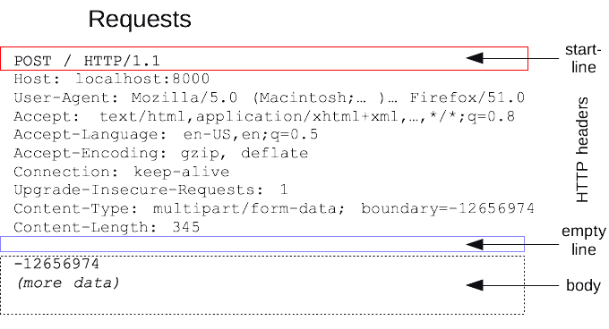
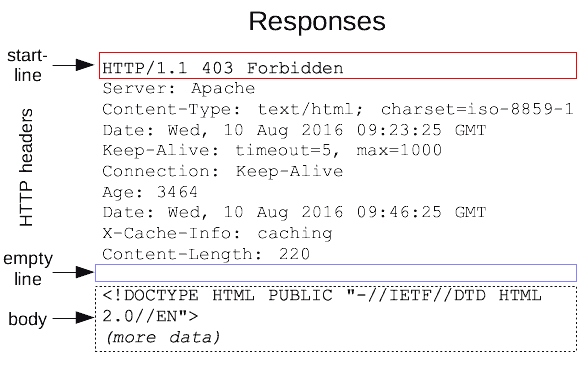

$$
% Display
\newcommand{\ds}{\displaystyle}
\newcommand{\ob}{\overbrace}
\newcommand{\ub}{\underbrace}
\newcommand{\code}{\texttt}

% Colours
\newcommand{\red}[1]{\textcolor{red}{#1}}
\newcommand{\redt}[1]{\textcolor{red}{\text{#1}}}
\newcommand{\blue}[1]{\textcolor{blue}{#1}}
\newcommand{\bluet}[1]{\textcolor{blue}{\text{#1}}}
\newcommand{\green}[1]{\textcolor{green}{#1}}
\newcommand{\greent}[1]{\textcolor{green}{\text{#1}}}

% Typefaces/Text-styles
\newcommand{\mc}{\mathcal}
\newcommand{\mf}{\mathfrak}
\newcommand{\b}{\mathbf}
\newcommand{\bs}{\boldsymbol}

% Fractions
\newcommand{\f}{\frac}

% Positioning
\newcommand{\l}{\left}
\newcommand{\m}{\middle}
\newcommand{\r}{\right}

% Logic
\newcommand{\n}{\not}
\newcommand{\eq}{\equiv}
\newcommand{\xor}{\oplus}

% Sets
\newcommand{\fa}{\forall}
\newcommand{\te}{\exists}
\newcommand{\empty}{\varnothing}
\newcommand{\set}[1]{\l\lbrace#1\r\rbrace}
\newcommand{\setb}[2]{\l\lbrace#1\ \m| \ #2\r\rbrace}
\newcommand{\bb}{\mathbb}
\newcommand{\R}{\bb{R}}
\newcommand{\N}{\bb{N}}
\newcommand{\Z}{\bb{Z}}
\newcommand{\Q}{\bb{Q}}
\newcommand{\C}{\bb{C}}

% Derivatives
\newcommand{\d}[1]{\mathrm{d}#1}
\newcommand{\deriv}[2]{\f{\d{#1}}{\d{#2}}}
\newcommand{\pderiv}[2]{\f{\partial #1}{\partial #2}}

% Sums/Integrals
\newcommand{\s}[3]{\sum_{#1}^{#2}#3}
\newcommand{\i}[4]{\int_{#1}^{#2}#3\ \d{#4}}

% Probability
\newcommand{\p}[1]{\bb{P}\l(#1\r)}
\newcommand{\cp}[2]{\p{#1\m|#2}}
\newcommand{\jp}[2]{\p{#1,#2}}
\newcommand{\e}[1]{\bb{E}\l[#1\r]}
\newcommand{\var}[1]{\text{Var}\l[#1\r]}
\newcommand{\sd}[1]{\text{SD}\l[#1\r]}
\newcommand{\cov}[2]{\text{Cov}\l[#1,#2\r]}

% Binomials
\newcommand{\ch}{\binom}
\newcommand{\pbin}[3][{}]{\l(#2 + #3\r)^#1}
\newcommand{\mbin}[3][{}]{\l(#2 - #3\r)^#1}

% Linear Algebra
\newcommand{\T}{\mathsf{T}}
\newcommand{\seq}[4][{}]{#2_{#3}#1 \ldots #1 #2_{#4}}
\newcommand{\rowv}[3]{\l(\seq[,]{#1}{#2}{#3}\r)}
\newcommand{\colv}[3]{\rowv{#1}{#2}{#3}^\T}
\newcommand{\sqpmat}[3][{}]{
    \begin{pmatrix}
		#2_{1{#1}1} & #2_{1{#1}2} & \cdots & #2_{1{#1}j} & \cdots & #2_{1{#1}#3} \\
		#2_{2{#1}1} & #2_{2{#1}2} & \cdots & #2_{2{#1}j} & \cdots & #2_{2{#1}#3} \\
		\vdots & \vdots & \ddots & \vdots & \ddots & \vdots \\
		#2_{i{#1}1} & #2_{i{#1}2} & \cdots & #2_{i{#1}j} & \cdots & #2_{i{#1}#3} \\
		\vdots & \vdots & \ddots & \vdots & \ddots & \vdots \\
		#2_{#3{#1}1} & #2_{#3{#1}2} & \cdots & #2_{#3{#1}j} & \cdots & #2_{#3{#1}#3} \\
	\end{pmatrix}
}
\newcommand{\sqmat}[3][{}]{
    \begin{matrix}
		#2_{1{#1}1} & #2_{1{#1}2} & \cdots & #2_{1{#1}j} & \cdots & #2_{1{#1}#3} \\
		#2_{2{#1}1} & #2_{2{#1}2} & \cdots & #2_{2{#1}j} & \cdots & #2_{2{#1}#3} \\
		\vdots & \vdots & \ddots & \vdots & \ddots & \vdots \\
		#2_{i{#1}1} & #2_{i{#1}2} & \cdots & #2_{i{#1}j} & \cdots & #2_{i{#1}#3} \\
		\vdots & \vdots & \ddots & \vdots & \ddots & \vdots \\
		#2_{#3{#1}1} & #2_{#3{#1}2} & \cdots & #2_{#3{#1}j} & \cdots & #2_{#3{#1}#3} \\
	\end{matrix}
}
\newcommand{\sqbmat}[3][{}]{
    \begin{bmatrix}
		#2_{1{#1}1} & #2_{1{#1}2} & \cdots & #2_{1{#1}j} & \cdots & #2_{1{#1}#3} \\
		#2_{2{#1}1} & #2_{2{#1}2} & \cdots & #2_{2{#1}j} & \cdots & #2_{2{#1}#3} \\
		\vdots & \vdots & \ddots & \vdots & \ddots & \vdots \\
		#2_{i{#1}1} & #2_{i{#1}2} & \cdots & #2_{i{#1}j} & \cdots & #2_{i{#1}#3} \\
		\vdots & \vdots & \ddots & \vdots & \ddots & \vdots \\
		#2_{#3{#1}1} & #2_{#3{#1}2} & \cdots & #2_{#3{#1}j} & \cdots & #2_{#3{#1}#3} \\
	\end{bmatrix}
}
\newcommand{\sqpmat}[3][{}]{
    \begin{pmatrix}
		#2_{1{#1}1} & #2_{1{#1}2} & \cdots & #2_{1{#1}j} & \cdots & #2_{1{#1}#3} \\
		#2_{2{#1}1} & #2_{2{#1}2} & \cdots & #2_{2{#1}j} & \cdots & #2_{2{#1}#3} \\
		\vdots & \vdots & \ddots & \vdots & \ddots & \vdots \\
		#2_{i{#1}1} & #2_{i{#1}2} & \cdots & #2_{i{#1}j} & \cdots & #2_{i{#1}#3} \\
		\vdots & \vdots & \ddots & \vdots & \ddots & \vdots \\
		#2_{#3{#1}1} & #2_{#3{#1}2} & \cdots & #2_{#3{#1}j} & \cdots & #2_{#3{#1}#3} \\
	\end{pmatrix}
}
\newcommand{\sqvmat}[3][{}]{
    \begin{vmatrix}
		#2_{1{#1}1} & #2_{1{#1}2} & \cdots & #2_{1{#1}j} & \cdots & #2_{1{#1}#3} \\
		#2_{2{#1}1} & #2_{2{#1}2} & \cdots & #2_{2{#1}j} & \cdots & #2_{2{#1}#3} \\
		\vdots & \vdots & \ddots & \vdots & \ddots & \vdots \\
		#2_{i{#1}1} & #2_{i{#1}2} & \cdots & #2_{i{#1}j} & \cdots & #2_{i{#1}#3} \\
		\vdots & \vdots & \ddots & \vdots & \ddots & \vdots \\
		#2_{#3{#1}1} & #2_{#3{#1}2} & \cdots & #2_{#3{#1}j} & \cdots & #2_{#3{#1}#3} \\
	\end{vmatrix}
}
\newcommand{\sqVmat}[3][{}]{
    \begin{Vmatrix}
		#2_{1{#1}1} & #2_{1{#1}2} & \cdots & #2_{1{#1}j} & \cdots & #2_{1{#1}#3} \\
		#2_{2{#1}1} & #2_{2{#1}2} & \cdots & #2_{2{#1}j} & \cdots & #2_{2{#1}#3} \\
		\vdots & \vdots & \ddots & \vdots & \ddots & \vdots \\
		#2_{i{#1}1} & #2_{i{#1}2} & \cdots & #2_{i{#1}j} & \cdots & #2_{i{#1}#3} \\
		\vdots & \vdots & \ddots & \vdots & \ddots & \vdots \\
		#2_{#3{#1}1} & #2_{#3{#1}2} & \cdots & #2_{#3{#1}j} & \cdots & #2_{#3{#1}#3} \\
	\end{Vmatrix}
}
$$

[TOC]

# Web security

## HTTP requests

After establishing a TCP connection to a web server, a client can send **==HTTP requests==** to the server. These requests consist of:

- A start line consisting of:
  - a keyword such as `GET` or `POST`.
  - a route to request from the server.
  - HTTP version.
- Headers
- Body consisting of request data, e.g. parameters in the case of `POST` requests.

<p style="text-align:center;">
    </img>
	<br>
	<p style="text-align:center;">
    <b>Figure 1</b>: A typical HTTP <code>POST</code> request. (<a href="https://developer.mozilla.org/en-US/docs/Web/HTTP/Messages">source</a>)
	</p>
</p>


**Note**: HTTP requests and responses are delivered via TCP over port 80. The standard HTTP does not provide any means of data encryption—meaning that an attacker can intercept the packets being sent between a client and server, and gain full access to any information that was being transmitted, acting as a man-in-the middle.

## HTTP responses

After receiving and interpreting a request message, a server responds with a **==HTTP response==** message of similar structure to the request—consisting of:

- A start line consisting of:
  - a HTTP version
  - a status code
  - a status message
- Headers
- Message body (normally a HTML document)

<p style="text-align:center;">
    </img>
	<br>
	<p style="text-align:center;">
    <b>Figure 2</b>: A typical HTTP response. (<a href="https://developer.mozilla.org/en-US/docs/Web/HTTP/Messages">source</a>)
	</p>
</p>

## State in HTTP sessions

HTTP is **==stateless==**—when a client sends a request, the server sends back a response, but the server does not hold any information on previous requests.

However, this is an issue since lots of web applications require a client to access various pages before completing a specific task. In this case, the client state should be kept along all of those pages—how does the server know if two requests came from the same browse?

The idea to solve this is to insert some token into the page when it is requested, and pass the token back with the next request. There are two main approaches to maintaining a session between a web client and a web server:

- Use **hidden fields**.
- Use **cookies**.

### Hidden fields

This approach involves placing a **==hidden field==** in a HTML form. This hidden field contains a session ID in all of the HTML pages sent to the client. The hidden field will be returned back to the server in the request (once the form is submitted).

| **Advantages**                       | **Disadvantages**                                            |
| ------------------------------------ | ------------------------------------------------------------ |
| All web browsers support HTML forms. | Requires careful and tedious programming effort—all of the pages must be dynamically generated to include this hidden field. |
|                                      | Session ends as soon as the browser is closed.               |

### Cookies

A **==cookie==** is a small piece of information that a server sends to a browser and is stored inside the browser. A cookie has a name and a value, along with other attributes such as domain, path, expiration date, version number and comments.

The browser automatically includes the cookie in all subsequent requests made through the browser to the originating host of the cookie. Cookies are only **sent back by the browser to their originating host and not any other hosts**—the domain and path specify which server (and path) to return the cookie to.

A server can set the cookie's value to uniquely identify a client. Hence, cookies are commonly used for session and user management. In addition to session management, cookies can also be used to hold personalised information, or to help in online sales services, e.g. shopping cart.

| **Advantages** | **Disadvantages**                           |
| -------------- | ------------------------------------------- |
|                | Users may disable cookies in their browser. |

### Setting cookies

Cookies are set on the client's when the server uses the `Set-Cookie` field in the HTTP header of its response. A cookie has several attributes:

- `name`: The name-value of the cookie.
- `expires`: When to delete the cookie.
- `domain` and `path`: Tells the browser what website the cookie belongs to. 
- `Secure`: Whether to send the cookie.
- `HttpOnly`: If enabled, scripting languages cannot access or manipulate the cookie.

### Cookie domains and hosts

A cookie is valid for the domain it is set for, and all its subdomains.

A subdomain may access cookies set for a higher-level domain but not vice-versa.

> **Example**:
>
> - `mail.example.com` can access cookies set for `example.com`
> - `example.com` cannot access cookies set for `mail.example.com`

Hosts can access cookies set for their TLDs, but hosts can only set cookies one level up in the domain hierarchy.

> **Example**:
>
> - `one.mail.example.com` can access cookies set for `example.com`
> - `one.mail.example.com` cannot set cookies for `example.com`

A website can only set a cookie for domain that matched the domain of the HTTP response. Additionally, if the `domain` and `path` attributes of the cookie are not specified by the server, they default to the domain and path of the resource that was requested.

## Security goals

Web applications should provide the same security guarantees as those required for standalone applications. 

The main web application **security goals** are:

- Visiting any website should not infect a computer with malware, or read and write files.

  **Defences**: 

  - Javascript is sandboxed—limits the scope of what a script can do.
  - Bugs are avoided in the browser's code.
  - Privilege separation.

- Visiting one website should not compromise sessions (or cookies in general) for another website.

  **Defences**:

  - Same-origin policy—each website is isolated from all other websites.

- Sensitive data stored on any website should be protected.

## Session hijacking

**==Session hijacking==** is the exploitation of a valid computer session to gain unauthorised access to information or services in a computer system.

Sessions can be compromised in different ways—the most common are:

- **Session token theft vulnerabilities** - This type of vulnerability can occur when:
  - Session tokens are predictable.<br>*Ideally, cookies should be unpredictable*.
  - A website uses a mixture of HTTPS and HTTP pages, and a token is sent over HTTP.
  - Cross-site-scripting (XSS) vulnerabilities.
- **Cross-site request forgery (CSRF) vulnerabilities**

### Cross-site request forgery (CSRF)

**==Cross-site request forgery (CSRF)==** forces a user to execute unwanted actions on a web application in which they are currently authenticated.

CSRF attacks target state-changing requests, not theft of data, since the attacker has no way to see the response to the forged request.

**Target**: A user who has an account on a vulnerable server.

**Attack**: 

1. Build an exploit URL.
2. Trick the victim into making a request to the vulnerable server—as if intentional.

**Attacker's tools**:

- Ability to get the user to click the exploit link.
- Ability to have the victim visit the attacker's server while logged in to the vulnerable server.

For a CSRF attack to work, it is essential that requests to the vulnerable server have predictable structure.

> **Example**: The website for a bank allows transfers for a currently logged in account. The transfer requests look like:
>
> ```http
> GET http://bank.com/transfer.do?acct=bob&amount=100 HTTP/1.1
> ```
>
> An attacker can craft a URL to transfer money from a victim's account to their own, and plant this URL on their own website:
>
> ```http
> http://bank.com/transfer.do?acct=attacker&amount=100000
> ```
>
> For example, as the source URL for an image, which will cause the client to attempt to load the image by requesting the resource from the server. This will perform a transfer in the background.
>
> ```html
> 
> ```

#### CSRF defences

- **Check the referrer**: A HTTP request can contain a `referrer` field in its header. Checking the `referrer` field in the client's HTTP requests can prevent CSRF attacks.

  Ensuring that the HTTP request has come from the original site means that attacks from other sites will not function.

- **Include a secret**: Including a secret in every link or form can prevent CSRF attacks. This secret can be:

  - in the form of a hidden form field
  - in the form of a custom HTTP header
  - encoded directly in the URL

  It is essential that this secret is **unpredictable**. This means that it can also have the same value as the session token.

- **Set the `SameSite` cookie attribute**: This attribute prevents cookies from being sent in cross-site requests. However, this is a very recent standard and might not be supported by all browsers.

### Cross-site scripting

#### Accessing the DOM

The **==Document Object Model (DOM)==** is an interface of HTML elements (including cookies) to the outside world.

The API for the `document` or `window` elements can be used to manipulate the document itself or to get at the children of that document.

> **Example**:
>
> - Display an alert message by using the `alert()` function from the `window` object:
>
> ```html
> <body onload="window.alert('welcome to my page!');")></body>
> ```
>
> - Display all the cookies associated with the current document in an alert message:
>
> ```html
> <body onload="window.alert(document.cookie);")></body>
> ```
>
> - Send all the cookies associated with the current document to the `evil.com` server if `x` points to a non-existent image:
>
> ```html
> </img>
> ```

#### Same-origin policy (SOP)

The **==same-origin policy (SOP)==** prevents a malicious script on one page from obtaining access to sensitive data on another webpage through that page's DOM—each origin is kept isolated (**sandboxed**) from the rest of the web.

An **==origin==** is defined by its **scheme**, its **host**, and the **port** of a URL.

- The SOP restricts the access to the DOM of a web resource to scripts loaded from the same origin.
- Under the SOP, a browser permits scripts contained in a first webpage to access data in a second webpage, but only if both webpages have the same origin.
- Cross-site HTTP requests initiated from within scripts are subject to SOP restriction for security reasons.

#### Cross-site scripting attacks

**==Cross-site scripting (XSS) attacks==** are a type of injection, in which malicious scripts are injected into otherwise benign and trusted websites.

The goal of the attacker is to insert code into the browser under the guise of conforming to the same-origin policy:

1. A website $S_1$ provides a malicious script.
2. The attacker tricks the vulnerable server $S_2$ to send the attacker's script to the target victim's browser.
3. The victim's browser believes that the script's origin is $S_2$.
4. The malicious script runs with $S_2$'s access privileges.

XSS attacks can generally be categorised into two categories **stored** and **reflected**.

#### Stored XSS attacks

**==Stored XSS attacks==** are those where the injected script is **permanently stored on the target server**, such as in a database, in a message forum, visitor log, comment field, etc. The victim then retrieves the malicious script from the server when it requests the stored information.

#### Reflected XSS attacks

**==Reflected XSS attacks==** are those where the injected script is **reflected off the web server**, such as in an error message, search result, or any other response that includes some or all of the input sent to the server as part of the request.

Reflected attacks are typically delivered to victims via another route, such as in an email or on some other website.

The key to the reflected XSS attack is to find a good web server that will echo the user input back in the HTML response.

> **Example**:
>
> Input from `eve.com`:
>
> ```http
> http://vulnerabletoreflextedXSS.com/search.php?term=hello
> ```
>
> Result from `vulnerabletoreflectedXSS.com`:
>
> ```html
> <html>
> <title>Search results</title>
> <body>
>  Results for hello: 
>  ...
> </body>
> </html>
> ```

#### XSS defences

- **Escape/filter output**: Escape dynamic data before inserting it into HTML.

  > **Example**:
  > $$
  > \begin{matrix}
  > 	\texttt{<} & \to & \texttt{&gt;}\\
  > 	\texttt{>} & \to & \texttt{&lt;}\\
  > \end{matrix}
  > \qquad\qquad
  > \begin{matrix}
  > 	\texttt{&} & \to & \texttt{&amp;}\\
  > 	\texttt{"} & \to & \texttt{&quot;}\\
  > \end{matrix}
  > $$
  > Or remove any `<script>`, `</script>`, `<javascript>`, `</javascript>` tags.

  **Note**: This is error prone due to there being many ways to introduce Javascript.

  > **Example**:
  >
  > ```html
  > <div style="background-image:url(javascript:alert('JavaScript'))"></div>
  > ```

- **Input validation**: Check that inputs (headers, cookies, query strings, form fields and hidden fields) are of expected form.

- **==Content Security Policy (CSP)==**: CSP is an added layer of security that helps to detect XSS and data injection attacks. This works by having the server supply a whitelist of scripts that are allowed to appear on the page.

- **`Http-Only` cookie attribute**: If enabled, scripting languages cannot access or manipulate the cookie.

## Server-side attacks

**==Server-side attacks==** are attacks launched directly from an attacker (the client) to a listening service—most commonly a server.

## Injection attacks

**==Injection attacks==** such as SQL, OS, and LDAP injection occur when untrusted data is sent to an interpreter as part of a command or query. The attacker's hostile data can trick the interpreter into executing unintended commands or accessing data without proper authorisation.

### Command injection

**==Command injection==** is a web security vulnerability that allows an attacker to execute arbitrary operating system commands on the server that is running an application, and typically fully compromise the application and all its data.

#### Defences

- Include input validation, input escaping and sanitising, and restricting the power of an API.
- Separate the data and code channels—the web server should be operating with the most restrictive permissions as possible: read, write and execute permissions only to necessary files.

### SQL injection

**==SQL injection==** works similarly to command injection—but rather than code being injected to execute arbitrary operating system commands, the code manipulates SQL commands.

#### Defences

- **Sanitise input** before using it to construct database queries.

- **Prepared statements**.

  The idea behind prepared statements is that the query and the data should be sent to the server separately.

  This works by creating a template of the SQL query, in which data values are substituted. This helps by ensuring that the untrusted value is not interpreted as a command.

  > **Example**:
  >
  > ```php
  > $result = pg_query_params(
  > conn,
  > "SELECT * from user_accounts  WHERE username = $1 AND password = $2",
  > array($GET['user'], $GET['pwd'])
  > );
  > ```

# Resources

- *Myrto Arapinis, Markulf Kohlweiss, Kami Vaniea, Roberto Tamassia, Aggelos Kiayias (University of Edinburgh)*<br/>[Computer Security (INFR10067)](http://www.drps.ed.ac.uk/18-19/dpt/cxinfr10067.htm)
- *Mozilla Corporation*<br/>[HTTP Messages](https://developer.mozilla.org/en-US/docs/Web/HTTP/Messages)
