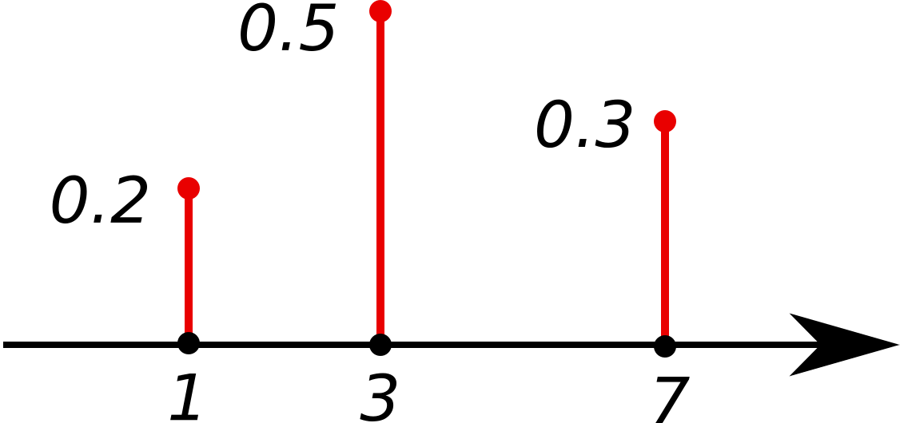

[TOC]

# Discrete probability

## Definitions

For some statistical experiment being performed:

- The set of all possible outcomes is called the ==**sample space**==, denoted $\Omega$.
- A subset $E\subseteq\Omega$ is an **==event==**.

## Elementary principles

### Events

Let $E$ and $F$ be events from some sample space $\Omega$.

- $E\cup F$ is the event that either (or both) $E$ or $F$ happens
- $EF$ (or $E\cap F$) is the event that both $E$ and $F$ happen
- $E^c$ (or $\bar{E}$) is the event that $E$ does **not** happen ($\Omega-E$)

###De Morgan's Law

For events $\{E_i\}_{i=1}^n$:
$$
\newcommand{\p}[1]{\mathbb{P}\left(#1\right)}
\newcommand{\cp}[2]{\p{#1\middle|#2}}
\newcommand{\jp}[2]{\p{#1,#2}}
\newcommand{\e}[1]{\mathbb{E}\left[#1\right]}
\newcommand{\var}[1]{\text{Var}\left[#1\right]}
\newcommand{\sd}[1]{\text{SD}\left(#1\right)}
\newcommand{\cov}[2]{\text{Cov}\left[#1,#2\right]}
\newcommand{\img}[1]{\text{Image}\left(#1\right)}
\newcommand{\bb}{\mathbb}
\newcommand{\R}{\bb{R}}
\newcommand{\N}{\bb{N}}
\newcommand{\Z}{\bb{Z}}
\newcommand{\Q}{\bb{Q}}
\newcommand{\C}{\bb{C}}
\newcommand{\ds}{\displaystyle}
\newcommand{\set}[1]{\left\lbrace#1\right\rbrace}
\newcommand{\setb}[2]{\left\lbrace#1\ \middle| \ #2\right\rbrace}
\newcommand{\d}[1]{\mathrm{d}#1}
\newcommand{\i}[4]{\int_{#1}^{#2}#3\ \d{#4}}
\newcommand{\deriv}[2]{\frac{\d{#1}}{\d{#2}}}
\newcommand{\pderiv}[2]{\frac{\partial #1}{\partial #2}}
\newcommand{\tp}[1]{\mathcal{P}_{#1}}
\newcommand{\surp}[1]{\mathcal{S}\left(#1\right)}
\left(\bigcup_{i=1}^nE_i\right)^c=\bigcap_{i=1}^nE_i^c
$$

$$
\left(\bigcap_{i=1}^nE_i\right)^c=\bigcup_{i=1}^nE_i^c
$$

###Axioms

For each event $E\subseteq\Omega$, we assign a probability $\p{E}$ satisfying:

- $0\leq\p{E}\leq1$

- $\p{\Omega}=1$

- For any sequence $\set{E_i}_{i=1}^\infty$ of **mutually exclusive events**:
  $$
  \p{\bigcup_{j=1}^\infty E_j}=\sum_{j=1}^\infty\p{E_j}
  $$
  Where **==mutual exclusivity==** means ($E_j\cap E_k=\emptyset\quad\forall j\neq k$)

- $\p{E^c}=1-\p{E}$

### Inclusion-exclusion principle

For a finite sequence of arbitrary events $\set{E_i}_{i=1}^n$ where $E_i\subseteq\Omega\quad\forall i$:
$$
\p{\bigcup_{i=1}^nE_i}=\sum_{j=1}^n\p{E_j\cap E_k}+\sum_{j<k<l}^n\p{E_j\cap E_k\cap E_l}-\cdots+(-1)^{n+1}\cdot\p{\bigcap_{i=1}^nE_i}
$$

####Example

> - For $n=2$
> $$
> \p{E_1\cup E_2}=\p{E_1}+\p{E_2}-\p{E_1\cap E_2}
> $$
>
> - For $n=3$
>
> $$
> \begin{align}
> 	\p{E_1\cup E_2\cup E_3}= \ &\p{E_1}+\p{E_2}+\p{E_3}\\
> 	&-\p{E_1\cap E_2}-\p{E_1\cap E_3}-\p{E_2\cap E_3}\\
> 	&+\p{E_1\cap E_2\cap E_3}
> \end{align}
> $$
>

## Random variables

A **==random variable==** is a function that maps each outcome of the sample space to some numerical value.

Given a sample space $\Omega$, a random variable $X$ with values in some set $\cal{R}$ is a function:
$$
X:\Omega\mapsto\cal{R}
$$

> Where $\cal{R}$ is typically $\N_0$ or $\N$ in discrete probability and $\R$ in continuous probability.

### Discrete random variables

- The random variable $X$ is a ==**discrete random variable**== when its range is finite (or countably infinite).

### Continuous random variables

- The random variable $X$ is a ==**continuous random variable**== when its range is uncountably infinite.

### Notation

Random variables often make it easier to ask questions such as:

> How likely is it that the value of $X$ is equal to $2$?

This is the same as the probability of the event $\setb{x\in\Omega}{X(x)=2}$, which is often denoted as $\p{X=2}$ and read "*the probability of the random variable $X$ taking on the value $2$*".

### Example

> Let our statistical experiment be the toss of a fair coin. We will perform this experiment $3$ times, giving us:
> $$
> \Omega=\set{H,T}^3=\{(H,H,H),(H,H,T),(H,T,H),\ldots,(T,T,T)\}
> $$
> Let $X$ be the random variable denoting the number of heads after $3$ coin flips.
>
> - $\p{X=0}=\p{\{(T,T,T)\}}=\frac{1}{8}$
> - $\p{X=1}=\p{\{(T,T,H),(T,H,T),(H,T,T)\}}=\frac{3}{8}$
> - $\p{X=2}=\p{\{(T,H,H),(H,T,H),(H,H,T)\}}=\frac{3}{8}$
> - $\p{X=3}=\p{\{(H,H,H)\}}=\frac{1}{8}$

Note that for the collection $\set{\p{X=k}}_{k=0}^3$, we have:
$$
0\leq\p{X=k}\leq1\\
\sum_{k=0}^3\p{X=k}=1
$$
As we will see later, this represents a probablity distribution, and these are properties that all probability distributions must have.

## Stirling's approximation

**==Stirling's approximation==** is an approximation for the factorial operation. It is an accurate estimation, even for smaller values of $n$.

The approximation is:
$$
n!\sim\sqrt{2\pi n}\left(\frac{n}{e}\right)^n
$$
Where the $\sim$ sign means that the two quantities are asymptotic. This means that their ratio tends to $1$ as $n$ tends to $\infty$.

Alternatively, there is a version of Stirling's formula with bounds valid for all positive integers $n$, rather than asymptotics:
$$
\sqrt{2\pi}n^{n+\frac{1}{2}}e^{-n}\leq n!\leq en^{n+\frac{1}{2}}e^{-n}
$$

## Distributions

A **==probability distribution==** is a mathematical function that maps each outcome of a statistical experiment to its probability of occurrence.

### Probability mass function

A **==probability mass function==** is a function that gives the probability that a discrete random variable is exactly equal to some value. It defines a discrete probability distribution.

Suppose that $X : \Omega\mapsto\mathcal{R}$ is a discrete random variable. Then the probability mass function $f_X:\mathcal{R}\mapsto[0,1]$ for $X$ is defined as:
$$
f_X(x)=\p{X=x}=\p{\setb{s\in\Omega}{X(s)=x}}
$$

#### Example

This is the probability mass function of a discrete probability distribution. 

In this case, we have a random variable $X:\Omega\mapsto\bb{N}$ and a probability mass function $f_X:\bb{N}\mapsto[0,1]$.

Consider the following probabilities as examples:

> - $\p{X=1}=\p{\setb{s\in\Omega}{X(s)=1}}=\p{\set{1}}=0.2$
> - $\p{X=3}=\p{\setb{s\in\Omega}{X(s)=3}}=\p{\set{3}}=0.5$
> - $\p{X=7}=\p{\setb{s\in\Omega}{X(s)=7}}=\p{\set{7}}=0.3$
> - $\begin{align}\p{X\geq1}&=\p{\bigcup_{s\in\Omega}\set{s}}=\sum_{s\in\Omega}\p{\set{s}}\\&=\p{\set{1,3,7}}=\p{\set{1}}+\p{\set{3}}+\p{\set{7}}\\&=0.2+0.5+0.7\\&=1\end{align}$

### Conditions

For any probability distribution (with some random variable $X : \Omega\mapsto\cal{R}$), its probability mass function must satisfy both of the following conditions:

- $0\leq\p{X=k}\leq1\qquad\forall k\in\mathcal{R}$
- $\sum_{k\in\mathcal{R}}^{}\p{X=k}=1$

### Cumulative distribution function

The **==cumulative distribution function==** of a random variable $X$ evaluated at $x$ is the probability that $X$ will take a value less than or equal to $x$.

If $X$ is a discrete random variable that maps to values $\set{x_i}_{i=1}^n$, then the cumulative distribution function $F_X$ is defined as:
$$
F_X(x)=\p{X\leq x}=\sum_{x_i\leq x}\p{X=x_i}=\sum_{x_i\leq x}\p{\set{x_i}}
$$

### Complementary cumulative distribution function

Sometimes, it is useful to study the opposite question — how often the random variable is **above** a particular value. This is called the **==complementary cumulative distribution function==** or simply the **==tail distribution==**, and is denoted $\overline{F_X}(x)$, and is defined as:
$$
\begin{align}
	\overline{F_X}(x)&=\p{X>x}\\
	&=1-F_X(x)\\
\end{align}
$$

### Uniform distribution

A random variable is **==uniformly distributed==** if every possible outcome is equally likely to be observed. In other words, for some statistical experiment, suppose there are $n$ different outcomes. Then the probability of each outcome is $\frac{1}{n}$.

Therefore, the probability mass function for a uniformly distributed discrete random variable $X:\Omega\mapsto\N_0$ for $n$ possible outcomes would be:
$$
\p{X=k}=\frac{1}{n}
$$

| Parameter | Meaning                     |
| --------- | --------------------------- |
| $n\in\N$  | Number of possible outcomes |

### Binomial distribution

The **==binomial distribution==** with parameters $n$ and $p$ is the discrete probability distribution of the number of successes ($k$) in a sequence of $n$ **Bernoulli trials**.

The probability mass function for a binomially distributed discrete random variable $X:\Omega\mapsto\N_0$ for $n$ Bernoulli trials (each with probability of success $p$) would be:
$$
\p{X=k}=\binom{n}{k}p^k(1-p)^{n-k}
$$

| Parameter   | Meaning                              |
| ----------- | ------------------------------------ |
| $n\in\N_0$  | Number of trials                     |
| $p\in[0,1]$ | Probability of success in each trial |

| Quantity (or function)     | Formula               |
| -------------------------- | --------------------- |
| Mean (expected value)      | $\e{X}=np$            |
| Variance                   | $\var{X}=np(1-p)$     |
| Moment-generating function | $M_X(t)=(1-p+pe^t)^n$ |

### Poisson distribution

The **==Poisson distribution==** is a discrete probability distribution that expresses the probability of a given number of events occuring in a fixed interval of time or space if these events occur with a known constant rate and independently of time since the last event.

The probability mass function for a Poisson distributed discrete random variable $X:\Omega\mapsto\mathcal{R}$ with some constant rate $\lambda$ would be:
$$
\p{X=k}=\frac{\lambda^ke^{-\lambda}}{k!}
$$

| Parameter                | Meaning |
| ------------------------ | ------- |
| $\lambda\in\R:\lambda>0$ | Rate    |

| Quantity (or function)     | Formula                     |
| -------------------------- | --------------------------- |
| Mean (expected value)      | $\e{X}=\lambda$             |
| Variance                   | $\var{X}=\lambda$           |
| Moment-generating function | $M_X(t)=e^{\lambda(e^t-1)}$ |

### Negative binomial distribution

The **==negative binomial distribution==** is a discrete probability distribution of the number of trials in a sequence of independent and identically distributed Bernoulli trials before a specified number of successes occurs.

The probability mass function for a negative binomially distributed discrete random variable $X:\Omega\mapsto\N_0$ with $n\in\N_0 : n\geq k$ trials given $k$ successes, would be:
$$
\p{X=n}=\binom{n-1}{k-1}p^k(1-p)^{n-k}
$$

| Parameter                              | Meaning                                             |
| -------------------------------------- | --------------------------------------------------- |
| $k\in\N$ (but can be extended to $\R$) | Number of successes until the experiment is stopped |
| $p\in[0,1]$                            | Success probability in each experiment              |

| Quantity (or function)     | Formula                                    |
| -------------------------- | ------------------------------------------ |
| Mean (expected value)      | $\e{X}=\frac{pk}{1-p}$                     |
| Variance                   | $\var{X}=\frac{pk}{(1-p)^2}$               |
| Moment-generating function | $M_X(t)=\left(\frac{1-p}{1-pe^t}\right)^r$ |

#### Different forms of the distribution

| X counts                          | PMF       | Formula                             | Support    |
| --------------------------------- | --------- | ----------------------------------- | ---------- |
| $n$ trials, given $k$ successes   | $\p{X=n}$ | $\ds\binom{n-1}{k-1}p^k(1-p)^{n-k}$ | $n\geq k$  |
| $r$ failures, given $k$ successes | $\p{X=r}$ | $\ds\binom{k+r-1}{r}p^k(1-p)^r$     | $r\in\N_0$ |

#### Geometric distribution

The **==geometric distribution==** is a special case of the negative binomial distribution, with the parameter $r=1$.

The geometric distribution gives the probability that the first occurence of success requires $k$ independent Bernoulli trials, each with success probability $p$.

The probability mass function for a geometrically distributed discrete random variable $X:\Omega\mapsto\N_0$ with the first success being the $k^\text{th}$ trial, would be:
$$
\p{X=k}=(1-p)^{k-1}p
$$

| Parameter   | Meaning                                |
| ----------- | -------------------------------------- |
| $p\in[0,1]$ | Success probability in each experiment |

| Quantity (or function)     | Formula                          |
| -------------------------- | -------------------------------- |
| Mean (expected value)      | $\e{X}=\frac{1}{p}$              |
| Variance                   | $\var{X}=\frac{1-p}{p^2}$        |
| Moment-generating function | $M_X(t)=\frac{pe^t}{1-(1-p)e^t}$ |

#####When to use?

- The phenomenon being modelled is a sequence of independent trials
- There are only two possible outcomes for each trial (success/failure)
- The probability of success, $p$, is the same for every trial

###Hypergeometric distribution

The **==hypergeometric distribution==** is a discrete probability distribution that describes the probability of $k$ successes (random draws for which the object drawn has a specified feature) in $n$ draws, **without replacement**, from a finite population of size $N$ that contains exactly $K$ objects with that feature, where each draw is either a success or failure.

The probability mass function for a hypergeometrically distributed discrete random variable $X:\Omega\mapsto\N_0$ with $k$ **successes**, would be:
$$
\p{X=k}=\frac{\ds\binom{K}{k}\ds\binom{N-K}{n-k}}{\ds\binom{N}{n}}
$$

| Parameter                | Meaning                                   |
| ------------------------ | ----------------------------------------- |
| $N\in\N$                 | Population size                           |
| $K\in\{0,1,2,\ldots,N\}$ | Number of objects with a specific feature |
| $n\in\{0,1,2,\ldots,N\}$ | Number of draws                           |

| Quantity (or function) | Formula              |
| ---------------------- | -------------------- |
| Mean (expected value)  | $\e{X}=n\frac{K}{N}$ |

###Joint probability

Previously, we introduced $\p{A\cap B}$ as the probability of the intersection of the events $A$ and $B$.

If instead, we let these events be described by the random variables:

- $A$ = $X \text{ at value } x$
- $B=Y \text{ at value y}$

Then we can write:
$$
\p{A\cap B}=\p{X=x\cap Y=y}=\p{X=x,Y=y}
$$
Typically we write $\p{X=x,Y=y}$, and this is referred to as the **==joint probability==** of $X=x$ and $Y=y$.

#### Joint probability distribution

If $X$ and $Y$ are discrete random variables, the function given by $f(x,y)=\p{X=x,Y=y}$ for each pair of values $(x,y)\in\img{X}\times\img{Y}$, is called the **==joint probability distribution==** of $X$ and $Y$.

#### Joint cumulative distribution function

If $X$ and $Y$ are discrete random variables, the definition of the **==joint cumulative distribution function==** of $X$ and $Y$ is given by:
$$
F(x,y)=\p{X\leq x,Y\leq y}=\sum_{s\leq x}\sum_{t\leq y}f(s,t)
$$
where $f(s,t)$ is the joint probability distribution of $X$ and $Y$ at $(s,t)$.

#### Independence of random variables

Consider two discrete random variables $X$ and $Y$. We say that $X$ and $Y$ are independent if:
$$
\p{X=x,Y=y}=\p{X=x}\cdot\p{Y=y}\qquad\forall x,y
$$
The definition of independence can be extended to $n$ random variables:

Consider $n$ discrete random variables $\set{X_i}_{i=1}^n$. We say that $\set{X_i}_{i=1}^n$ are **mutually independent** if:
$$
\p{\bigcap_{i=1}^n\left(X_i=x_i\right)}=\prod_{i=1}^n\p{X_i=x_i}\qquad\forall x\in\set{x_i}_{i=1}^n
$$

##Conditional probability

**==Conditional probability==** is a measure of the probability of an event, given that some other event has occurred.

If the event of interest is $A$ and the event $B$ is known to have occurred, the conditional probability of $A$ given $B$ is written as:
$$
\cp{A}{B}
$$

### Conditioning of an event

Given two events $A$ and $B$, the conditional probability of $A$ given $B$ is defined as:
$$
\cp{A}{B}=\frac{\p{A\cap B}}{\p{B}}\qquad\text{where }\p{B}>0
$$
This may be visualised as restricting the sample space to $B$.

#### Axiomatic definition

Sometimes the definition of conditional probability is treated as an **axiom of probability**:
$$
\p{A\cap B}=\cp{A}{B}\p{B}
$$
This is simply a rearrangement of the equation previously shown.

### Independent events

Events $A$ and $B$ are said to be **==statistically independent==** if their joint probability equals the product of the probability of each event:
$$
\p{A\cap B}=\p{A}\p{B}
$$

####Consequences

- By substituting this into the definition of conditional probability, we get:
  $$
  \cp{A}{B}=\p{A}
  $$
  Intuitively this makes sense, as if $A$ and $B$ are independent, then the fact that event $B$ has already occured should not influence the probability of event $A$ occuring.

#### General case

#####Pairwise independence

A finite set of events $\set{E_i}_{i=1}^n$ is **==pairwise independent==** if every pair of events is independent — that is, **iff**:
$$
\p{E_m\cap E_k}=\p{E_m}\cdot\p{E_k}\qquad\forall k,m:(1\leq k\leq n)\land(1\leq m\leq n)\land (k\neq m)
$$

#####Mutual independence

A finite set of events is **==mutually independent==** if every event is independent of any intersection of the other events — that is, **iff** for every $k$-element subset of $\set{E_i}_{i=1}^n$:
$$
\p{\bigcap_{i=1}^kE_i}=\prod_{i=1}^k\p{E_i}
$$

####Law of total probability

The **==law of total probability==** is the proposition that if $\{B_i\}_{i=1}^n$ is a finite **partition** of a sample space (in other words, a set of pairwise disjoint events whose union is the entire sample space), then for any event $A$ of the same **probability space**:
$$
\p{A}=\sum_{i=1}^n\p{A\cap B_i}=\sum_{i=1}^n\cp{A}{B_i}\p{B_i}
$$

####Bayes' theorem

**==Bayes' theorem==** describes the probability of an event, based on prior knowledge of conditions that might be related to the event.

#####Derivation

Bayes' theorem shows that:
$$
\cp{A}{B}\propto\cp{B}{A}\p{A}\quad\text{and}\quad\cp{\bar{A}}{B}\propto\cp{B}{\bar{A}}\p{\bar{A}}
$$

In other words, there exists some constant $c\in\R$ such that:
$$
\cp{A}{B}=c\cdot\p{A}\cp{B}{A}\quad\text{and}\quad\cp{\bar{A}}{B}=c\cdot\cp{B}{\bar{A}}\p{\bar{A}}
$$
If we add these two formulas, we deduce that:
$$
\begin{align}
1&=c\cdot\p{A}\cp{B}{A}+c\cdot\cp{B}{\bar{A}}\p{\bar{A}}\\
1&=c\left[\p{A}\cp{B}{A}+\cp{B}{\bar{A}}\p{\bar{A}}\right]\\
\end{align}
$$
Therefore, the constant $c$ can be expressed as:
$$
\begin{align}
c&=\frac{1}{\p{A}\cp{B}{A}+\cp{B}{\bar{A}}\p{\bar{A}}}\\
&=\frac{1}{\p{B}}\quad\text{(By the law of total probability)}
\end{align}
$$

#####Definition

**==Bayes' theorem==** is then mathematically defined as:
$$
\cp{A}{B}=\frac{\p{A}\cp{B}{A}}{\p{B}}=\frac{\p{A}\cp{B}{A}}{\p{A}\cp{B}{A}+\cp{B}{\bar{A}}\p{\bar{A}}}
$$
Or alternatively:
$$
\cp{\bar{A}}{B}=\frac{\p{\bar{A}}\cp{B}{\bar{A}}}{\p{B}}=\frac{\p{\bar{A}}\cp{B}{\bar{A}}}{\p{A}\cp{B}{A}+\cp{B}{\bar{A}}\p{\bar{A}}}
$$

####Chain rule

The **==chain rule==** (or **==multiplication rule==**) permits the calculation of any member of the **joint distribution** of a set of random variables using only conditional probabilities.

Consider an indexed collection of events $\{E_i\}_{i=1}^n$, then we can apply the definition of conditional probability to calculate the joint probability:
$$
\p{E_n,E_{n-1},\ldots,E_1}=\cp{E_n}{E_{n-1},E_{n-2},\ldots,E_1}\cdot\p{E_{n-1},E_{n-2},\ldots,E_1}
$$
Repeating this process with each final term creates the product:
$$
\p{\bigcap_{i=1}^nE_i}=\prod_{i=1}^n\cp{E_i}{\bigcap_{j=1}^{k-1}E_j}
$$

##### Example

> With four variables, the chain rule produces this product of conditional probabilities:
> $$
> \p{E_4,E_3,E_2,E_1}=\cp{E_4}{E_3,E_2,E_1}\cdot\cp{E_3}{E_2,E_1}\cdot\cp{E_2}{E_1}\cdot\p{E_1}
> $$
>

#### Mutual independence

Two events are **==mutually independent==** (or **disjoint**) if they cannot both occur. In other words, events $A$ and $B$ are mutually independent **iff** $\p{A\cap B}=0$.

This has a consequence to the inclusion-exclusion principle. If $A$ and $B$ are mutually independent, then:
$$
\begin{align}
\p{A\cup B}&=\p{A}+\p{B}-\cancelto{0}{\p{A\cap B}}\\
&=\p{A}+\p{B}
\end{align}
$$

##### Example

> If our statistical experiment is the toss of a fair coin and:
>
> - $A$ is the event that a heads was tossed
> - $B$ is the event that a tails was tossed
>
> Then $\p{A}=\p{B}=\frac{1}{2}$, but $A\cap B=\emptyset$ since a coin cannot show heads and tails simultaneously (unless it is some kind of coin that exists in quantum superposition).
>
> Therefore $\p{A\cap B}=0$.

###Other properties

- $\cp{A}{\bar{B}}=1-\cp{\bar{A}}{\bar{B}}$
- $\cp{\bar{A}}{B}=1-\cp{A}{B}$

## Expectation

The **==expectation==** of a random variable is the probability-weighted average of all possible values.

The expectation of a random variable $X\in\set{x_i}_{i=1}^k$ is:
$$
\e{X}=\sum_{i=1}^kx_i\cdot\p{X=x_i}
$$

Where the notation $X\in\set{x_i}_{i=1}^k$ means that $X$ takes on the values $\set{x_i}_{i=1}^k$ (its image consists of the values in this set).

###Example

> If $X\in\{1,2,3,\ldots,n\}$, where $X$ is a uniformly distributed random variable (with each outcome having a probability of $\frac{1}{n}$), then its expectation is given by:
> $$
> \begin{align}
> 	\e{X}&=\sum_{k=1}^nk\cdot\p{X=k}\\
> 	&=\sum_{k=1}^nk\cdot\frac{1}{n}\\
> 	&=\frac{1}{n}\sum_{k=1}^nk\\
> 	&=\frac{1}{n}\cdot\frac{n(n+1)}{2}\\
> 	&=\frac{n+1}{2}
> \end{align}
> $$
>

###Moments

Let $X$ be a random variable and $n\in\bb{N}$, then $\e{X^n}$ is called the ==**$n^\text{th}$ moment**== of $X$.

---

In general, if $g(X)$ is a function of $X$ (e.g. $X^2$, $\ln(X)$), then $g(X)$ is also a random variable. 

If $g(X)\in\set{x_j}_{j=1}^k$, its expectation is given by:
$$
\e{g(X)}=\sum_{j=1}^kg(x_j)\cdot\p{X=x_j}
$$
Therefore, if we let $g(X)=X^n$ where $n\in\bb{N}$ and $g(X)$ takes on the values $\set{x_j}_{j=1}^k$, then an expression for the $n^\text{th}$ moment of $X$ would be:
$$
\e{X^n}=\sum_{j=1}^kx_j^n\cdot\p{X=x_j}
$$

###Properties

####Linearity

**==Linearity of expectation==** is the property that the expectation of the sum of random variables is equal to the sum of their individual expected values, regardless of whether they are independent.

More formally, for random variables $\set{X_i}_{i=1}^n$ and constants $\set{c_i}_{i=1}^n$:
$$
\e{\sum_{i=1}^nc_iX_i}=\sum_{i=1}^n(c_i\cdot\e{X_i})
$$

#####Example

> $\e{X+2Y}=\e{X}+2\cdot\e{Y}$

#####Proof of linearity of expectation

Proving the theorem for discrete random variables $X$ and $Y$, by the basic definition of expectation:
$$
\begin{align}
	\e{X+Y}&=\sum_x\sum_y[(x+y)\cdot\p{X=x,Y=y}]\\
	&=\sum_x\sum_y[x\cdot\p{X=x,Y=y}]+[y\cdot\p{X=x,Y=y}]\\
	&=\sum_xx\underbrace{\sum_y\p{X=x,Y=y}}_{\p{X=x}}+\sum_yy\underbrace{\sum_x\p{X=x,Y=y}}_{\p{Y=y}}\\
&=\sum_xx\cdot\p{X=x}+\sum_yy\cdot\p{Y=y}\\
&=\e{X}+\e{Y}
\end{align}
$$
This result can be extended for $n$ variables using induction.

####Other properties

- If $X=c$ where $c$ is some constant, then $\e{X}=c$.

  - In particular, for any random variable $X$:

    $\e{\e{X}}=\e{X}$

    This is due to the fact that the expectation of a random variable is simply a constant.

- $\e{XY}=\e{X}\e{Y}$ for independent $X$ and $Y$.

## Variance and standard deviation

The **==variance==** of a random variable $X$, denoted by $\var{X}$, is defined as:
$$
\begin{align}
	\var{X}&=\e{(X-\e{X})^2}\\
	&=\e{X^2}-\e{X}^2
\end{align}
$$
The variance is a measure of how far a set of numbers are spread out from their mean.

The **==standard deviation==** of a random variable $X$, denoted by $\sd{X}$, is defined as:
$$
\sd{X}=\sqrt{\var{X}}
$$

### Properties

- $\var{aX}=a^2\var{X}\implies\sd{aX}=|a|\sd{X}$

- $\var{aX+b}=a^2\var{X}$ (Adding a constant to a random variable does not change its variance)

- $\var{X+Y}=\var{X}+\var{Y}+2\cov{X}{Y}$

  - In the case that $X$ and $Y$ are independent, $\cov{X}{Y}=0$, thus:

    $\var{X+Y}=\var{X}+\var{Y}$

  - This can also extend to three or more random variables.
    $$
    \var{\sum_{i=1}^nX_i}=\sum_{i=1}^n\var{X_i}+2\sum\sum_{i<j}\cov{X_i}{X_j}
    $$
    Note that if $\cov{X_i}{X_j}=0\quad\forall i,j:i\neq j$, then:
    $$
    \var{\sum_{i=1}^nX_i}=\sum_{i=1}^n\var{X_i}
    $$

    > Example:
    >
    > $\var{X+Y+Z}=\var{X}+\var{Y}+\var{Z}+2\cov{X}{Y}+2\cov{X}{Y}+2\cov{Y}{Z}$
    >
    > Where all covariances will equal zero if $X$, $Y$ and $Z$ are mutually independent.

##Covariance

The **==covariance==** of two random variables $X$ and $Y$, denoted by $\cov{X}{Y}$, is defined as:
$$
\begin{align}
	\cov{X}{Y}&=\e{(X-\e{X})(Y-\e{Y})}\\
	&=\e{XY}-\e{X}\e{Y}
\end{align}
$$

### Properties

- $\cov{aX}{bY}=ab\cov{X}{Y}$

- If $\cov{X}{Y}=0$, this does not necessarily mean that $X$ and $Y$ are independent random variables.

  However, if $X$ and $Y$ are independent, then $\cov{X}{Y}=0$. 

  The contrapositive may also be useful:

  If $\cov{X}{Y}\neq0$, then $X$ and $Y$ are dependent.
