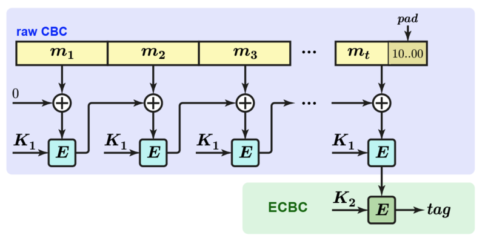

$$
% Display
\newcommand{\ds}{\displaystyle}
\newcommand{\ob}{\overbrace}
\newcommand{\ub}{\underbrace}
\newcommand{\code}{\texttt}

% Colours
\newcommand{\red}[1]{\textcolor{red}{#1}}
\newcommand{\redt}[1]{\textcolor{red}{\text{#1}}}
\newcommand{\blue}[1]{\textcolor{blue}{#1}}
\newcommand{\bluet}[1]{\textcolor{blue}{\text{#1}}}
\newcommand{\green}[1]{\textcolor{green}{#1}}
\newcommand{\greent}[1]{\textcolor{green}{\text{#1}}}

% Typefaces/Text-styles
\newcommand{\mc}{\mathcal}
\newcommand{\mf}{\mathfrak}
\newcommand{\b}{\mathbf}
\newcommand{\bs}{\boldsymbol}

% Fractions
\newcommand{\f}{\frac}

% Positioning
\newcommand{\l}{\left}
\newcommand{\m}{\middle}
\newcommand{\r}{\right}

% Logic
\newcommand{\n}{\not}
\newcommand{\eq}{\equiv}
\newcommand{\xor}{\oplus}

% Sets
\newcommand{\fa}{\forall}
\newcommand{\te}{\exists}
\newcommand{\empty}{\varnothing}
\newcommand{\set}[1]{\l\lbrace#1\r\rbrace}
\newcommand{\setb}[2]{\l\lbrace#1\ \m| \ #2\r\rbrace}
\newcommand{\bb}{\mathbb}
\newcommand{\R}{\bb{R}}
\newcommand{\N}{\bb{N}}
\newcommand{\Z}{\bb{Z}}
\newcommand{\Q}{\bb{Q}}
\newcommand{\C}{\bb{C}}

% Derivatives
\newcommand{\d}[1]{\mathrm{d}#1}
\newcommand{\deriv}[2]{\f{\d{#1}}{\d{#2}}}
\newcommand{\pderiv}[2]{\f{\partial #1}{\partial #2}}

% Sums/Integrals
\newcommand{\s}[3]{\sum_{#1}^{#2}#3}
\newcommand{\i}[4]{\int_{#1}^{#2}#3\ \d{#4}}

% Probability
\newcommand{\p}[1]{\bb{P}\l(#1\r)}
\newcommand{\cp}[2]{\p{#1\m|#2}}
\newcommand{\jp}[2]{\p{#1,#2}}
\newcommand{\e}[1]{\bb{E}\l[#1\r]}
\newcommand{\var}[1]{\text{Var}\l[#1\r]}
\newcommand{\sd}[1]{\text{SD}\l[#1\r]}
\newcommand{\cov}[2]{\text{Cov}\l[#1,#2\r]}

% Binomials
\newcommand{\ch}{\binom}
\newcommand{\pbin}[3][{}]{\l(#2 + #3\r)^#1}
\newcommand{\mbin}[3][{}]{\l(#2 - #3\r)^#1}

% Linear Algebra
\newcommand{\T}{\mathsf{T}}
\newcommand{\seq}[4][{}]{#2_{#3}#1 \ldots #1 #2_{#4}}
\newcommand{\rowv}[3]{\l(\seq[,]{#1}{#2}{#3}\r)}
\newcommand{\colv}[3]{\rowv{#1}{#2}{#3}^\T}
\newcommand{\sqpmat}[3][{}]{
    \begin{pmatrix}
		#2_{1{#1}1} & #2_{1{#1}2} & \cdots & #2_{1{#1}j} & \cdots & #2_{1{#1}#3} \\
		#2_{2{#1}1} & #2_{2{#1}2} & \cdots & #2_{2{#1}j} & \cdots & #2_{2{#1}#3} \\
		\vdots & \vdots & \ddots & \vdots & \ddots & \vdots \\
		#2_{i{#1}1} & #2_{i{#1}2} & \cdots & #2_{i{#1}j} & \cdots & #2_{i{#1}#3} \\
		\vdots & \vdots & \ddots & \vdots & \ddots & \vdots \\
		#2_{#3{#1}1} & #2_{#3{#1}2} & \cdots & #2_{#3{#1}j} & \cdots & #2_{#3{#1}#3} \\
	\end{pmatrix}
}
\newcommand{\sqmat}[3][{}]{
    \begin{matrix}
		#2_{1{#1}1} & #2_{1{#1}2} & \cdots & #2_{1{#1}j} & \cdots & #2_{1{#1}#3} \\
		#2_{2{#1}1} & #2_{2{#1}2} & \cdots & #2_{2{#1}j} & \cdots & #2_{2{#1}#3} \\
		\vdots & \vdots & \ddots & \vdots & \ddots & \vdots \\
		#2_{i{#1}1} & #2_{i{#1}2} & \cdots & #2_{i{#1}j} & \cdots & #2_{i{#1}#3} \\
		\vdots & \vdots & \ddots & \vdots & \ddots & \vdots \\
		#2_{#3{#1}1} & #2_{#3{#1}2} & \cdots & #2_{#3{#1}j} & \cdots & #2_{#3{#1}#3} \\
	\end{matrix}
}
\newcommand{\sqbmat}[3][{}]{
    \begin{bmatrix}
		#2_{1{#1}1} & #2_{1{#1}2} & \cdots & #2_{1{#1}j} & \cdots & #2_{1{#1}#3} \\
		#2_{2{#1}1} & #2_{2{#1}2} & \cdots & #2_{2{#1}j} & \cdots & #2_{2{#1}#3} \\
		\vdots & \vdots & \ddots & \vdots & \ddots & \vdots \\
		#2_{i{#1}1} & #2_{i{#1}2} & \cdots & #2_{i{#1}j} & \cdots & #2_{i{#1}#3} \\
		\vdots & \vdots & \ddots & \vdots & \ddots & \vdots \\
		#2_{#3{#1}1} & #2_{#3{#1}2} & \cdots & #2_{#3{#1}j} & \cdots & #2_{#3{#1}#3} \\
	\end{bmatrix}
}
\newcommand{\sqpmat}[3][{}]{
    \begin{pmatrix}
		#2_{1{#1}1} & #2_{1{#1}2} & \cdots & #2_{1{#1}j} & \cdots & #2_{1{#1}#3} \\
		#2_{2{#1}1} & #2_{2{#1}2} & \cdots & #2_{2{#1}j} & \cdots & #2_{2{#1}#3} \\
		\vdots & \vdots & \ddots & \vdots & \ddots & \vdots \\
		#2_{i{#1}1} & #2_{i{#1}2} & \cdots & #2_{i{#1}j} & \cdots & #2_{i{#1}#3} \\
		\vdots & \vdots & \ddots & \vdots & \ddots & \vdots \\
		#2_{#3{#1}1} & #2_{#3{#1}2} & \cdots & #2_{#3{#1}j} & \cdots & #2_{#3{#1}#3} \\
	\end{pmatrix}
}
\newcommand{\sqvmat}[3][{}]{
    \begin{vmatrix}
		#2_{1{#1}1} & #2_{1{#1}2} & \cdots & #2_{1{#1}j} & \cdots & #2_{1{#1}#3} \\
		#2_{2{#1}1} & #2_{2{#1}2} & \cdots & #2_{2{#1}j} & \cdots & #2_{2{#1}#3} \\
		\vdots & \vdots & \ddots & \vdots & \ddots & \vdots \\
		#2_{i{#1}1} & #2_{i{#1}2} & \cdots & #2_{i{#1}j} & \cdots & #2_{i{#1}#3} \\
		\vdots & \vdots & \ddots & \vdots & \ddots & \vdots \\
		#2_{#3{#1}1} & #2_{#3{#1}2} & \cdots & #2_{#3{#1}j} & \cdots & #2_{#3{#1}#3} \\
	\end{vmatrix}
}
\newcommand{\sqVmat}[3][{}]{
    \begin{Vmatrix}
		#2_{1{#1}1} & #2_{1{#1}2} & \cdots & #2_{1{#1}j} & \cdots & #2_{1{#1}#3} \\
		#2_{2{#1}1} & #2_{2{#1}2} & \cdots & #2_{2{#1}j} & \cdots & #2_{2{#1}#3} \\
		\vdots & \vdots & \ddots & \vdots & \ddots & \vdots \\
		#2_{i{#1}1} & #2_{i{#1}2} & \cdots & #2_{i{#1}j} & \cdots & #2_{i{#1}#3} \\
		\vdots & \vdots & \ddots & \vdots & \ddots & \vdots \\
		#2_{#3{#1}1} & #2_{#3{#1}2} & \cdots & #2_{#3{#1}j} & \cdots & #2_{#3{#1}#3} \\
	\end{Vmatrix}
}
$$

[TOC]

# Cryptography

**==Cryptography==** refers to secure information and communication techniques derived from algorithms that transform messages through various means such as modular arithmetic or bitwise operations, in ways that are difficult to decipher.

**Note**: General cryptography may refer to other things, but modern cryptography is typically heavily based on mathematical theory, and most commonly refers to plain-text encryption and decryption.

## Historical ciphers

### Rail fence cipher

- Shared secret: key $k\in\N$

#### Encryption

Plaintext written in columns of size $k$. The cipher text is the concatenation of the resulting rows.

> **Example**: 
>
> - $k=4$
>
> - $m=\text{THIS IS SOME RANDOM TEXT}$
>
> $$
> \begin{matrix}
> 	\text{T} &   & \text{S} &  & \text{D} & \text{T}\\
> 	\text{H} & \text{I} & \text{O} & \text{R} & \text{O} & \text{E}\\
> 	\text{I} & \text{S} & \text{M} & \text{A} & \text{M} & \text{X}\\
> 	\text{S} &   & \text{E} & \text{N} &  & \text{T} \\
> \end{matrix}
> $$
>
> - $c=\text{T S DTHIOROEISMAMXS EN T}$

#### Decryption

Ciphertext written in rows of size $\f{|c|}{k}$.

#### Analysis

- Key space size $k<|c|$: **open to brute force attack** due to small key space.

### Substitution cipher

- Shared secret: a permutation $\beta$ of the set of characters.

#### Encryption

Apply $\beta$ to each character of the plaintext.
$$
\begin{align}
	m&=p_1p_2\ldots p_n\\
	E(\beta,m)&=\beta(p_1)\beta(p_2)\ldots\beta(p_n)
\end{align}
$$

#### Decryption

Apply $\beta^{-1}$ to each character of the ciphertext.
$$
\begin{align}
	m&=p_1p_2\ldots p_n\\
	c&=E(\beta,m)=c_1c_2\ldots c_n\\\\
	D(\beta,c)&=\beta^{-1}(c_1)\beta^{-1}(c_2)\ldots\beta^{-1}(c_n)\\
	&=m
\end{align}
$$

#### Analysis

- Key space size $|\mathcal{K}|=26! (\approx2^{88})$: **brute force infeasible**!

### Vigenère cipher

- Shared secret: key - a word $w$ over the English alphabet

#### Encryption

Break the plaintext $m=m_1m_2\ldots m_n$ in $\f{|m|}{|w|}$ blocks, and encrypt each block as follows:
$$
\begin{matrix}
	  & m_{i+1} & \ldots & m_{i+|w|}\\
	+ & w_1 & \ldots & w_{|w|}\\
	\hline
	  & \underbrace{m_{i+1}+w_1\pmod{26}}_{c_{i+1}} & \ldots & \underbrace{m_{i+|w|}+w_{|w|}\pmod{26}}_{c_{i+|w|}}
\end{matrix}
$$
Concatenate the resulting blocks to obtain the ciphertext.

#### Decryption

Break the ciphertext $c=c_1c_2\ldots c_n$ in $\f{|m|}{|w|}$ blocks, and decrypt each block as follows:
$$
\begin{matrix}
	  & c_{i+1} & \ldots & c_{i+|w|}\\
	- & w_1 & \ldots & w_{|w|}\\
	\hline
	  & \underbrace{m_{i+1}-w_1\pmod{26}}_{c_{i+1}} & \ldots & \underbrace{m_{i+|w|}-w_{|w|}\pmod{26}}_{c_{i+|w|}}
\end{matrix}
$$

## Symmetric Encryption

### Symmetric encryption schemes

A **==symmetric cipher==** consists of two algorithms:

- **Encryption algorithm**: $E:\mathcal{K}\times\mathcal{M}\to\mathcal{C}$
- **Decryption algorithm**: $D:\mathcal{K}\times\mathcal{C}\to\mathcal{M}$

Such that $\fa k\in\mathcal{K}$, and $\fa m\in\mathcal{M}$:
$$
D\l(k,E(k,m)\r)=m
$$
That is, decrypting an encrypted message $E(k,m)$ with the decryption algorithm $D$, using the same key $k$ that was used to encrypt the original message, will produce the original message $m$.

The key $k$ is intended to be kept secret, between the sender and receiver of the message $m$.

### Good encryption schemes

An encryption scheme is secure against a given attacker if this attacker cannot:

- Recover the secret key $k$.
- Recover the plaintext $m$ underlying a ciphertext $c$.
- Recover any bits of the plaintext $m$ underlying a ciphertext $c$.

### Kerchoff's principle

**==Kerchoff's principle==** states that a cryptosystem should be secure even if everything about the system, except the key, is public knowledge.

- The encryption $E$ and decryption $D$ algorithms are public.
- The security relies entirely on the secrecy of the key.

### Attacker's capabilities

- A cryptographic scheme is secure under some assumptions, or against a certain type of attacker.
- A cryptographic scheme may be vulnerable to certain types of attacks, but not others.

An attacker might have access to:

- **Known ciphertext attack**: Some ciphertexts $c_1,\ldots,c_n$, all of which were encrypted using the same key.

  The goal is to determine the plaintext for one or more of these ciphertexts or, better yet, to discover the key.

- **Known plaintext attack**: Some plaintext/ciphertext pairs $(m_1,c_1),\ldots,(m_n,c_n)$ such that $c_i=E(k,m_i)$—each plaintext was encrypted using the same key $k$.

  The goal is to determine the key $k$.

- **Chosen ciphertext attack**: Access to a decryption oracle (can maybe trick a user to decrypt ciphertexts $c_1,\ldots,c_n$ of his choice)—can choose one or more ciphertext messages and get the plaintext that is associated with each one, based on the use of the same key $k$.

- **Chosen plaintext attack**: Access to an encryption oracle (can maybe trick a user to encrypt messages $m_1,\ldots,m_n$ of his choice)—can choose one or more plaintext messages and get the ciphertext that is associated with each one, based on the use of the same key $k$.

- **Computational power**: Unlimited, polynomial, or realistic ($\leq 2^{80}$) computational power.

### Pseudo-random number generators

A **==pseudo-random number generator==** is a method for generating a sequence of numbers that approximates the properties of a random sequence.

A desired property of a random sequence is that the numbers it generates are uniformly distributed.

### Brute-force attack

In a **==brute-force==** attack, the attacker tries all possible keys $k\in\mathcal{K}$. This requires some knowledge about the structure of plaintext.

#### Prevention

The main form of prevention for brute-force attacks is to make exhaustive searches infeasible:

- $\mathcal{K}$ should be sufficiently large - keys should be sufficiently long.
- Keys should be sampled uniformly at random from $\mathcal{K}$

### Perfect secrecy

A cipher $(E, D)$ over $(\mathcal{M}, \mathcal{C}, \mathcal{K})$ satisfies **==perfect secrecy==** if for all messages $m_1, m_2\in\mathcal{M}$ of the same length $(|m_1|=|m_2|)$, and for all ciphertexts $c\in\mathcal{C}$:
$$
\l|\p{E(k,m_1)=c}-\p{E(k,m_2)=c}\r|\leq\epsilon
$$

> **Where**:
>
> - $k\xleftarrow[]{r}\mathcal{K}$ ($k$ is a key sampled uniformly at random from the key-space $\mathcal{K}$)
> - $\epsilon$ is some *negligible quantity*

### One-Time Pad (OTP)

- Shared secret: key $k\in\mathcal{K}$, where $\mathcal{M}=\mathcal{C}=\mathcal{K}=\set{0,1}^n$ (bit-string of length $n$)

#### Encryption

Perform a logical XOR ($\xor$) operation with the key $k$ and the message:
$$
\fa k\in\mathcal{K}.\fa m\in\mathcal{M}.E(k,m)=k\xor m
$$

#### Decryption

Perform a logical XOR operation with the key $k$ and the ciphertext:
$$
\fa k\in\mathcal{K}.\fa c\in\mathcal{C}.D(k,c)=k\xor c
$$

#### Consistency

$$
D(k,E(k,m))=k\xor(k\xor m)=m
$$

#### Proof that OTP satisfies perfect secrecy

First note that $\fa m\in\mathcal{M}$ and $\fa c\in\mathcal{C}$:
$$
\begin{align}
	\p{E(k,m)=c}&=\f{|\setb{k\in\mathcal{K}}{k\xor m=c}|}{|\mathcal{K}|}\\
	&=\f{1}{|\mathcal{K}|}
\end{align}
$$

> **Where**: $k\xleftarrow[]{r}\mathcal{K}$

Thus, $\fa m_1,m_2\in\mathcal{M}$, and $\fa c\in C$:
$$
\l|\p{E(k,m_1)=c}-\p{E(k,m_2)=c}\r|\leq\l|\f{1}{|\mathcal{K}|}-\f{1}{|\mathcal{K}|}\r|=0
$$

#### Limitations of OTP

- **Key length**: The key must be as long as the plaintext.

- **Getting true randomness**: The key should not be guessable from an attacker:

  > **Example**: `00000000` or `11111111` would be bad keys in $\mathcal{K}=\set{0,1}^8$.

- Perfect secrecy does not capture all possible attacks.

- Two-time pad attacks.

- Malleable.

### Stream ciphers

The motivation behind **stream ciphers** is to make the OTP practical.

In a **==stream cipher==**, each plaintext digit is encrypted one at a time with the corresponding digit of the key-stream, to give a digit of the ciphertext stream.

- **Idea**: Use a **pseudo-random** key rather than a really random key.

  - The key will not really be random, but will look random.

  - The key will be generated from a key seed using a **==Pseudo-Random Generator (PRG)==**:
    $$
    G:\set{0,1}^s\to\set{0,1}^n
    $$

    > **With**: $s \ll n$ ($s$ much less than $n$)

- **Encryption**: Using a PRG:
  $$
  G:E(k,m)=G(k)\xor m
  $$

- **Decryption**: Using a PRG:
  $$
  G:D(k,c)=G(k)\xor c
  $$

> **Example**: Vigenère cipher, RC4.

#### Benefits and drawbacks of stream ciphers

| **Benefits**                                                 | **Drawbacks**                                                |
| ------------------------------------------------------------ | ------------------------------------------------------------ |
| **Speed of transformation**: Stream cipher algorithms are linear in time. | **Low diffusion**: All information of a plaintext symbol is contained in a single ciphertext symbol. |
| **Low error propagation**: An error in encrypting one symbol is likely not to affect subsequent symbols. | **Susceptible to insertions**: An active interceptor who breaks the algorithm might insert text that looks authentic. |

#### RC4

**==RC4==** is a stream cipher invented by Ron Rivest in 1987.

- Consists of 2 phases: **Initialisation** and **key-stream generation**
- Main data structure: Array $S$ of 256 bytes.
- Used in HTTPS and WEP
- **Weaknesses**:
  - First bytes are biased<br>**Solution**: Drop the first 256 generated bytes.
  - Subject to related keys attacks<br>**Solution**: Choose randomly generated keys as seeds.

##### Initialisation

```ruby
for i = 0 to 255 do
	S[i] = i 
end

j = 0

for i = 0 to 255 do
    j = j + S[i] + K[i (mod |K|)] (mod 256)
    swap(S[i], S[j])
end
```

##### Key-stream generation

```ruby
while generatingOutput
    i = i + 1 (mod 256)
    j = j + S[i] (mod 256)
    swap(S[i], S[j])
    output(S[S[i] + S[j] (mod 256)])
end
```

### Block ciphers

In a **==block cipher==**, the plaintext is divided into blocks, and each block (group of plaintext symbols) is encrypted one by one - rather than encrypting one symbol at a time like stream ciphers do.

- Most modern symmetric encryption algorithms are block ciphers.

- Block sizes vary (e.g. 64 bits for DES, 128 bits for AES).

---

A block cipher with parameters $k$ and $l$ is a pair of deterministic algorithms $(E,D)$ such that:

- Encryption $E:\set{0,1}^k\times\set{0,1}^l\to\set{0,1}^l$
- Decryption $D:\set{0,1}^k\times\set{0,1}^l\to\set{0,1}^l$

> **Example**: 3DES ($l=64, k=168$) and AES ($l=128,k=128,192,256$).

#### Benefits and drawbacks of block ciphers

| **Benefits**                                                 | **Drawbacks**                                                |
| ------------------------------------------------------------ | ------------------------------------------------------------ |
| **High diffusion**: Information from one plaintext symbol is diffused into several ciphertext symbols. | **Slowness of encryption**: An entire block must be accumulated before encryption or decryption can begin. |
| **Immune to tampering**: Difficult to insert symbols without detection. | **Error propagation**: An error in one symbol may corrupt the entire block. |

#### DES

The **==Data Encryption Standard (DES)==** is a symmetric-key block cipher

- 64 bit key (8 bits parity, 56 bits actual data - every 8th bit is a parity bit)
- 64 bit plaintext, 64 bit ciphertext
- 16 rounds, each accepting a 64-bit input and giving a 64-bit output.

##### Encryption algorithm

1. Construct the key $k$ by inserting a parity bit after every 7th bit of the actual data.<br>This expands $k$ from 56-bit to 64-bit.

2. Generate 16 48-bit sub-keys, $\seq{k}{1}{16}$ from this new 64-bit key.<br>Read [here](http://page.math.tu-berlin.de/~kant/teaching/hess/krypto-ws2006/des.htm) for more information about generating sub-keys.

3. Permute the plaintext.

4. Divide the plaintext into two 32-bit halves, $L_i$ and $R_i$. 

5. For each of the 16 rounds, starting from $i=1$:

   **Round $i$**

   - $L_{i+1}=R_i$: The left half of the input for the next round, $L_{i+1}$, becomes the right half of the input for the current round, $R_i$.
   - $R_{i+1}=L_i\xor M(k_i,R_i)$: The right half of the input for the next round, $R_{i+1}$, becomes the result of taking the logical XOR between the left half of the input for the current round, $L_i$, and the output of the mangler function accepting the sub-key for the current round, $k_i$, and the right half of the input for the current round, $R_i$.<br>The **mangler** function $M$ scrambles half a block together with the 48-bit sub-key, $k_i$.

5. Swap the left and right halves of the output from the final round.
6. Permute the resulting text, which produces the ciphertext.

##### Decryption algorithm

Perform the encryption algorithm again, but using the sub-keys $\seq{k}{1}{16}$ in reverse.

##### Problems with DES

- Vulnerable to exhaustive key search (brute-force) attacks.
- 3DES solves this by increasing key space to 168 bits.

#### 3DES

**==3DES==** encryption chains 3 DES operations with 3 different DES keys, $K_1,K_2, K_3$.

- 3 different 64-bit (56-bit data + 8-bit parity) DES keys.
- 64 bit plaintext $M$, 64 bit ciphertext $C$

**Note**: If $K_1=K_2=K_3$, then 3DES works the same as single DES.

##### Encryption algorithm

$$
C=E(K_3,D(K_2,E(K_1,M)))
$$

> Where $E$ and $D$ are the encryption and decryption algorithms for DES.

##### Decryption algorithm

$$
M=D(K_1,E(K_2,D(K_3,C)))
$$

##### Problems with 3DES

- 3 times as slow as DES.

#### AES

**==Advanced Encryption Standard (AES)==** is a symmetric-key block cipher that operates on:

- 128-bit blocks (128-bit plaintext and ciphertext)
- 128, 192 or 256 bit keys (AES-128, AES-192 or AES-256)

AES is **stronger** and **faster** than 3DES.

##### 128-bit example

AES-128 proceeds in **ten** rounds. Each round performs an invertible transformation on a 128-bit array, called **==state==**.

1. The initial state $X_0$ is the XOR of the plaintext $M$ with the key $K$.
   $$
   X_0=M\xor K
   $$

2. Round $i$ (where $i\in\set{1,\ldots,10}$) receives state $X_{i-1}$ as input and produces state $X_i$.

3. The ciphertext $C$ is the output of the final round.
   $$
   C=X_{10}
   $$

Where each round is built from four basic steps:

1. **SubBytes** step: An S-box substitution step.
2. **ShiftRows** step: A permutation step.
3. **MixColumns** step: A matrix multiplication (Hill cipher) step.
4. **AddRoundKey** step: An XOR step with a **round key** derived from the 128-bit encryption key.

## Cryptographic hash functions and MACs

### One-way functions (OWFs)

A function $f$ is a **==one-way function==** if for all $y$, there is no efficient algorithm which can compute $x$ such that $f(x)=y$.

#### Examples

- Constant functions **are not** OWFs,<br>since any $x$ is such that $f(x)=c$.
- The successor function in $\N$ **is not** a OWF,<br>given $\mathrm{succ}(n)$, it is easy to retrieve $n=\mathrm{succ}(n)-1$.
- Multiplication of large primes **is** a OWF:<br>integer factorisation is a hard problem - given $pq$ where $p$ and $q$ are primes, it is hard to retrieve $p$ and $q$.

### Collision-resistant functions (CRFs)

A function $f$ is **==collision-resistant==** if there is no efficient algorithm that can find two messages $m_1$ and $m_2$ such that $f(m_1)=f(m_2)$.

#### Examples

- Constant functions **are not** CRFs,<br>for all $m_1$ and $m_2$, $f(m_1)=f(m_2)$.
- The successor function in $\N$ **is** a CRF,<br>the predecessor of a positive integer is unique.
- Multiplication of large primes **is** a CRF:<br>every positive integer has a unique prime factorisation.

### Cryptographic hash functions

A **==cryptographic hash function==** $H:\cal{M \to T}$ is a function that satisfies the following four properties:

- $\cal{|M|\gg|T|}$
- it is easy to compute the hash value for any given message
- it is hard to retrieve a message from its hashed value (OWF)
- it is hard to find two different messages with the same hash value (CRF)

Examples of cryptographic hash functions include `MD5`, `SHA-256`, `Whirlpool` and `bcrypt`.

#### Applications

- **File integrity**: Hashes are sometimes posted along with files on read-only spaces to allow verification of integrity of the files.
- **Password verification**: Instead of storing passwords in cleartext, only the hash digest of each password is stored. To authenticate a user, the password presented by the user is hashed and compared with the stored hash.

### Message authentication codes (MACs)

A **==message authentication code (MAC)==** is a short piece of information used to authenticate a message—in other words, to confirm that the message came from the stated sender and has not been changed.

Essentially, a MAC is an encrypted checksum generated on the underlying message that is sent along with a message to ensure message authentication.

#### Functionality

<p style="text-align:center;">
    </img>
	<br>
	<p style="text-align:center;">
        <b>Figure 1</b>: The process of MAC authentication.<br> <em>Note: This example assumes a cleartext message.</em> (<a href="https://www.tutorialspoint.com/cryptography/message_authentication.htm/">source</a>)
	</p>
</p>


As shown in Figure 1:

1. The sender uses some publicly known MAC algorithm—an algorithm $E$ which accepts the input message $m$ and the secret key $k$ and produces a MAC value.

2. Similarly to a hash function, a MAC function also compresses an arbitrary long input into a fixed length output.

   **The major difference between hash and MAC is that MAC uses a secret key during the compression.**

3. The sender forwards the message along with the MAC.

   **Note**: In Figure 1 this is simply a cleartext message, but in reality (if confidentiality) is necessary, this would be encrypted. If this is the case, then the MAC should always be computed on the ciphertext (two different keys should be used in this case).

4. Once the message and MAC is received, the receiver feeds the received message and the shared secret key $k$ into the same MAC algorithm that was used by the sender, and re-computes the MAC value.

5. The receiver now checks equality of the freshly-computed MAC with the MAC received from the sender.

   - If they match, then the receiver accepts the message and assures themself that the message has been sent by the intended sender.

   - If the computed MAC does not match the MAC sent by the sender, the receiver cannot determine whether it is the message that has been altered, or the origin that has been falsified.

     As a bottom-line, a receiver safely assumes that the message is not genuine.

#### Block ciphers and message integrity

Let $(E,D)$ be a block cipher. We build a MAC $(S,V)$ using $(E,D)$ as follows:

- $S(k,m)=E(k,m)$
- $V(k,m,t)=\begin{cases}\top\quad\text{if $m=D(k,t)$}\\\bot\quad\text{otherwise}\end{cases}$

However, block ciphers can usually only process 128 or 256 bits. To overcome this limitation, it is possible to split plaintext and chain encryption operations together, often by using logical operators such as XOR.

<p style="text-align:center;">
    </img>
	<br>
	<p style="text-align:center;">
        <b>Figure 14</b>: Construction of a MAC with CBC mode encryption (ECBC-MAC).<br>
    <em>Note: A zero initialisation vector is always used in this mode of operation.</em> (<a href="https://he.wikipedia.org/wiki/%D7%A7%D7%95%D7%91%D7%A5:ECBC-MAC.png">source</a>)
	</p>
</p>

##### Initialisation vector

An **==initialisation vector (IV)==** is a block of bits that is used by several modes to randomise the encryption and hence produce distinct ciphertexts even if the same plaintext is encrypted multiple times.

##### Modes of operation

A **==mode of operation==** is an algorithm that uses a block cipher to provide information security such as **confidentiality** or **authenticity**.

> **Example**: CBC, ECB and CTR.

## Asymmetric encryption

**==Asymmetric encryption==**, also known as **public-key cryptography**, is a cryptographic system that encrypts and decrypts data using two separate yet mathematically connected cryptographic keys—these keys are known as a **public key** and a **private key**.

### Online Trusted Third Party (TTP)

**==Online Trusted Third Party (TTP)==** is a method of establishing keys through the use of a **trusted third party**.

- Users $\seq[,]{U}{1}{n}$
- TTP, $T$
- Encryption and decryption algorithms $E(k,m)$ and $D(k,m)$
- Each user $U_i$ has a shared secret key $K_i$ with $T$
- $U_i$ and $U_j$ can establish a key $K_{i,j}$ with the help of $T$

#### Functionality

Suppose $U_i$ wishes to communicate with $U_j$ securely, but needs to establish a key $K_{i,j}$ first.

1. $U_i$ sends a message to $T$, saying that they wish to communicate with $U_j$.
2. $T$ generates a new secret key $K_{i,j}$.
3. $T$ sends the new key $K_{i,j}$ to:
   - $U_i$ in the form of an encrypted message $E(K_i,K_{i,j})$.
   - $U_j$ in the form of an encrypted message $E(K_j,K_{i,j})$.
4. To acquire the shared secret key $K_{i,j}$,
   - $U_i$ decrypts the message using $K_i$: $D(K_i,E(K_i,K_{i,j}))=K_{i,j}$
   - $U_j$ decrypts the message using $K_j$: $D(K_j,E(K_j,K_{i,j}))=K_{i,j}$
5. $U_i$ and $U_j$ can now communicate using $K_{i,j}$.

#### Problems

- The TTP can read all messages between $U_i$ and $U_j$.

  Since TTP generated $K_{i,j}$, it can intercept and read any messages went between $U_i$ and $U_j$, since they are also using $K_{i,j}$.

- The TTP can impersonate any user.

  Since TTP has a key shared with every user, it can generate a fake channel between $U_i$ and $U_j$.

### Public-key cryptography

- Key generation algorithm: $G:\to\cal{K\times K}$

  Generates $(K_\hat{s},K_\hat{p})$ where:

  - $K_\hat{s}$ is a secret (**private**) key for decryption
  - $K_\hat{p}$ is a shared public key for encryption

- Encryption algorithm $E:\cal{K\times M\to C}$

- Decryption algorithm $D:\cal{K\times C\to M}$

Such that $\forall(K_\hat{s},K_\hat{p})\in G$ and $\forall m\in\mathcal{M}$, $D(K_\hat{s},E(K_\hat{p},m))=m$.

#### Functionality

Suppose user $U_i$ wishes to send a message to $U_j$.

1. $U_i$ encrypts the message $m$, using a shared public key $K_\hat{p}^j$ from $U_j$, and sends the resulting ciphertext $c=E(K_\hat{p}^j,m)$ to $U_j$.
2. $U_j$ uses their own secret private key $K_\hat{s}^j$ to decrypt the ciphertext $D(K_\hat{s}^j,E(K_\hat{p}^j,m))=m$.

It is important that $K_\hat{s}^j$ is never shared, and that $K_\hat{p}^j\neq K_\hat{s}^j$.

### Number theory

#### Primes

1. $p\in\N$ is a ==**prime**== if its only divisors are $1$ and $p$
2. Every $n\in\N$ has a ==**unique factorisation**== as a product of prime numbers (prime factors)

#### Relative primes

1. $a,b\in\Z$ are ==**relative primes**== if they have no common factors

2. ==**Euler's totient function**== $\phi(n)$ is the number of integers that are relatively prime with $n$:
   $$
   \phi(n)=\l|\setb{m}{0<m<n\ \text{and}\ \gcd(m,n)=1}\r|
   $$

   > **Example**:
   >
   > - For $p$ prime: $\phi(p)=p-1$
   > - For $p$ and $q$ primes: $\phi(pq)=(p-1)(q-1)$

**Note**: Euler's totient function is multiplicative—if $\gcd(m,n)=1$, then $\phi(mn)=\phi(m)\phi(n)$

#### $\Z_n$

Let $n\in\N$. We define $\Z_n=\set{0,\ldots,n-1}$.
$$
\fa a\in\Z, \fa b\in\Z_n, a\eq b\pmod{n}\iff\te k\in\N\ \text{s.t.}\ a=b+kn
$$

##### Modular inversion

The inverse of $x\in\Z_n$ is $y\in\Z_n$ s.t. $xy\equiv1\pmod{n}$. We denote $x^{-1}$ the inverse of $x\pmod{n}$.

> **Example**:
>
> - $7^{-1}$ in $\Z_{12}$: $7$
> - $4^{-1}$ in $\Z_{12}$: $4$ has no inverse in $\Z_{12}$

##### Theorem

Let $n\in\N$, $x\in\Z_n$. $x$ has an inverse in $\Z_n$ iff $\gcd(x,n)=1$.

#### $\Z_n^*$

Let $n\in\N$. We define $Z_n^*=\setb{x\in\Z_n}{\gcd(x,n)=1}$.

> **Example**:
> $$
> \Z_{12}^*=\set{1,\cancel{2,3,4},5,\cancel{6},7,\cancel{8,9,10},11}=\set{1,5,7,11}
> $$

**Note**: $|\Z_n^*|=\phi(n)$

##### Theorem (Euler)

$$
\fa n\in\N,\fa x\in\Z_n^*,\ \gcd(x,n)=1\implies x^{\phi(n)}\eq1\pmod{n}
$$

##### Theorem (Euler)

For all $p$ prime, $\Z_p^*$ is a cyclic group, i.e.
$$
\exist g\in\Z_p^*, \set{g^1,g^2,g^3,\ldots,g^{p-1}}=\Z_p^*
$$

Where $g$ is a **==generator==** of $\Z_p^*$. See [here](https://crypto.stanford.edu/pbc/notes/numbertheory/gen.html).

#### Intractable problems

##### Integer factorisation (into prime factors)

- **Input**: $n\in\N$
- **Output**: $\seq[,]{p}{1}{m}$ such that $n=\prod_{i=1}^mp_i$

##### RSAP

- **Input**: 
  - $n$ such that $n=pq$ with $p,q$ prime
  - $e$ such that $\gcd(e,\phi(n))=1$
  - $m^e\pmod n$
- **Output**: $m$

##### Discrete logarithmic problem (DLOG)

- **Input**:
  - $p$ prime
  - generator $g$ of $\Z_p^*$
  - $y\in\Z_p^*$
- **Output**: $x$ such that $y=g^x\pmod p$

##### Diffie-Hellman problem (DHP)

- **Input**: 
  - $p$ prime
  
  - generator $g$ of $\Z_p^*$, $g^a\pmod p, g^b\pmod p$
  
    **Note**: $a$ and $b$ are not known—they are randomly chosen.
- **Output**: $g^{ab}\pmod p$

### Diffie-Hellman (DH) protocol

The **==Diffie-Hellman (DH) protocol==** is a method of establishing a key $K_{i,j}$ between two users $U_i$ and $U_j$ without relying on a TTP.

The protocol uses (and assumes) the fact that the Diffie-Hellman protocol is hard in $\Z_p^*$.

#### Functionality

1. Fix: 

   - A very large prime $p$
   - A generator $g$ of $\Z_p^*$

2. $U_i$ selects a random $a\in\Z_p$ and sends $U_j$ the result of $g^a\pmod p$.

   $U_j$ selects a random $b\in\Z_p$ and sends $U_i$ the result of $g^b\pmod p$.

3. The shared secret key is the value $g^{ab}\pmod p$.

   - $U_i$ can calculate this using their chosen $a$ and the value of  $g^b\pmod p$ sent by $U_j$: $g^{ab}\pmod p = (g^b)^a\pmod p$
   - $U_j$ can calculate this by using their chosen $b$ and the value of $g^a\pmod p$ sent by $U_i$: $g^{ab}\pmod p = (g^a)^b\pmod p$

##### Problems

- **Subject to a man-in-the-middle attack**

  The MITM generates their own $a'$ and $b'$, and:

  - Sends $g^{a'}\pmod p$ to $U_j$ instead of $g^a\pmod p$
  - Sends $g^{b'}\pmod p$ to $U_i$ instead of $g^b \pmod p$

  After exponentiation with their own $a/b$,

  - $U_i$'s key, $K_i$, is $(g^a)^{b'}\pmod p$
  - $U_j$'s key, $K_j$, is $(g^b)^{a'}\pmod p$

  Note that these aren't necessarily equal to each other, and therefore can't be used as a shared key.

  However, the MITM has access to both $K_i$ and $K_j$.

### RSA trapdoor permutation

A **==trapdoor function==** is a function that is easy to compute in one direction, yet difficult to find its inverse without special information, called the **trapdoor**.

#### Functionality

- Generate public key $K_\hat{p}$ and secret key $K_\hat{s}$ with $G_\mathrm{RSA}()$:

  > **Where**:
  >
  > - $K_\hat{p}=(N,e)$ and $K_\hat{s}=(N,d)$
  > - $N=pq$ with $p$, $q$ random primes
  > - $e,d\in\Z$ s.t. $ed\eq1\pmod{\phi(N)}$
  >
  > (First pick $p$ and $q$, then $e$ and $d$)

- $\mathcal{M=C}=\Z_N$

- Encryption: $\mathrm{RSA}(K_\hat{p},x)=x^e\pmod N$

- Decryption: $\mathrm{RSA}^{-1}(K_\hat{s}, x)=x^d\pmod N$

##### Consistency

When $x$ and $N$ are relatively prime:
$$
\begin{align}
	\mathrm{RSA}^{-1}\l(K_\hat{s},RSA(K_\hat{p},x)\r)
	&=(x^e)^d\pmod N\\
	&=x^{ed}\pmod N\\
	&=x^{1+k\phi(N)}\pmod N\\
	&=x\cdot x^{k\phi(N)}\pmod N\\
	&=x\cdot (x^{\phi(N)})^k\pmod N\\
	&\stackrel{\text{Euler}}{=}x\pmod N
\end{align}
$$

##### Problems

$(G_\mathrm{RSA}, \mathrm{RSA}, \mathrm{RSA}^{-1})$ (RSA trapdoor permutation) is called **==raw RSA==**. This should **not** be used directly as an asymmetric cipher because RSA is deterministic, which means it is **not secure against chosen plaintext attacks**.

### ISO standard

The goal of the **==ISO standard==** is to build an asymmetric cipher using $(G_\mathrm{RSA}, \mathrm{RSA}, \mathrm{RSA}^{-1})$, that is secure against chosen plaintext attacks.

- Let $(E_s,D_s)$ be a symmetric encryption scheme over $(\cal{M, C, K})$.
- Let $H:\Z_N^*\to\cal{K}$ (a mapping from the integers $\Z_N^*$ to the key-space $\cal{K}$.

Build $(G_\mathrm{RSA}, E_\mathrm{RSA}, D_\mathrm{RSA})$ as follows:

- $G_\mathrm{RSA}()$ as described earlier in the RSA section, generating keys $(K_\hat{p},K_\hat{s})$.

- $E_\mathrm{RSA}(K_\hat{p},m)$:

  1. Pick a random coprime $x\in\Z_N^*$.

  2. Let $y=\mathrm{RSA}(K_\hat{p},x)=x^e\pmod N$

  3. Let $k=H(x)$

  4. $E_\mathrm{RSA}(K_\hat{p},m)= y\  ||\ E_s(k,m)$

     > **Where**: $||$ represents concatenation.

- $D_\mathrm{RSA}(K_\hat{p}, y\ ||\ c)=D_s\Big(H\l(\mathrm{RSA}^{-1}\l(K_\hat{s},y\r)\r),c\Big)$

### ElGamal (EG)

The **==ElGamal==** encryption system is an asymmetric key encryption algorithm for public-key cryptography, which is based on the Diffie-Hellman key exchange.

- ElGamal relies upon the hardness of the discrete logarithm problem.

- ElGamal is inherently randomised, unlike RSA which is deterministic and requires randomisation to be added ontop.

#### Functionality

##### Key generation

The aim of key generation is for user $U_j$ (the receiving user) to generate a public-private key pair such that anyone can then use the public key to send messages confidentially.

1. Fix a prime $p$ and a generator $g\in\Z_p^*$.

> We then have:
>
> - $\mathcal{M}=\Z_p$
>
>   **Note**: This means that for messages with a larger integer representation than $p-1$ must be split up and encrypted separately.
>
> - $C=\mathcal{M}^2$

2. To generate a public-private key pair $(K_\hat{p},K_\hat{s})$:

   - Select a private (secret) key $K_\hat{s}$ such that $K_\hat{s}\stackrel{r}{\leftarrow}\set{1,\ldots,p-2}$.

     Let $K_\hat{s}=d$.

   - The public key $K_\hat{p}$ is then given by $g^d\pmod p$.

     $K_\hat{p}=g^d\pmod p$.

   Due to the hardness of the discrete logarithm problem, it should be hard for anyone with knowledge of the public key—$g^d\pmod p$, to derive the private key $d$.

##### Encryption

In order for ElGamal to be random, every encrypted message must be randomised—the same message encrypted twice should result in different ciphertexts.

The ElGamal encryption algorithm incorporates a random value in order to preserve this property. This means that each time a message is encrypted, a new random value $r\in\Z$ must be selected uniformly at random—that is, $r\stackrel{r}{\leftarrow}\Z$.
$$
\begin{align}
	E_\mathrm{EG}(K_\hat{p},m)
	&=\Big(g^r\pmod p,\quad m\cdot (K_\hat{p})^r\pmod p\Big)\\
	&=\Big(g^r\pmod p,\quad m\cdot(g^d)^r\pmod p\Big)
\end{align}
$$

##### Decryption

$$
D_\mathrm{EG}(K_\hat{s},x)=e^{-d}\cdot c\pmod p
$$

> **Where**: $x=(e,c)$

##### Consistency

Let $K_\hat{p}=g^d\pmod p$ and $K_\hat{s}=d$, then:
$$
\begin{align}
	D_\mathrm{EG}\big(K_\hat{s}, E_\mathrm{EG}(K_\hat{p},m)\big)
	&=(g^r)^{-d}\cdot m\cdot (g^d)^r\pmod p\\
	&=g^0\cdot m\pmod p\\
	&=m\pmod p
\end{align}
$$

### Digital signatures

The goal of a **==digital signature==** is to provide data integrity and origin authenticity in the public-key setting—in other words, a digital signature can be used to authenticate identity of the sender of a message (or the signer of a document), and also ensure that the original content of the message that has been sent is unchanged.

- Key generation algorithm $G:\to\cal{K\times K}$

  *Generates signing-verification key pairs*: $(K_\hat{s}, K_\hat{v})$

- Signing algorithm $S:\cal{K\times M\to S}$

- Verification algorithm $V:\cal{K\times M\times S}\to\set{\top,\bot}$

> **Where**: $\cal{S}$ is the tag-space.

Such that $\fa(K_\hat{s}, K_\hat{v})\in G$ and $\fa m\in\mathcal{M},\ V\big(K_\hat{v}, m, S(K_\hat{s},m)\big)=\top$

#### Functionality

Suppose $U_i$ wishes to send a message $m$ to $U_j$, but $U_j$ to be sure that the message originated from $U_i$, by using digital signatures:

1. $U_i$ generates $(K_\hat{s}^i, K_\hat{v}^i)$ with key generation algorithm $G$.

2. $U_i$ sends the verification key $K_\hat{v}^i$ to $U_j$.

3. $U_i$ generates a tag $t$ using the signing algorithm $S$ with the signing key $K_\hat{s}^i$ and message $m$:

   $t=S(K_\hat{s}^i,m)$

4. $U_i$ sends the message $m$ along with the tag $t$ to $U_j$ as a pair $(m,t)$.

5. $U_j$ verifies this tag with the verification algorithm $V$ (using $K_\hat{v}^i$), checking if it evaluates to $\top$:

   $V(K_\hat{v}^i,m,t)\stackrel{\text{eval}}{=}\top\ ?$

#### Properties

- Are **publicly verifiable**: Anyone can verify a signature.
- Are **transferable**: Due to public verifiability
- Provide **non-repudiation**: If a user signs a document with their secret key $K_\hat{s}$, they cannot deny it later.

#### Security

A good digital signature scheme should satisfy ==**existential unforgeability**==: 

Given $\set{\big(m_i,S(K_\hat{s}, m_i)\big)}_{i=1}^n$ where $\seq[,]{m}{1}{n}$ is chosen by the adversary, it should be hard to compute a valid pair $\big(m,S(K_\hat{s},m)\big)$ without knowing $K_\hat{s}$ for any $m\notin\set{\seq[,]{m}{1}{n}}$.

#### Advantages over MACs

- MACs are **not publicly verifiable**, and therefore **not transferable**.

  > Only $U_j$ can verify $t$.

- MACs **do not provide non-repudiation**.

  > $U_i$ could later claim that they didn't compute $t$ themself.

### RSA signatures

RSA can be used for signing and verification, as detailed below in what is known as the **==textbook RSA signature==**. 

#### Functionality

- Generate verification key $K_\hat{v}$ and signing key $K_\hat{s}$ with $G_\mathrm{RSA}()$:

  > **Where**:
  >
  > - $K_\hat{v}=(N,e)$ and $K_\hat{s}=(N,d)$
  > - $N=pq$ with $p$, $q$ random primes
  > - $e,d\in\Z$ s.t. $ed\eq1\pmod{\phi(N)}$
  >
  > (First pick $p$ and $q$, then $e$ and $d$)

- $\mathcal{M=C}=\Z_N$

- Signing: $S_\mathrm{RSA}(K_\hat{s},x)=\big(x,x^d\pmod N\big)$

- Verifying: $V_\mathrm{RSA}(K_\hat{v},m,x)=\begin{cases} \top\quad \text{if $m=x^e\pmod N$}\\ \bot\quad\mathrm{otherwise} \end{cases}$

Such that $\fa(K_\hat{v},K_\hat{s})=G_\mathrm{RSA}()$ and $\fa x$, $V_\mathrm{RSA}\big(K_\hat{v},x,S_\mathrm{RSA}(K_\hat{s},x)\big)=\top$.

#### Consistency

The same as the proof of consistency of textbook RSA encryption/decryption.

#### Problems

The textbook RSA signature scheme **does not provide existential unforgeability**—that is:

- Suppose an attacker has two valid signatures $\sigma_1=M_1^d\pmod n$ and $\sigma_2=M_2^d\pmod n$ on messages $M_1$ and $M_2$.

- Then the attacker can exploit the homomorphic properties of RSA and produce a new signature
  $$
  \begin{align}
  	\sigma
  	&=\sigma_1\cdot\sigma_2\pmod n\\
  	&=M_1^d\cdot M_2^d\pmod n\\
  	&=(M_1\cdot M_2)^d\pmod n
  \end{align}
  $$
  which is a valid signature on the message $M_1\cdot M_2$.

---

To use RSA for signatures in a way that does provide existential unforgeability, **apply a hash function $H$**:

- After the signing step:
  $$
  S_\mathrm{RSA}(K_\hat{s},x)=\big(x, \red{H(}x\red{)}^d\pmod N\big)
  $$

- During verification:
  $$
  V_\mathrm{RSA}(K_\hat{p},m,x)=\begin{cases}
  	\top\quad\text{if $\red{H(}m\red{)}=x^e\pmod N$}\\
  	\bot\quad\text{otherwise}
  \end{cases}
  $$

### Public key infrastructure

Public-key encryption schemes are secure only if the authenticity of the public key is assured.

#### Distribution of public keys

- **Public announcements**: Participants broadcast their public key.

  $\redt{$\textbf{Bad}$: Does not defend against forgeries}$

- **Publicly available directories**: Participants publish their public key on public directories.

  $\redt{$\textbf{Bad}$: Does not defend against forgeries}$

- **Public-key authority**: Participants contact the authority for each public key it needs.

  $\redt{$\textbf{Bad}$: Creates a bottleneck in the system}$

- **Public-key certificates**: Certificate Authorities (CAs) issue certificates to participants on their public key.

  $\greent{$\textbf{Good}$: As reliable as a public-key authority, but avoids the bottleneck}$

#### Public key certificates

**==Public key certificates==** are used to ensure the authenticity (or ownership) of public keys. 

A public key certificate (issued by CAs) consists mainly of:

- A **public key**.
- A **subject** identifying the owner of the key.
- A **signature** by the CA on the key and the subject, binding them together.

The CA is assumed to be trustworthy.

## Cryptographic protocols

A **==cryptographic protocol==** is a protocol that performs a security-related function (e.g. bank transfer) and applies cryptographic methods.

### Example of a logical attack

Assume a commutative symmetric encryption scheme `{{m}_K1}_K2={{m}_K2}_K1` where `{m}_K` denotes the encryption of message `m` under the key `K`.

```sequence
participant Alice
participant Bob

Note over Alice,Bob: Example of a logical attack\non a cryptographic protocol

Note over Alice: new K1
Alice->Bob:{pin:3443}_K1

Note over Bob: new K2
Bob-->Alice:{{pin:3443}_K1}_K2

Note over Alice: Decrypts\nwith K_1
Alice->Bob: {pin:3443}_K2
```

In this example, an attacker sitting on the network can derive `K_2`. An attacker can also perform a man-in-the-middle attack. 

### Authentication and key agreement protocols

An **==authentication and key agreement protocol==** is a protocol that allows two parties to authenticate each other and agree on some session key.

- Long-term keys should be used as little as possible to reduce **attack-surface**—giving more knowledge to the attacker.

- The use of a key should be restricted to a specific purpose.

  > **Example**: You shouldn't use the same RSA key for both encryption and signing.

- Public key algorithms tend to be computationally more expensive than symmetric key algorithms.

- Long term keys are typically used to establish short-term **session keys**.

  > **Example**: TLS over HTTP, AKA for 3G, BAC for e-passports, etc.

### Forward secrecy

**==Perfect forward secrecy==**, or just **forward secrecy** is a feature of specific key agreement protocols that gives assurances that session keys will not be compromised even if the private (long-term) key is compromised.

### Station-to-Station protocol

The **==Station-to-Station==** protocol is a cryptographic protocol based on the Diffie-Hellman key exchange. This protocol provides **mutual authentication** and **key agreement**, and **forward secrecy**.

Unlike the standard Diffie-Hellman key exchange, this protocol assumes that the parties have signature keys, which are used to sign messages, thereby **providing security against man-in-the-middle attacks**.

#### Functionality

1. Fix: 

   - A very large prime $p$
   - A generator $g$ of $\Z_p^*$

2. $U_i$ selects a random $a\in\Z_p$ and calculates the result of $g^a\pmod p$.

   This is sent to $U_j$ along with $g$ and $p$, as a tuple $(g,p,g^a)$.

3. $U_j$ selects a random $b\in\Z_p$ and calculates the result of $g^b\pmod p$.

   $U_j$ then signs the tuple $(g^b,g^a)$ with signing algorithm $S$ and their own signing key $K_\hat{s}^j$, giving $S\big(K_\hat{s}^j,(g^b, g^a)\big)$.

   $U_j$ then calculates $g^{ab}\pmod p$ and uses this as the key for an encryption scheme, to encrypted the signed message described above—$E\Big(g^{ab},S\big(K_\hat{s}^j,(g^b, g^a)\big)\Big)$.

   This is sent to $U_i$ along with $g^b$ and $\mathrm{Cert}_j$ (the public key certificate for $U_j$), as a tuple $\bigg(g^b, \mathrm{Cert}_j, E\Big(g^{ab},S\big(K_\hat{s}^j,(g^b, g^a)\big)\Big)\bigg)$.

4. $U_i$ repeats the same encryption and signing process, but using their own signing key $K_\hat{s}^i$, giving $E\Big(g^{ab},S\big(K_\hat{s}^i,(g^a, g^b)\big)\Big)$.

   This is sent back to $U_j$ along with $\mathrm{Cert}_i$ (the public key certificate for $U_i$), as a tuple $\bigg(\mathrm{Cert}_i,E\Big(g^{ab},S\big(K_\hat{s}^i,(g^a, g^b)\big)\Big)\bigg)$.

# Resources

- *Myrto Arapinis, Markulf Kohlweiss, Kami Vaniea, Roberto Tamassia, Aggelos Kiayias (University of Edinburgh)*<br/>[Computer Security (INFR10067)](http://www.drps.ed.ac.uk/18-19/dpt/cxinfr10067.htm)
- *Darril Gibson*<br/>[Symmetric Block Cipher Versus Stream Cipher](https://www.linkedin.com/pulse/symmetric-block-cipher-versus-stream-darril-gibson/)
- *Dr. Bill Young (University of Texas at Austin)*<br/>[Stream and Block Encryption](https://www.cs.utexas.edu/~byoung/cs361/lecture45.pdf)
- *J. Orlin Grabbe (Technische Universität Berlin)*<br/>[The DES Algorithm Illustrated](http://page.math.tu-berlin.de/~kant/teaching/hess/krypto-ws2006/des.htm)
- *Tutorials Point*<br/>[Message Authentication](https://www.tutorialspoint.com/cryptography/message_authentication.htm/)