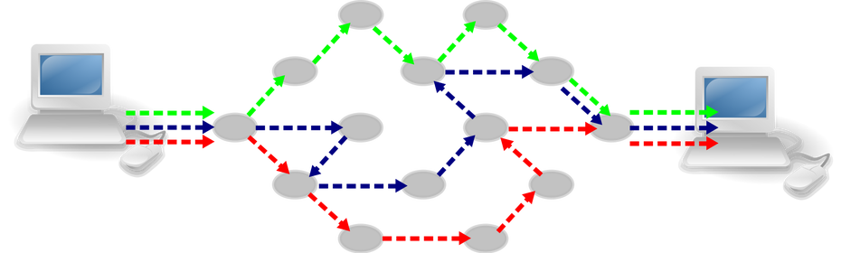
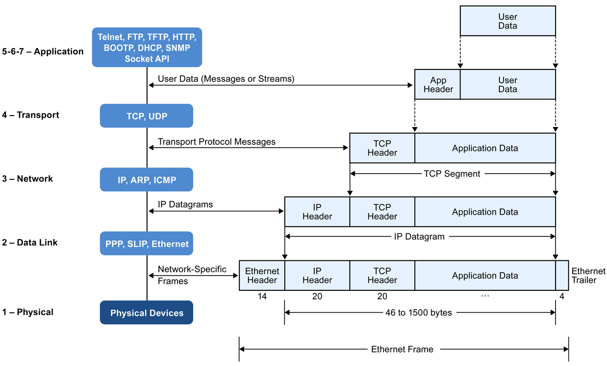
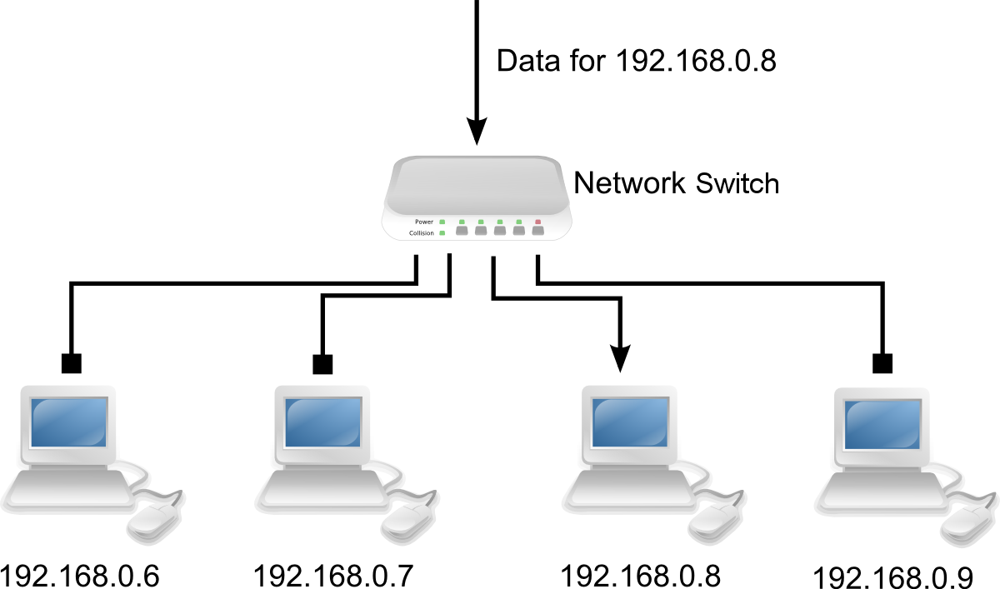
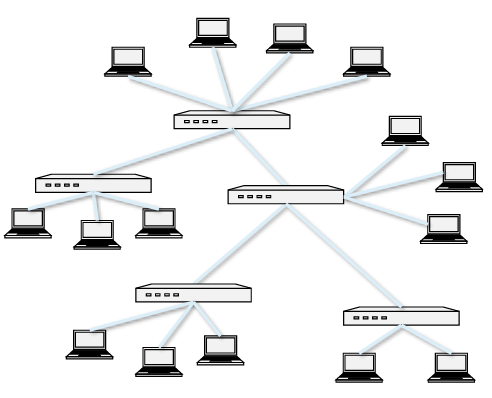
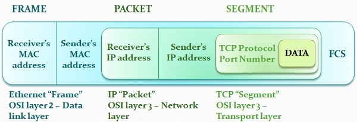
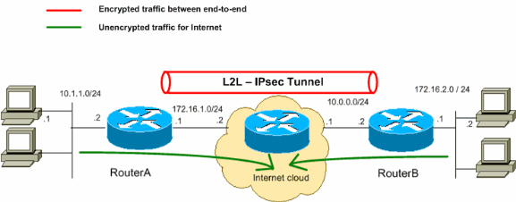
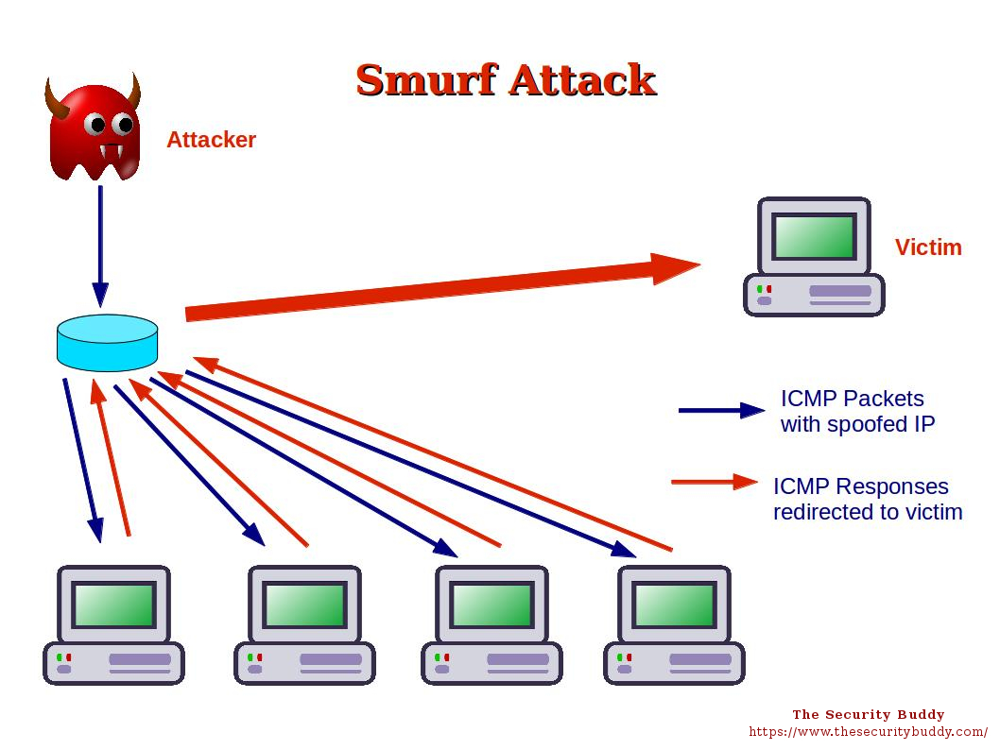
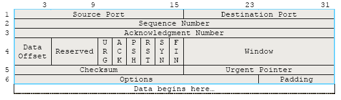
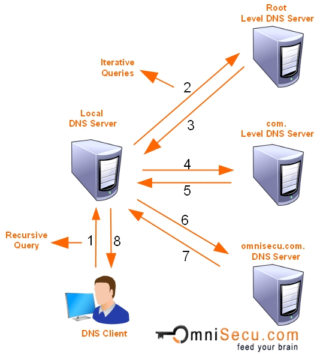
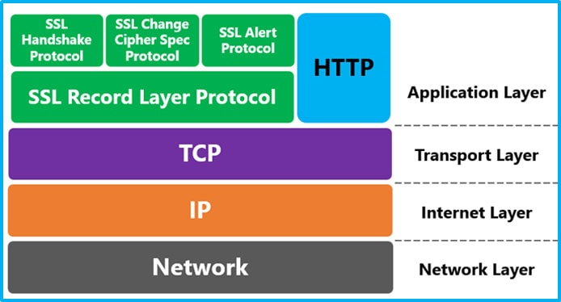

$$
% Display
\newcommand{\ds}{\displaystyle}
\newcommand{\ob}{\overbrace}
\newcommand{\ub}{\underbrace}
\newcommand{\code}{\texttt}

% Colours
\newcommand{\red}[1]{\textcolor{red}{#1}}
\newcommand{\redt}[1]{\textcolor{red}{\text{#1}}}
\newcommand{\blue}[1]{\textcolor{blue}{#1}}
\newcommand{\bluet}[1]{\textcolor{blue}{\text{#1}}}
\newcommand{\green}[1]{\textcolor{green}{#1}}
\newcommand{\greent}[1]{\textcolor{green}{\text{#1}}}

% Typefaces/Text-styles
\newcommand{\mc}{\mathcal}
\newcommand{\mf}{\mathfrak}
\newcommand{\b}{\mathbf}
\newcommand{\bs}{\boldsymbol}

% Fractions
\newcommand{\f}{\frac}

% Positioning
\newcommand{\l}{\left}
\newcommand{\m}{\middle}
\newcommand{\r}{\right}

% Logic
\newcommand{\n}{\not}
\newcommand{\eq}{\equiv}
\newcommand{\xor}{\oplus}

% Sets
\newcommand{\fa}{\forall}
\newcommand{\te}{\exists}
\newcommand{\empty}{\varnothing}
\newcommand{\set}[1]{\l\lbrace#1\r\rbrace}
\newcommand{\setb}[2]{\l\lbrace#1\ \m| \ #2\r\rbrace}
\newcommand{\bb}{\mathbb}
\newcommand{\R}{\bb{R}}
\newcommand{\N}{\bb{N}}
\newcommand{\Z}{\bb{Z}}
\newcommand{\Q}{\bb{Q}}
\newcommand{\C}{\bb{C}}

% Derivatives
\newcommand{\d}[1]{\mathrm{d}#1}
\newcommand{\deriv}[2]{\f{\d{#1}}{\d{#2}}}
\newcommand{\pderiv}[2]{\f{\partial #1}{\partial #2}}

% Sums/Integrals
\newcommand{\s}[3]{\sum_{#1}^{#2}#3}
\newcommand{\i}[4]{\int_{#1}^{#2}#3\ \d{#4}}

% Probability
\newcommand{\p}[1]{\bb{P}\l(#1\r)}
\newcommand{\cp}[2]{\p{#1\m|#2}}
\newcommand{\jp}[2]{\p{#1,#2}}
\newcommand{\e}[1]{\bb{E}\l[#1\r]}
\newcommand{\var}[1]{\text{Var}\l[#1\r]}
\newcommand{\sd}[1]{\text{SD}\l[#1\r]}
\newcommand{\cov}[2]{\text{Cov}\l[#1,#2\r]}

% Binomials
\newcommand{\ch}{\binom}
\newcommand{\pbin}[3][{}]{\l(#2 + #3\r)^#1}
\newcommand{\mbin}[3][{}]{\l(#2 - #3\r)^#1}

% Linear Algebra
\newcommand{\T}{\mathsf{T}}
\newcommand{\seq}[4][{}]{#2_{#3}#1 \ldots #1 #2_{#4}}
\newcommand{\rowv}[3]{\l(\seq[,]{#1}{#2}{#3}\r)}
\newcommand{\colv}[3]{\rowv{#1}{#2}{#3}^\T}
\newcommand{\sqpmat}[3][{}]{
    \begin{pmatrix}
		#2_{1{#1}1} & #2_{1{#1}2} & \cdots & #2_{1{#1}j} & \cdots & #2_{1{#1}#3} \\
		#2_{2{#1}1} & #2_{2{#1}2} & \cdots & #2_{2{#1}j} & \cdots & #2_{2{#1}#3} \\
		\vdots & \vdots & \ddots & \vdots & \ddots & \vdots \\
		#2_{i{#1}1} & #2_{i{#1}2} & \cdots & #2_{i{#1}j} & \cdots & #2_{i{#1}#3} \\
		\vdots & \vdots & \ddots & \vdots & \ddots & \vdots \\
		#2_{#3{#1}1} & #2_{#3{#1}2} & \cdots & #2_{#3{#1}j} & \cdots & #2_{#3{#1}#3} \\
	\end{pmatrix}
}
\newcommand{\sqmat}[3][{}]{
    \begin{matrix}
		#2_{1{#1}1} & #2_{1{#1}2} & \cdots & #2_{1{#1}j} & \cdots & #2_{1{#1}#3} \\
		#2_{2{#1}1} & #2_{2{#1}2} & \cdots & #2_{2{#1}j} & \cdots & #2_{2{#1}#3} \\
		\vdots & \vdots & \ddots & \vdots & \ddots & \vdots \\
		#2_{i{#1}1} & #2_{i{#1}2} & \cdots & #2_{i{#1}j} & \cdots & #2_{i{#1}#3} \\
		\vdots & \vdots & \ddots & \vdots & \ddots & \vdots \\
		#2_{#3{#1}1} & #2_{#3{#1}2} & \cdots & #2_{#3{#1}j} & \cdots & #2_{#3{#1}#3} \\
	\end{matrix}
}
\newcommand{\sqbmat}[3][{}]{
    \begin{bmatrix}
		#2_{1{#1}1} & #2_{1{#1}2} & \cdots & #2_{1{#1}j} & \cdots & #2_{1{#1}#3} \\
		#2_{2{#1}1} & #2_{2{#1}2} & \cdots & #2_{2{#1}j} & \cdots & #2_{2{#1}#3} \\
		\vdots & \vdots & \ddots & \vdots & \ddots & \vdots \\
		#2_{i{#1}1} & #2_{i{#1}2} & \cdots & #2_{i{#1}j} & \cdots & #2_{i{#1}#3} \\
		\vdots & \vdots & \ddots & \vdots & \ddots & \vdots \\
		#2_{#3{#1}1} & #2_{#3{#1}2} & \cdots & #2_{#3{#1}j} & \cdots & #2_{#3{#1}#3} \\
	\end{bmatrix}
}
\newcommand{\sqpmat}[3][{}]{
    \begin{pmatrix}
		#2_{1{#1}1} & #2_{1{#1}2} & \cdots & #2_{1{#1}j} & \cdots & #2_{1{#1}#3} \\
		#2_{2{#1}1} & #2_{2{#1}2} & \cdots & #2_{2{#1}j} & \cdots & #2_{2{#1}#3} \\
		\vdots & \vdots & \ddots & \vdots & \ddots & \vdots \\
		#2_{i{#1}1} & #2_{i{#1}2} & \cdots & #2_{i{#1}j} & \cdots & #2_{i{#1}#3} \\
		\vdots & \vdots & \ddots & \vdots & \ddots & \vdots \\
		#2_{#3{#1}1} & #2_{#3{#1}2} & \cdots & #2_{#3{#1}j} & \cdots & #2_{#3{#1}#3} \\
	\end{pmatrix}
}
\newcommand{\sqvmat}[3][{}]{
    \begin{vmatrix}
		#2_{1{#1}1} & #2_{1{#1}2} & \cdots & #2_{1{#1}j} & \cdots & #2_{1{#1}#3} \\
		#2_{2{#1}1} & #2_{2{#1}2} & \cdots & #2_{2{#1}j} & \cdots & #2_{2{#1}#3} \\
		\vdots & \vdots & \ddots & \vdots & \ddots & \vdots \\
		#2_{i{#1}1} & #2_{i{#1}2} & \cdots & #2_{i{#1}j} & \cdots & #2_{i{#1}#3} \\
		\vdots & \vdots & \ddots & \vdots & \ddots & \vdots \\
		#2_{#3{#1}1} & #2_{#3{#1}2} & \cdots & #2_{#3{#1}j} & \cdots & #2_{#3{#1}#3} \\
	\end{vmatrix}
}
\newcommand{\sqVmat}[3][{}]{
    \begin{Vmatrix}
		#2_{1{#1}1} & #2_{1{#1}2} & \cdots & #2_{1{#1}j} & \cdots & #2_{1{#1}#3} \\
		#2_{2{#1}1} & #2_{2{#1}2} & \cdots & #2_{2{#1}j} & \cdots & #2_{2{#1}#3} \\
		\vdots & \vdots & \ddots & \vdots & \ddots & \vdots \\
		#2_{i{#1}1} & #2_{i{#1}2} & \cdots & #2_{i{#1}j} & \cdots & #2_{i{#1}#3} \\
		\vdots & \vdots & \ddots & \vdots & \ddots & \vdots \\
		#2_{#3{#1}1} & #2_{#3{#1}2} & \cdots & #2_{#3{#1}j} & \cdots & #2_{#3{#1}#3} \\
	\end{Vmatrix}
}
$$

[TOC]

# Network security

Communication in modern networks is characterised by the following fundamental principles:

- **Packet switching**
- **Stack of layers**
- **Encapsulation**

### Packet switching

**==Packet switching==** is a mode of data transmission in which a message is:

1. Divided into a number of parts.
2. Each part is sent independently through a network (over whatever route is optimum for each packet).
3. Reassembled at the destination.

<p style="text-align:center;">
    </img>
	<br>
	<p style="text-align:center;">
        <b>Figure 1</b>: Packet switching with 3 packets. (<a href="https://apposite-tech.com/blog/packet-switching-vs-circuit-switching/">source</a>)
	</p>
</p>

#### Packets

**==Packets==** typically consist of a **header** and a **payload**.

- **Header**: Contains data about the packet, which is used by the networking hardware to direct the packet to its destination.
- **Payload**: The actual data that is to be delivered to the packet's destination.<br>

#### Reasons to use packet-switching

If a message is sent all at once (as one packet), an attacker would have access to the whole message if it was intercepted. 

Dividing it into packets prevents this, by only allowing a single packet or division of the message (which is often useless alone) to be intercepted by the attacker.

### Networking stacks

Network communication models typically use a **stack of layers** to divide network communications.

A network **==layer==** takes care of a specific job, and passes the data onto the next layer.

<p style="text-align:center;">
    </img>
	<br>
	<p style="text-align:center;">
        <b>Figure 2</b>: Linux networking stack. (<a href="http://140.120.7.21/LinuxRef/Network/LinuxNetworkStack.html">source</a>)
	</p>
</p>

#### OSI model

The **==OSI model==** is a specific standard for network communication layering - it defines a networking framework to implement protocols in **seven** layers.

Most communications systems implement the OSI model in one way or another, often combining two or three layers into one.

<p style="text-align:center;">
    </img>
	<br>
	<p style="text-align:center;">
        <b>Figure 3</b>: OSI networking model. (<a href="https://www.cloudflare.com/learning/ddos/glossary/open-systems-interconnection-model-osi/">source</a>)
        <br>
        <em><a href="https://www.webopedia.com/quick_ref/OSI_Layers.asp">More information on the individual layers</a></em>
	</p>
</p>

#### Packet encapsulation and decapsulation

As packets travel through a networking stack, the protocols at each layer either add or remove fields from the basic header. 

##### Encapsulation

When a protocol on the sending host adds data to the packet header, the process is called data ==**encapsulation**==. This occurs when going **down** the stack, towards the physical layer.

Data that the host typically adds to the packet header includes:

- Address of the next location (or node)
- Protocol information
- The type of data
- Source and destination addresses

##### Decapsulation

When a protocol on the sending host removes data from the packet header, the process is called data **==decapsulation==**. This occurs when going **up** the stack, towards the application layer.

#### Protocol data units

A **==protocol data unit==** (PDU) is a single unit of information transmitted between layers in a network stack.

In network stacks, each of the layers implement protocols tailored to the specific type of data exchange. For example:

- **Segments** are units of data in the *Transport Layer* (TCP/UDP in the case of the Internet)
- **Packets** are units of data in the *Network Layer* (IP in the case of the Internet)
- **Frames** are units of data in the *Link layer* (Ethernet, WiFi, Bluetooth, etc.)

These are all different types of PDUs, just with specific names on specific layers.

<p style="text-align:center;">
    </img>
	<br>
	<p style="text-align:center;">
        <b>Figure 4</b>: TCP/IP network stack.<br> The PDUs are displayed on the right, and change when moving between layers (encapsulation and decapsulation). (<a href="https://www.micrium.com/iot/internet-protocols/">source</a>)
    	<br>
        <em><a href="https://www.inetdaemon.com/social/tweet/frames-datagrams-packets-pdus-oh-my/">More information on frames, datagrams, packets, segments and PDUs.</a></em>
	</p>
</p>

### Network interfaces

**==Network interfaces==** are devices that connect a computer to a network. Packets are transmitted between network interfaces, and computers may have multiple network interfaces. Some examples are:

- Ethernet card
- WiFi adapter
- DSL modem

As discussed in the [*Protocol Data Units*](#protocol-data-units) section, most local area networks (such as Ethernet and WiFi) broadcast frames.

#### MAC addresses

Most network interfaces come with a predefined MAC address. A **==Media Access Control (MAC) address==** is a 48-bit number usually represented in hexadecimal. These addresses are used in the **data link layer** of the OSI model.

> **Example**: `00-1A-92-D4-BF-86`

The first three **octets** of any MAC address are [IEEE](https://www.ieee.org/)-assigned Organisationally Unique Identifiers (OUIs), which are labels that identify which organisation created the interface:

> **Example**: 
>
> - Cisco: `00-1A-A1`
> - D-Link: `00-1B-11`
> - AsusTek: `00-1A-92`

The remaining three octets of the MAC address can be assigned by organisations as they wish, with uniqueness being the only constraint.

### Switch

A **==network switch==** is a computer networking device that connects devices on a network by using packet switching to receive, process and forward data to the destination device.

- Operates at the link layer
- Has multiple interfaces, each connected to a device/segment

#### Operation of a switch

1. Learn the MAC addresses of each device connected to it.
2. Forward frames only to the destination device.

<p style="text-align:center;">
    </img>
	<br>
	<p style="text-align:center;">
        <b>Figure 5</b>: Operation of a network switch in a typical network. (<a href="https://www.kisspng.com/png-network-switch-computer-network-diagram-ethernet-h-939358/">source</a>)
	</p>
</p>

#### Combining switches

Switches can be combined and arranged into a **tree**. Each switch forwards frames for the MAC addresses of the machines in the segments (subtrees) connected to it.

- Frames to unknown MAC addresses are broadcast to all devices.
- Frames to MAC addresses in the same segment (subtree) as the sender are ignored or discarded.

<p style="text-align:center;">
    </img>
	<br>
	<p style="text-align:center;">
        <b>Figure 6</b>: Combining switches (tree diagram). (<a href="https://www.learn.ed.ac.uk/bbcswebdav/pid-3265643-dt-content-rid-7410213_1/courses/INFR100672018-9SV1SEM2/02_Principles_Layers.pdf">source</a>)
	</p>
</p>

### Internet Protocol (IP)

The **==Internet Protocol (IP)==** is the principal set of digital message formats and rules for exchanging messages between devices across a single network or a series of interconnected networks, using the *Internet Protocol* Suite (often referred to as TCP/IP).

The IP is used as the primary protocol in the TCP/IP stack's **internet layer** (a subset of the OSI stack's **network layer**).

#### IP functions

<p style="text-align:center;">
    </img>
	<br>
	<p style="text-align:center;">
        <b>Figure 7</b>: A typical data-link frame. (<a href="https://techdifferences.com/difference-between-frame-and-packet.html">source</a>)
	</p>
</p>

##### Addressing

In order to deliver data, IP needs to be aware of the destination of the data, and hence includes addressing systems.

##### Routing

IP might be required to communicate across networks, and communicate with networks not directly connected to the current network.

#### Addresses

An **==IP address==** is a numerical label assigned to each device connected to a computer network that uses the Internet Protocol for communication. These addresses are used in the **network layer** of the OSI model.

IP addresses come in two forms:

- **IPv4**: 32-bit addresses (numbers typically displayed in decimal)

  > **Example**: `172.16.254.1`

- **IPv6**: 128-bit addresses (numbers typically displayed in hexadecimal)

  > **Example**: `0:0:0:0:0:ffff:ac10:fe01`

IPv6 was introduced to solve the issue of [IPv4 address exhaustion](https://en.wikipedia.org/wiki/IPv4_address_exhaustion) (a limitation on the ~4.3 billion IPv4 addresses available).

##### Address subdivisions

IP addresses are divided into separate segments: **network**, **subnet** and **host**.
$$
\underbrace{\color{red}{128.148}}_\text{Network}.\underbrace{\color{blue}{32}}_\text{Subnet}.\underbrace{\color{green}{110}}_\text{Host}
$$

##### Broadcast addresses

A **==broadcast address==** is a network address at which all devices connected to a network are enabled to receive packets.

> **Analogy**: There is often a need to send a datagram to all stations connected to the same medium, or the same link, without even knowing their own addresses. It is like shouting aloud in a room to speak to all present persons at once, without knowing their names. This is broadcasting.

$$
\underbrace{128.148.32.110}_\text{IP address}\quad\to\quad \underbrace{128.148.32.\color{red}{255}}_\text{Broadcast address}
$$

##### Private networks

**==Private networks==** are networks which are not routed outside of a LAN.

> **Example**:
>
> - `10.0.0.0/8`
> - `172.16.0.0/12`
> - `192.168.0.0/16`

#### Packets

The headers of IP packets typically include the following fields:

- Source address
- Destination address
- Packet length
- Time to live (TTL)
- IP version
- Fragmentation information
- Transport layer protocol information (e.g. TCP)

#### Routing

A **==router==** bridges two or more networks.

<p style="text-align:center;">
    </img>
	<br>
	<p style="text-align:center;">
        <b>Figure 8</b>: Routers bridging two networks. (<a href="https://www.cisco.com/c/dam/en/us/support/docs/routers/1700-series-modular-access-routers/71462-rtr-l2l-ipsec-split-00.gif">source</a>)
	</p>
</p>

Routers operate at the **network layer**, and have two main tasks:

1. Maintain **routing tables** to forward packets to the appropriate network.
2. Forward decisions based solely on the destination address.

A **==routing table==** maps ranges of addresses to LANs or other gateway routers.

### Internet Control Message Protocol (ICMP)

**==Internet Control Message Protocol (ICMP)==** is a protocol that is used for network testing and debugging. Messages for this protocol are simple, and encapsulated in single IP packets.

ICMP is considered a **network layer** protocol.

#### Tools using ICMP

- `ping` - Command for sending series of echo request messages and provides statistics on roundtrip times and packet loss.
- `traceroute` - Command for sending series of ICMP packets with increasing TTL value to discover and display routes that the packets took.

#### Smurfing

**==Smurfing==** is a form of **Denial of Service (DoS)** attack that exploits the ICMP, whereby remote hosts respond to echo packets to say they are alive (ping).

The idea behind smurfing is:

1. Large numbers of ICMP requests are sent to the victim's IP address.
2. The source IP address is spoofed (to make tracing the attacker harder).
3. The hosts on the victim's network respond to the ICMP requests.
4. This creates a significant amount of traffic on the victim's network, resulting in consumption of bandwidth and ultimately causing the victim's server to crash.

<p style="text-align:center;">
    </img>
	<br>
	<p style="text-align:center;">
        <b>Figure 9</b>: Typical smurf attack. (<a href="https://www.thesecuritybuddy.com/dos-ddos-prevention/what-is-smurf-attack/">source</a>)
	</p>
</p>

##### Prevention

- Individual hosts and routers can be configured to be non-responsive to external ping requests or broadcasts.
- Routers can also be configured to ensure that packets directed to broadcast addresses are not forwarded to all devices on the network.
- ==**Ingress filtering**== - a technique used to ensure that incoming packets are actually from the networks which they claim to originate.

### Address Resolution Protocol (ARP)

The **==Address Resolution Protocol (ARP)==** is a protocol responsible for connecting the **network layer** and **data link layer** together by mapping IP addresses to physical machine addresses (MAC addresses) that are recognised in the local network.

- Based on broadcast messages and local caching
- Doesn't support confidentiality, integrity or authentication

#### Caching (look-up table)

Systems keep an ==**ARP look-up table**== where they store information about what IP addresses are associated with what MAC addresses.

> **Example**: Running the command `arp -a` displays the ARP table:
>
> | **IP Address** | **Physical Address** | **Type** |
> | -------------- | -------------------- | -------- |
> | 128.148.31.1   | 00-00-0c-07-ac-00    | dynamic  |
> | 128.148.31.15  | 00-0c-76-b2-d7-1d    | dynamic  |
> | 128.148.31.71  | 00-0c-76-b2-d0-d2    | dynamic  |

#### Functionality

If a source device wants to send a packet to another device:

1. The source device checks its ARP cache (look-up table) to find if it already has a resolved MAC address that corresponds to the requested device's IP address.

   If there is a MAC address, it is used for sending the packet.

2. If there is no record for the requested device's IP address in the ARP look-up table, the source device generates an ARP message with the following fields:

   - **Sender hardware address**: The source device's MAC address
   - **Sender protocol address**: The source device's IP address
   - **Target hardware address**: *Blank* - To be determined
   - **Target protocol address**: The target device's IP address

3. The source device broadcasts the ARP message to the local network.

4. The ARP message is received by each device on the LAN since it is a broadcast.

   Each device compares the **target protocol address** on the ARP message with its own IP address. Those devices which do not match these two addresses will drop the packet without any action.

5. When the targeted device checks the **target protocol address**, it will find a match and will generate an ARP reply message, essentially filling in the blank **target hardware address** with the devices own MAC address.

6. The ARP reply message is sent from the target device back to the source device (as a **unicast** message, NOT broadcast - to save network resources).

7. The source device processes the ARP reply from the target device, and adds a new cache entry to the ARP look-up table with the new **target hardware address** and **target protocol address**.

8. The source device will then send the requested packet to the now known **target hardware address**.

#### Poisoning attacks

An **==ARP poisoning attack==** (also known as ARP spoofing or ARP cache poisoning) is a type of attack in which a malicious **man-in-the-middle** sends false ARP reply messages over a local area network.

Essentially in step 5 of the [*ARP functionality*](#arp-functionality) description, although the attacker's device won't match the target protocol address, the attacker can still send back a spoofed reply message with its own MAC address, acting as if it were the intended target device.

This results in the linking of an attacker's MAC address with the IP address of a legitimate device on the network.

### User Datagram Protocol (UDP)

The **==User Datagram Protocol (UDP)==** is a stateless, unreliable datagram protocol built on top of IP - that is, it lies at the **transport layer** of the OSI model.

> **Example**: VoIP and streaming (audio/video) all use UDP.

#### Advantages

- UDP aims to be an efficient protocol, and does this by not providing delivery guarantees or acknowledgements.
- Can distinguish data for multiple concurrent applications on a single host.

#### Disadvantages

- Lack of reliability implies applications using UDP **must** be ready to accept a fair amount of corrupted and lost data.
- Most applications built on UDP will suffer if they require reliability.

### Transmission Control Protocol (TCP)

**==Transmission Control Protocol (TCP)==** is a **transport layer** (OSI model) protocol that enables/offers: 

- The guarantee that packets will be delivered in the same order in which they were sent.
- The ability to distinguish multiple applications on the same host.
- The ability for two hosts to establish a connection and exchange streams of data.

> **Example**: HTTP and SSH are built on top of TCP.

#### Functionality

- Packages a data stream into segments transported by IP.
  - The order of these segments is maintained by marking each packet with a **sequence number**.
  - Every time TCP receives a packet, it sends out an ==**ACK** (control character indicating the successful receipt of a packet)==. 
- Checks transmitted data by comparing a **checksum** of the data with a checksum encoded in the packet.

#### Packet structure

<p style="text-align:center;">
    </img>
	<br>
	<p style="text-align:center;">
        <b>Figure 10</b>: Structure of a TCP packet (160+ bits).<br> The blue-outlined section is the <em>packet header</em>. (<a href="http://gungoz.q-eye.co/tcp-packet-format/">source</a>)
	</p>
</p>

#### Ports

Both TCP and UDP support concurrent applications running on the same server. In order to do this, **==ports==** are used to identify where data is directed. 

A **port** is simply represented as a 16 bit number (`0`-`65535`).

- Ports `0`-`1023` are reserved for use by known protocols.

  > **Example**: HTTPS uses `443` and SSH uses `22`.

- Ports `1024`-`49151` are known as user ports, and are used for listening to connections.

#### `SYN` flag

**==SYN==** is a binary flag field in the TCP packet header, which indicates whether a particular packet is part of a SYN exchange during the handshake.

#### Establishing connections

A **TCP connection** involves a client and server, where the server is generally a passive listener, waiting for a connection request. However, the server is just another client.

TCP connections are established through a three-way handshake, known as `SYN, SYN-ACK, ACK` (SSAA):

1. The client requests a connection by sending out a `SYN` packet.
2. The server responds by sending a `SYN-ACK` packet, acknowledging the connection.
3. The client responds by sending an `ACK` packet to the server, thus establishing the connection.

```sequence
participant Client
participant Server

Note over Client,Server: Establishing a\nTCP connection

Note right of Server: Listening for\nconnection requests
Note left of Client: Wants to establish\na TCP connection

Client->Server: SYN\nSeq=x
Note right of Server: Acknowledging\nconnection

Server-->Client: SYN-ACK\nSeq=y, Ack=x+1
Note left of Client: Establishing\nconnection

Client->Server: ACK\nSeq=x+1, Ack=y+1
Note over Client,Server: TCP connection\nestablished
```

#### Terminating connections

- During connection establishment using the three-way handshake, initial **sequence numbers** are exchanged.
- The TCP header includes a 16-bit checksum of the data and parts of the header, including the source and destination.
- Acknowledgement (or lack thereof) is used by TCP to keep track of network congestion, control flow etc.
- TCP connections are cleanly terminated with a 4-way handshake, known as `FIN, ACK, FIN, ACK` (FAFA):
  1. The client which wishes to terminate the connection sends a `FIN` message to the server.
  2. The server responds by sending an `ACK`.
  3. The server also responds with a `FIN`.
  4. The client now sends an `ACK`, and the connection is terminated.

```sequence
participant Client
participant Server

Note over Client,Server: Terminating a TCP connection

Client->Server: FIN\nSeq=x

Server-->Client: ACK\nSeq=x+1
Server-->Client: FIN\nSeq=y

Client->Server: ACK\nSeq=y+1

Note over Client,Server: TCP connection terminated
```

#### Data transfer

Data transfer with TCP works the same way as [*terminating connections*](#terminating-connections), but replacing the `FIN`'s with `DATA`'s.

#### `SYN` flooding

==**`SYN` flooding**== is a form of TCP attack in which lots of requests (`SYN` packets)  are sent to the victim in order to overload them.

1. A basic three-part handshake is used to initiate a TCP connection to the victim.

2. Many `SYN` packets are sent to the victim (without acknowledging any replies).

   As a result, the victim accumulates more `SYN` packets than they can handle.

##### Advantages of `SYN` flooding (as an attack)

- Effective against small targets - e.g. someone running a game server in their home.

##### Disadvantages of `SYN` flooding (as an attack)

- **Attribution**: The attacker uses their own IP address, which could be easily traced.
- **Bandwidth**: The attacker uses their own bandwidth, which is likely to be smaller than the server's.
- Not effective against large targets, e.g. company websites.

#### Forging packets (spoofing)

**==TCP packet forging==** is another form of TCP attack, which is exactly the same as `SYN` flooding - except the source of the TCP packet is forged.

##### Advantages of packet forging (as an attack)

- Harder to trace the attacker.
- `ACK`'s are sent to a second computer. This means that less bandwidth is used on the attacker's side.

##### Disadvantages of packet forging (as an attack)

- **Ingress filtering** is commonly used to drop packets with source addresses outside their origin network fragment.

### Application layer and DNS

The **==application layer==** is a layer in the OSI network model that is used for managing human-computer interactions. 

This layer is typically where applications (such as web browsers) can access the network services.

#### Protocols

Examples of protocols that lie in the application layer are:

- Domain Name System (**DNS**)
- Hyper-Text Transfer Protocol (**HTTP**)
- (**SSL**/**TLS**). Protocol used for secure, encrypted browsing (**HTTPS**)
- (**IMAP**/**POP3**/**SMTP**). Internet email protocols.
- File Transfer Protocol (**FTP**). An old but still used protocol for uploading and downloading files.
- **Telnet**. Early remote access protocol.
- **SSH**. More recent secure remote access protocol.

#### URLs

**==Uniform Resource Locators (URLs)==** are a standardised format for describing the location and access method of resources via the internet.

URLs are of the format:
$$
\texttt{<scheme>://<user>:<password>@<host>:<port>/<url-path>?<query-string>}
$$

> **Where**: $\texttt{<host>}=\red{\texttt{<subdomain>}}.\green{\texttt{<domain>}}.\blue{\texttt{<tld>}}$
>
> Example: $\texttt{https://}\red{\texttt{profile}}.\green{\texttt{facebook}}.\blue{\texttt{com}}$

#### Domain Name System (DNS)

The **==Domain Name System (DNS)==** is an application-layer protocol. The basic function of DNS is to **map domain names to IP addresses**—this mapping is many-to-many.

> **Examples**:
>
> - `www.ed.ac.uk` and `edwc.is.ed.ac.uk` map to `129.215.228.101`.
> - `google.com` maps to `216.58.213.110`, `198.7.237.249` and other addresses.

More generally, a DNS is a distributed database that stores **==resource records==** such as:

| **Resource name** | **Abbreviation** | **Description**                         |
| ----------------- | ---------------- | --------------------------------------- |
| Address           | `A`              | IP address associated with a host name. |
| Mail exchange     | `MX`             | Mail server of a domain.                |
| Name server       | `NS`             | Authoritative server for a domain.      |

##### Domains

###### Domain name

A **==domain name==** consists of two or more labels, separated by dots.

> **Example**: `google.com`, `inf.ed.ac.uk`

###### Top-level domain (TLD)

**==Top-level domains==** can be any of:

- Generic (gTLD), e.g. `.com`, `.org`, `.net` - managed by ICANN
- Country-code (ccTLD), e.g. `.ca`, `.it` - managed by government organisations
- New top level domains, e.g. `.scot`, `.tirol`

###### ICANN

The **==Internet Corporation for Assigned Names and Numbers (ICANN)==** is a non-profit corporation that:

- Keeps a registered database of gTLDs

- Accredits registrars for gTLDs

##### DNS tree

`TLD` (e.g. `ac.uk`) -> `Domain` (e.g. `ed.ac.uk`) -> `Resource records`

Alternatively, if a domain has subdomains:

`TLD` (e.g. `ac.uk`) -> `Domain` (e.g. `ed.ac.uk`) -> `Subdomain` (e.g. `inf.ed.ac.uk`) -> `Resource records` (e.g. `A`, `MX`)

##### Name servers

A **==name server==** is a server on the internet responsible for handling queries regarding a domain name.

A name server: 

- Keeps a local database of DNS records (as a **zone** file).
- Answers DNS queries.
- Can ask other name servers if a requested record is not in the local database.

An **==authoritative name server==** stores a reference version of DNS records for a **zone** (subtree of the DNS tree).

> **Example**:
>
> - `dns0.ed.ac.uk` is authoritative for `ed.ac.uk`
> - `dns0.inf.ed.ac.uk` is authoritative for `inf.ed.ac.uk`

##### Name resolution

A **==name resolver==** is a program that retrieves DNS records.

A name resolver:

- Caches records received
- Connects to a name server (default, root, or given)
- Can be implemented in **iteratively** or **recursively**.

<p style="text-align:center;">
    </img>
	<br>
	<p style="text-align:center;">
        <b>Figure 11</b>: An example of iterative name resolution with the query <code>omnisecu.com</code>.</em> (<a href="http://www.omnisecu.com/tcpip/recursive-and-iterative-dns-queries.php">source</a>)
	</p>
</p>

###### Iterative name resolution

In **==iterative name resolution==**, when a DNS server is queried, it returns an answer without querying other DNS servers—even if it cannot provide a definite answer. This answer can be:

- A definite answer to the query (a DNS record).
- A referral to an authoritative server (e.g. a TLD server) via a NS record.
- An error if the domain/host does not exist, or for other reasons such as network errors.

###### Recursive name resolution

In **==recursive name resolution==**, when a DNS server is queried, it will query subsequent DNS servers (on behalf of the client/requester) until a definitive answer is returned to the requester.

**Note**: The queries made to subsequent DNS servers from the first DNS server are **iterative** queries.

##### Glue records

A **==glue record==** is a DNS record of type `A` (IP address) for a name server referred to by a `NS` record.

This is used to break **circular references**.

###### Circular references

Sometimes the authoritative name server for a domain may be within the same domain (a subdomain).

> **Example**: `dns0.inf.ed.ac.uk` is authoritative for `inf.ed.ac.uk`

###### Example

In the below table, the second record represents a **glue record**.

| **Name**            | **Type** | **Location**        |
| ------------------- | -------- | ------------------- |
| `inf.ed.ac.uk`      | `NS`     | `dns0.inf.ed.ac.uk` |
| `dns0.inf.ed.ac.uk` | `A`      | `129.215.160.240`   |

##### Caching

If a path in the DNS tree was simply traversed for each requested query, there would be too much network traffic, meaning that root servers and TLD servers would quickly become overloaded.

DNS servers **==cache==** records that are results of queries, for a specified amount of time. This amount is specified as a **time-to-live** field.

1. Resolver looks in the cache for an `A` record of the query domain.
2. Resolver looks in the cache for a `NS` record of the longest suffix of the query domain.

##### Local DNS cache

The local DNS cache is maintained by the operating system. This is shared among all running applications and can be displayed to all users.

This may cause privacy issues—namely:

- Browsing by other users can be monitored
- Private or incognito browsing does not clear the DNS cache.

##### DNS cache poisoning

**==DNS cache poisoning==** is a cyber attack that exploits DNS vulnerabilities by diverting internet traffic away from legitimate servers and towards fake ones.

The basic idea behind the attack is to give a DNS server a false address `A` record and get it cached.

###### DNS query mechanism

- DNS queries are issued over UDP on port 53. This is convenient for an attack because there are no sequence numbers (`SYN-ACK`) as there were in TCP/IP. In UDP, a sent packet will get processed since there are no authentication measures.
- There is a 16-bit **==request identifier==** in the payload to match answers with queries.

###### Vulnerability to cache poisoning

A DNS server is vulnerable to cache poisoning if its resolver:

- Disregards request identifiers.
- Has predictable request identifiers and return ports.
- Accepts unsolicited DNS records.

###### Defences against cache poisoning

- **Query randomisation**
  - Random request identifier (16 bits)
  - Random return port (16 bits)
- **Check request identifiers**
- **Use signed records** (DNSSEC)

### SSL/TLS

**==SSL==** and **==TLS==** are both cryptographic protocols that establish an encrypted, bidirectional network tunnel for arbitrary data to travel between two hosts through the use of public-key cryptography. These protocols are often used in conjunction with other internet protocols such as HTTPS, SSH, FTPS and secure email.

These protocols provide:

- **End-to-end confidentiality**: Communication between client and server applications is encrypted.
- **End-to-end integrity**: Detection of corrupted communication between client and server applications.

In addition to providing an encrypted channel, these protocols are also used to authenticate communicating parties. This is crucial for such applications as online transactions because a client must be sure that money is being transferred to the person or company who they claim to be.

#### Position in the stack

SSL and TLS lie on top of TCP/IP, and below application layer protocols (in the OSI model). In the TCP/IP stack, these protocols lie in the application layer (as seen in Figure 12).

<p style="text-align:center;">
    </img>
	<br>
	<p style="text-align:center;">
        <b>Figure 12</b>: TLS/SSL consists of two layers within the application layer of the TCP/IP stack.</em> (<a href="https://www.hostingadvice.com/how-to/tls-vs-ssl/">source</a>)
	</p>
</p>

#### Differences between SSL and TLS

SSL is the predecessor to TLS. TLS was introduced in 1999 as a new version of SSL, and was based on SSLv3.

#### TLS building blocks

|                       | **Confidentiality**                         | **Integrity**                            | **Authentication**                      |
| --------------------- | ------------------------------------------- | ---------------------------------------- | --------------------------------------- |
| **Setup**             | Public-key based key-exchanged (RSA and DH) | Public-key digital signature (e.g. RSA)  | Public-key digital signature (e.g. RSA) |
| **Data transmission** | Symmetric encryption (e.g. AES in CBC mode) | Hash-based MACS (e.g. HMAC using SHA256) |                                         |

#### Functionality

When a connection is established between a client $C$ (typically a web browser) and a server $S$:

1. $C$ sends its supported cryptographic algorithms to $S$.

2. $S$ picks the strongest algorithms that it supports.

3. $S$ sends its SSL/TLS certificate to $C$.

   This certificate contains $S$'s public encryption key.

4. The certificate is checked by $C$ against a trusted CA. As a certificate cannot be falsified, $C$ may be certain that they are communicating with the right server.

5. $S$ and $C$ perform a key exchange for symmetric encryption and hash-based authentication of subsequent data transfer.

6. $S$ and $C$ exchange data bidirectionally.

Before a message is encrypted, a MAC is appended to each HTTP message. The resulting message is encrypted and sent.

This symmetric cryptosystem provides **confidentiality**, and the use of MAC provides integrity of the HTTP requests and responses.

##### Basic key exchange

The basic key exchange performed in step 5 described above **used to be** done with RSA:

1. $S$ generates a public-private key pair $(K_\hat{p}^S,K_\hat{s}^S)$ and sends $K_\hat{p}^S$ to $C$.
2. $C$ generates a random secret value $r$.
3. $C$ encrypts $r$ with public key $K_\hat{p}^S$ and sends this message $m=E(K_\hat{p}^S,r)$ to $S$.
4. $S$ decrypts $m$ with their private key $K_\hat{s}^S$, giving $r$, which is later used to encrypt messages.

#### Forward secrecy

**==Forward secrecy==** is provided by a crypto-system if a compromise of private keys in a key exchange does not break the confidentiality of past messages.

TLS with the basic key exchange described above **does not** provide forward secrecy. 

As a result, the basic RSA key exchange is not used since an attacker can uncover the value of $r$ and use it to derive encryption keys.

#### Diffie-Hellman key exchange

An alternate key exchange method used that provides forward secrecy is the **==Diffie-Hellman key exchange==**.

1. Fix a prime $p$ and generator $g$ of $\Z_p^*$.
2. $C$ generates a random $x$ and computes $X=g^x\pmod p$.
3. $S$ generates a random $y$ and computes $Y=g^y\pmod p$.
4. $C$ and $S$ exchange $X$ and $Y$.
5. $C$ calculates $K_C=Y^x\pmod p=(g^y)^x\pmod p$.
6. $S$ calculates $K_S=X^y\pmod p=(g^x)^y\pmod p$.
7. Observe that $K_C=K_S$.

##### Problems

Although Diffie-Hellman provides forward secrecy, it is open to an man-in-the-middle attack.

This attack can be prevented by signing $X$ and $Y$ before sending them.

**Note**: This approach requires both $C$ and $S$ to know each other's public key.

### Firewalls and intrusion detection

A **==firewall==** is a security measure designed to prevent **unauthorised electronic access** to a networked computer system. 

#### Firewall policies

Firewalls prevent unauthorised access by monitoring and controlling incoming an outgoing traffic based on predetermined security rules.

These rules are called **==firewall policies==**. Based on these rules, it allows or denies traffic.

##### Example

| **Rule** | **Protocol** | **Source address** | **Destination address** | **Destination port** | **Action** |
| -------- | ------------ | ------------------ | ----------------------- | -------------------- | ---------- |
| 1        | TCP          | *                  | 192.168.1.*             | 22                   | Permit     |
| 2        | UDP          | *                  | 192.168.1.*             | 69                   | Permit     |
| 3        | TCP          | 192.168.1.*        | *                       | 80                   | Permit     |
| 4        | TCP          | 8                  | 192.168.1.18            | 80                   | Permit     |
| 5        | UDP          | *                  | 192.168.1.*             | *                    | Deny       |

#### Stateless firewalls

A **==stateless firewall==** does not maintain any remembered context (state) with respect to the packets it is processing.

Instead, it treats each packet attempting to travel through it in isolation without considering packets that it has processed previously—if a packet matches the filter's set of rules, the packet filter will drop or accept it.

**Note**: Stateless firewalls may have to be fairly restrictive in order to prevent most attacks.

#### Stateful firewalls

**==Stateful firewalls==** can tell when packets are part of legitimate sessions originating within a trusted network. They maintain a record of all connections passing through it and can determine if a packet is either:

- The start of a new connection
- Part of an existing connection
- An invalid packet

Stateful firewalls maintain tables containing information on each active connection, including the IP addresses, ports, and sequence numbers of packets involved in a connection.

Using these tables, stateful firewalls can allow only inbound TCP packets that are in response to a connection initiated from the internal network.

##### Port scanning

A **==port scanner==** is a tool that provides information regarding open ports in a target system. An example of a port-scanning tool is `nmap`.

Port scanning can be a useful tool in the arsenal of an attacker, as it can identify ports which are open to attacks.

#### Application layer firewalls

An **==application layer firewall==** works like a proxy—it can *understand* certain applications and protocols, and as a result effectively simulates the effects of an application at OSI level 7.

This type of firewall acts as a **protective man-in-the-middle** that screens information at the application layer. It may inspect the contents of the traffic, blocking what it views as inappropriate content. For example:

- Block all web traffic containing certain words
- Remove all macros from Microsoft Word files in email
- Prevent anything that looks like a credit card number from leaving a database

#### Personal firewalls

A **==personal firewall==** runs on the workstation that it protects, as software. It provides basic protection—especially for home or mobile devices.

Any **rootkit** type software can disable the firewall.

#### Network Address Translation (NAT)

**==Network Address Translation (NAT)==** is a method of remapping one IP address space into another.

##### IPv4

**==IPv4==** is the fourth version of the Internet Protocol. The addressing system used in this protocol is 32-bit, which limits the address space to $2^{32}=4,294,967,296$ addresses.

###### Address space exhaustion

There are less than 4.3 billion IPv4 addresses available. This is an issue as we do not have enough addresses for every device on the planet.

The solution to this problem is NAT, where the internal IP address of a device is different from its external IP address.

#### Intrusion Detection Systems (IDS)

Firewalls are used as a preventative measure. An **==Intrusion Detection System (IDS)==** can be used to detect a potential incident in progress.

At some point, some traffic must be allowed to move into and out of a network. However, most security incidents are caused by a user letting something into the network that is malicious, or being an insider threat themselves. Situations such as these cannot be prevented or anticipated in advance.

The next step is to identify that something bad is happening quickly so it can be addressed. This is when IDS comes in.

#### Alarms

An IDS can either sound an alarm or not, depending on whether it thinks it has detected an intrusion attack. 

This leads to TP, FP, FN and TN.

##### Rule-based intrusion detection

In **==rule-based intrusion detection==**, a set of rules identify the types of actions that match certain known intrusion attacks. These rules encode a **signature** for such attacks.

| **Benefits**                        | **Drawbacks**                                       |
| ----------------------------------- | --------------------------------------------------- |
| High accuracy (low false positives) | Admin must anticipate attack patterns in advance    |
|                                     | An attacker may test an attack on common signatures |
|                                     | Impossible to detect a new type of attack           |

##### Statistical intrusion detection

In **==statistical intrusion detection==**, a statistical model of acceptable or *normal* behavior is dynamically built, and any other non-matching behaviour is flagged.

| **Benefits**                                        | **Drawbacks**                                 |
| --------------------------------------------------- | --------------------------------------------- |
| Admin does not need to anticipate potential attacks | System needs time to warm up to new behaviour |
| Can detect new types of attacks                     | Lower accuracy (higher false positives)       |

##### Number of alarms

In the 2013 Target breach, the IDS did correctly identify that there was an attack on the Target network. However, there were too many alarms going off to investigate all of them in great depth.

Some cyberattack insurance policies state that if you know about an attack and do nothing, they will not cover the attack—meaning that having a noisy IDS can potentially be a liability.

# Resources

- *Myrto Arapinis, Markulf Kohlweiss, Kami Vaniea, Roberto Tamassia, Aggelos Kiayias (University of Edinburgh)*<br/>[Computer Security (INFR10067)](http://www.drps.ed.ac.uk/18-19/dpt/cxinfr10067.htm)
- *Apposite Tech*<br/>[Packet-switching vs. circuit-switching](https://apposite-tech.com/blog/packet-switching-vs-circuit-switching/)
- *M. Tim Jones (Emulex Corp.)*<br/>[Anatomy of the Linux networking stack](http://140.120.7.21/LinuxRef/Network/LinuxNetworkStack.html)
- *Cloudflare*<br/>[What is the OSI model?](https://www.cloudflare.com/learning/ddos/glossary/open-systems-interconnection-model-osi/)
- *Vangie Beal (Webopedia)*<br/>[The 7 Layers of the OSI Model](https://www.webopedia.com/quick_ref/OSI_Layers.asp)
- *Micrium*<br/>[Designing the Internet of Things - Internet & Protocols](https://www.micrium.com/iot/internet-protocols/)
- *InetDaemon*<br/>[Frames, Datagrams, Packets, PDUs - OH MY!](https://www.inetdaemon.com/social/tweet/frames-datagrams-packets-pdus-oh-my/)
- *TechDifferences*<br/>[Difference Between Frame and Packet](https://techdifferences.com/difference-between-frame-and-packet.html)
- *Wikipedia*<br/>[IPv4 address exhaustion](https://en.wikipedia.org/wiki/IPv4_address_exhaustion)
- *Cisco*<br/>[LAN-to-LAN IPsec Tunnel Between Two Routers Configuration Example](https://www.cisco.com/c/en/us/support/docs/routers/1700-series-modular-access-routers/71462-rtr-l2l-ipsec-split.html)
- *Amrita Mitra (The Security Buddy)*<br/>[What is Smurf Attack?](https://www.thesecuritybuddy.com/dos-ddos-prevention/what-is-smurf-attack/)
- *OmniSecu*<br/>[Recursive and Iterative DNS Queries](http://www.omnisecu.com/tcpip/recursive-and-iterative-dns-queries.php)
- *HostingAdvice*<br/>[TLS vs. SSL - 5 Things to Know (Differences, Protocols & Handshakes)](https://www.hostingadvice.com/how-to/tls-vs-ssl/)