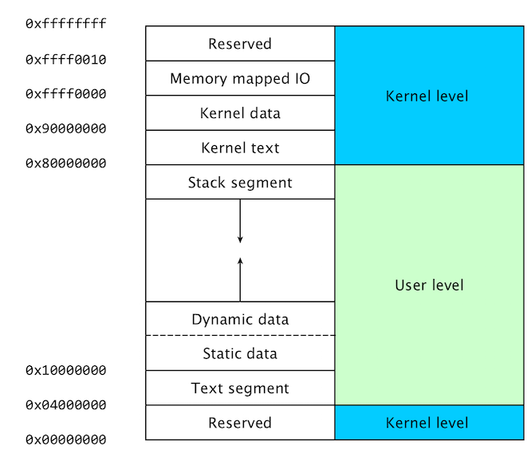

$$
% Display
\newcommand{\ds}{\displaystyle}
\newcommand{\ob}{\overbrace}
\newcommand{\ub}{\underbrace}
\newcommand{\code}{\texttt}

% Colours
\newcommand{\red}[1]{\textcolor{red}{#1}}
\newcommand{\redt}[1]{\textcolor{red}{\text{#1}}}
\newcommand{\blue}[1]{\textcolor{blue}{#1}}
\newcommand{\bluet}[1]{\textcolor{blue}{\text{#1}}}
\newcommand{\green}[1]{\textcolor{green}{#1}}
\newcommand{\greent}[1]{\textcolor{green}{\text{#1}}}

% Typefaces/Text-styles
\newcommand{\mc}{\mathcal}
\newcommand{\mf}{\mathfrak}
\newcommand{\b}{\mathbf}
\newcommand{\bs}{\boldsymbol}

% Fractions
\newcommand{\f}{\frac}

% Positioning
\newcommand{\l}{\left}
\newcommand{\m}{\middle}
\newcommand{\r}{\right}

% Logic
\newcommand{\n}{\not}
\newcommand{\eq}{\equiv}
\newcommand{\xor}{\oplus}

% Sets
\newcommand{\fa}{\forall}
\newcommand{\te}{\exists}
\newcommand{\empty}{\varnothing}
\newcommand{\set}[1]{\l\lbrace#1\r\rbrace}
\newcommand{\setb}[2]{\l\lbrace#1\ \m| \ #2\r\rbrace}
\newcommand{\bb}{\mathbb}
\newcommand{\R}{\bb{R}}
\newcommand{\N}{\bb{N}}
\newcommand{\Z}{\bb{Z}}
\newcommand{\Q}{\bb{Q}}
\newcommand{\C}{\bb{C}}

% Derivatives
\newcommand{\d}[1]{\mathrm{d}#1}
\newcommand{\deriv}[2]{\f{\d{#1}}{\d{#2}}}
\newcommand{\pderiv}[2]{\f{\partial #1}{\partial #2}}

% Sums/Integrals
\newcommand{\s}[3]{\sum_{#1}^{#2}#3}
\newcommand{\i}[4]{\int_{#1}^{#2}#3\ \d{#4}}

% Probability
\newcommand{\p}[1]{\bb{P}\l(#1\r)}
\newcommand{\cp}[2]{\p{#1\m|#2}}
\newcommand{\jp}[2]{\p{#1,#2}}
\newcommand{\e}[1]{\bb{E}\l[#1\r]}
\newcommand{\var}[1]{\text{Var}\l[#1\r]}
\newcommand{\sd}[1]{\text{SD}\l[#1\r]}
\newcommand{\cov}[2]{\text{Cov}\l[#1,#2\r]}

% Binomials
\newcommand{\ch}{\binom}
\newcommand{\pbin}[3][{}]{\l(#2 + #3\r)^#1}
\newcommand{\mbin}[3][{}]{\l(#2 - #3\r)^#1}

% Linear Algebra
\newcommand{\T}{\mathsf{T}}
\newcommand{\seq}[4][{}]{#2_{#3}#1 \ldots #1 #2_{#4}}
\newcommand{\rowv}[3]{\l(\seq[,]{#1}{#2}{#3}\r)}
\newcommand{\colv}[3]{\rowv{#1}{#2}{#3}^\T}
\newcommand{\sqpmat}[3][{}]{
    \begin{pmatrix}
		#2_{1{#1}1} & #2_{1{#1}2} & \cdots & #2_{1{#1}j} & \cdots & #2_{1{#1}#3} \\
		#2_{2{#1}1} & #2_{2{#1}2} & \cdots & #2_{2{#1}j} & \cdots & #2_{2{#1}#3} \\
		\vdots & \vdots & \ddots & \vdots & \ddots & \vdots \\
		#2_{i{#1}1} & #2_{i{#1}2} & \cdots & #2_{i{#1}j} & \cdots & #2_{i{#1}#3} \\
		\vdots & \vdots & \ddots & \vdots & \ddots & \vdots \\
		#2_{#3{#1}1} & #2_{#3{#1}2} & \cdots & #2_{#3{#1}j} & \cdots & #2_{#3{#1}#3} \\
	\end{pmatrix}
}
\newcommand{\sqmat}[3][{}]{
    \begin{matrix}
		#2_{1{#1}1} & #2_{1{#1}2} & \cdots & #2_{1{#1}j} & \cdots & #2_{1{#1}#3} \\
		#2_{2{#1}1} & #2_{2{#1}2} & \cdots & #2_{2{#1}j} & \cdots & #2_{2{#1}#3} \\
		\vdots & \vdots & \ddots & \vdots & \ddots & \vdots \\
		#2_{i{#1}1} & #2_{i{#1}2} & \cdots & #2_{i{#1}j} & \cdots & #2_{i{#1}#3} \\
		\vdots & \vdots & \ddots & \vdots & \ddots & \vdots \\
		#2_{#3{#1}1} & #2_{#3{#1}2} & \cdots & #2_{#3{#1}j} & \cdots & #2_{#3{#1}#3} \\
	\end{matrix}
}
\newcommand{\sqbmat}[3][{}]{
    \begin{bmatrix}
		#2_{1{#1}1} & #2_{1{#1}2} & \cdots & #2_{1{#1}j} & \cdots & #2_{1{#1}#3} \\
		#2_{2{#1}1} & #2_{2{#1}2} & \cdots & #2_{2{#1}j} & \cdots & #2_{2{#1}#3} \\
		\vdots & \vdots & \ddots & \vdots & \ddots & \vdots \\
		#2_{i{#1}1} & #2_{i{#1}2} & \cdots & #2_{i{#1}j} & \cdots & #2_{i{#1}#3} \\
		\vdots & \vdots & \ddots & \vdots & \ddots & \vdots \\
		#2_{#3{#1}1} & #2_{#3{#1}2} & \cdots & #2_{#3{#1}j} & \cdots & #2_{#3{#1}#3} \\
	\end{bmatrix}
}
\newcommand{\sqpmat}[3][{}]{
    \begin{pmatrix}
		#2_{1{#1}1} & #2_{1{#1}2} & \cdots & #2_{1{#1}j} & \cdots & #2_{1{#1}#3} \\
		#2_{2{#1}1} & #2_{2{#1}2} & \cdots & #2_{2{#1}j} & \cdots & #2_{2{#1}#3} \\
		\vdots & \vdots & \ddots & \vdots & \ddots & \vdots \\
		#2_{i{#1}1} & #2_{i{#1}2} & \cdots & #2_{i{#1}j} & \cdots & #2_{i{#1}#3} \\
		\vdots & \vdots & \ddots & \vdots & \ddots & \vdots \\
		#2_{#3{#1}1} & #2_{#3{#1}2} & \cdots & #2_{#3{#1}j} & \cdots & #2_{#3{#1}#3} \\
	\end{pmatrix}
}
\newcommand{\sqvmat}[3][{}]{
    \begin{vmatrix}
		#2_{1{#1}1} & #2_{1{#1}2} & \cdots & #2_{1{#1}j} & \cdots & #2_{1{#1}#3} \\
		#2_{2{#1}1} & #2_{2{#1}2} & \cdots & #2_{2{#1}j} & \cdots & #2_{2{#1}#3} \\
		\vdots & \vdots & \ddots & \vdots & \ddots & \vdots \\
		#2_{i{#1}1} & #2_{i{#1}2} & \cdots & #2_{i{#1}j} & \cdots & #2_{i{#1}#3} \\
		\vdots & \vdots & \ddots & \vdots & \ddots & \vdots \\
		#2_{#3{#1}1} & #2_{#3{#1}2} & \cdots & #2_{#3{#1}j} & \cdots & #2_{#3{#1}#3} \\
	\end{vmatrix}
}
\newcommand{\sqVmat}[3][{}]{
    \begin{Vmatrix}
		#2_{1{#1}1} & #2_{1{#1}2} & \cdots & #2_{1{#1}j} & \cdots & #2_{1{#1}#3} \\
		#2_{2{#1}1} & #2_{2{#1}2} & \cdots & #2_{2{#1}j} & \cdots & #2_{2{#1}#3} \\
		\vdots & \vdots & \ddots & \vdots & \ddots & \vdots \\
		#2_{i{#1}1} & #2_{i{#1}2} & \cdots & #2_{i{#1}j} & \cdots & #2_{i{#1}#3} \\
		\vdots & \vdots & \ddots & \vdots & \ddots & \vdots \\
		#2_{#3{#1}1} & #2_{#3{#1}2} & \cdots & #2_{#3{#1}j} & \cdots & #2_{#3{#1}#3} \\
	\end{Vmatrix}
}
$$

[TOC]

# Operating system security

## Operating system

An **==Operating System (OS)==** provides the interface between the users of a computer and that computer's hardware.

The OS handles the management of low-level resources such as:

- Disk drives
- CPU
- RAM
- I/O devices

### Multi-user access

An OS must be able to provide access (to the same computer) to multiple users with potentially different levels of access to the computer.

### Multi-tasking

An OS must allow multiple applications to run at the same time without interfering with each other (especially in terms of memory).

### Unix architecture

#### Execution modes

In the Unix architecture, there are two **execution modes**:

- **User mode**: Access to resources through syscall (system calls) to the kernel.
- **Kernel mode**: Direct access to resources.

System calls are usually contained in a collection of programs (e.g. a library such as the C library `libc`).

Users have restricted access to the hardware, which is dictated by the libraries used by the user. Although the user does not directly have access to resources, these libraries ultimately are run (at a lower level) with kernel privileges when the program is executed.

As a result, we have to be careful when writing system calls, in order to not introduce implementation issues.

#### Processes and process management

A **==process==** is an instance of a program that is currently executing.

Programs must be loaded into the RAM and uniquely identified before they are executed—this unique identification comes in the form of a **Process ID (PID)**. Each PID is associated with the process':

- CPU time allocated by the kernel
- Memory usage
- User ID (UID) of the user that launched the process
- Program name, etc.

Processes may also control (fork) other processes.

#### File permissions

As users may have different levels of access, the OS must also manage the varying permissions of files—ensuring that only authorised users can access specific files.

**==File permissions==** are checked by the OS to determine if a file is readable, writable, or executable by a user or group of users.

#### Setuid programs

Unix processes have two user IDs:

- Real user ID (`uid`): The user launching the program.
- Effective user ID (`euid`): The user that owns the program.

Executable files can have the set-user-ID property (`setuid`) enabled. If user $A$ executes a `setuid` file $f$ owned by user $B$, then the `euid` of the process is $B$ and not $A$.

The system call `setuid(uid)` allows a process to change its `euid` to `uid`.

Writing secure `setuid` programs can be tricky because vulnerabilities may be exploited by malicious user actions.

## Memory management

In order for a program to actually be executed, it must be loaded into RAM and uniquely identified—this is done by the kernel.

### RAM and address space

The **==RAM==** of a computer is its **address space**—a range of valid addresses in memory that are available for a program or process.

RAM contains the following data for a currently running program:

- The code
- The input data
- The working memory

For any running process, it is organised into a number of different segments which keep the different parts of the address space separate. 

Security concerns require that we do not mix up these segments—allowing them to interfere with each other.

### Linux (32-bit) process memory layout

<p style="text-align:center;">
    </img>
	<br>
	<p style="text-align:center;">
        <b>Figure 1</b>: Simplified 32-bit Linux process memory layout. (<a href="http://www.it.uu.se/education/course/homepage/os/vt18/module-1/memory-mapped-io/">source</a>)
	</p>
</p>

Programs written by the user can only modify the **user level** section of allocated address space, as shown in Figure 1, which spans the memory addresses between `0x10000000` and `0x80000000`. 

This section encompasses the following components:

- **==Stack segment==**: Used by the user program to store temporary data during execution.

  > **Example**: Subroutine calls, local variables and method arguments.

  This segment is **read-write**.

  The size of this segment **is not** fixed and can change at runtime. Depending on the OS, the size of the stack may have an upper limit.

  This segment typically grows **downwards**, towards the `0x00000000` address.

- **==Dynamic data (heap) segment==**: Contains data allocated during runtime by the user program. 

  > **Example**: Data allocated by `malloc`.

  This segment is **read-write**.

  The size of this segment **is not** fixed and can change at runtime. 

  This segment typically grows **upwards**, towards the `0xffffffff` address.

- **==Static data segment==**: Data known at compile-time that is used by the user program. 

  > **Example**: Global variables and static local variables.

  This segment is **read-write** as the values of variables can be altered at runtime. 

  The size of this segment is determined by the size of the values in the program's source code, and can not change at runtime.

- **==Text segment==**: The assembly instructions for the compiled user program. 

  This segment is **read-only**. It is read-only so that the program is not modified as it is being executed.

  The size of this segment **is** fixed and cannot change at runtime.

### The stack

The **==stack==** is a part of the memory configured as a **LIFO (Last-In First-Out)** data structure, used as a temporary storage area to quickly access data used for the assembly program.

#### Special registers

- `%ebp`: The **==Extended Base Stack Pointer==** points to the base of the current stack frame.
- `%esp`: The **==Extended Stack Pointer==** points to the address of the top of the stack.
- `%eip`: The **==Extended Instruction Pointer==** is a **read-only** register that contains the address of the next instruction to read in the program. The value of this pointer will be an address within the *Text segment*.

#### Stack frame

A **==stack frame==** is a data structure that contains information about routine/subroutine calls in an executed program. A frame is added to the top of the stack when a routine/subroutine is called.

##### Calling a routine

When calling a routine, the following procedures are done:

1. **Push arguments**: The arguments of the routine are pushed onto the stack (in reverse).
2. **Push return address**: The address of the instruction to run after control returns (after execution of the routine is finished) is pushed onto the stack.
3. **Jump**: Jump to the function's address in the *Text segment*.

##### Called routine

Once a routine has been called:

1. **Push `%ebp`**: Push the old frame pointer onto the stack.

2. **Set `%ebp` to `%esp`**: Set the frame pointer `%ebp` to where the end of the top of the stack currently is (`%esp`).

   `%ebp`=`%esp`

3. **Push local variables**: Push local variables onto the stack.

   These local variables are accessed as offsets from `%ebp`.

##### Returning routine

Once a routine has finished being executed and must return to its caller:

1. **Reset previous frame**: Reset the previous stack frame.

   `%esp`=`%ebp`

2. **Jump**: Jump back to the return address.

   `%eip`= 4(`%esp`)

### Buffer overflow attacks

A **==buffer overflow==** condition exists when a program attempts to place more data in a buffer than it can hold. This may leads to some of that data to leak out into other memory areas, which can corrupt or overwrite whatever data they were holding.

A **==buffer overflow attack==** can be used to change the flow of execution of a program by:

1. Loading malicious code into memory
2. Making `%eip` point to the malicious code (this requires the malicious code to modify the `%ret` register)

<p style="text-align:center;">
    </img>
	<br>
	<p style="text-align:center;">
    <b>Figure 16</b>: Overwriting <code>%ret</code> to point to the shellcode's address. (<a href="https://intronetworks.cs.luc.edu/current/html/security.html">source</a>)<br/>
    <em>Note: Although the stack grows downward, <b>buffers grow upward</b>.</em>
	</p>
</p>
#### Shellcode injection

**==Shellcode injection==** is an exploit that can be performed through the use of buffer overflows. They can be used to open a shell, giving an attacker general access to the system.

**Shellcode** is a small piece of code that when used as a payload, injects malicious code into a running application.

In order for shellcode injection to be successful:

- Machine code instructions must be injected.
- The code cannot contain any null terminators `\0` as exploitable functions such as `printf`, `gets` and `strcpy` will stop copying the string.

##### Return address

Overwriting the buffer to contain shellcode is not particularly challenging. 

However, finding the address of where the shellcode starts can be difficult—and this is essential to know because the return address must be changed to point to where the shellcode begins in memory.

Simply placing the shellcode at the start of the buffer often doesn't work depending on the operating system, since the address of the buffer might be shifted around a bit for security purposes.

However, it is possible to instead use **==NOP==** (no-operation) instructions (`\x90`) to construct a **==NOP slide==**—a sequence of NOP instructions meant to slide the CPU's instruction execution flow to its final, desired destination whenever the program branches to a memory address anywhere on the slide.

In the case of shellcode injection, a NOP slide can be inserted before the shellcode when the buffer is being overwritten. If using a large enough padding of NOPs, this will then allow us to select a random address which is likely to point to some location in the NOP slide, which will then "slide" to the shellcode's actual address.

This is much simpler than trying to figure out the exact address of the shellcode to return to.

#### Unsafe `libc` functions

There are a number of unsafe `libc` functions that are open to exploitation—mainly due to the fact that they **do not check the bounds of the buffers that they manipulate**. For example:

```c
/* Copies the string pointed to by &src
 * (including the null terminator) to the
 * character array at &dest.
 */
char *strcpy(char *dest, const char *src);
  
/* Concatenates two strings and stores the
 * resultant concatenated string in the first
 * string argument specified, *dest. 
 */
char *strcat(char *dest, const char *src);

/* Reads characters from STDIN, storing them
 * in *buf until either the EOF or a new line
 * is encountered. If any characters were stored,
 then *buf is returned, else NULL.
 */
char *gets(char *buf);

/* Reads formatted input from STDIN. */
int scanf(const char *format, ...);
```

To avoid vulnerabilities associated with these unsafe `libc` functions, use safer C libraries instead—for example, libraries that provide size-bounded analogues of unsafe `libc` functions.

### Arithmetic overflows

An **==arithmetic overflow==** is a condition that occurs when an arithmetic operation attempts to create a numeric value that is greater of the maximum representable value with a given number of digits.

#### Signed integers

In 32-bit architectures, **signed integers** are expressed in **two's complement** notation:

- Positive numbers $[0,2^{31}-1]$ are represented by the range `0x00000000`-`0x7fffffff`.
- Negative numbers $[-2^{31}+1, -1]$ are represented by the range `0x80000000`-`0xffffffff`.

#### Unsigned integers

In 32-bit architectures, **unsigned integers** are only positive numbers represented by the range `0x00000000`-`0xffffffff`.

Once the highest unsigned integer is reached, the next sequential integer wraps around to zero.

### Format functions and strings

A **==format function==** takes a variable number of arguments, from which one is the so-called **==format string==**.

> **Example**: `fprintf`, `printf`, `syslog`, etc.

The behaviour of the format function is controlled by the format string. The function retrieves the parameters requested by the format string from the stack.

> **Example**: 
>
> - `printf(fmt_str, arg1, ..., argn);` would produce a stack frame:
> $$
> \bot (\texttt{arg}_n, \ldots, \texttt{arg}_1, \texttt{&fmt_str}, \texttt{ret},\texttt{ebp})\ldots \top
> $$
>
> - `printf("Num %d has no address, num %d has:%08x\n", i, a, &a)` would produce a stack frame:
>
> $$
> \bot (\texttt{&a}, \underbrace{\texttt{a}, \texttt{i}}_\text{values}, \texttt{&fmt_str}, \texttt{ret}, \texttt{ebp}) \top
> $$

#### Exploitation

Format strings can cause vulnerabilities if an attacker is able to provide the format string to a format function.

> **Example**:
>
> ```c
> int vulnerable_print(char *user) {
> 	printf(user);
> }
> 
> int safe_print(char *user) {
> 	printf("%s", user);
> }
> ```

We can exploit format strings to:

- **View the stack memory at any location**.

  *This can be done by walking up the stack until the target pointer is found*.

  > **Example**: `printf("hello%08x.%08x.%08x.%08x|%s|");`

  A vulnerable program can leak information such as passwords, sessions or crypto keys.

- **Write to any memory location**.

  > **Example**: 
  >
  > - `printf("hello %n", &temp);` writes 6 into `temp`.
  > - `printf("hello%08x.%08x.%08x.%08x.%n");`

### Protection schemes

#### Stack canaries

A **==stack canary==** is a protection scheme used to detect a stack buffer overflow before the execution of malicious code can occur.

This method works by placing a small integer (the value of which is **randomly chosen** at the start of a process) in memory just before the stack return pointer `%ret`. This is the **canary value**—its actual value is stored somewhere in memory so that it can be compared with the value at the address on the stack where the canary value should be. The actual value in memory must be write-protected for this purpose.

Since most buffer overflows overwrite memory from lower to higher memory addresses, overwriting the return pointer will also result in the canary value being overwritten. 

The canary value is checked to ensure that it has not changed before a routine uses the return pointer `%ret` on the stack.

This method greatly increases the difficulty of exploiting a stack buffer overflow because it forces the attacker to gain control of the instruction pointer `%eip` by some non-traditional method.

**Note**: There are still ways of changing program control flow without overwriting the stack canary, e.g. format string exploits.

#### Non-executable stack and heap

Making the stack and heap non-executable can prevent any malicious code loaded into the stack from being executed—even in the event of a canary being bypassed.

**Note**: This **does not** protect against **return-to-`libc`** attacks. A **==return-to-`libc`==** attack is an attack that relies on the `libc` library which is linked to most C programs. This library provides useful calls for an attacker, such as the `exec` function that allows the execution of arbitrary code—for example, `exec("/bin/sh")` which would start up a new shell.

#### Address space layout randomisation

**==Address space layout randomisation==** is a protection scheme that aims to place standard libraries in random locations in memory.

This protection scheme is particularly useful for protecting against return-to-`libc` attacks—for each program, `exec` is situated at a different location, meaning that the attacker cannot directly point to `exec`.

# Resources

- *Myrto Arapinis, Markulf Kohlweiss, Kami Vaniea, Roberto Tamassia, Aggelos Kiayias (University of Edinburgh)*<br/>[Computer Security (INFR10067)](http://www.drps.ed.ac.uk/18-19/dpt/cxinfr10067.htm)
- *Uppsala University*<br/>[Memory mapped I/O](http://www.it.uu.se/education/course/homepage/os/vt18/module-1/memory-mapped-io/)
- *Loyola University Chicago*<br/>[Stack Buffer Overflow](https://intronetworks.cs.luc.edu/current/html/security.html)
- *Mozilla Corporation*<br/>[HTTP Messages](https://developer.mozilla.org/en-US/docs/Web/HTTP/Messages)
