[TOC]

# Graphs

## Undirected graphs

For a set $V$, let $[V]^k$ denote the set of $k$-element subsets of $V$. (Equivalently, $[V]^k$ is the set ofo all $k$-combinations of $V$.)

---

A **(simple, undirected) graph** $G=(V,E)$, consists of a set of **vertices** $V \neq \emptyset$, and a set $E \subseteq [V]^2$ of **edges**.

Every edge $\{u,v\}\in E$ has two distinct vertices $u \neq v$ as **endpoints**, and such vertices $u$ and $v$ are then said to be **adjacent** in the graph $G$.

The above definitions allow for infinite graphs, where $|V| = \infty$.

## Directed graphs

### Definitions

#### Directed graph

A **directed graph**, $G=(V,E)$, consists of a set of vertices $V \neq \emptyset$, and a set $E \subseteq V \times V$ of **directed edges**.

Each directed edge $(u,v)\in E$ has a **start (tail)** vertex $u$, and an **end (head)** vertex $v$.

#### Degrees

The **in-degree** of a vertex $v$, denoted $deg^-(v)$, is the number of edges directed into $v$. The **out-degree** of $v$, denoted $deg^+(v)$, is the number of edges directed out of $v$. Note that a loop at a vertex contributes 1 to both in-degree and out-degree.

### Theorem

Let $G=(V,E)$ be a directed graph.

Then:
$$
|E| = \sum_{v \in V}\operatorname{deg}^-(v) =  \sum_{v \in V}\operatorname{deg}^+(v)
$$

### Proof

The first sum counts the number of outgoing edges over all vertices and the second sum counts the number of incoming edges over all vertices. Both sums must be $|E|$.

## Complete graphs

A **complete graph on n vertices**, denoted by $K_n$, is the simple graph that contains exactly one edge between each pair of distinct vertices.

A complete graph $K_n$ has $n$ vertices and $\frac{n(n-1)}{2}$ edges.

## Cycles

A **cycle** $C_n$ for $n \geq 3$ consists of $n$ vertices $v_1, v_2, \ldots, v_n$ and edges {$v_1,v_2$},{$v_2$,$v_3$},$\ldots$,{$v_{n-1}$,$v_n$}, {$v_n$,$v_1$}.

## n-cubes

An **n-dimensional hypercube** or **n-cube**, is a graph with $2^n$ vertices representing all bit strings of length $n$, where there is an edge between two vertices iff they differ in exactly one bit position.

For example: 

- A vertex $011$ on a **3-cube** would have edges connecting to vertices $001$, $010$ and $111$.
- A vertex $110010$ on a **6-cube** would have edges connecting to vertices $110011$, $110000$, $110110$, $111010$, $100010$ and $010010$.

## Bipartite graphs

### Definition

An equivalent definition of a bipartite graph is one where it is possible to **color** the vertices either red or blue so that no two adjacent vertices are the same color.

### Examples

#### Show that $C_6$ is bipartite

Partition the vertex set $V$ into $V_1=\{v_1,v_3,v_5\}$ and $V_2=\{v_2,v_4,v_6\}$.

  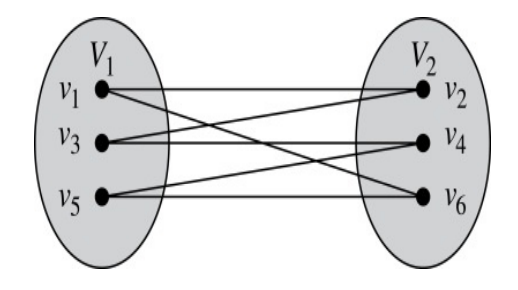

#### Show that $C_3$ is not bipartite

If we partition vertices of $C_3$ into two non-empty sets, one set must contain two vertices. But every vertex is connected to every other. So, the two vertices in the same partition are connected. Hence, $C_3$ is not bipartite.

## Complete Bipartite Graphs

### Definition

A **complete bipartite graph** is a graph that has its vertex set $V$ partitioned into two subsets $V_1$ of size $m$ and $V_2$ of size $n$ such that there is an edge from every vertex in $V_1$ to every vertex in $V_2$.

	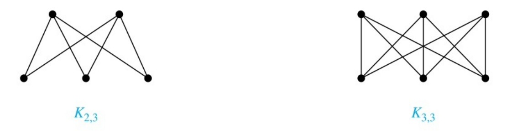
  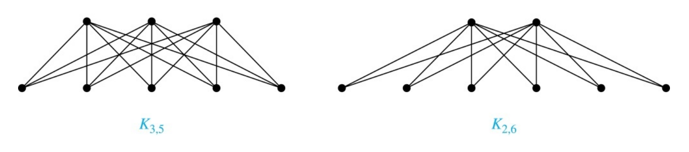

## Subgraphs

### Definition

A **subgraph** of a graph $G=(V,E)$ is a graph $(W,F)$, where $W \subseteq V$ and $F \subseteq E$. A subgraph $H$ of $G$ is a **proper subgraph** of $G$ if $H \neq G$.

### Example

  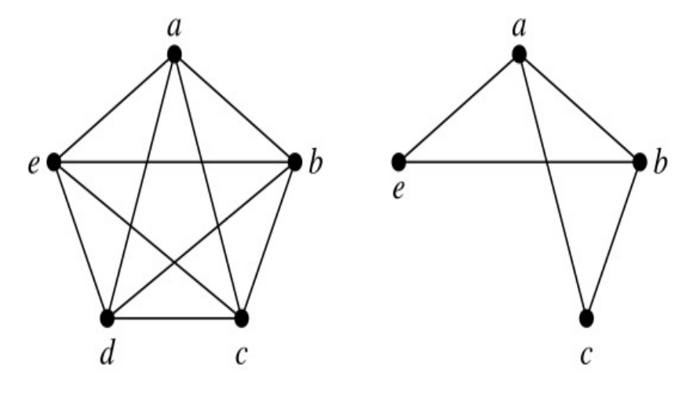

## Induced subgraphs

### Definition

Let $G=(V,E)$ be a graph. The **subgraph induced** by a subset $W$ of the vertex set $V$ is the graph $H=(W,F)$, whose edge set $F$ contains an edge in $E$ iff both endpoints are in $W$.

### Example

Here is $K_5$ and its **induced subgraph** induced by $W=\{a,b,c,e\}$.

  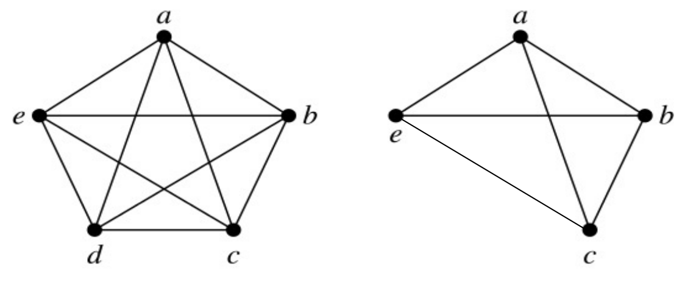

## Bipartite graphs

A **bipartite graph** is a (undirected) graph $G=(V,E)$ whose vertices can be partitioned into two disjoint sets $(V_1,V_2)$, with $V_1 \cap V_2 = \emptyset$ and $V_1 \cup V_2 = V$, such that for every edge $e \in E$, $e=\{u,v\}$ such that $u \in V_1$ and $v \in V_2$. In other words, every edge connects a vertex in $V_1$ with a vertex in $V_2$.

This is an alternative definition to the *coloring* definition.

## Matching in Bipartite Graphs

### Matching

A **matching** $M$, in a graph $G=(V,E)$, is a subset of edges, $M \subseteq E$, such that there does not exist two distinct edges in $M$ that are incident on the same vertex. In other words, if $\{u,v\},\{w,z\}\in M$, then either $\{u,v\}=\{w,z\}$ or $\{u,v\}\cap\{w,z\}=\emptyset$.

i.e. the set of pairwise non-adjacent edges; that is, no two edges share a common vertex.

### Maximum matching

A **maximum matching** in graph $G$ is a matching in $G$ with the maximum possible number of edges.

	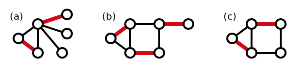

### Perfect/complete matchings

For a graph $G=(V,E)$, we say that a subset of edges, $W \subseteq E$, **covers** a subset of vertices, $A \subseteq V$, if for all vertices $u \in A$ there exists an edge $e \in W$, such that $e$ is incident on $u$, i.e., such that $e=\{u,v\}$, for some vertex $v$.

In a bipartite graph $G=(V,E)$ with bipartition $(V_1,V_2)$, a **complete matching** with respect to $V_1$, is a matching $M' \subseteq E$ that covers $V_1$, and a **perfect matching** is a matching, $M^* \subseteq E$, that covers $V$.

Figure (b) above is an example of a perfect matching.

## Hall's Marriage Theorem

### Theorem

For a bipartite graph $G=(V,E)$, with bipartition $(V_1,V_2)$, there exists a matching $M \subseteq E$ that covers $V_1$ **iff** $\forall S \subseteq V_1, |S| \leq |N(S)|$.

### Proof

Slides 5-8 on [Lecture 19](https://www.inf.ed.ac.uk/teaching/courses/dmmr/slides/16-17/Ch10.pdf).

### Corollary

A bipartite graph $G=(V,E)$ with bipartition ($V_1,V_2$) has a **perfect** matching iff $|V_1|=|V_2|$ and $\forall S \subseteq V_1, |S| \leq |N_G(S)|$.

## Union of graphs

### Definition

The **union** of two simple graphs $G_1=(V_1,E_1)$ and $G_2=(V_2,E_2)$ is the simple graph with vertex set $V_1 \cup V_2$ and edge set $E_1 \cup E_2$. The union of $G_1$ and $G_2$ is denoted by $G_1 \cup G_2$.

### Examples

	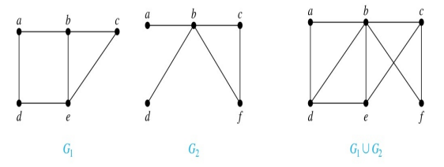

## Adjacency lists

### Definition

An **adjacency list** represents a graph (with no multiple edges) by specifying the vertices that are adjacent to each vertex.

### Example

| Vertex | Adjacent vertices |
| ------ | ----------------- |
| $a$    | $b,c,e$           |
| $b$    | $a$               |
| $c$    | $a,d,e$           |
| $d$    | $c,e$             |
| $e$    | $a,c,d$           |

This adjacency list corresponds to the graph:

	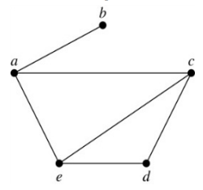

## Adjacency matrices

### Definition

Suppose that $G=(V,E)$ is a simple graph where $|V|=n$. Arbitrarily list the vertices of $G$ as $v_1, v_2, \ldots, v_n$.

The **adjacency matrix**, $\mathbf{A}$, of $G$, **with respect to this listing of vertices**, is the $n \times n \quad (0-1)$ matrix with its $(i,j)^{th}$ entry = $1$ when $v_i$ and $v_j$ are adjacent, and $=0$ when they are not adjacent.

In other words: $A=[a_{ij}]$ and:
$$
a_{ij} =
\begin{cases}
1,  & \text{if $\{v_i,v_j\}$ is an edge of $G$} \\
0, & \text{otherwise}
\end{cases}
$$

### Examples

#### Example 1

$$
\begin{bmatrix}
0 & 1 & 1 & 1 \\
1 & 0 & 1 & 0 \\
1 & 1 & 0 & 0 \\
1 & 0 & 0 & 0
 \end{bmatrix}
$$

Corresponds to the graph:

	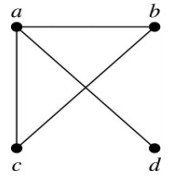

#### Example 2

$$
\begin{bmatrix}
0 & 1 & 1 & 0 \\
1 & 0 & 0 & 1 \\
1 & 0 & 0 & 1 \\
0 & 1 & 1 & 0
 \end{bmatrix}
$$

Corresponds to the graph:

	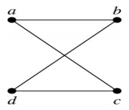

### Adjacency matrices (continued)

- The adjacency matrix of an undirected graph is **symmetric**:

$$
a_{ij}=a_{ji}, \forall i,j
$$

​	Also, since there are no loops, each diagonal entry is zero: $a_{ii}=0, \forall i$.

- Adjacency matrices can also be used to represent graphs with loops and multi-edges.

- When multiple edges connect vertices $v_i$ and $v_j$, (or if multiple loops present at the same vertex), the $(i,j)^{th}$ entry equals the number of edges connecting the pair of vertices.

  ### Example

  $$
  \begin{bmatrix}
  0 & 3 & 0 & 2 \\
  3 & 0 & 1 & 1 \\
  0 & 1 & 1 & 2 \\
  2 & 1 & 2 & 0
   \end{bmatrix}
  $$

  Corresponds to the graph:

  

  	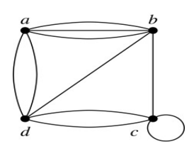
  

- Adjacency matrices can represent directed graphs in exactly the same way.

  The matrix $\mathbf{A}$ for a directed graph $G=(V,E)$ has a $1$ in its $(i,j)^{th}$ position if there is an edge from $v_i$ to $v_j$, where $v_1, v_2, \ldots, v_n$ is a list of the vertices.

  In other words:
  $$
  a_{ij}=1 \quad \quad \text{if $(i,j)\in E$} \\
  a_{ij}=0 \quad \quad \text{if $(i,j)\not \in E$}
  $$
  **Note**: The adjacency matrix for a directed graph does not have to be symmetric.

- A **sparse** graph has few edges relative to the number of possible edges.

  Sparse graphs are more efficient to represent using an adjacency list than an adjacency matrix. But for a **dense** graph, an adjacency matrix is often preferable.

## Isomorphism of graphs

### Definition

Two (undirected) graphs $G_1=(V_1,E_1)$ and $G_2=(V_2,E_2)$ are **isomorphic** if there is a bijection, $f : V_1 \mapsto V_2$, with the property that for all vertices $a,b \in V_1$:
$$
\{a,b\} \in E_1 \Longleftrightarrow \{f(a),f(b)\} \in E_2
$$
Such a function $f$ is called an **isomorphism**.

Intuitively, isomorphic graphs are **the same** except for the renamed vertices.

  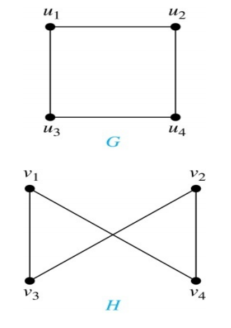

It is difficult to determine whether two graphs are isomorphic by brute force: there are $\mathbf{n!}$ bijections between vertices of $n$-vertex graphs.

To show that two graphs are not isomorphic, we can find a property that only one of the two graphs has. Such a property is called **graph invariant**:

e.g. 

- Number of vertices of given degree
- Degree sequence (list of the degrees)
- Number of edges
- Number of cycles

### Example

  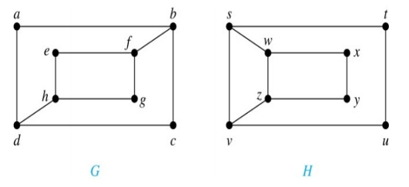

These graphs are not isomorphic. This is because $deg(a)=2$ in $G$, a must correspond to $t,u,x$ or $y$, since these are the vertices of degree $2$ in $H$.

But each of these vertices is adjacent to another vertex of degree $2$ in $H$, which is not true for $a$ in $G$. So, $G$ and $H$ can not be isomorphic.

## Paths (in undirected graphs)

Informally, a **path** is a sequence of edges connecting vertices.

### Definition

For an undirected graph $G=(V,E)$, an integer $n \geq 0$, and vertices $u,v \in V$, a **path (or walk) of length $n$ from $u$ to $v$ in $G$ is a sequence:**
$$
x_0, e_1, x_1, e_2, \ldots, x_{n-1},e_n,x_n
$$
of interleaved vertices $x_j \in V$ and edges $e_1 \in E$, such that $x_0 =u$ and $x_n = v$, and such that $e_i=\{x_{i-1},x_i\} \in E \quad \forall i \in \{1,\ldots,n\}$.

Such a path **starts** at $u$ and **ends** at $v$. A path of length $n \geq 1$ is called a **circuit** (or **cycle**) if $n \geq 1$ and the path starts and ends at the same vertex, i.e. $u=v$.

A path or circuit is called **simple** if it does not contain the same edge more than once.

### More

**Don't confuse a simple undirected graph with a simple path**.

There can be a simple path in a non-simple graph, and a non-simple path in a simple graph.

A path is **tidy** when no vertex is repeated.

A path is **simple** when no edge is repeated.

## Connectedness

### Definition

An undirected graph $G=(V,E)$ is called **connected** if there is a path between every pair of distinct vertices. It is called **disconnected** otherwise.

### Proposition

There is always a simple, and tidy, path between any pair of vertices $u$, $v$ of a connected undirected graph $G$.

### Proof

[Read slide 7](https://www.inf.ed.ac.uk/teaching/courses/dmmr/slides/16-17/Ch10.pdf)

### Connected components

A **connected component** $H=(V',E')$ of a graph $G=(V,E)$ is a maximal connected subgraph of $G$, meaning $H$ is connected and $V' \subseteq V$ and $E' \subseteq E$ but $H$ is not a proper subgraph of a larger connected subgraph $R$ of $G$.

### Strongly connected graphs

A directed graph $G=(V,E)$ is **strongly connected** if for every pair of vertices in $u$ and $v$ in $V$, there is a directed path from $u$ to $v$, and a directed path from $v$ to $u$.

It is **weakly connected** if there is a path between every pair of vertices in $V$ in the underlying undirected graph (meaning we ignore the direction of edges).

A **strongly connected component** of a directed graph $G$, is a maximal strongly connected subgraph $H$ of $G$ which is not contained in a larger strongly connected subgraph of $G$.

## Euler/Hamiltonian paths and circuits

### Definitions

An **Euler path** in a multigraph $G$ is a simple path that contains every edge of $G$. (so every edge occurs exactly once in the path)

An **Euler circuit** in a multigraph $G$ is a simple circuit that contains every edge of $G$. (so every edge occurs exactly once in the circuit)

A **Hamiltonian path** is a multigraph $G$ is a simple path that passes through every vertex (not necessarily each edge), exactly once.

A **Hamiltonian circuit** is a multigraph $G$ is a simple circuit that passes through every vertex (not necessarily each edge), exactly once.

## Graph colouring

### Definition

Suppose we have $k$ disinct colours with which to colour the vertices of a graph. Let $[k]=\{1,\ldots,k\}$. For an undirected graph, $G=(V,E)$, an admissable vertex **$k$-colouring** of $G$ is a function $c : V \to [k]$, such that $\forall u,v \in V$, $\{u,v\}\in E \implies c(u) \neq c(v)$.

For an integer $k \geq 1$, we say an undirected graph $G=(V,E)$, is $k$-colourable if there exists a **$k$-colouring** of $G$.

The **chromatic number** of $G$, denoted $\chi(G)$, is the smallest positive integer $k$, such that $G$ is $k$-colourable.

### Observations

- Any graph $G$ with $n$ vertices is $n$-colourable.

- The **$n$-clique**, $K_n$ i.e., the complete graph on $n$ vertices, has chromatic number $\chi(K_n)=n$. All its vertices must get assigned different colours in any admissable colouring.

- The **clique number**, $\omega(G)$, of graph $G$ is the maximum positive integer $r\geq 1$, such that $K_r$ is a subgraph of $G$.

- For all graphs $G$, $\omega(G)\leq \chi(G) : \text{G has a $r$-clique} \implies \text{G is not $(r-1)$-colourable}$.

- In general, $\omega(G) \neq \chi(G)$.

  > e.g. $C_5$ has $\omega(C_5)=2$ and $\chi(C_5)=3$. Note that in this case, $\omega(C_5) < \chi(C_5)$.

- Any bipartite graph is $2$-colourable. This is an alternative definition of being bipartite.

- Generally, a graph $G$ is $k$-colourable precisely if it is $k$-partite, meaning its vertices can be partitioned into $k$ disjoint sets such that all edges of the graph are between nodes in different parts.

