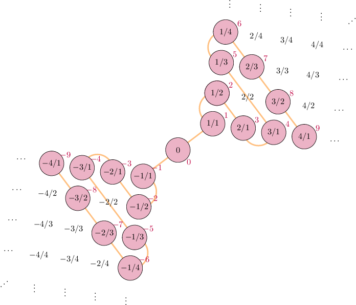

[toc]

# Sets and functions

## Functions

### Injection, surjection and bijection

Given a function $f: X \to Y$:

#### Injection (one-to-one)

The function is injective if every element of the codomain is mapped to by at most one element of the domain.

| **Definition**                               | **Diagram**                                         | **Example**                              |
| -------------------------------------------- | --------------------------------------------------- | ---------------------------------------- |
| $\forall x,x'\in X, f(x)=f(x')\implies x=x'$ |  | $\mathbb{R} \to \mathbb{R}:x\mapsto e^x$ |

#### Surjection (onto)

The function is surjective if every element of the codomain is mapped to by at least one element of the domain (The image and the codomain of the function are equal).

| **Definition**                            | **Diagram**                                          | **Example**                             |
| ----------------------------------------- | ---------------------------------------------------- | --------------------------------------- |
| $\forall y\in Y, \exists x\in X : y=f(x)$ |  | $\mathbb{R} \to [-1,1]:x\mapsto \sin x$ |

#### Bijection (one-to-one correspondence)

The function is bijective if every element of the codomain is mapped to by exactly one element of the domain (The function is both **injective** and **surjective**).

| **Definition**                | **Diagram**                                         | **Examples**                                                 |
| ----------------------------- | --------------------------------------------------- | ------------------------------------------------------------ |
| Both injective and surjective |  | $\mathbb{R}^+ \to \mathbb{R}:x\mapsto \ln x$ $\mathbb{R} \to \mathbb{R}^+:x\mapsto e^x$ $\mathbb{R}^+ \to \mathbb{R}^+:x\mapsto x^2$ $\mathbb{R}^+ \to \mathbb{R}^+:x\mapsto \sqrt{x}$ |

Note that a function is bijective if and only if it has an inverse.

## Sets

### Cardinality

For set $A$, its cardinality is denoted as $|A|$. The cardinality of a set is a measure of the number of elements of the set.

Given two sets $A$ and $B$:

#### $|A|=|B|$

The sets $A$ and $B$ have the same cardinality if there exists a bijection from $A$ to $B$.

#### $|A|\leq|B|$

$A$ has cardinality less than or equal to the cardinality of $B$ if there exists an injective function from $A$ to $B$.

#### $|A|<|B|$

$A$ has cardinality strictly less than the cardinality of $B$ if there is an injective function, but no bijective function from $A$ to $B$.

> Example: $|\mathbb{N}|<|\mathbb{R}|$
>
> This is because the inclusion map $i : \mathbb{N} \to \mathbb{R}$ is injective (every element of $\mathbb{N}$ is also in $\mathbb{R}$).
>
> But it can be shown that there does not exist a bijective function from $\mathbb{N}$ to $\mathbb{R}$. This can be proven by Cantor's diagonal argument.

### Cantor's diagonalisation argument

Cantor's diagonalisation argument can be used to prove that the set of all infinite sequences of binary digits is infinite.
$$
\begin{align}
s_{1} &= \textcolor{red}{0}\ 0\ 0\ 0\ 0\ 0\ 0\ 0\ 0\ 0\ 0\ \cdots \\
s_{2} &= 1\ \textcolor{red}{1}\ 1\ 1\ 1\ 1\ 1\ 1\ 1\ 1\ 1\ \cdots \\
s_{3} &= 0\ 1\ \textcolor{red}{0}\ 1\ 0\ 1\ 0\ 1\ 0\ 1\ 0\ \cdots \\
s_{4} &= 1\ 0\ 1\ \textcolor{red}{0}\ 1\ 0\ 1\ 0\ 1\ 0\ 1\ \cdots \\
s_{5} &= 1\ 1\ 0\ 1\ \textcolor{red}{0}\ 1\ 1\ 0\ 1\ 1\ 0\ \cdots \\
s_{6} &= 0\ 0\ 1\ 1\ 0\ \textcolor{red}{1}\ 1\ 0\ 1\ 1\ 0\ \cdots \\
s_{7} &= 1\ 0\ 0\ 0\ 1\ 0\ \textcolor{red}{0}\ 0\ 1\ 0\ 0\ \cdots \\
s_{8} &= 0\ 0\ 1\ 1\ 0\ 0\ 1\ \textcolor{red}{1}\ 0\ 0\ 1\ \cdots \\
s_{9} &= 1\ 1\ 0\ 0\ 1\ 1\ 0\ 0\ \textcolor{red}{1}\ 1\ 0\ \cdots \\
s_{10} &= 1\ 1\ 0\ 1\ 1\ 1\ 0\ 0\ 1\ \textcolor{red}{0}\ 1\ \cdots \\
s_{11} &= 1\ 1\ 0\ 1\ 0\ 1\ 0\ 0\ 1\ 0\ \textcolor{red}{0}\ \cdots \\
& \quad\  \vdots\ \ \vdots\ \ \vdots\ \ \vdots\ \ \vdots\ \ \vdots\ \ \vdots\ \ \vdots\ \ \vdots\ \ \vdots\ \ \vdots \ \ddots
\end{align}
$$
First, we make the assumption that we can list **all** of the infinite sequences of binary digits, as shown above.

Then, we construct a new sequence by choosing the $i$th digit of $s_i$ (the digits coloured in red), and taking its complement.

So in this case, we would have formed the new sequence that starts with:
$$
10111010011\ldots
$$
By assumption, this sequence appears in the list of all infinite binary sequences that we made. However this is a contradiction as it can't appear in this list, as it differs from every other sequence by at least one bit.

Therefore, the set of infinite sequences of binary digits is infinite.

---

Similarly, we can prove that the set of real numbers $\mathbb{R}$ is not countable. We will show that the set of reals in the interval $(0,1)$ is not countable. 

First, assume that we could list all of the decimal expansions of the reals in $(0,1)$:
$$
0.s_{00}s_{01}s_{02}s_{03}s_{04}\ldots\\
0.s_{10}s_{11}s_{12}s_{13}s_{14}\ldots\\
0.s_{20}s_{21}s_{22}s_{23}s_{24}\ldots\\
0.s_{30}s_{31}s_{32}s_{33}s_{34}\ldots\\
0.s_{40}s_{41}s_{42}s_{43}s_{44}\ldots\\
\vdots\quad \vdots\quad \vdots\quad \vdots\quad \vdots \ \
$$
This sequence can be described as $\displaystyle\bigg(\sum_{j\in\mathbb{N_0}}\frac{s_{ij}}{10^{j+1}}\bigg)_{i=0}^\infty$, where $s_{ij}\in\mathbb{Z_{10}}$ (this can be expressed in a simpler way, but it made me feel smart so i'm keeping it).

We need to construct a new real number that wouldn't be listed above. That is, one that differs from every listed number above in at least one digit.

Similarly to the example with binary strings, we can construct a new number that disagrees with every digit $s_{ij} : i=j$, so all of the digits $s_{00},s_{11},s_{22},\ldots$ Since we are working in $\mathbb{Z}_{10}$, we can let $\overline{s_{ij}}$ represent the modular multiplicative inverse of $s_{ij}$. $\forall z\in\mathbb{Z}_{10} \ \ z \neq \bar{z}$, so we can use this to construct our new number:
$$
0.\overline{s_{00}}\ \overline{s_{11}}\ \overline{s_{22}}\ \overline{s_{33}}\ \ldots
$$
This number differs with every number listed above by at least one digit, and therefore we have a contradiction.

### Finite, countable and uncountable sets

- For any set $X$, if $|X|<|\mathbb{N}|$, then $X$ is said to be a **finite** set.
- For any set $X$, if $|X|=|\mathbb{N}|$, then $X$ is said to be a **countably infinite** set.
- For any set $X$, if $|X|>|\mathbb{N}|$, then $X$ is said to be **uncountable**.

A set $S$ is **countable** either if

- it is finite
- it is infinite there exists a bijection $f$ between the elements of the set of natural numbers and the set of $S$. i.e. there exists a function $f : \mathbb{N} \to S$ such that $f$ is a bijective function.

> Example: Prove that the set of rationals $\mathbb{Q}$ is countable.
>
> For this proof, we will first prove that $\mathbb{Z}$ is countable. We must find a bijection $f : \mathbb{N} \to \mathbb{Z}$. Consider the following function:
> $$
> f(x) = \begin{cases}
> 	0 & \text{if $x=1$} \\
> 	\frac{x}{2} & \text{if $x$ even} \\
> 	\frac{-(x-1)}{2} & \text{if $x$ odd and $x>1$}
> \end{cases}
> $$
> It is easy to prove that this function is bijective. Therefore, $\mathbb{Z}$ is countable.
>
> ---
>
> Now since we know that $\mathbb{Z}$ is countable, it is sufficient to find a bijection $g : \mathbb{Z} \to \mathbb{Q}$, since $f \circ g$ is a bijection between $\mathbb{N}$ and $\mathbb{Q}$.
>
> The following diagram depicts such a bijection. Note that we don't count any fractions that can be reduced to a fraction that has already been counted previously. For example $\frac{-2}{2}$ is not counted, as this is equivalent to $\frac{-1}{1}$.
>
> 

### Powerset

The powerset of any set $S$ is the set of all subsets of $S$, including the empty set $\emptyset$ and $S$ itself. The power set of the set $S$ is denoted as $\mathcal{P}(S)$.

For every set $S$, $|\mathcal{P}(S)|=2^{|S|}$.

#### Example

$S=\{x,y,z\} \iff \mathcal{P}(S)=\{\emptyset,\{x\},\{y\},\{z\},\{x,y\},\{x,z\},\{y,z\},\{x,y,z\}\}$

#### Relation to binomial theorem

The number of subsets with $k$ elements in the power set of a set with $n$ elements is given by the number of combination $\binom{n}{k}$.

> Example: The power set of a set with three elements has:
>
> - $\binom{3}{0}=$ $1$ subset with $0$ elements (the empty subset)
> - $\binom{3}{1}=$ $3$ subsets with $1$ element (the singleton subsets)
> - $\binom{3}{2}=$ $3$ subsets with $2$ elements (the complements of the singleton subsets)
> - $\binom{3}{3}=$ $1$ subset with $3$ elements (the original set itself)

### Disjoint sets

Sets $A$ and $B$ are disjoint iff $A\cap B=\emptyset$.

More generally, sets $S_1,S_2,S_3,\ldots,S_n$ are (pairwise) disjoint iff
$$
\forall i,j \in \mathbb{N} : (i,j\leq n) \land (i\neq j)\implies S_i\cap S_j=\emptyset
$$

### Union

#### Cardinality of unions of disjoint sets

For disjoint sets $A$ and $B$, we have $|A\cup B|=|A|+|B|$.

#### Arbitrary unions

For a finite union of sets $S_1,S_2,S_3,\ldots,S_n$, one often writes:
$$
S_1\cup S_2\cup S_3\cup \ldots\cup S_n =\bigcup_{i=1}^nS_i
$$
For an infinite union of sets $S_1,S_2,S_3,\ldots$, one often writes:
$$
S_1\cup S_2\cup S_3\cup \ldots =\bigcup_{i=1}^\infty S_i \quad \text{or} \quad \bigcup_{i\in\mathbb{N}} S_i
$$

### Intersection

For disjoint sets $A$ and $B$, we have $|A\cap B|=1$. That is, $A\cap B=\emptyset$.

#### Arbitrary intersections

For a finite union of sets $S_1,S_2,S_3,\ldots,S_n$, one often writes:
$$
S_1\cap S_2\cap S_3\cap \ldots\cap S_n =\bigcap_{i=1}^nS_i
$$
For an infinite union of sets $S_1,S_2,S_3,\ldots$, one often writes:
$$
S_1\cap S_2\cap S_3\cap \ldots =\bigcap_{i=1}^\infty S_i \quad \text{or} \quad \bigcap_{i\in\mathbb{N}} S_i
$$

### Inclusion-Exclusion principle

Consider the cardinality of the union of two disjoint finite sets $A$ and $B$. Symbolically, this can be expressed as:
$$
|A\cup B|=|A|+|B|-|A\cap B|
$$
The formula expresses the fact that the sum of the sizes of the two sets may be too large since some elements may be counted twice. The double-counted elements are those in the intersection of the two sets and the count is corrected by subtracting the size of the intersection.

The principle is more clearly seen in the case of three sets, which for the sets $A$,$B$ and $C$ is given by:

$|A\cup B\cup C|=|A|+|B|+|C|-|A\cap B|-|A\cap C|-|B\cap C|+|A\cap B\cap C|$

This can also be easily seen with a Venn diagram.

### Set difference

If $A$ and $B$ are sets, then the set difference of $A$ in $B$ is the set of elements in $B$ but not in $A$. The set difference of $A$ in $B$ is denoted as either $A-B$.

> Example:
>
> - $\{1,2,3\}-\{2,3,4\}=\{1\}$
> - $\{2,3,4\}-\{1,2,3\}=\{4\}$
> - $\{x,y,z\}-\{z\}=\{x,y\}$
> - $\mathbb{R}-\mathbb{Q}$ is the set of irrational numbers.

### Cartesian product

For sets $A$ and $B$, the Cartesian product $A \times B$ is the set of all ordered pairs $(a,b)$ where $a\in A$ and $b\in B$:
$$
A\times B = \{(a,b) \ | \ a \in A \land b \in B\}
$$

> Example: $A=\{1,2\}$ and $B=\{3,4\}$, then:
> $$
> A\times B = \{(1,3),(1,4),(2,3),(2,4)\} \\
> B\times A = \{(3,1),(3,2),(4,1),(4,2)\}
> $$
>