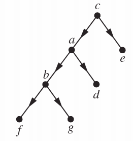
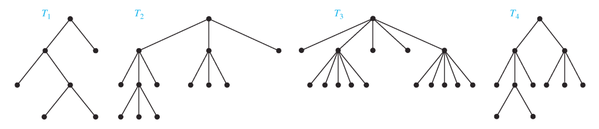
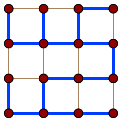

[TOC]

## Trees

A **tree** is a connected simple undirected graph with no simple
circuits.

A **forest** is a (not necessarily connected) simple undirected
graph with no simple circuits.

### Theorems

---

A graph $G$ is a **tree** iff there is a **unique** simple path between any two vertices of $G$.

---

Every tree, $T=(V,E)$ with $|V| \geq 2$, has at least two vertices that have degree 1.

---

Every tree with $n$ vertices has exactly $n-1$ edges.

### Rooted trees

A **rooted tree** is a pair $(T,r)$ where $T=(V,E)$ is a tree, and $r \in V$ is a chosen **root** vertex of the tree. Often, the edges of a rooted tree are viewed as being directed:

  

For each node $v \neq r$ the **parent** is the unique vertex $u$ such that $(u,v) \in E$. $v$ is then called a **child** of $u$. Two vertices with the same parent are called **siblings**.

A **leaf** is a vertex with no children. Non-leaves are called **internal vertices**. In the example above, $f, g, d, e$ are leaves.

The **height** of a rooted tree is the length of the longest directed path from the root to any leaf. In the example above, the height of the graph is $2$.

The **ancestors** of a vertex $v$ are all vertices $u \neq v$ such that there is a directed path from $u$ to $v$. In the example above, the ancestors of $b$ are $a$ and $c$.

The **descendants** of a vertex $v$ are all vertices $u \neq v$ such that there is a directed path from $v$ to $u$. In the example above, the descendants of $c$ are every other vertex in the graph.

The **subtree** rooted at $v$, is the subgraph containing $v$ and all its descendants, and all directed edges between them.

## $m$-ary trees

For $m \geq 1$, a rooted tree is called a **$m$-ary tree** if every internal node has at most $m$ children.

It is called a **full $m$-ary tree** if every internal node has exactly $m$ children.

An $m$-ary tree with $m=2$ is called a **binary tree**.

  

$T_1, T_2, T_3$ are **full** binary, 3-ary and 5-ary trees (respectively). $T_4$ is a **non-full** 3-ary tree, as not every internal node has exactly 3 children.

**Note that the root node is considered an internal node**.

### Counting vertices

#### Theorems

$\forall m \geq 1$, every full $m$-ary tree with $i$ internal vertices has exactly $n=m \cdot i+1$ vertices.

> **Proof:** Every vertex other than the root is a child of an internal vertex. There are thus $m \cdot i$ such children, plus $1$ root.

---

$\forall m \geq 1$ a full $m$-ary tree with:

1. $n$ vertices has $i=(n-1)/m$ internal vertices and $l=[(m-1)n+1]/m$ leaves.
2. $i$ internal vertices has $n=m \cdot i+1$ vertices and $l=(m-1)i+1$ leaves.
3. If $m \geq 2$, then if the $m$-ary tree has $l$ leaves then it has $n=(ml-1)/(m-1)$ vertices and $i=(l-1)/(m-1)$ internal vertices.

> **Proof:** All of these can be derived from $n=l+i$ and $n=m \cdot i+1$.

---

There are at most $m^h$ leaves in an $m$-ary tree of height $h$.

> **Proof:** By induction on $h \geq 0$.

---

If an $m$-ary tree has $l$ leaves, and $h$ is its height, then $h \geq \lceil \log_m l \rceil$.

> **Proof:** Since $l \leq m^h$, we have $\log_m l \leq h$. But $h \in \mathbb{Z}^+$, so $\lceil \log_m l \rceil \leq h$.

## Spanning trees of undirected graphs

For a simple undirected graph $G$, a **spanning tree** of $G$ is a subgraph $T$ of $G$ such that $T$ is a tree and $T$ contains every vertex of $G$.

  

The blue heavy edges in this grid graph represent a spanning tree.

### Theorems

Every connected graph $G$ has a spanning tree.

> **Proof:** While there is a circuit in $G$, remove one edge of the circuit. Repeat until there are no more circuits. Removing one edge of the circuit does not change connoectivity, and eventually no circuits can remain (because there are finitely many edges to be removed). So the end result is a tree which is a subtree of $G$.

## Prim's algorithm

Prim's algorithm finds a minimum spanning tree for a weighted undirected graph. This means it find a subset of the edges that forms a tree that includes every vertex, where the total weight of all the edges in the tree is minimized.

[Hegarty Maths](https://www.youtube.com/watch?v=DqpmZiC3ito)