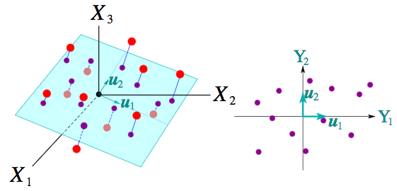
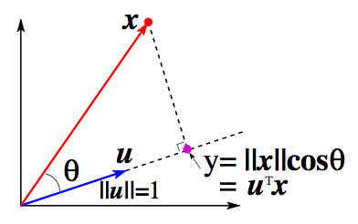
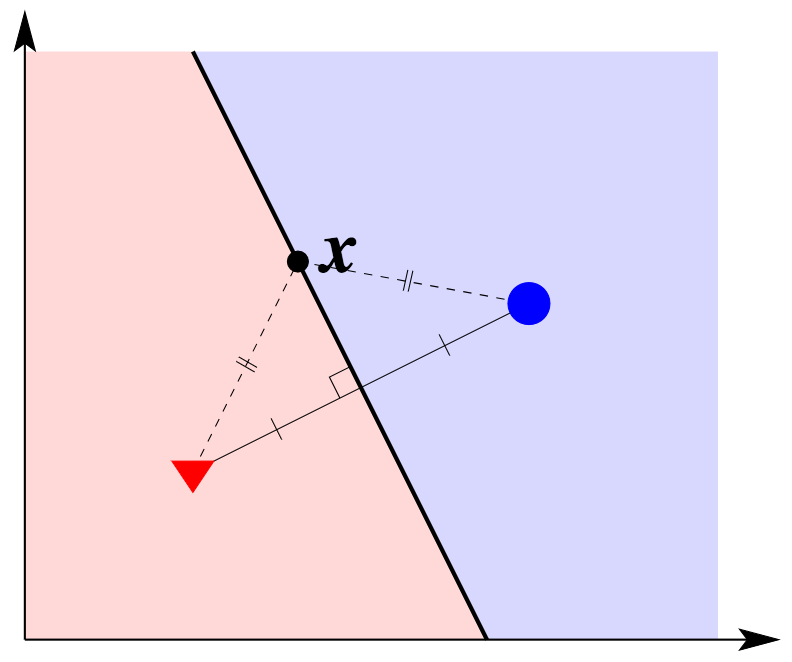
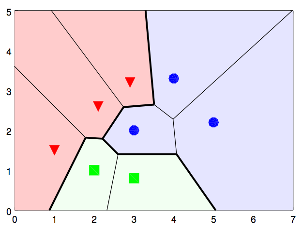
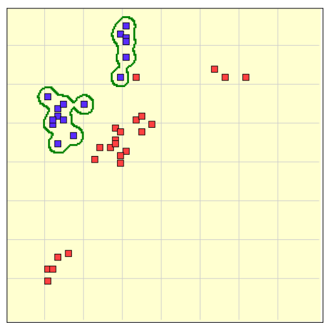
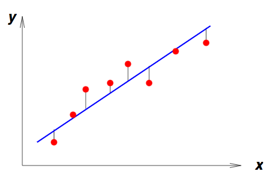
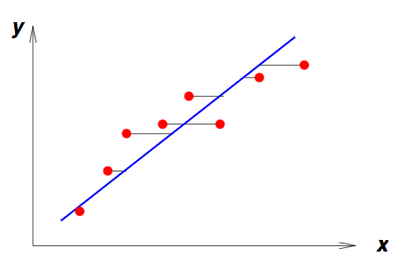
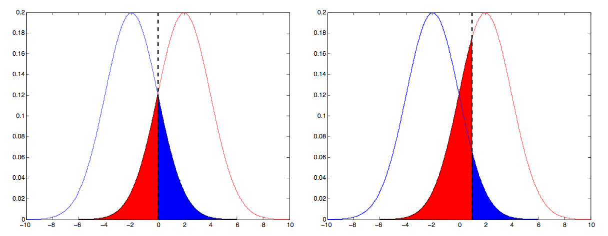

[TOC]

# Learning

## Clustering

**==Clustering==** is the partitioning of a data set into meaningful or useful groups, based on distance between data points.

> **Example**: Given a set of oranges and lemons, cluster into different orange and lemon varieties.

### K-means clustering

**==K-means clustering==** is a simple algorithm to find clusters:

1. Pick $K$ random points as cluster centre positions
2. Assign each point to its nearest centre (In the unlikely event of a tie, break the tie in some way).
3. Move each centre to the mean of its assigned points
4. If the centres moved, go back to step 2.

#### Evaluation of K-means clustering

To measure the quality of a K-means clustering solution, we can use a **==sum-squared error function==** — that is, the sum of squared distances of each point from its cluster centre.

Let $z_{kn}$ be defined as:
$$
\newcommand{\p}[1]{\mathbb{P}\left(#1\right)}
\newcommand{\cp}[2]{\p{#1\middle|#2}}
\newcommand{\jp}[2]{\p{#1,#2}}
\newcommand{\e}[1]{\mathbb{E}\left[#1\right]}
\newcommand{\var}[1]{\text{Var}\left[#1\right]}
\newcommand{\sd}[1]{\text{SD}\left(#1\right)}
\newcommand{\cov}[2]{\text{Cov}\left[#1,#2\right]}
\newcommand{\img}[1]{\text{Image}\left(#1\right)}
\newcommand{\bb}{\mathbb}
\newcommand{\R}{\bb{R}}
\newcommand{\N}{\bb{N}}
\newcommand{\Z}{\bb{Z}}
\newcommand{\Q}{\bb{Q}}
\newcommand{\C}{\bb{C}}
\newcommand{\ds}{\displaystyle}
\newcommand{\set}[1]{\left\lbrace#1\right\rbrace}
\newcommand{\setb}[2]{\left\lbrace#1\ \middle| \ #2\right\rbrace}
\newcommand{\d}[1]{\mathrm{d}#1}
\newcommand{\i}[4]{\int_{#1}^{#2}#3\ \d{#4}}
\newcommand{\deriv}[2]{\frac{\d{#1}}{\d{#2}}}
\newcommand{\pderiv}[2]{\frac{\partial #1}{\partial #2}}
\newcommand{\tp}[1]{\mathcal{P}_{#1}}
\newcommand{\b}{\mathbf}
\newcommand{\bs}{\boldsymbol}
\newcommand{\T}{\mathsf{T}}
\newcommand{\norm}[1]{\mathcal{N}\left(#1\right)}
z_{kn}=\begin{cases}
	1 \quad&\text{if point $x_n$ belongs to cluster $k$}\\
	0 &\text{otherwise}
\end{cases}
$$
Then:
$$
E=\sum_{k=1}^K\sum_{n=1}^Nz_{kn}||\underbrace{\b{x}_n-\b{m}_k}_{r_D(\b{x}_n,\b{m}_k)}||^2\\
\ \\
\text{where}\qquad\begin{align}
	&\b{m}_k \text{ is the centre of cluster $k$}\\
	&\b{x}_n=(x_{n1},\ldots,x_{nD})^\T\\
	&\b{m}_k=(m_{k1},\ldots,m_{kD})^\T\\
\end{align}
$$
The sum squared error decreases as we increase $K$. ($E\to0$ as $K\to N$)

## Dimensionality reduction

High-dimensional data is often difficult to understand and visualise. It is often a good idea to consider dimensionality reduction of data to improve visualisation.

As shown in the example below, **==dimensionality reduction==** is the process of reducing the number of random variables under consideration. This is done by projecting each sample in 3D onto a 2D plane.

Recall orthogonal projection of data onto an axis:

### Optimal projection of 2D data onto 1D

For the optimal projection of 2D data to 1D, we need a mapping $y_n=\b{u}^\T\b{x}_n=u_1x_{n1}+u_2x_{n2}$ where the is optimal $\b{u}$ is when $\var{y}$ is maximised.

This optimal $\b{u}$ is called the **==principal component axis==**.

### General case

Mapping $D$-dimensional data to a **principal component axis** $\b{u}=(u_1,\ldots,u_D)^\T$ that maximises $\var{y}$:
$$
y_n=\b{u}^\T\b{x}_n=u_1x_{n1}+\cdots+u_Dx_{nD}
$$
$\b{u}$ is given as the eigenvector with the largest eigenvalue of the **covariance matrix**, $\bs{\Sigma}$. 

#### Covariance matrix

Each entry of the covariance matrix is given by:
$$
\begin{align}
	\bs{\Sigma}_{ij}
	&=\cov{\b{x}_i}{\b{x}_j}\\
	&=\e{(\b{x}_i-\bs{\mu}_i)(\b{x}_j-\bs{\mu}_j)}\\
	&=\frac{1}{N-1}\sum_{n=1}^N(x_{ni}-\mu_i)(x_{nj}-\mu_j),\qquad\mu_i=\frac{1}{N}\sum_{n=1}^Nx_{ni}
\end{align}
$$
Giving us the following matrix equality:
$$
\bs{\Sigma}=\frac{1}{N-1}\sum_{n=1}^N(\b{x}_n-\bs{\mu})(\b{x}_n-\bs{\mu})^\T,\qquad\bs{\mu}=\frac{1}{N}\sum_{n=1}^N\b{x}_n
$$

## Classification and nearest neighbours

### Types of learning problems

| Data        | Input         | Output                 | Type of problem | Type of learning |
| ----------- | ------------- | ---------------------- | --------------- | ---------------- |
| $\b{x}$     | $\set{\b{x}}$ | groups (subsets)       | clustering      | unsupervised     |
| $(\b{x},y)$ | $\b{x}$       | $y$: discrete category | classification  | supervised       |

Where $\b{x}=(x_1,\ldots,x_D)^\T$ is a feature vectors and $y$ is a target vector or scalar.

 ### Classification

- The data has a feature vector $\b{x}=(x_1,\ldots,x_D)^\T$ and a label $c\in\set{1,\ldots,C}$.

- Given a **training set** - a set of $N$ feature vectors and their labels $(\b{x}_1,c_1),\ldots,(\b{x}_N,c_N)$, we have to use a learning algorithm to train a classifier from a training set.

- The **test set** is a set of feature vectors which the classifier must assign labels. It is used for evaluation.

- An **error function** tells us how accurate the classifier is. One option is to count the number of misclassifications:
  $$
  \text{Error rate}=\frac{\text{No. of misclassified samples}}{\text{No. of test samples}}
  $$

### Nearest-neighbour classifier

**==Nearest-neighbour classification==** is labeling a test example to have the label of the closest training example.

### K-nearest neighbour classifier

**==K-nearest neighbour classification==** is finding the K closest points in the training set to the test example, then classifying the test example by using a majority vote of the K class labels.

- Training a K-nearest neighbour classifier is simple — just store the training set.
- Classifying a test example requires finding the K nearest training examples, which can be computationally demanding if the training set is large (since we need to compute the Euclidean distance between the test example and every training example).

#### K-NN classification algorithm

For each test example $\b{z}\in z$:

- Compute the distance $r(\b{z},\b{x})$ between $\b{z}$ and each training example $(\b{x},c)\in X$
- Select $U_k(\b{z})\subseteq X$, the set of the $k$ nearest training examples to $\b{z}$
- Decide the class of $\b{z}$ by the majority voting

### Geometry of nearest-neighbour classifier

- A **==decision boundary==** is a boundary that partitions the vector space into subsets of different classes.

  > **Example**: The decision boundary for a vector space with two feature vectors in two different classes would look like:
  >
  > 

- **==Decision regions==** are the regions that are separated by the decision boundaries.

  In the diagram above, the decision regions are the blue and red regions.

  >  **Example**: In a vector space with more feature vectors and classes, the decision boundaries and decision regions can become more complicated:
  >
  > 

### Generalisation and over-fitting

- **==Overfitting==** is the tuning of a classifier too closely to the training set. This can often reduce the accuracy of classification on the test set.

  > **Example**: The decision boundary of the below classifier is too overfitting and poorly generalised.
  >
  > 

## Statistical pattern recognition and optimisation

###Rules of probability

For random variables $X\in\set{x_i}_{i=1}^L$ and $Y\in\set{y_j}_{j=1}^M$:

- **Product rule**:
  $$
  \begin{align}
  	\jp{Y=y_j}{X=x_i}
  	&=\cp{Y=y_j}{X=x_i}\p{X=x_i}\\
  	&=\cp{X=x_i}{Y=y_j}\p{Y=y_j}\\
  \end{align}
  $$
  Abbreviation:
  $$
  \begin{align}
  	\jp{Y}{X}
  	&=\cp{Y}{X}\p{X}\\
  	&=\cp{X}{Y}\p{Y}\\
  \end{align}
  $$
  $X$ and $Y$ are **==independent==** iff:

  - $\cp{X}{Y}=\p{X}$ and $\cp{Y}{X}=\p{Y}$
  - $\jp{X}{Y}=\p{X}\p{Y}$, which follows from the previous statement.

- **Sum rule**:
  $$
  \p{X=x_i}=\sum_{j=1}^M\jp{X=x_i}{Y=y_j}
  $$
  Abbreviation:
  $$
  \p{X}=\sum_Y\jp{X}{Y}
  $$

  - $\p{X}$ is referred to as the **==marginal probability==** of $X$.
  - $\sum_Y\jp{X}{Y}$ is the **marginalisation** of the joint probability over $Y$.

### Bayes' theorem

$$
\cp{H}{E}=\frac{\cp{E}{H}\p{H}}{\p{E}}
$$

### Bayes' decision rule

Suppose we have a random variable $C\in\set{1,\ldots,K}$, where each element $k$ represents a class label. Let $C_k$ denote $C=k$ and suppose we have an input feature vector matrix $\b{x}$, with features $x_i$.

Then the most probable class (**MAP** - Maximum A Posteriori) for vector $\b{x}$ is given by the class label which generates the maximum posterior probability — that is:
$$
\begin{align}
	k_\text{max}
	&=\underset{k\in C}{\arg\max}\ \cp{C_k}{\b{x}}\\
	&=\underset{k\in C}{\arg\max}\ \cp{\b{x}}{C_k}\p{C_k}\\
\end{align}
$$
Where:
$$
\begin{align}
	\overbrace{\cp{C_k}{\b{x}}}^\color{red}{\text{posterior}}
	&=\frac{\overbrace{\cp{\b{x}}{C_k}}^\color{red}{\text{likelihood}}\cdot\overbrace{\p{C_k}}^\color{red}{\text{prior}}}{\underbrace{\p{\b{x}}}_\color{red}{\text{evidence}}}\\\\
	&=\frac{\cp{\b{x}}{C_k}\cdot\p{C_k}}{\sum_{j=1}^K\cp{\b{x}}{C_j}\p{C_j}}\qquad\text{By the law of total probability}
\end{align}
$$
Often, the evidence $\p{\b{x}}$ will be the same for all classes and therefore it might not be necessary to consider it when finding the most probable class since:
$$
\cp{C_k}{\b{x}}\propto\cp{\b{x}}{C_k}\p{C_k}
$$

### Least square error line fitting

This is an optimisation problem, also called finding the **==line of best fit==**.

If the least square error line is given by $\hat{y}_n=ax_n+b$ (also called the **regression line** on $y$ with $x$), then we need to find:
$$
\min_{a,b}\frac{1}{N}\sum_{n=1}^N(\hat{y}_n-y_n)^2
$$
That is, find $a$ and $b$ for the line $\hat{y}_n=ax_n+b$ such that the total variance of all points (along the $y$ axis) is minimized, as depicted here:

#### Regression on $x$ with $y$

Sometimes it may be better to have a least square error line in the form $\hat{x}=cy_n+d$. This is called a regression line on $x$ with $y$, where $c$ and $d$ are given by:
$$
\min_{c,d}\frac{1}{N}\sum_{n=1}^N(\hat{x}_n-x_n)^2
$$
That is, find $c$ and $d$ for the line $\hat{x}=cy_n+d$ such that the total variance of all points (along the $x$ axis) is minimized, as depicted here:

### Iterative optimisation

**==Iterative optimisation==** is used on optimisation problems that don't have a closed-form solution (might not converge, such as $K$-means clustering)

#### Iterative optimisation method

1. Choose an initial point $\b{x}_0$, and make $t=0$
2. Choose $\b{x}_{t+1}$ based on an update formula for $\b{x}_t$
3. Increment $t$, so $t\leftarrow t+1$ and go to step 2 unless a stopping criterion is met.

**Gradient descent** is an example of an iterative optimisation method.

####Gradient descent

$$
\b{x}_{t+1}=\b{x}_t-\eta\nabla f(\b{x})\big|_{\b{x}=\b{x}_t}
$$

## Naïve Bayes classification

For a feature vector $\b{x}=(x_1,\ldots,x_D)^\T$, we wish to know $\cp{\b{x}}{C_k}=\cp{x_1,x_2,\ldots,x_D}{C_k}$. 

With the chain rule of probabilities:
$$
\begin{align}
	\cp{\b{x}}{C_k}
	&=\cp{x_1,x_2,\ldots,x_D}{C_k}\\
	&=\cp{x_1}{C_k}\cdot\cp{x_2}{x_1,C_k}\cdots\cp{x_D}{x_{D-1},\ldots,x_1,C_k}\\
\end{align}
$$
Naïve Bayes classification **naïvely** assumes that every feature $x_i$ is conditionally independent of every other $x_j:i\neq j$ given $C_k$, i.e:
$$
\cp{x_i}{C_k,x_j}=\cp{x_i}{C_k},\qquad i\neq j
$$
Therefore it follows that after this *naïve* assumption:
$$
\cp{\b{x}}{C_k}=\prod_{i=1}^D\cp{x_i}{C_k}
$$
Or:
$$
\begin{align}
	\cp{C_k}{\b{x}}
	&=\frac{\p{C_k}\prod_{i=1}^D\cp{x_i}{C_k}}{\prod_{i=1}^D\p{x_i}}\\
	&\ \text{Since the denominator remains constant}\\
	&\ \text{for a given input:}\\
	&\propto\p{C_k}\prod_{i=1}^D\cp{x_i}{C_k}
\end{align}
$$
Therefore, when applying **==maximum likelihood estimation==** (**MLE**) of priors and likelihoods (using Naïve Bayes assumption for the likelihoods), we get:
$$
k_\text{max}=\underset{k}{\arg\max}\ \cp{\b{x}}{C_k}\p{C_k}\\
$$

### Advantages and disadvantages

| **Advantages**                                    | **Disadvantages**                                            |
| ------------------------------------------------- | ------------------------------------------------------------ |
| Simplifies calculation of posterior probabilities | If there are no occurences of a class label and a certain feature together, then the entire posterior probability will be $0$, since it is a product of all posteriors. |

## Text classification with Naïve Bayes

Given a document $\mathcal{D}$ with a fixed set of classes $C=\set{1,\ldots,K}$, we classify $\mathcal{D}$ as the MAP class:
$$
\begin{align}
	k_\text{max}
	&=\underset{k\in C}{\arg\max}\ \cp{C_k}{\mathcal{D}}\\
	&=\underset{k\in C}{\arg\max}\ \cp{\mathcal{D}}{C_k}\p{C_k}\\
\end{align}
$$
But how do we represent $\mathcal{D}$, and how do we estimate $\cp{\mathcal{D}}{C_k}$ and $\p{C_k}$?

### Representation of $\mathcal{D}$

- **Sequence of words** model: $\mathcal{D}=(X_1,X_2,\ldots,X_n)$

  | Advantages                            | Disadvantages             |
  | ------------------------------------- | ------------------------- |
  | Maintains order and position of words | Computationally expensive |
  |                                       | Difficult to train        |

- **Set of words** (**Bag-of-words**) model:

  In the bag-of-words model, we only consider the words in a document that appear in a predefined vocabulary $V$.

  > **Example**: If classifying scam emails, we would have a vocabulary consisting of words like:
  >
  > *casino, congratulations, draws, lotto, first, winner, true, lottery, million*

  | **Advantages**                | **Disadvantages**                        |
  | ----------------------------- | ---------------------------------------- |
  | Easier to train               | Ignores the context of words             |
  | Not computationally expensive | Loses the ordering and position of words |

#### Multinomial document model

- Document represented by an integer feature vector, whose elements indicate the frequency of the corresponding word in the document:
  $$
  \b{x}=(x_1,\ldots,x_D)\qquad x_i\in\bb{N}_0
  $$
  Where $D$ is either:

  - The number of unique words in the document (**sequence-of-words** model)
  - The number of words in the vocabulary $V$ (**bag-of-words** model), $|V|$

$$
\cp{\mathcal{D}}{C_k}=\cp{\b{x}}{C_k}\propto\prod_{t=1}^{|V|}\cp{w_t}{C_k}^{x_t}
$$

---

**Note**: Remember that when classifying an unlabelled document $\mathcal{D}$, we actually want the posterior — $\cp{C_k}{\mathcal{D}}$.

#### Bernoulli document model

- Document represented by a binary feature vector, whose elements indicate absence or presence of the corresponding word in the document
  $$
  \b{b}=(b_1,\ldots,b_D)\qquad b_i\in\set{0,1}
  $$
  Where $\mathcal{D}$ is the same as previously described for the multinomial document model.
  $$
  \cp{\mathcal{D}}{C_k}=\cp{\b{b}}{C_k}=\prod_{t=1}^{|V|}\left[b_t\cp{w_t}{C_k}+(1-b_t)(1-\cp{w_t}{C_k})\right]
  $$
  Where $\cp{w_t}{C_k}=\frac{n_k(w_t)}{N_k}$.

- $n_k(w_t)$ - number of documents of class $k$ in which $w_t$ is observed
- $N_k$ - total documents in class $k$

---

**Note**: Remember that when classifying an unlabelled document $\mathcal{D}$, we actually want the posterior — $\cp{C_k}{\mathcal{D}}$.

## Multivariate Gaussians and classification

###Gaussian distribution

$$
\norm{x;\mu,\sigma^2}=\frac{1}{\sqrt{2\pi\sigma^2}}e^\frac{-(x-\mu)^2}{2\sigma^2}
$$

- Symmetric and centered about $\mu$
- $\sigma$ increase $\to$ Gets flatter and wider
- $\sigma$ decrease $\to$ Gets taller and narrower

### Parameter estimation from data

- Sample mean and sample variance estimates:
  $$
  \mu=\frac{1}{N}\sum_{n=1}^Nx_n\qquad\sigma^2=\frac{1}{N-1}\sum_{n=1}^N(x_n-\mu)^2
  $$

- Maximum likelihood estimates:
  $$
  \mu_\text{ML}=\frac{1}{N}\sum_{n=1}^Nx_n\qquad\sigma^2=\frac{1}{N}\sum_{n=1}^N(x_n-\mu_\text{ML})^2
  $$

### Multivariate form

For a $D$-dimensional vector $\b{x}=(x_1,\ldots,x_D)^\T$:
$$
\cp{\b{x}}{\bs{\mu},\bs{\Sigma}}=\frac{1}{(2\pi)^\frac{D}{2}|\bs{\Sigma}|^\frac{1}{2}}e^{-\frac{1}{2}(\b{x}-\bs{\mu})^\T\bs{\Sigma}^{-1}(\b{x}-\bs{\mu})}
$$

- $\bs{\mu}=(\mu_1,\ldots,\mu_D)^T$ is the **mean vector**
- $\bs{\Sigma}=(\sigma_{ij})$ is the **covariance matrix**

Note that the 1-dimensional Gaussian is a special case of this PDF.

#### Parameter estimation

- $\bs{\Sigma}=\e{(\b{x}-\bs{\mu})(\b{x}-\bs{\mu})^\T}=\frac{1}{N-1}\sum_{n=1}^N(\b{x}_n-\bs{\mu})(\b{x}_n-\bs{\mu})^\T$
- $\bs{\Sigma}_\text{ML}=\frac{1}{N}\sum_{n=1}^N(\b{x}_n-\bs{\mu}_\text{ML})(\b{x}_n-\bs{\mu}_\text{ML})^\T$

### Covariance

The covariance of variables $X$ and $Y$ is:
$$
\cov{X}{Y}=\frac{1}{N}\sum_{i=1}^N(x_i-\bar{x})(y_i-\bar{y})
$$

### Covariance matrix

$$
\bs{\Sigma}
=\begin{bmatrix}
	\sigma_{11} & \cdots & \sigma_{1D}\\
	\vdots & \ddots & \vdots\\
	\sigma_{D1} & \cdots & \sigma_{DD}
\end{bmatrix}
=\frac{1}{N}\sum_{n=1}^N(\b{x}_n-\bs{\mu})(\b{x}_n-\bs{\mu})^\T
$$

Where $\b{x}_n=(x_{n1},\ldots,x_{nD})^\T$ is a feature vector (an observation of $D$ variables) in:
$$
\b{X}=\begin{bmatrix}
	x_{11} & x_{12} & \cdots & x_{1(D-1)} & x_{1D} \\
	x_{21} & x_{22} & \cdots & x_{2(D-1)} & x_{2D} \\
	\vdots & \vdots & \ddots & \vdots & \vdots \\
	x_{(N-1)1} & x_{(N-1)2} & \cdots & x_{(N-1)(D-1)} & x_{(N-1)D} \\
	x_{N1} & x_{N2} & \cdots & x_{N(D-1)} & x_{ND}
\end{bmatrix}
$$
**Note**: Diagonals are the variances.

> **Example**: Consider the following test data with variables length, width and height of a certain object:
> $$
> \b{X}=\begin{bmatrix}
> 	\overset{\text{Length}}{4.0} & \overset{\text{Width}}{2.0} & \overset{\text{Height}}{0.60}\\
> 	4.2 & 2.1 & 0.59\\
> 	3.9 & 2.0 & 0.58\\
> 	4.3 & 2.1 & 0.62\\
> 	4.1 & 2.2 & 0.63
> \end{bmatrix}
> $$
> Then we have $\bs{\mu}=(4.10,2.08,0.604)^\T$ and
> $$
> \bs{\Sigma}=\begin{bmatrix}
> 	\small{\text{Length}} & \overset{\text{Length}}{0.025} & \overset{\text{Width}}{0.0075} & \overset{\text{Height}}{0.00175}\\
> 	\small{\text{Width}} & 0.0075 & 0.0070 & 0.00135\\
> 	\small{\text{Height}} & 0.00175 & 0.00135 & 0.00043
> \end{bmatrix}
> $$
> Which tells us that the covariance between the length and height is $0.00175$, etc.

#### Geometric interpretation

The covariance matrix defines the shape of the data.

- Diagonal spread of the data is captured by the covariance, while axis-aligned spread is captured by the variance.
- The center of the spread is given by the mean vector.

> Example: If $\bs{\Sigma}$ is diagonal (such that the covariances are $0$), then the variances must be equal to the eigenvalues:
>
> 

 
>---
> 
>But if $\bs{\Sigma}$ isn't diagonal, the eigenvalues still represent the variance magnitude in the direction of the largest spread of the data, and the variance components of the covariance matrix still represent the variance magnitude in the direction of the $x$ and $y$ axis.
> 
>But since the data isn't axis-aligned, these values aren't the same anymore:
> 
>

### Problems with estimation of covariance matrix

- $\bs{\Sigma}^{-1}$ becomes unstable when $|\bs\Sigma|$ is small.

  - One solution is the reduce the dimensionality with PCA

  - Another solution is regularisation — adding a small positive number to the diagonal elements:
    $$
    \bs\Sigma \leftarrow \bs\Sigma+\epsilon\b I
    $$

### Diagonal covariance matrix

If $\bs\Sigma$ is diagonal, then:
$$
\begin{align}
	\cp{\b{x}}{\bs{\mu},\bs{\Sigma}}
	&=\frac{1}{(2\pi)^\frac{D}{2}|\bs{\Sigma}|^\frac{1}{2}}e^{-\frac{1}{2}(\b{x}-\bs{\mu})^\T\bs{\Sigma}^{-1}(\b{x}-\bs{\mu})}\\
	&=\prod_{i=1}^D\norm{x_i;\mu_i,\sigma_{ii}^2}\\
	&=\prod_{i=1}^D\frac{1}{\sqrt{2\pi\sigma_{ii}^2}}e^\frac{-(x_i-\mu_i)^2}{2\sigma_{ii}^2}
\end{align}
$$

### Bayes' theorem and univariate Gaussians

Remember that:
$$
\begin{align}
	\cp{C_k}{x}&\propto\cp{x}{C_k}\p{C_k}\\
	&\propto\norm{x;\mu,\sigma^2}\cdot\p{C_k}\\
	&\propto\frac{\p{C_k}}{\sqrt{2\pi\sigma^2}}e^\frac{-(x-\mu)^2}{2\sigma^2}
\end{align}
$$

#### Log likelihood

$$
\begin{align}
	LL(x|C_k)
	&=LL(x;\mu,\sigma^2)\\
	&=\ln\norm{x;\mu,\sigma^2}\\
	&=-\frac{1}{2}\left[\ln(2\pi)+\ln(\sigma^2)+\frac{(x-\mu)^2}{\sigma^2}\right]\\
\end{align}
$$

#### Log posterior probability

$$
\begin{align}
	\ln\cp{C_k}{x} 
	&\propto \ln\cp{x}{C_k} + \ln\p{C_k}\\
	&\propto LL(x|C_k)+\ln\p{C_k}\\
	&\propto -\frac{1}{2}\left[\ln(2\pi)+\ln(\sigma^2)+\frac{(x-\mu)^2}{\sigma^2}\right]+\ln{\p{C_k}}
\end{align}
$$

### Multivariate Gaussian classifier

#### Log likelihood

$$
\begin{align}
	LL(\b{x}|C_k)
	&=LL(\b{x};\bs\mu,\bs\Sigma)\\
	&=\ln\p{\b{x};\bs\mu,\bs\Sigma}\\
	&=-\frac{1}{2}\left[D\ln(2\pi)+\ln|\bs\Sigma|+(\b{x}-\bs\mu)^\T\bs\Sigma^{-1}(\b{x}-\bs\mu)\right]
\end{align}
$$

#### Log posterior probability

$$
\begin{align}
	\ln\cp{C_k}{\b{x}} 
	&\propto \ln\cp{\b{x}}{C_k} + \ln\p{C_k}\\
	&\propto LL(\b{x}|C_k)+\ln\p{C_k}\\
	&\propto -\frac{1}{2}\left[D\ln(2\pi)+\ln|\bs\Sigma|+(\b{x}-\bs\mu)^\T\bs\Sigma^{-1}(\b{x}-\bs\mu)\right]+\ln{\p{C_k}}
\end{align}
$$

### Performance measures

- Accuracy (correct classification rate)

  $\text{accuracy}=1-\text{error rate}$

- Confusion matrix

## Discriminant functions

###Decision regions

- Given an unseen point $\b{x}$, we assign the class $k=\arg\max_k\cp{C_k}{\b{x}}$.

- The $\b{x}$-space can be regarded as being divided into decision regions $\mathcal{R}_k$ such that a point falling in $\mathcal{R}_k$ is assigned to class $C_k$.

  These decision regions $\mathcal{R}_k$ can consist of several disjoint regions, each associated with class $C_k$.

- The boundaries between these regions are called decision boundaries.

### Misclassification

To estimate the probability of misclassification, we need to consider the two ways that a points can be classified wrongly:

1. Assigning $x$ to $C_1$ when it belongs to $C_2$
2. Assigning $x$ to $C_2$ when it belongs in $C_1$

The probability of the total error is then:
$$
\p{\text{error}}=\jp{x\in\mathcal{R}_2}{C_1}+\jp{x\in\mathcal{R}_1}{C_2}
$$
With conditional probabilities, we get:
$$
\p{\text{error}}=\cp{x\in\mathcal{R}_2}{C_1}\p{C_1}+\cp{x\in\mathcal{R}_1}{C_2}\p{C_2}
$$

### Overlapping Gaussians

Connsider the overlapping Gaussian PDFs shown below.

Two possible decision boundaries are shown by the dashed line. The decision boundary on the left hand plot is optimal, assuming equal priors.

**Note**: The overall probability of error is given by the area of the shaded regions under the PDFs — that is:
$$
\p{\text{error}}=\i{\mathcal{R}_2}{}{\cp{x}{C_1}\p{C_1}}{x}+\i{\mathcal{R}_1}{}{\cp{x}{C_2}\p{C_2}}{x}
$$

### Discriminant functions

For a set of $K$ classes, we have a set of $K$ discriminant functions $y_k(\b{x})$, one for each class. Data point $\b{x}$ is assigned to class $C_k$ if:
$$
y_k(\b{x})>y_l(\b{x})\qquad\forall l\neq k
$$
In other words, assign $\b{x}$ to the class $C_k$ whose discriminant function $y_k(\b{x})$ is biggest.

One example of a discriminant function we've seen is simply the log posterior probability of class $C_k$ given a data point $\b{x}$.

####Optimal discriminant functions

- Classifying a point as the class with the largest log posterior probability corresponds to the decision rule which minimises the probability of misclassification.

  In this sense, MAP classification forms an optimal discriminant function.

- A **decision boundary** occurs at points in the input space where discriminant functions for each class are equal.

  If the region of input space classified as class $C_k$ and the region classified as $C_l$ are contiguous, then the decision boundary separating them is given by:
  $$
  y_k(\b{x})=y_l(\b{x})
  $$

> **Example**: The form of the discriminant function when using a Gaussian PDF is given as:
> $$
> \begin{align}
> 	y_k(\b{x})
> 	&=\ln\cp{C_k}{\b{x}}=\ln\cp{\b{x}}{C_k}+\ln\p{C_k}\\
> 	&=-\frac{1}{2}(\b{x}-\bs\mu_k)^\T\bs\Sigma_k^{-1}(\b{x}-\bs\mu_k)-\frac{1}{2}\ln|\bs\Sigma_k|+\ln{\p{C_k}}\ \underbrace{-\ \frac{D}{2}\ln(2\pi)}_\text{constant}\\
> 	&\ \text{Since the term is constant for each class, we can ignore it:}\\
> 	&=-\frac{1}{2}(\b{x}-\bs\mu_k)^\T\bs\Sigma_k^{-1}(\b{x}-\bs\mu_k)-\frac{1}{2}\ln|\bs\Sigma_k|+\ln{\p{C_k}}
> \end{align}
> $$
> Sometimes all of the classes may share the same covariance matrix — that is, $\bs\Sigma_k=\bs\Sigma\quad\forall C_k$.
>
> If this is the case, the term $-\frac{1}{2}\ln|\bs\Sigma_k|$ can be ignored since it is constant for all classes:
> $$
> \begin{align}
> 	y_k(\b{x})
> 	&=-\frac{1}{2}(\b{x}-\bs\mu_k)^\T\bs\Sigma^{-1}(\b{x}-\bs\mu_k)+\ln{\p{C_k}}\\
> 	&\ \text{Matrix-vector expansion gives:}\\
> 	&=-\frac{1}{2}\left[\b{x}^\T\bs\Sigma^{-1}\b{x}-\b{x}^\T\bs\Sigma^{-1}\bs\mu_k-\bs\mu_k^\T\bs\Sigma^{-1}\b{x}+\bs\mu_k^\T\bs\Sigma^{-1}\bs\mu_k\right]+\ln\p{C_k}\\
> 	&\ \text{Note that $\b{x}^\T\bs\Sigma^{-1}\b{x}$ is constant for all classes, and can be ignored.}\\
> 	&\ \text{Additionally, for symmetric matrix $\b{M}$ and vectors $\b{a}$ and $\b{b}$,}\\
> 	&\ \text{we have $\b{a}^\T\b{M}\b{b}=\b{b}^\T\b{M}\b{a}$.}\\\\
> 	&\ \text{Therefore, $\b{x}^\T\bs\Sigma^{-1}\bs\mu_k=\bs\mu_k^\T\bs\Sigma^{-1}\b{x}$ and we can simplify further:}\\
> 	&=\bs\mu_k^\T\bs\Sigma^{-1}\b{x}-\frac{1}{2}\bs\mu_k^\T\bs\Sigma^{-1}\bs\mu_k+\ln\p{C_k}\\
> 	\\
> 	&\ \text{If we define $\b{w}_k^\T=\bs{\mu}_k^\T\bs\Sigma^{-1}$ and $w_{k0}=-\frac{1}{2}\bs\mu_k^\T\bs\Sigma^{-1}\bs\mu_k+\ln\p{C_k}$,}\\
> 	&\ \text{we can see that the discriminant function is linear in $\b{x}$:}\\
> 	&=\b{w}_k^\T\b{x}+w_{k0}\\\\
> 	&\ \text{Where $\b{w}_k$ is called the weight vector and $w_{k0}$ is the bias for class $C_k$.}
> 	
> \end{align}
> $$
>

#### Log odds and two-class problems

For two-class problems, we want to find a single decision boundary between the class regions and hence a single discriminant function $y(\b{x})$ such that:

- $y(\b{x})=0$ is the decision boundary
- $y(\b{x})>0$ means that the feature vector $\b{x}$ is assigned to class $C_1$
- $y(\b{x})<0$ means that the feature vector $\b{x}$ is assigned to class $C_2$

A suitable discriminant function in this case is the log ratio of posterior probabilities (**==log odds==**):
$$
\begin{align}
	y(\b{x})
	&=\ln\frac{\cp{C_1}{\b{x}}}{\cp{C_2}{\b{x}}}=\ln\frac{\cp{\b{x}}{C_1}}{\cp{\b{x}}{C_2}}+\ln\frac{\p{C_1}}{\p{C_2}}\\
	&=\ln\cp{C_1}{\b{x}}-\cp{C_2}{\b{x}}+\ln\p{C_1}-\ln\p{C_2}
\end{align}
$$
