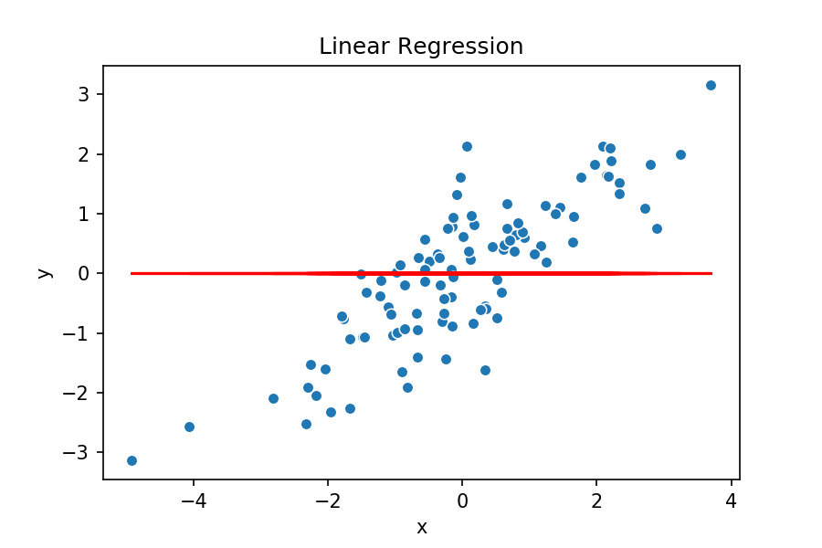
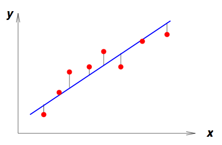
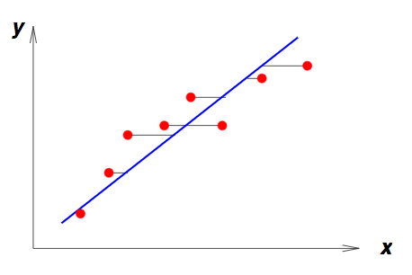

$$
% Display
\newcommand{\ds}{\displaystyle}
\newcommand{\ob}{\overbrace}
\newcommand{\ub}{\underbrace}
\newcommand{\code}{\texttt}

% Colours
\newcommand{\red}[1]{\textcolor{red}{#1}}
\newcommand{\redt}[1]{\textcolor{red}{\text{#1}}}
\newcommand{\blue}[1]{\textcolor{blue}{#1}}
\newcommand{\bluet}[1]{\textcolor{blue}{\text{#1}}}
\newcommand{\green}[1]{\textcolor{green}{#1}}
\newcommand{\greent}[1]{\textcolor{green}{\text{#1}}}

% Typefaces/Text-styles
\newcommand{\mc}{\mathcal}
\newcommand{\mf}{\mathfrak}
\newcommand{\b}{\mathbf}
\newcommand{\bs}{\boldsymbol}

% Fractions
\newcommand{\f}{\frac}

% Positioning
\newcommand{\l}{\left}
\newcommand{\m}{\middle}
\newcommand{\r}{\right}

% Logic
\newcommand{\n}{\not}
\newcommand{\eq}{\equiv}
\newcommand{\xor}{\oplus}

% Sets
\newcommand{\fa}{\forall}
\newcommand{\te}{\exists}
\newcommand{\empty}{\varnothing}
\newcommand{\set}[1]{\l\lbrace#1\r\rbrace}
\newcommand{\setb}[2]{\l\lbrace#1\ \m| \ #2\r\rbrace}
\newcommand{\bb}{\mathbb}
\newcommand{\R}{\bb{R}}
\newcommand{\N}{\bb{N}}
\newcommand{\Z}{\bb{Z}}
\newcommand{\Q}{\bb{Q}}
\newcommand{\C}{\bb{C}}

% Derivatives
\newcommand{\d}[1]{\mathrm{d}#1}
\newcommand{\deriv}[2]{\f{\d{#1}}{\d{#2}}}
\newcommand{\pderiv}[2]{\f{\partial #1}{\partial #2}}

% Sums/Integrals
\newcommand{\s}[3]{\sum_{#1}^{#2}#3}
\newcommand{\i}[4]{\int_{#1}^{#2}#3\ \d{#4}}

% Probability
\newcommand{\p}[1]{\bb{P}\l(#1\r)}
\newcommand{\cp}[2]{\p{#1\m|#2}}
\newcommand{\jp}[2]{\p{#1,#2}}
\newcommand{\e}[1]{\bb{E}\l[#1\r]}
\newcommand{\var}[1]{\text{Var}\l[#1\r]}
\newcommand{\sd}[1]{\text{SD}\l[#1\r]}
\newcommand{\cov}[2]{\text{Cov}\l[#1,#2\r]}

% Binomials
\newcommand{\ch}{\binom}
\newcommand{\pbin}[3][{}]{\l(#2 + #3\r)^#1}
\newcommand{\mbin}[3][{}]{\l(#2 - #3\r)^#1}

% Linear Algebra
\newcommand{\T}{\mathsf{T}}
\newcommand{\seq}[4][{}]{#2_{#3}#1 \ldots #1 #2_{#4}}
\newcommand{\rowv}[3]{\l(\seq[,]{#1}{#2}{#3}\r)}
\newcommand{\colv}[3]{\rowv{#1}{#2}{#3}^\T}
\newcommand{\sqpmat}[3][{}]{
    \begin{pmatrix}
		#2_{1{#1}1} & #2_{1{#1}2} & \cdots & #2_{1{#1}j} & \cdots & #2_{1{#1}#3} \\
		#2_{2{#1}1} & #2_{2{#1}2} & \cdots & #2_{2{#1}j} & \cdots & #2_{2{#1}#3} \\
		\vdots & \vdots & \ddots & \vdots & \ddots & \vdots \\
		#2_{i{#1}1} & #2_{i{#1}2} & \cdots & #2_{i{#1}j} & \cdots & #2_{i{#1}#3} \\
		\vdots & \vdots & \ddots & \vdots & \ddots & \vdots \\
		#2_{#3{#1}1} & #2_{#3{#1}2} & \cdots & #2_{#3{#1}j} & \cdots & #2_{#3{#1}#3} \\
	\end{pmatrix}
}
\newcommand{\sqmat}[3][{}]{
    \begin{matrix}
		#2_{1{#1}1} & #2_{1{#1}2} & \cdots & #2_{1{#1}j} & \cdots & #2_{1{#1}#3} \\
		#2_{2{#1}1} & #2_{2{#1}2} & \cdots & #2_{2{#1}j} & \cdots & #2_{2{#1}#3} \\
		\vdots & \vdots & \ddots & \vdots & \ddots & \vdots \\
		#2_{i{#1}1} & #2_{i{#1}2} & \cdots & #2_{i{#1}j} & \cdots & #2_{i{#1}#3} \\
		\vdots & \vdots & \ddots & \vdots & \ddots & \vdots \\
		#2_{#3{#1}1} & #2_{#3{#1}2} & \cdots & #2_{#3{#1}j} & \cdots & #2_{#3{#1}#3} \\
	\end{matrix}
}
\newcommand{\sqbmat}[3][{}]{
    \begin{bmatrix}
		#2_{1{#1}1} & #2_{1{#1}2} & \cdots & #2_{1{#1}j} & \cdots & #2_{1{#1}#3} \\
		#2_{2{#1}1} & #2_{2{#1}2} & \cdots & #2_{2{#1}j} & \cdots & #2_{2{#1}#3} \\
		\vdots & \vdots & \ddots & \vdots & \ddots & \vdots \\
		#2_{i{#1}1} & #2_{i{#1}2} & \cdots & #2_{i{#1}j} & \cdots & #2_{i{#1}#3} \\
		\vdots & \vdots & \ddots & \vdots & \ddots & \vdots \\
		#2_{#3{#1}1} & #2_{#3{#1}2} & \cdots & #2_{#3{#1}j} & \cdots & #2_{#3{#1}#3} \\
	\end{bmatrix}
}
\newcommand{\sqpmat}[3][{}]{
    \begin{pmatrix}
		#2_{1{#1}1} & #2_{1{#1}2} & \cdots & #2_{1{#1}j} & \cdots & #2_{1{#1}#3} \\
		#2_{2{#1}1} & #2_{2{#1}2} & \cdots & #2_{2{#1}j} & \cdots & #2_{2{#1}#3} \\
		\vdots & \vdots & \ddots & \vdots & \ddots & \vdots \\
		#2_{i{#1}1} & #2_{i{#1}2} & \cdots & #2_{i{#1}j} & \cdots & #2_{i{#1}#3} \\
		\vdots & \vdots & \ddots & \vdots & \ddots & \vdots \\
		#2_{#3{#1}1} & #2_{#3{#1}2} & \cdots & #2_{#3{#1}j} & \cdots & #2_{#3{#1}#3} \\
	\end{pmatrix}
}
\newcommand{\sqvmat}[3][{}]{
    \begin{vmatrix}
		#2_{1{#1}1} & #2_{1{#1}2} & \cdots & #2_{1{#1}j} & \cdots & #2_{1{#1}#3} \\
		#2_{2{#1}1} & #2_{2{#1}2} & \cdots & #2_{2{#1}j} & \cdots & #2_{2{#1}#3} \\
		\vdots & \vdots & \ddots & \vdots & \ddots & \vdots \\
		#2_{i{#1}1} & #2_{i{#1}2} & \cdots & #2_{i{#1}j} & \cdots & #2_{i{#1}#3} \\
		\vdots & \vdots & \ddots & \vdots & \ddots & \vdots \\
		#2_{#3{#1}1} & #2_{#3{#1}2} & \cdots & #2_{#3{#1}j} & \cdots & #2_{#3{#1}#3} \\
	\end{vmatrix}
}
\newcommand{\sqVmat}[3][{}]{
    \begin{Vmatrix}
		#2_{1{#1}1} & #2_{1{#1}2} & \cdots & #2_{1{#1}j} & \cdots & #2_{1{#1}#3} \\
		#2_{2{#1}1} & #2_{2{#1}2} & \cdots & #2_{2{#1}j} & \cdots & #2_{2{#1}#3} \\
		\vdots & \vdots & \ddots & \vdots & \ddots & \vdots \\
		#2_{i{#1}1} & #2_{i{#1}2} & \cdots & #2_{i{#1}j} & \cdots & #2_{i{#1}#3} \\
		\vdots & \vdots & \ddots & \vdots & \ddots & \vdots \\
		#2_{#3{#1}1} & #2_{#3{#1}2} & \cdots & #2_{#3{#1}j} & \cdots & #2_{#3{#1}#3} \\
	\end{Vmatrix}
}
$$

[TOC]

# Linear regression

**==Linear regression==** addresses the supervised learning problem of approximating the relationship between the **input variables** and **output variables** of some data.

## Training data

Training data for linear regression problems comes in the form:
$$
\mathcal{D}_\text{train}=\set{\l(\b{x}^{(i)},y^{(i)}\r)}_{i=1}^n
$$

> **Where**:
>
> - $\b{x}^{(i)}\in\R^d$, a $d$-dimensional vector of real numbers, $\b{x}^{(i)}=\colv{x^{(i)}}{1}{d}$.
> - $y_i\in\R$

This is typically represented as an $N\times D$ matrix of **==feature vectors==** $\b{X}=\l(\b{x}^{(1)^\T},\ldots,\b{x}^{(n)^\T}\r)^\T$ and a corresponding **output vector** $\b{y}=\l(y^{(1)},\ldots,y^{(n)}\r)^\T$. 

Each of the columns $\b{x}_j=\l(x_j^{(1)},\ldots,x_j^{(n)}\r)^\T$ of $\b{X}$ represents a **==feature==**, which is simply a **random variable** (sometimes called an **explanatory variable**). In practicality, these features are often specific attributes of the system or object being modeled, e.g. *height*, *rent*, *temperature*. 
$$
\begin{array}{c:cccc|c}
	\b{X} & \b{x}_1 & \b{x}_2 & \cdots & \b{x}_d & \b{y}\\
	\hdashline
	\blue{\b{x}^{(1)^\T}} & x_1^{(1)} & x_2^{(1)} & \cdots & x_d^{(1)} & y^{(1)}\\
	\blue{\b{x}^{(2)^\T}} & x_1^{(2)} & x_2^{(2)} & \cdots & x_d^{(2)} & y^{(2)}\\
	\vdots & \vdots & \vdots & \ddots & \vdots & \vdots\\
	\blue{\b{x}^{(n)^\T}} & x_1^{(n)} & x_2^{(n)} & \cdots & x_d^{(n)} & y^{(n)}\\
\end{array}
$$
The accompanying output variable $\b{y}$ contains the output for each feature vector where the output $y^{(i)}$ is assumed to be a **linear combination** of its feature values $\b{x}^{(i)}$—that is:
$$
\begin{align}
	y^{(i)}
	&=\theta_1x_1^{(i)}+\theta_2x_2^{(i)}+\cdots+\theta_dx_d^{(i)}\\
	&=\sum_{j=1}^d \theta_j x_j^{(i)}
\end{align}
$$

> **Where**: $\theta_j\in\R$ is an arbitrary coefficient, referred to as a **==weight==**.

If we let $\bs{\theta}=\colv{\theta}{1}{d}$ then we can see that the expression for $y^{(i)}$ as a sum of products, can be represented as a dot product:
$$
\begin{align}
	y^{(i)}
	&=\sum_{j=1}^d \theta_j x_j^{(i)}\\
	&=\begin{pmatrix}
		\theta_1\\
		\theta_2\\
		\vdots\\
		\theta_d
	\end{pmatrix}
	\cdot
	\begin{pmatrix}
		x_1^{(i)}\\
		x_2^{(i)}\\
		\vdots\\
		x_d^{(i)}
	\end{pmatrix}\\
	&=\bs{\theta}\cdot\b{x}^{(i)}\\
	&=\bs{\theta}^\T\b{x}^{(i)}
\end{align}
$$

>  **Where**: $\bs{\theta}$ is referred to as the **==weight vector==**.

Which further allows us to represent $\b{y}$ more concisely, as:
$$
\b{y}=\b{X}\bs{\theta}
$$
**Note**: Remember that $\bs{\theta}$ is the same for each feature vector, since it's trying to model a linear relation between the features—**not** the feature vectors!

## Learning task

Suppose we have training data $\mathcal{D}_\text{train}=\set{\l(\b{x}^{(i)},y^{(i)}\r)}_{i=1}^n$. 

Linear regression aims to learn from this data in order to create a **regression line**, $\hat{\b{y}}$. This line can then be used to estimate the value of the output variable $y^{(k)}$ for some new unlabeled feature vector $\b{x}^{(k)}$.

**Note**: The regression line is simply a $d$-dimensional hyperplane in $d$-dimensional feature space. This is often called a **line-of-best-fit**.

	</img>
	 
	

    <b>Figure 1</b>: Search for an optimal regression line in one-dimentional feature space. (<a href="https://towardsdatascience.com/linear-regression-from-scratch-977cd3a1db16">source</a>)
	

### Error functions

In order to determine which of the infinitely many regression lines have the least *error*, we need to introduce **error functions**.

An **==error function==** (also called **cost function**) for linear regression should act as a form of aggregate measure of how far the output values of the training samples are, from the values that would be predicted by the regression line—that is, for some regression line with fixed $\bs{\theta}$, how far are the predicted outputs (lying on the hyperplane) $\hat{\b{y}}=\b{X}\bs{\theta}$ from the actual output values, $\b{y}$.

The optimum regression line should have the **minimal** error—which in turn makes this a minimization problem.

#### Residuals

A **==residual==** is the error in a single result—how far an individual predicted $\hat{y}^{(i)}$ is from the actual output $y^{(i)}$.

The most commonly used residuals are **vertical-offset**, only considering the distance in the plane of the output variable.

	</img>
	</img>
	 
	

    <b>Figure 2</b>: Vertical and horizontal offset residuals. (<a href="https://www.inf.ed.ac.uk/teaching/courses/inf2b/">source</a>)
	

	</img>
	 
	

    <b>Figure 3</b>: Vertical-offset residuals in a two-dimensional feature space. (<a href="https://stackoverflow.com/questions/47344850/scatterplot3d-regression-plane-with-residuals">source</a>)
	

#### Ordinary least squares (OLS)

**==Ordinary least squares (OLS)==** is a form of regression analysis that uses the **==sum-squared error==** (or **residual sum of squares (RSS)**) function as a cost function.

Sum-squared error is simply the sum of the squared (vertical-offset) residual lengths:
$$
\begin{align}
	C(\bs{\theta})
	&=\sum_{i=1}^n\l(y^{(i)}-\hat{y}^{(i)}\r)^2\\
	&=\sum_{i=1}^n\l(y^{(i)}-\bs{\theta}^\T x^{(i)}\r)^2
\end{align}
$$

> **Note**: We square the lengths because the subtraction may result in a negative number.

Which can be represented as $\l(\b{y}-\hat{\b{y}}\r)^\T\l(\b{y}-\hat{\b{y}}\r)$ in matrix notation, giving us:
$$
C(\bs{\theta})=\l(\b{y}-\b{X}\bs{\theta}\r)^\T\l(\b{y}-\b{X}\bs{\theta}\r)
$$
Then the optimum weight vector $\hat{\bs{\theta}}$ is given by minimising this cost function:
$$
\begin{align}
	\hat{\bs{\theta}}
	&=\arg\min_{\bs{\theta}\in\bs{\Theta}}C(\bs{\theta})\\
	&=\arg\min_{\bs{\theta}\in\bs{\Theta}}\l(\b{y}-\b{X}\bs{\theta}\r)^\T\l(\b{y}-\b{X}\bs{\theta}\r)
\end{align}
$$

> **Where**: $\bs{\Theta}$ is the set of all possible weights—$\R^d$ in this case.

### Bias term

Despite there being infinitely many possible values for $\bs{\theta}$, the hyperplane is restricted to passing through the origin $\b{0}$—as there is no intercept term in $\hat{\b{y}}=\b{X}\bs{\theta}$.

This can often be a very limiting restriction, as it essentially means that the hyperplane cannot be translated on the $\b{y}$ plane. This may make it difficult to create a *good* regression line from the training data.

> **Example**: Due to the origin restriction, it is not possible to create an optimal regression line for the following collection of one-dimensional feature vectors.
>
> 

>   

>     <figure style="text-align:center;margin:0 5px;">
>   		</img>
>     	<figcaption>y=1.1x</figcaption>
>   	</figure>
> 		<figure style="text-align:center;margin:0 5px;">
>       </img>
> 		 <figcaption>y=1.5x</figcaption>
> 		</figure>
> 		<figure style="text-align:center;margin:0 5px;">
>       </img>
> 	    <figcaption>y=2x</figcaption>
> 		</figure>
> 	

> 	 
> 	

>     <b>Figure 4</b>: Sub-optimal origin-restricted regression lines for one-dimensional feature vectors.
> 	

> 

If an intercept term $\theta_0$ (called a **==bias==**) is incorporated into the regression line $\hat{\b{y}}=\b{X}\bs{\theta}+\theta_0$, it becomes possible for the regression line to move around in space more freely.

In practicality, we will usually want a bias for our linear model anyway.

> **Example**: If we are modelling the prediction the price of a house, $y^{(i)}$, with explanatory variables valued at $x_1^{(i)},\ldots,x_d^{(i)}$, we don't want the house price to be $0$ when all of the explanatory variables are valued at $0$. 
>
> For example, when the explanatory variables are all zero, we want the default house price will be $\$1000$. The bias term allows us to capture this information by defining the value of the regression line when the explanatory variables are all zero—in other words, the point of intercept with the $\b{y}$ axis.

  

    <figure style="text-align:center;margin-bottom:0;margin-top:0px;">
  		</img>
    	<figcaption>y=0.6x+4</figcaption>
  	</figure>
	

	 
	

    <b>Figure 5</b>: A better-fitting regression line as a result of the bias term.
	

### Design matrix

In order for the bias term introduced above to be consistent with the previous linear algebra, a few changes need to be made to the representations of matrices and vectors, to ensure that dot products to remain well-defined.

With the introduction of the bias term $\theta_0$, an individual training example can be represented linearly as:
$$
\begin{align}
	y^{(i)}
	&=\blue{\theta_0}+\theta_1x_1^{(i)}+\theta_2x_2^{(i)}+\cdots+\theta_dx_d^{(i)}\\
	&=\blue{\theta_0}+\sum_{j=1}^d \theta_j x_j^{(i)}
\end{align}
$$
Prior to the introduction of the bias term, we could express this as a dot product. However, the $\theta_0$ term in the expression above is **no longer** attached to the value of any explanatory variable $x_{j}^{(i)}$.

We can address this issue by extending the feature vector $\b{x}^{(i)}$ to have $1$ as it's first element, $x_0^{(i)}$. Let this new vector be $\phi \! \l(\b{x}^{(i)}\r)$:
$$
\bs{\phi} \! \l(\b{x}^{(i)}\r)=\underbrace{\l(1,x_1^{(i)},\ldots,x_d^{(i)}\r)^\T}_{d+1}
$$
If we express $y^{(i)}$ as a linear combination of the explanatory variables as defined in $\bs{\phi} \! \l(\b{x}^{(i)}\r)$, we can now say:
$$
\begin{align}
	y^{(i)}
	&=\blue{\theta_0}+\theta_1x_1^{(i)}+\theta_2x_2^{(i)}+\cdots+\theta_dx_d^{(i)}\\
	&=\blue{\theta_0\cdot 1}+\theta_1x_1^{(i)}+\theta_2x_2^{(i)}+\cdots+\theta_dx_d^{(i)}\\
	&=\blue{\theta_0x_0^{(i)}}+\theta_1x_1^{(i)}+\theta_2x_2^{(i)}+\cdots+\theta_dx_d^{(i)}\\
	&=\sum_{j=0}^d \theta_j x_j^{(i)}
\end{align}
$$
Further if we treat the bias term $\theta_0$ as an extension of the weight vector $\bs{\theta}$, so that $\bs{\theta}=\underbrace{\colv{\theta}{0}{d}}_{d+1}$ we can express this as a dot product:
$$
\begin{align}
	y^{(i)}
	&=\sum_{j=0}^d \theta_j x_j^{(i)}\\
	&=\begin{pmatrix}
		\theta_0\\
		\theta_1\\
		\vdots\\
		\theta_d
	\end{pmatrix}
	\cdot
	\begin{pmatrix}
		x_0^{(i)}\\
		x_1^{(i)}\\
		\vdots\\
		x_d^{(i)}
	\end{pmatrix}\\
	&=\bs{\theta}^\T\bs{\phi} \! \l(\b{x}^{(i)}\r)
\end{align}
$$
The modified feature vectors $\bs{\phi} \! \l(\b{x}^{(i)}\r)$ can be represented by a new matrix—known as the **==design matrix==**, $\bs{\Phi}$:
$$
\begin{array}{c:ccccc|c}
	\bs{\Phi} & \b{x}_0 & \b{x}_1 & \b{x}_2 & \cdots & \b{x}_d & \b{y}\\
	\hdashline
	\blue{\bs{\phi}\l(\b{x}^{(1)}\r)^\T} & 1 & x_1^{(1)} & x_2^{(1)} & \cdots & x_d^{(1)} & y^{(1)}\\
	\blue{\bs{\phi}\l(\b{x}^{(2)}\r)^\T} &  1& x_1^{(2)} & x_2^{(2)} & \cdots & x_d^{(2)} & y^{(2)}\\
	\vdots & \vdots & \vdots & \vdots & \ddots & \vdots & \vdots\\
	\blue{\bs{\phi}\l(\b{x}^{(n)}\r)^\T} & 1 & x_1^{(n)} & x_2^{(n)} & \cdots & x_d^{(n)} & y^{(n)}\\
\end{array}
$$
Using the previous result along with matrix algebra, we can represent the output vector $\b{y}$ as:
$$
\b{y}=\bs{\Phi}\bs{\theta}
$$

#### Solving the OLS problem (with the design matrix)

We previously saw that the optimal $\hat{\bs{\theta}}$ with no bias term is given by solving the following minimization problem for OLS:
$$
\begin{align}
	\hat{\bs{\theta}}
	&=\arg\min_{\bs{\theta}\in\bs{\Theta}}C(\bs{\theta})\\
	&=\arg\min_{\bs{\theta}\in\bs{\Theta}}\l(\b{y}-\b{X}\bs{\theta}\r)^\T\l(\b{y}-\b{X}\bs{\theta}\r)
\end{align}
$$
By extending $\bs{\theta}$ with the bias term $\theta_0$ and using the design matrix $\bs{\Phi}$ instead of $\b{X}$, this becomes:
$$
\begin{align}
	\hat{\bs{\theta}}
	&=\arg\min_{\bs{\theta}\in\bs{\Theta}}C(\bs{\theta})\\
	&=\arg\min_{\bs{\theta}\in\bs{\Theta}}\l(\b{y}-\bs{\Phi}\bs{\theta}\r)^\T\l(\b{y}-\bs{\Phi}\bs{\theta}\r)
\end{align}
$$
Minimization for OLS has a **closed-form (analytical) solution** which can be derived by taking partial derivatives with respect to $\bs{\theta}$ and setting them to $0$. This leads to the following analytical solution for the optimal weight vector $\hat{\bs{\theta}}$:
$$
\hat{\bs{\theta}}=\underbrace{\l(\bs{\Phi}^\T\bs{\Phi}\r)^{-1}\bs{\Phi}^\T}_\redt{pseudo-inverse}\b{y}
$$

> **Where**: $\l(\bs{\Phi}^\T\bs{\Phi}\r)^{-1}\bs{\Phi}^\T$ is referred to as the **==pseudo-inverse==** of $\bs{\Phi}$. 
>
> This is not the actual inverse matrix since $\bs{\Phi}$ is **not invertible** as it is not square, since it has shape $N\times (D+1)$.

**Note**: Although OLS has an analytical solution, it is also possible to use other iterative optimization methods such as **gradient descent**, **stochastic gradient descent**, **BFGS**, etc. to minimize the cost function. However, these methods are **not** guaranteed to converge or find a global minimum.

## Regularization

**==Regularization==** refers to various methods used to penalize specific terms in a cost function in order to prevent overfitting to the training data. This is done by adding a **regularization term** (also called a **regularizer**). 

Regularization discourages or decreases the complexity of a linear model.

	</img>
	 
	

    <b>Figure 6</b>: Simplification of a polynomial regression model's <em>complexity</em> as a result of regularization. <em>Blue represents the unregularized and overfitted model, and green represents a regularized model which generalizes better.</em> (<a href="https://en.wikipedia.org/wiki/Regularization_(mathematics)">source</a>)
	

For least squares problems, the regularized cost function looks like:
$$
C(\bs{\theta})=\sum_{i=1}^n\l(y^{(i)}-\bs{\theta}^\T x^{(i)}\r)^2+\lambda\underbrace{\blue{R(\bs{\theta})}}_\text{reg. term}
$$

> **Where**: 
>
> - $\lambda$ is a **==tuning parameter==** that controls the importance of the regularization term—higher $\lambda$ leads to more penalization. This parameter is selected through cross-validation.
> - $R(\bs{\theta})$ is a regularization term chosen to penalize coefficients by a specific quantity—shrinking them towards zero.

Regularization essentially forces the minimization of a cost function within the constraints of the provided regularization term.

 <figure style="text-align:center;margin-bottom:0;margin-top:0px;">
		</img>
 	<figcaption>Unregularized OLS cost function minimization</figcaption>
	</figure>
		<figure style="text-align:center;margin-bottom:0;margin-top:0px;">
   </img>
		 <figcaption>Regularized OLS cost function minimization</figcaption>
		</figure>
	

	 
	

    <b>Figure 7</b>: Graphical depiction of the constraint placed on the minimization of the RSS cost function as a result of L2 regularization in a two-dimensional feature space. <em>This constraint is in place due to the fact that we now have to minimize a combined sum of the RSS and regularization term. To solve this minimization problem we must get as close to the minimum of the RSS contour, whilst still remaining in the constrained region imposed by the regularization term (the circle in this case, but n-sphere in general).</em> (<a href="https://sebastianraschka.com/faq/docs/regularized-logistic-regression-performance.html">source</a>)
	

### $L_1$ and $L_2$ regularized least squares problems

Regularization terms in the form of the $L_1$ (Manhattan) and $L_2$ (Euclidean) **norms** are commonly used for linear regression—these norms form the basis for **==$L_1$ and $L_2$ regularization==**. 

The table below provides information about both of these regularization methods when used to solve least squares problems:

|                                                              |                            $L_1$                             |                            $L_2$                             |
| ------------------------------------------------------------ | :----------------------------------------------------------: | :----------------------------------------------------------: |
| **Name**                                                     |                            Lasso                             |                            Ridge                             |
| **Regularization term** — $R(\bs{\theta})$ _**Note**: Observe that we don't penalize the bias term, $\theta_0$._ | $\sum_{i=1}^n \blue{|\theta_i|}$ (or $||\bs{\theta}||_1$ — the $L_1$ norm) | $\sum_{i=1}^n \blue{\theta_i^2}$ (or $||\bs{\theta}||_2^2$ — the squared $L_2$ norm) |
| **Regularized least squares** — $C(\bs{\theta})$             | $\sum_{i=1}^n\l(y^{(i)}-\bs{\theta}^\T x^{(i)}\r)^2+\lambda\sum_{i=1}^n |\theta_i|$ | $\sum_{i=1}^n\l(y^{(i)}-\bs{\theta}^\T x^{(i)}\r)^2+\lambda\sum_{i=1}^n \theta_i^2$ |
| **Analytic solution**                                        |           None—use iterative optimization methods.           | $\hat{\bs{\theta}}=\l(\bs{\Phi}^\T\bs{\Phi}+\lambda \b{I}\r)^{-1}\bs{\Phi}^\T\b{y}$ |
| **Affected weights**                                         |                    All weights—uniformly.                    | All weights—but low valued weights will be penalized less since we are squaring. Conversely, large weights will face more penalty. |
| **When to use**                                              | When there are many features which are irrelevant to the output variable—since it **can** shrink them to zero, completely disregarding them. Also works well when $n\gg d$ (number of instances is far greater than the number of features). | When all (or most) features are relevant to the output variable—since it can **not** shrink them to zero, meaning that all features will have **some** impact. Also works better when there is high collinearity between features. |
| **Constraint region visualization** **Note**: Regularization constraint region is depicted in red, RSS contour is depicted in blue. |        |        |

### Elastic net regularization

**==Elastic net==** is a compromise regularization method that involves the usage of a regularization term which linearly combines the $L_1$ and $L_2$ norms of the weights, using two tuning parameters, $\lambda_1$ and $\lambda_2$. 

The elastic net regularized cost function for least squares problems is given as:
$$
C(\bs{\theta})=\underbrace{\sum_{i=1}^n\l(y^{(i)}-\bs{\theta}^\T x^{(i)}\r)^2}_\text{RSS}+\underbrace{\lambda_1\sum_{i=1}^n |\theta_i|}_{L_1}+\underbrace{\lambda_2\sum_{i=1}^n \theta_i^2}_{L_2}
$$

#### Comparison with standalone $L_1$ and $L_2$ regularization

This form of regularization is often used to counteract the limitations of the $L_1$ and $L_2$ penalties.

- With highly-correlated features:

  - $L_1$ regularization generally picks one and effectively discards the others by setting their weights to zero. However, it is often difficult to determine which feature was chosen.
  - $L_2$ regularization shrinks the weights of highly-correlated features towards one another.

  Elastic net is a compromise between the two that attempts to shrink and do a **sparse selection** simultaneously.

- In regards to penalty:

  - $L_1$ regularization penalizes weights more uniformly.
  - $L_2$ regularization penalizes higher-valued weights more than the smaller ones.

  Once again, elastic net acts as a compromise between this property of the two regularization methods.

## Basis functions

The main requirement for a linear regression model is that the weights must be linear. However, it is not necessary that the explanatory variables are  linear—they can be defined by any non-linear function of the explanatory variables too.

This allows us to more generally define a linear model as:
$$
\begin{align}
	y^{(i)}
	&=\theta_0 \phi_0 \! \l(x_0^{(i)}\r)
	+\theta_1 \phi_1 \! \l(x_1^{(i)}\r)
	+\theta_2 \phi_2 \! \l(x_2^{(i)}\r)
	+\cdots
	+\theta_d \phi_d \! \l(x_d^{(i)}\r)\\
	&=\sum_{j=0}^d \theta_j \phi_j \! \l(x_j^{(i)}\r)\\
	&=\bs{\theta}^\T \bs{\phi} \! \l(\b{x}^{(i)}\r)
\end{align}
$$

> **Where**:
>
> - Each $\phi_j$ is called a **==basis function==**, which is a function of the current input $\b{x}^{(i)}$.
> - $\bs{\phi}$ is a vector-valued function such that $\bs{\phi} \! \l(\b{x}^{(i)}\r)=\Big(\phi_0 \! \l(\b{x}^{(i)}\r),\ldots,\phi_d \! \l(\b{x}^{(i)}\r) \Big)^\T$.
> - $\phi_0 \! \l(\b{x}^{(i)}\r)=1$ by convention—so that the bias term is not affected by the basis function.

### The identity basis function

The most simple case of a linear regression model that we have seen before is where the output variable may be modeled as:
$$
y^{(i)}=\theta_0+\theta_1x_1^{(i)}+\theta_2x_2^{(i)}+\cdots+\theta_dx_d^{(i)}
$$
This regression model can be defined by the identity basis function:
$$
\begin{align}
	\bs{\phi} \! \l(\b{x}^{(i)}\r)
	&=\b{x}^{(i)}\\
	&=\l(1,x_1^{(i)},\ldots,x_d^{(i)}\r)^\T
\end{align}
$$

> **Where**: The individual basis functions would be $\phi_j \! \l(\b{x}^{(i)}\r)=x_j^{(i)}$—a function only of the feature with the same index as the basis function.

This is more clearly seen by looking at the design matrix $\bs{\Phi}$ of this basis function when applied to the training set $\mathcal{D}_\text{train}$:
$$
\begin{array}{c:ccccc|c}
	\bs{\Phi} & \b{x}_0 & \b{x}_1 & \b{x}_2 & \cdots & \b{x}_d & \b{y}\\
	\hdashline
	\blue{\bs{\phi}\l(\b{x}^{(1)}\r)^\T} & \phi_0 \! \l(\b{x}^{(1)}\r) & \phi_1 \! \l(\b{x}^{(1)}\r) & \phi_2 \! \l(\b{x}^{(1)}\r) & \cdots & \phi_d \! \l(\b{x}^{(1)}\r) & y^{(1)}\\
	\blue{\bs{\phi}\l(\b{x}^{(2)}\r)^\T} & \phi_0 \! \l(\b{x}^{(2)}\r) & \phi_1 \! \l(\b{x}^{(2)}\r) & \phi_2 \! \l(\b{x}^{(2)}\r) & \cdots & \phi_d \! \l(\b{x}^{(2)}\r) & y^{(2)}\\
	\vdots & \vdots & \vdots & \vdots & \ddots & \vdots & \vdots\\
	\blue{\bs{\phi}\l(\b{x}^{(n)}\r)^\T} & \phi_0 \! \l(\b{x}^{(n)}\r) & \phi_1 \! \l(\b{x}^{(n)}\r) & \phi_2 \! \l(\b{x}^{(n)}\r) & \cdots & \phi_d \! \l(\b{x}^{(n)}\r) & y^{(n)}\\
\end{array}

\quad
=
\quad

\begin{array}{c:ccccc|c}
	\bs{\Phi} & \b{x}_0 & \b{x}_1 & \b{x}_2 & \cdots & \b{x}_d & \b{y}\\
	\hdashline
	\blue{\bs{\phi}\l(\b{x}^{(1)}\r)^\T} & 1 & x_1^{(1)} & x_2^{(1)} & \cdots & x_d^{(1)} & y^{(1)}\\
	\blue{\bs{\phi}\l(\b{x}^{(2)}\r)^\T} &  1& x_1^{(2)} & x_2^{(2)} & \cdots & x_d^{(2)} & y^{(2)}\\
	\vdots & \vdots & \vdots & \vdots & \ddots & \vdots & \vdots\\
	\blue{\bs{\phi}\l(\b{x}^{(n)}\r)^\T} & 1 & x_1^{(n)} & x_2^{(n)} & \cdots & x_d^{(n)} & y^{(n)}\\
\end{array}
$$

### Polynomial regression

Standard linear regression with the identity basis function is powerful for modelling an output variable $y^{(i)}$ which is assumed to be linearly dependent upon the explanatory variables $x_j^{(i)}$.

However, it is not always the case that the explanatory variables have a linear relationship with the output variable. 

	</img>
	 
	

    <b>Figure 8</b>: Example of a relationship that cannot accurately be modeled with a hyperplane. <em>This data would be more accurately represented with a polynomial regression model.</em> (<a href="https://towardsdatascience.com/introduction-to-linear-regression-and-polynomial-regression-f8adc96f31cb">source</a>)
	

In this case, it may be more appropriate to assume a different relationship, such as a polynomial one. The output variable can be modeled as a $d$-degree polynomial—a linear combination of the **monomials** of each feature:
$$
y^{(i)}=\theta_0+\theta_1x_1^{(i)}+\theta_2\l(x_2^{(i)}\r)^2+\cdots+\theta_d\l(x_d^{(i)}\r)^d
$$
Which can be defined with the following basis function:
$$
\bs{\phi} \l(\b{x}^{(i)}\r)=\l(1,x_1^{(i)}, \l(x_2^{(i)}\r)^2, \ldots, \l(x_d^{(i)}\r)^d\r)^\T
$$

### Multivariate basis functions

Despite the identity and polynomial basis functions $\phi_j \! \l(\b{x}^{(i)}\r)$ only operating on the $j^\text{th}$ feature, $x_j^{(i)}$, this isn't a strict requirement of basis functions—remember that each basis function $\phi_j$ is a function of the entire feature vector $\b{x}^{(i)}$, and can therefore be dependent upon the values of other features. This brings rise to what are known as **==multivariate basis functions==**.

> **Example**: A basis function with multivariate inputs.
> $$
> \bs{\phi}\l(\b{x}^{(i)}\r)^\T=1+x_1^{(i)}+x_2^{(i)}+x_3^{(i)}+x_1^{(i)}x_2^{(i)}+x_1^{(i)}x_3^{(i)}+x_2^{(i)}x_3^{(i)}+\l(x_1^{(i)}\r)^2+\cdots
> $$

# Resources

- *Iain Murray (School of Informatics, University of Edinburgh)* [Machine Learning and Pattern Recognition: Linear Regression](https://www.inf.ed.ac.uk/teaching/courses/mlpr/2018/notes/w1b_linear_regression.html)
- *Nigel Goddard (School of Informatics, University of Edinburgh)* [Introductory Applied Machine Learning: Linear Regression - Solving for Model Parameters](https://www.learn.ed.ac.uk/bbcswebdav/pid-3412542-dt-content-rid-6699350_1/xid-6699350_1)
- *Hiroshi Shimodaira, Iain Murray, Steve Renals (School of Informatics, University of Edinburgh)* [Algorithms, Data Structures and Learning: Introduction to statistical pattern recognition and optimization](https://www.inf.ed.ac.uk/teaching/courses/inf2b/learnSlides/inf2b-learnlec05-full.pdf)
- *Gordon Ross (School of Mathematics, University of Edinburgh)* [Statistical Learning: Nonlinearity and Dimensionality Reduction](http://www.drps.ed.ac.uk/19-20/dpt/cxmath10094.htm)
- *Nguyen (StackOverflow)* [Role of the bias term in linear regression](https://stats.stackexchange.com/a/286849)
- Wikipedia [Residual sum of squares](https://en.wikipedia.org/wiki/Residual_sum_of_squares) [Regularization (mathematics)](https://en.wikipedia.org/wiki/Regularization_(mathematics)) [Norm (mathematics)](https://en.wikipedia.org/wiki/Norm_(mathematics)) [Taxicab geometry](https://en.wikipedia.org/wiki/Taxicab_geometry) [Elastic net regularization](https://en.wikipedia.org/wiki/Elastic_net_regularization)
- *Renu Khandelwal (Medium)* [$L_1$ and $L_2$ Regularization](https://medium.com/datadriveninvestor/l1-l2-regularization-7f1b4fe948f2)
- *Jae Duk Seo (Towards Data Science)* [Only Numpy: Implementing different combinations of $L_1$/$L_2$ norm/regularization](https://towardsdatascience.com/only-numpy-implementing-different-combination-of-l1-norm-l2-norm-l1-regularization-and-14b01a9773b)
- *Stephanie (Statistics How To)* [Tuning Parameter / Penalty Parameter](https://www.statisticshowto.datasciencecentral.com/tuning-parameter/)
- *Sebastian Raschka* [Does regularization in logistic regression always results in better fit and better generalization?](https://sebastianraschka.com/faq/docs/regularized-logistic-regression-performance.html)
- *Sebastian Raschka (Mlxtend)* [Regularization of Generalized Linear Models](http://rasbt.github.io/mlxtend/user_guide/general_concepts/regularization-linear/)
- *balaks (StackOverflow)* [Ridge, lasso and elastic net](https://stats.stackexchange.com/questions/93181/ridge-lasso-and-elastic-net)
- *Martin Krasser* [Bayesian regression with linear basis function models](http://krasserm.github.io/2019/02/23/bayesian-linear-regression/)
- *Ayush Pant (Towards Data Science)* [Introduction to Linear Regression and Polynomial Regression](https://towardsdatascience.com/introduction-to-linear-regression-and-polynomial-regression-f8adc96f31cb)
- *Ignacio P. Pozuelo (StackOverflow)* [Lasso or Ridge for correlated variables](https://stackoverflow.com/questions/42904211/lasso-or-ridge-for-correlated-variables)