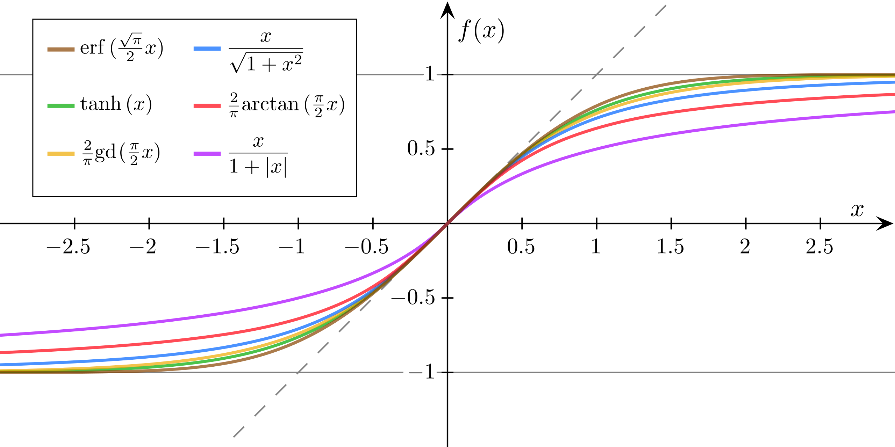
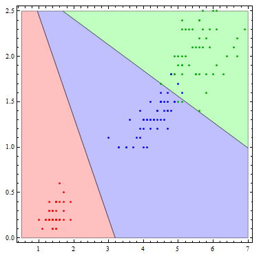

$$
% Display
\newcommand{\ds}{\displaystyle}
\newcommand{\ob}{\overbrace}
\newcommand{\ub}{\underbrace}
\newcommand{\code}{\texttt}

% Colours
\newcommand{\red}[1]{\textcolor{red}{#1}}
\newcommand{\redt}[1]{\textcolor{red}{\text{#1}}}
\newcommand{\blue}[1]{\textcolor{blue}{#1}}
\newcommand{\bluet}[1]{\textcolor{blue}{\text{#1}}}
\newcommand{\green}[1]{\textcolor{green}{#1}}
\newcommand{\greent}[1]{\textcolor{green}{\text{#1}}}

% Typefaces/Text-styles
\newcommand{\mc}{\mathcal}
\newcommand{\mf}{\mathfrak}
\newcommand{\b}{\mathbf}
\newcommand{\bs}{\boldsymbol}

% Fractions
\newcommand{\f}{\frac}

% Positioning
\newcommand{\l}{\left}
\newcommand{\m}{\middle}
\newcommand{\r}{\right}

% Logic
\newcommand{\n}{\not}
\newcommand{\eq}{\equiv}
\newcommand{\xor}{\oplus}

% Sets
\newcommand{\fa}{\forall}
\newcommand{\te}{\exists}
\newcommand{\empty}{\varnothing}
\newcommand{\set}[1]{\l\lbrace#1\r\rbrace}
\newcommand{\setb}[2]{\l\lbrace#1\ \m| \ #2\r\rbrace}
\newcommand{\bb}{\mathbb}
\newcommand{\R}{\bb{R}}
\newcommand{\N}{\bb{N}}
\newcommand{\Z}{\bb{Z}}
\newcommand{\Q}{\bb{Q}}
\newcommand{\C}{\bb{C}}

% Derivatives
\newcommand{\d}[1]{\mathrm{d}#1}
\newcommand{\deriv}[2]{\f{\d{#1}}{\d{#2}}}
\newcommand{\pderiv}[2]{\f{\partial #1}{\partial #2}}

% Sums/Integrals
\newcommand{\s}[3]{\sum_{#1}^{#2}#3}
\newcommand{\i}[4]{\int_{#1}^{#2}#3\ \d{#4}}

% Probability
\newcommand{\p}[1]{\bb{P}\l(#1\r)}
\newcommand{\cp}[2]{\p{#1\m|#2}}
\newcommand{\jp}[2]{\p{#1,#2}}
\newcommand{\e}[1]{\bb{E}\l[#1\r]}
\newcommand{\var}[1]{\text{Var}\l[#1\r]}
\newcommand{\sd}[1]{\text{SD}\l[#1\r]}
\newcommand{\cov}[2]{\text{Cov}\l[#1,#2\r]}

% Binomials
\newcommand{\ch}{\binom}
\newcommand{\pbin}[3][{}]{\l(#2 + #3\r)^#1}
\newcommand{\mbin}[3][{}]{\l(#2 - #3\r)^#1}

% Linear Algebra
\newcommand{\T}{\mathsf{T}}
\newcommand{\seq}[4][{}]{#2_{#3}#1 \ldots #1 #2_{#4}}
\newcommand{\rowv}[3]{\l(\seq[,]{#1}{#2}{#3}\r)}
\newcommand{\colv}[3]{\rowv{#1}{#2}{#3}^\T}
\newcommand{\sqpmat}[3][{}]{
    \begin{pmatrix}
		#2_{1{#1}1} & #2_{1{#1}2} & \cdots & #2_{1{#1}j} & \cdots & #2_{1{#1}#3} \\
		#2_{2{#1}1} & #2_{2{#1}2} & \cdots & #2_{2{#1}j} & \cdots & #2_{2{#1}#3} \\
		\vdots & \vdots & \ddots & \vdots & \ddots & \vdots \\
		#2_{i{#1}1} & #2_{i{#1}2} & \cdots & #2_{i{#1}j} & \cdots & #2_{i{#1}#3} \\
		\vdots & \vdots & \ddots & \vdots & \ddots & \vdots \\
		#2_{#3{#1}1} & #2_{#3{#1}2} & \cdots & #2_{#3{#1}j} & \cdots & #2_{#3{#1}#3} \\
	\end{pmatrix}
}
\newcommand{\sqmat}[3][{}]{
    \begin{matrix}
		#2_{1{#1}1} & #2_{1{#1}2} & \cdots & #2_{1{#1}j} & \cdots & #2_{1{#1}#3} \\
		#2_{2{#1}1} & #2_{2{#1}2} & \cdots & #2_{2{#1}j} & \cdots & #2_{2{#1}#3} \\
		\vdots & \vdots & \ddots & \vdots & \ddots & \vdots \\
		#2_{i{#1}1} & #2_{i{#1}2} & \cdots & #2_{i{#1}j} & \cdots & #2_{i{#1}#3} \\
		\vdots & \vdots & \ddots & \vdots & \ddots & \vdots \\
		#2_{#3{#1}1} & #2_{#3{#1}2} & \cdots & #2_{#3{#1}j} & \cdots & #2_{#3{#1}#3} \\
	\end{matrix}
}
\newcommand{\sqbmat}[3][{}]{
    \begin{bmatrix}
		#2_{1{#1}1} & #2_{1{#1}2} & \cdots & #2_{1{#1}j} & \cdots & #2_{1{#1}#3} \\
		#2_{2{#1}1} & #2_{2{#1}2} & \cdots & #2_{2{#1}j} & \cdots & #2_{2{#1}#3} \\
		\vdots & \vdots & \ddots & \vdots & \ddots & \vdots \\
		#2_{i{#1}1} & #2_{i{#1}2} & \cdots & #2_{i{#1}j} & \cdots & #2_{i{#1}#3} \\
		\vdots & \vdots & \ddots & \vdots & \ddots & \vdots \\
		#2_{#3{#1}1} & #2_{#3{#1}2} & \cdots & #2_{#3{#1}j} & \cdots & #2_{#3{#1}#3} \\
	\end{bmatrix}
}
\newcommand{\sqpmat}[3][{}]{
    \begin{pmatrix}
		#2_{1{#1}1} & #2_{1{#1}2} & \cdots & #2_{1{#1}j} & \cdots & #2_{1{#1}#3} \\
		#2_{2{#1}1} & #2_{2{#1}2} & \cdots & #2_{2{#1}j} & \cdots & #2_{2{#1}#3} \\
		\vdots & \vdots & \ddots & \vdots & \ddots & \vdots \\
		#2_{i{#1}1} & #2_{i{#1}2} & \cdots & #2_{i{#1}j} & \cdots & #2_{i{#1}#3} \\
		\vdots & \vdots & \ddots & \vdots & \ddots & \vdots \\
		#2_{#3{#1}1} & #2_{#3{#1}2} & \cdots & #2_{#3{#1}j} & \cdots & #2_{#3{#1}#3} \\
	\end{pmatrix}
}
\newcommand{\sqvmat}[3][{}]{
    \begin{vmatrix}
		#2_{1{#1}1} & #2_{1{#1}2} & \cdots & #2_{1{#1}j} & \cdots & #2_{1{#1}#3} \\
		#2_{2{#1}1} & #2_{2{#1}2} & \cdots & #2_{2{#1}j} & \cdots & #2_{2{#1}#3} \\
		\vdots & \vdots & \ddots & \vdots & \ddots & \vdots \\
		#2_{i{#1}1} & #2_{i{#1}2} & \cdots & #2_{i{#1}j} & \cdots & #2_{i{#1}#3} \\
		\vdots & \vdots & \ddots & \vdots & \ddots & \vdots \\
		#2_{#3{#1}1} & #2_{#3{#1}2} & \cdots & #2_{#3{#1}j} & \cdots & #2_{#3{#1}#3} \\
	\end{vmatrix}
}
\newcommand{\sqVmat}[3][{}]{
    \begin{Vmatrix}
		#2_{1{#1}1} & #2_{1{#1}2} & \cdots & #2_{1{#1}j} & \cdots & #2_{1{#1}#3} \\
		#2_{2{#1}1} & #2_{2{#1}2} & \cdots & #2_{2{#1}j} & \cdots & #2_{2{#1}#3} \\
		\vdots & \vdots & \ddots & \vdots & \ddots & \vdots \\
		#2_{i{#1}1} & #2_{i{#1}2} & \cdots & #2_{i{#1}j} & \cdots & #2_{i{#1}#3} \\
		\vdots & \vdots & \ddots & \vdots & \ddots & \vdots \\
		#2_{#3{#1}1} & #2_{#3{#1}2} & \cdots & #2_{#3{#1}j} & \cdots & #2_{#3{#1}#3} \\
	\end{Vmatrix}
}
$$

[TOC]

# Logistic regression

Despite sharing a few similarities with linear regression, **==logistic regression==** is actually a **classification** method, where we train a model that will predict the value for a **discrete-valued** output variable, unlike the real-valued output that a linear model is trained to predict.

There are two types of logistic regression: **binomial** and **multinomial**. These terms refer to the nature of the output variable.

## Binomial logistic regression

In **==binomial logistic regression==**, the output can be modeled as a binomial variable. Our training data in this case looks like:
$$
\mathcal{D}_\text{train}=\set{\l(\b{x}^{(i)},y^{(i)}\r)}_{i=1}^N
$$

> **Where**:
>
> - $\b{x}^{(i)}\in\R^D$, a $(D+1)$-dimensional vector of real numbers, $\b{x}^{(i)}=\colv{1,x^{(i)}}{1}{D}$. **Note**: In the *Linear Regression* notes, $\b{x}^{(i)}$ represented the original unextended feature vector without the additional $1$. In logistic regression, this vector includes the $1$ by convention. The same applies for the weight vector $\bs{\theta}$ (additional bias term $\theta_0$) that we will see later.  However, it is still possible to apply a vector of basis functions $\bs{\phi}$ to this vector if you wish.
> - $y^{(i)}\in\set{0,1}$

As explained in the *Linear Regression* notes, this can be represented as an $N\times D$ matrix of **==feature vectors==** $\b{X}=\l(\b{x}^{(1)^\T},\ldots,\b{x}^{(N)^\T}\r)^\T$ and a corresponding **output vector** $\b{y}=\l(y^{(1)},\ldots,y^{(N)}\r)^\T$.

Each of the columns $\b{x}_j=\l(x_j^{(1)},\ldots,x_j^{(N)}\r)^\T$ of $\b{X}$ represents a **==feature==**, which is simply a **random variable** (sometimes called an **explanatory variable**).
$$
\begin{array}{c:ccccc|c}
	\b{X} & \b{x}_0 & \b{x}_1 & \b{x}_2 & \cdots & \b{x}_D & \b{y}\\
	\hdashline
	\blue{\b{x}^{(1)^\T}} & x_0^{(1)} & x_1^{(1)} & x_2^{(1)} & \cdots & x_D^{(1)} & y^{(1)}\\
	\blue{\b{x}^{(2)^\T}} & x_0^{(2)} & x_1^{(2)} & x_2^{(2)} & \cdots & x_D^{(2)} & y^{(2)}\\
	\vdots & \vdots & \vdots & \vdots & \ddots & \vdots & \vdots\\
	\blue{\b{x}^{(N)^\T}} & x_0^{(N)} & x_1^{(N)} & x_2^{(N)} & \cdots & x_D^{(N)} & y^{(N)}\\
\end{array}
$$
The accompanying output variable $\b{y}$ contains the output for each feature vector.

> In linear regression, the output $y^{(i)}$ is assumed to be a **linear combination** of its feature values $\b{x}^{(i)}$—that is:
> $$
> \begin{align}
> 	y^{(i)}
> 	&=\theta_0x_0^{(i)}+\theta_1x_1^{(i)}+\theta_2x_2^{(i)}+\cdots+\theta_Dx_D^{(i)}\\
> 	&=\sum_{j=0}^D \theta_j x_j^{(i)}\\
> 	&=\bs{\theta}^\T\b{x}^{(i)}
> \end{align}
> $$
> **Where**: 
>
> - $\theta_j\in\R$ is an arbitrary coefficient, referred to as a **==weight==**.
> - $\bs{\theta}=\colv{\theta}{0}{D}$ is a **==weight vector==**.

However, modeling the output as a linear combination of the feature values won't work for logistic regression, as the output needs to be discrete ($0$ or $1$). 

One way to ensure an output fits these constraints is to transform the real-valued $\bs{\theta}^\T\b{x}^{(i)}$ with some function $\sigma$, referred to as a **sigmoid function**.

### Sigmoid functions

A **==sigmoid function==** is a function with the domain of all real numbers, that returns a **monotonically increasing** value ranging from $0$ to $1$—that is:
$$
\sigma : \R \to (0,1) \qquad \text{s.t.} \quad \fa (x,y) \in \R^2,\  x\leq y \implies \sigma(x)\leq\sigma(y)
$$
There are many functions that satisfy these conditions:

	</img>
	 
	

    <b>Figure 1</b>: A collection of sigmoid functions. <em><b>Note</b>: Despite these sigmoids having a range of (-1,1), they can be transformed to (0,1).</em> (<a href="https://en.wikipedia.org/wiki/Sigmoid_function">source</a>)
	

However, the most commonly used sigmoid function for logistic regression is the appropriately named **logistic function**.

#### Logistic function

The **==logistic function==** is a sigmoid function that is used in logistic regression to transform the real-valued $\bs{\theta}^\T\b{x}^{(i)}$ into a value in the $(0,1)$ interval. This function is denoted $\sigma$, and is defined as:
$$
\sigma(x)=\frac{1}{1+e^{-x}}
$$

	</img>
	 
	

    <b>Figure 2</b>: The logistic function. (<a href="https://en.wikipedia.org/wiki/Sigmoid_function">source</a>)
	

### Probabilistic decision-making

Despite the logistic function mapping the real-valued output $y^{(i)}$ to the range $[0,1]$, we **cannot** simply model this output as the application of the logistic function to $\bs{\theta}^\T\b{x}^{(i)}$:
$$
\begin{align}
	y^{(i)}
	&=\sigma\l(\theta_0x_0^{(i)}+\theta_1x_1^{(i)}+\theta_2x_2^{(i)}+\cdots+\theta_Dx_D^{(i)}\r)\\
	&=\sigma\l(\sum_{j=0}^D \theta_j x_j^{(i)}\r)\\
	&=\sigma\l(\bs{\theta}^\T\b{x}^{(i)}\r)\\
	&=\frac{1}{1+e^{-\bs{\theta}^\T\b{x}^{(i)}}}
\end{align}
$$
This is problematic because $y^{(i)}$ may still be any real number in $[0,1]$—we still need to "decide" on whether to assign this number to the $0$ or $1$ class. Intuitively, this task is well-suited to probabilistic decision-making since we are already dealing with numbers between $0$ and $1$. 

We can model the decision of $y^{(i)}$ with:
$$
\begin{align}
	y^{(i)}
	&=\begin{cases}
    1\quad & \text{if} \quad \cp{y^{(i)}=1}{\b{x}^{(i)};\bs{\theta}}\geq\frac{1}{2}\\
    0      & \text{otherwise}
	\end{cases}\qquad\text{Or equivalently:}\\
	&=\begin{cases}
		0\quad & \text{if} \quad \cp{y^{(i)}=0}{\b{x}^{(i)};\bs{\theta}}>\frac{1}{2}\\
		1      & \text{otherwise}
	\end{cases}
\end{align}
$$

Where the conditional probability $\cp{y^{(i)}=1}{\b{x}^{(i)};\bs{\theta}}$ is the result of applying the logistic function to $\bs{\theta}^\T\b{x}^{(i)}$ as seen before:
$$
\begin{align}
	\cp{y^{(i)}=1}{\b{x}^{(i)};\bs{\theta}}
	&=\sigma\l(\bs{\theta}^\T\b{x}^{(i)}\r)\\
	&=\frac{1}{1+e^{-\bs{\theta}^\T\b{x}^{(i)}}}
\end{align}
$$

> **Note**: Observe that $\cp{y^{(i)}=1}{\b{x}^{(i)};\bs{\theta}}$ and $\cp{y^{(i)}=0}{\b{x}^{(i)};\bs{\theta}}$ must form a probability distribution, meaning that:
> $$
> \cp{y^{(i)}=1}{\b{x}^{(i)};\bs{\theta}}+\cp{y^{(i)}=0}{\b{x}^{(i)};\bs{\theta}}=1
> $$

### Decision boundary

In a classification problem with two classes, a **==decision boundary==** is a **hypersurface** that partitions the underlying feature space into two sets, one for each class.

In the case of binomial logistic regression (**without** a feature transformation with basis functions), this decision boundary is linear—a **hyperplane**. The decision boundary would occur when $\cp{y^{(i)}=1}{\b{x}^{(i)};\bs{\theta}}=\frac{1}{2}$, as we are completely uncertain which class to assign when the probability is $\frac{1}{2}$:
$$
\begin{align}
	\cp{y^{(i)}=1}{\b{x}^{(i)};\bs{\theta}}&=\frac{1}{2}\\
	\frac{1}{1+e^{-\bs{\theta}^\T\b{x}^{(i)}}}&=\frac{1}{2}\\
	1+e^{-\bs{\theta}^\T\b{x}^{(i)}}&=2\\
	e^{-\bs{\theta}^\T\b{x}^{(i)}}&=1\\
	-\bs{\theta}^\T\b{x}^{(i)}&=0\qquad\text{(By taking natural logarithms)}\\
	\bs{\theta}^\T\b{x}^{(i)}&=0
\end{align}
$$

> **Note**: Observe that the decision boundary is linear in $\b{x}^{(i)}$. However, feature transformations with basis functions $\bs{\phi}$ can result in a non-linear decision boundary.

### Learning task

Because logistic regression actually predicts probabilities rather than just classes, we can estimate the weights using **maximum likelihood estimation**. This requires us to define the distribution of the output variable $y^{(i)}$, and the likelihood function for this distribution.

#### Bernoulli distributed output variable

Recall that the Bernoulli distribution is the discrete probability distribution of a random variable which takes the value $1$ with probability $p$, and the value $0$ with probability $q=1-p$. In other words, the Bernoulli distribution models a single experiment that flips a (potentially biased) coin, with probability $p$ of the coin landing on heads, and probability $q=1-p$ of the coin landing on tails.

As we have a binary output variable with probability $p=\cp{y^{(i)}=1}{\b{x}^{(i)};\bs{\theta}}$ of taking value $1$, and probability $q=\cp{y^{(i)}=0}{\b{x}^{(i)};\bs{\theta}}$ (or $1-p=1-\cp{y^{(i)}=1}{\b{x}^{(i)};\bs{\theta}}$) of taking value $0$, we can say that the output variable is distributed as a Bernoulli random variable.
$$
y^{(i)} \sim \mathrm{Bernoulli}\l(p^{(i)}\r)
$$

> **Where**: $p^{(i)}=\cp{y^{(i)}=1}{\b{x}^{(i)};\bs{\theta}}$ is the parameter for this Bernoulli distribution.

#### Error function and maximum likelihood estimation

In linear regression, we solve ordinary least squares (OLS) problems which use the residual sum of squares (RSS) as an error function. However, we typically don't use this for logistic regression. As we have a discrete probability distribution with parameters, we can instead use ==**maximum likelihood estimation**== to determine the weights for the model.

The ==**likelihood function**== $L$ for a Bernoulli distributed output variable $y^{(i)} \sim \mathrm{Bernoulli} \l(p^{(i)}\r)$ is given by:
$$
L\l(\bs{\theta}; \b{y}\r)=\prod_{i=1}^N \l(p^{(i)}\r)^{y^{(i)}} \l(1-p^{(i)}\r)^{1-y^{(i)}}
$$
A maximum likelihood estimate $\hat{\bs{\theta}}$ for the weights $\bs{\theta}$ can be found by taking the derivative of $L$ with respect to $\bs{\theta}$ and set this equal to $0$.

To simplify the process of taking derivatives, we can apply natural logarithms to give us the **==log-likelihood==** $\cal{L}$, which we would still be finding the maximum of, since the natural logarithm function is monotonically increasing:
$$
\forall (x_1,x_2)\in\R^2\land x_1,x_2>0,\quad x_1 \geq y_2 \implies \log x_1\geq \log x_2
$$
We can now write the log-likelihood as:
$$
\begin{align}
	\mathcal{L}\l(\bs{\theta}; \b{y}\r)
	&=\log L\l(\bs{\theta}; \b{y}\r)\\
	&=\log \prod_{i=1}^N \l(p^{(i)}\r)^{y^{(i)}} \l(1-p^{(i)}\r)^{1-y^{(i)}}\\
	&=\sum_{i=1}^N \log \l[\l(p^{(i)}\r)^{y^{(i)}} \l(1-p^{(i)}\r)^{1-y^{(i)}}\r]\\
	&=\sum_{i=1}^N \l[\log\l(p^{(i)}\r)^{y^{(i)}} + \log\l(1-p^{(i)}\r)^{1-y^{(i)}} \r]\\
	&=\sum_{i=1}^N \l[y^{(i)}\log\l(p^{(i)}\r) + \big(1-y^{(i)}\big)\log\l(1-p^{(i)}\r) \r]
\end{align}
$$
This allows us to represent the maximization problem for the optimal weights as:
$$
\hat{\bs{\theta}}=\arg\max_{\bs{\theta}} \mathcal{L}\l(\bs{\theta}; \b{y}\r)
$$
However, in machine learning it is convention that optimization problems are minimization problems. This can be done by simply negating the function being optimized, if it is currently a maximization problem:
$$
\hat{\bs{\theta}}=\arg\min_{\bs{\theta}} -\mathcal{L}\l(\bs{\theta}; \b{y}\r)
$$

> **Where**: The **==negative log-likelihood==** $-\mathcal{L}(\bs{\theta};\b{y})$ is the **error function** $C(\bs{\theta})$ for our model.

> In the *Linear Regression* notes, we saw that the following minimization problem for OLS:
> $$
> \hat{\bs{\theta}}=\arg\min_{\bs{\theta}}\l(\b{y}-\bs{\Phi}\bs{\theta}\r)^\T\l(\b{y}-\bs{\Phi}\bs{\theta}\r)
> $$
> Had a closed-form (analytical) solution—$\hat{\bs{\theta}}=\l(\bs{\Phi}^\T\bs{\Phi}\r)^{-1}\bs{\Phi}^\T\b{y}$.

This is not the case for the MLE in logistic regression. We must take the derivative of $C(\bs{\theta})$ with respect to $\bs{\theta}$. This can be done by taking partial derivatives, since:
$$
\nabla C(\bs{\theta})
	=\deriv{}{\bs{\theta}}C(\bs{\theta})=\l(
		\pderiv{}{\theta_0}C(\bs{\theta}),
		\pderiv{}{\theta_1}C(\bs{\theta}),
		\ldots,
		\pderiv{}{\theta_N}C(\bs{\theta})
	\r)^\T
$$
> **Where**: $\nabla C(\bs{\theta})$ is called the **==gradient==** (in vector calculus).

An individual partial derivative of $C(\bs{\theta})$ with respect to $\theta_j$ would be given by:
$$
\begin{align}
	&\ \text{Simplifying:}\\
	
	\pderiv{}{\theta_j}C(\bs{\theta})
	
	&=\pderiv{}{\theta_j}\sum_{i=1}^N\l[
		-y^{(i)}\log\l(p^{(i)}\r) -\big(1-y^{(i)}\big)\log\l(1-p^{(i)}\r)
	\r]\\
	
	&=\pderiv{}{\theta_j}\sum_{i=1}^N\l[
		-y^{(i)}\log\l(\sigma\big(\bs{\theta}^\T\b{x}^{(i)}\big)\r) -\big(1-y^{(i)}\big)\log\l(1-\sigma\big(\bs{\theta}^\T\b{x}^{(i)}\big)\r) 
	\r]\\
	
	&=\pderiv{}{\theta_j}\sum_{i=1}^N\l[
		-y^{(i)}\log\l(\frac{1}{1+e^{-\bs{\theta}^\T\b{x}^{(i)}}}\r) -\big(1-y^{(i)}\big)\log\l(1-\frac{1}{1+e^{-\bs{\theta}^\T\b{x}^{(i)}}}\r)
	\r]\\
	
	&=\pderiv{}{\theta_j}\sum_{i=1}^N\l[
		-y^{(i)}\log\l(\frac{1}{1+e^{-\bs{\theta}^\T\b{x}^{(i)}}}\r) -\big(1-y^{(i)}\big)\log\l(\frac{e^{-\bs{\theta}^\T\b{x}^{(i)}}}{1+e^{-\bs{\theta}^\T\b{x}^{(i)}}}\r)
	\r]\\
	
	&=\pderiv{}{\theta_j}\sum_{i=1}^N\l[
		y^{(i)}\log\l(1+e^{-\bs{\theta}^\T\b{x}^{(i)}}\r) - \big(1-y^{(i)}\big)\log\l(e^{-\bs{\theta}^\T\b{x}^{(i)}}\r)+\big(1-y^{(i)}\big)\log\l(1+e^{-\bs{\theta}^\T\b{x}^{(i)}}\r) \r]\\
		
	&=\pderiv{}{\theta_j}\sum_{i=1}^N\l[
		\log\l(1+e^{-\bs{\theta}^\T\b{x}^{(i)}}\r)+(1-y^{(i)})\bs{\theta}^\T\b{x}^{(i)} 
	\r]\\
	
	&\ \text{Taking partial derivatives:}\\
	
	&=\sum_{i=1}^N\l[
		\frac{\l(-x^{(i)}_j\r)e^{-\bs{\theta}^\T\b{x}^{(i)}}}{1+e^{-\bs{\theta}^\T\b{x}^{(i)}}}
		+\big(1-y^{(i)}\big)x^{(i)}_j
	\r]\\
	
	&\ \text{Factoring out $x^{(i)}_j$ and simplifying:}\\
	
	&=\sum_{i=1}^N\l[
		\l(
			\frac{-e^{-\bs{\theta}^\T\b{x}^{(i)}}}{1+e^{-\bs{\theta}^\T\b{x}^{(i)}}}
			+1-y^{(i)}
		\r)x^{(i)}_j
	\r]\\
	
	&=\sum_{i=1}^N\l[
		\l(
			\frac{1}{1+e^{-\bs{\theta}^\T\b{x}^{(i)}}}-y^{(i)}
		\r)x^{(i)}_j
	\r]\\
	
	&=\sum_{i=1}^N\l[
		\l(
			\sigma\big(\bs{\theta}^\T\b{x}^{(i)}\big)-y^{(i)}
		\r)x^{(i)}_j
	\r]\\
\end{align}
$$
To obtain the $\theta_j$ that minimizes this, we would set it equal to zero and solve. However, this is not possible as it is a transcendental equation, and there is no closed-form solution.

Instead, we can utilize numerical optimization methods to approximate a solution—namely, **gradient descent**. However, there are many other optimization methods such as **L-BFGS**, **coordinate descent** or **stochastic gradient descent**.

#### Gradient descent

In order to minimize our error function, we will use **==gradient descent==**. 

> **Analogy**: A common analogy for gradient descent is one in which we imagine a hiker at the top of a mountain valley, left stranded and blindfolded at the top of a mountain. The objective of the hiker is to reach the bottom of the mountain.
>
> The most intuitive way to approach this would be to feel the slope in different directions around your feet, take one step in the direction with the steepest slope, and repeat.
>
> This action is analogous to the way in which gradient descent works.

The gradient $\nabla C(\bs{\theta})$ points in the direction of steepest **ascent** (at the current position $\bs{\theta}$). We are interested in "taking a step" in the direction of steepest descent, $-\nabla C(\bs{\theta})$.

By "taking a step", we mean moving some distance $\eta$ in a particular direction in $\bs{\theta}$-space.

> In the hiker analogy, suppose we have the vertical $y$-axis in which we are trying to minimize, along with the two axes in the horizontal plane of the hiker, $x_1$ and $x_2$. In this case, we "take a step" in the two-dimensional $\begin{pmatrix}x_1\\ x_2\end{pmatrix}$-space, which results in a change in the vertical $y$ position of the hiker.

A step of size $\eta$ in the direction of steepest descent $-\nabla C(\bs{\theta})$ (in $\bs{\theta}$-space) would be represented by the vector $-\eta\nabla C(\bs{\theta})$. If we take our current position $\bs{\theta}$ and apply this step by adding the transformation vector $-\eta\nabla C(\bs{\theta})$, we arrive at our updated position:
$$
\bs{\theta}^\bluet{new} \leftarrow \bs{\theta}^\bluet{old}-\eta\nabla C(\bs{\theta})
$$

> **Where**: $\eta$ is referred to as the **==learning rate==**.

This would be repeated until convergence. 

It is also possible to update individual components separately for this step—updating one component **once** then moving on to the next, until we have a completely updated weight vector $\bs{\theta}^\bluet{new}$. We would repeat this until convergence—when the components of $\bs{\theta}$ no longer change:
$$
\theta_j^\bluet{new} \leftarrow \theta_j^\bluet{old}-\eta\pderiv{}{\theta_j}C(\bs{\theta})
$$

##### Coordinate descent

It is also possible to consider an individual direction or component $\theta_j$ at a time when taking steps—completely focusing one component, but updating it **multiple** times (until convergence) to minimize this component before returning to minimize the others.
$$
\theta_j^\bluet{new} \leftarrow \theta_j^\bluet{old}-\eta\pderiv{}{\theta_j}C(\bs{\theta})
$$
Once this component is minimized, this would then be repeated for all remaining components. This variation of gradient descent is referred to as **==coordinate descent==**.

## Multinomial logistic regression

Although there may be many tasks involving binary output variables, many classification tasks naturally involve multiple output labels, such as:

- Hand-written digit recognition (labels are the digits $0$-$9$)
- Fruit recognition (labels are digits representing the type of fruit, e.g. $0=\text{Apple}$, $1=\text{Banana}$, ...)
- Assigning blog posts to a category (labels are digits representing the categories)
- Blood type classification (labels are digits representing the blood types)

For these kinds of tasks, the binomial logistic regression that was previously introduced won't work. However, it is possible to generalize binomial logistic regression problems to multi-class problems. This generalized classification method is referred to as **==multinomial logistic regression==**, but is also known under other names such as **softmax regression** or **maximum entropy classifier**.

	</img>
	 
	

    <b>Figure 3</b>: Division of the feature-space of a dataset into three decision regions by a classifier such as multinomial logistic regression that can generate multiple decision boundaries (each being linear in this case). (<a href="https://mathematica.stackexchange.com/questions/22218/multinomial-logistic-regression">source</a>)
	

---

Given training data $\mathcal{D}_\text{train}=\set{\l(\b{x}^{(i)},y^{(i)}\r)}_{i=1}^N$ where $y^{(i)}\in\set{1,\ldots,K}$, we can create a separate weight vector $\bs{\theta}^{(k)}=\colv{\theta^{(k)}}{0}{D}$ for each class $k\in K$. We can then classify a feature vector $\b{x}^{(i)}$ as $k$ or not-$k$, through the use of the **==softmax==** function, which is simply a normalized exponential function:
$$
\begin{align}
	\cp{y^{(i)}=c}{\b{x}^{(i)};\bs{\Theta}}
	&=\sigma_c\l(\b{x}^{(i)}\r)\\
	&=\frac{\exp\l({\bs{\theta}^{(c)\T}\b{x}^{(i)}}\r)}{\sum_{k=1}^K \exp\l({\bs{\theta}^{(k)\T}\b{x}^{(i)}}\r)}
\end{align}
$$

> **Where**: 
>
> - $\bs{\Theta}=\l(\bs{\theta}^{(1)},\bs{\theta}^{(2)},\ldots,\bs{\theta}^{(K)}\r)$, a matrix where each column represents a vector of weights $\bs{\theta}^{(c)}$ for class $c$.
> - $\frac{1}{\sum_{k=1}^K \exp\l({\bs{\theta}^{(k)\T}\b{x}^{(i)}}\r)}$ is a normalization term, used to ensure that the distribution sums up to one.

To decide on a class for $\b{x}^{(i)}$, we must calculate $\cp{y^{(i)}=c}{\b{x}^{(i)}}$ for every class $c$. The chosen class for $\b{x}^{(i)}$ is then the one that results in the maximum conditional probability—that is:
$$
\hat{c}=\underset{c\in\set{1,\ldots,K}}{\arg\max}\ \cp{y^{(i)}=c}{\b{x}^{(i)};\bs{\Theta}}
$$

### Learning the weights

Due to having a separate weight vector for each class, our negative log-likelihood error function will have to be modified to account for the softmax function—this can be done by summing over all classes in addition to summing over the examples. The modified negative log-likelihood function looks like:
$$
\begin{align}
	C(\bs{\Theta})
	&=-\mathcal{L}\l(\bs{\Theta}; \b{y}\r)\\
	&=-\sum_{i=1}^N\sum_{c=1}^K \l[y^{(i)}\log\l(p_c^{(i)}\r) + \big(1-y^{(i)}\big)\log\l(1-p_c^{(i)}\r) \r]
\end{align}
$$

>**Where**: 
>
>- $\displaystyle{p_c^{(i)}=\cp{y^{(i)}=c}{\b{x}^{(i)};\bs{\Theta}}=\frac{\exp\l({\bs{\theta}^{(c)\T}\b{x}^{(i)}}\r)}{\sum_{k=1}^K \exp\l({\bs{\theta}^{(k)\T}\b{x}^{(i)}}\r)}}$

Once again, this cannot be minimized with an analytic solution—we must resort to gradient descent (or another numerical optimization method).

### Gradient descent with multiple weight vectors

As a result of having to use an individual vector of weights for each class, we will introduce a vector $\bs{\nabla}C(\bs{\Theta})$ of the gradients for each class, $\nabla_{\bs{\theta}^{(c)}} C(\bs{\Theta})$:
$$
\bs{\nabla}C(\bs{\Theta})
=\begin{pmatrix}
	\nabla_{\bs{\theta}^{(1)}} C(\bs{\Theta})\\
	\nabla_{\bs{\theta}^{(2)}} C(\bs{\Theta})\\
	\vdots\\
	\nabla_{\bs{\theta}^{(K)}} C(\bs{\Theta})\\
\end{pmatrix}^\T
=\begin{pmatrix}
	\overset{\small{\nabla_{\bs{\theta}^{(1)}} C(\bs{\Theta})}\\}{\pderiv{}{\theta_1^{(1)}}C(\bs{\Theta})} &
	\overset{\small{\nabla_{\bs{\theta}^{(2)}} C(\bs{\Theta})}\\}{\pderiv{}{\theta_1^{(2)}}C(\bs{\Theta})} &
	\cdots & 
	\overset{\small{\nabla_{\bs{\theta}^{(K)}} C(\bs{\Theta})}\\}{\pderiv{}{\theta_1^{(K)}}C(\bs{\Theta})}
	\\
	
	\pderiv{}{\theta_2^{(1)}}C(\bs{\Theta}) & \pderiv{}{\theta_2^{(2)}}C(\bs{\Theta}) & \cdots & \pderiv{}{\theta_2^{(K)}}C(\bs{\Theta})\\
	\vdots & \vdots & \ddots & \vdots\\
	\pderiv{}{\theta_N^{(1)}}C(\bs{\Theta}) & \pderiv{}{\theta_N^{(2)}}C(\bs{\Theta}) & \cdots & \pderiv{}{\theta_N^{(K)}}C(\bs{\Theta})\\
\end{pmatrix}
$$

> **Where**: $\nabla_{\bs{\theta}^{(c)}} C(\bs{\Theta})=\l(\pderiv{}{\theta_1^{(c)}}C(\bs{\Theta}), \pderiv{}{\theta_2^{(c)}}C(\bs{\Theta}), \cdots, \pderiv{}{\theta_N^{(c)}}C(\bs{\Theta})\r)^\T$, the derivative of the error function $\nabla C(\bs{\Theta})$ with respect to the weight vector $\bs{\theta}^{(c)}$ for class $c$. In other words, this represents the gradient of the error function for class $c$.

Taking derivatives of $C(\bs{\Theta})$, one can show that the gradient is given by:
$$
\nabla_{\bs{\theta}^{(c)}}C(\bs{\Theta})=-\sum_{i=1}^N\l( \bb{I}_c^{(i)} - p_c^{(i)}\r)\b{x}^{(i)}
$$

> **Where**: 
>
> - $\bb{I}_c^{(i)}$ is an **indicator function** such that $\bb{I}_c^{(i)}=\begin{cases}1\quad & \text{if}\ \ y^{(i)}=c\\0 &\text{otherwise}\end{cases}$
> - $\displaystyle{p_c^{(i)}=\cp{y^{(i)}=c}{\b{x}^{(i)};\bs{\Theta}}}$

The weight vector $\bs{\theta}^{(c)}$ can then be optimized using gradient descent:
$$
\bs{\theta}^{(c)} \leftarrow \bs{\theta}^{(c)} - \eta \nabla_{\bs{\theta}^{(c)}}C(\bs{\Theta})
$$
We iteratively update this weight vector until it converges, then we proceed to the next vector of the weight matrix. Alternatively, it is possible to update the entire weight matrix until it converges:
$$
\bs{\Theta}\leftarrow\bs{\Theta}-\eta\bs{\nabla}C(\bs{\Theta})
$$

## Regularization

Just as we can add a regularization term to the RSS used as an error function in linear regression (in order to simplify the model and prevent overfitting to the training data), it is also possible to add a regularization term to the negative log-likelihood, and use this sum as a new, regularized error function. For binomial logistic regression:
$$
C(\bs{\theta})=-\mathcal{L}\l(\bs{\theta}; \b{y}\r)+\lambda \underbrace{\blue{R(\bs{\theta})}}_\text{reg. term}
$$

> **Where**: 
>
> - $\lambda$ is a **==tuning parameter==** that controls the importance of the regularization term—higher $\lambda$ leads to more penalization. This parameter is selected through cross-validation.
> - $R(\bs{\theta})$ is a regularization term chosen to penalize coefficients by a specific quantity—shrinking them towards zero.

For more general information regularization and how the $L_1$ and $L_2$ norms (along with ElasticNet) can be used as the regularization term, please read the _Linear Regression_ notes—these regularization methods apply in the same way to logistic regression.

# Resources

- _Nigel Goddard (School of Informatics, University of Edinburgh)_ [Introductory Applied Machine Learning: Logistic Regression - Two-Class Linear Classifier](https://www.learn.ed.ac.uk/bbcswebdav/pid-3412546-dt-content-rid-6699357_1/courses/INFR100692018-9SV1SEM1/Logipdf2.pdf) [Introductory Applied Machine Learning: Logistic Regression - Logistic Regression](https://www.learn.ed.ac.uk/bbcswebdav/pid-3412546-dt-content-rid-6699358_1/courses/INFR100692018-9SV1SEM1/Logipdf3.pdf) [Introductory Applied Machine Learning: Logistic Regression - Learning the Parameters](https://www.learn.ed.ac.uk/bbcswebdav/pid-3412546-dt-content-rid-6699359_1/courses/INFR100692018-9SV1SEM1/Logipdf4.pdf) [Introductory Applied Machine Learning: Logistic Regression - Multiclass Classification](https://www.learn.ed.ac.uk/bbcswebdav/pid-3412546-dt-content-rid-6699362_1/xid-6699362_1)
- _Iain Murray (School of Informatics, University of Edinburgh)_ [Logistic Regression](https://www.inf.ed.ac.uk/teaching/courses/mlpr/2018/notes/w3c_logistic_regression.html)
- _Michael F. Brannick (University of South Florida)_ [Logistic Regression](http://faculty.cas.usf.edu/mbrannick/regression/Logistic.html)
- _Cosma Shalizi (Department of Statistics, Carnegie Mellon University)_ [Logistic Regression](https://www.stat.cmu.edu/~cshalizi/uADA/12/lectures/ch12.pdf)
- _Saishruthi Swaminathan (Towards Data Science)_ [Logistic Regression — Detailed Overview](https://towardsdatascience.com/logistic-regression-detailed-overview-46c4da4303bc)
- _Wei Xu (Department of Computer Science and Engineering, Ohio State University)_ [Multi-Class Logistic Regression and Perceptron](https://cocoxu.github.io/courses/5525_slides_spring17/06_perceptron.pdf)
- _Wikipedia_ [Decision boundary](https://en.wikipedia.org/wiki/Decision_boundary) [Logistic regression](https://en.wikipedia.org/wiki/Logistic_regression) [Monotonic function](https://en.wikipedia.org/wiki/Monotonic_function) [Sigmoid function](https://en.wikipedia.org/wiki/Sigmoid_function) [Bernoulli distribution](https://en.wikipedia.org/wiki/Bernoulli_distribution) [Multinomial logistic regression](https://en.wikipedia.org/wiki/Multinomial_logistic_regression) [Maximum likelihood estimation](https://en.wikipedia.org/wiki/Maximum_likelihood_estimation)
- _Trevor Hastie (Department of Statistics, Stanford University)_ [Fast Regularization Paths via Coordinate Descent](https://web.stanford.edu/~hastie/TALKS/glmnet.pdf)
- _Chandler Watson (Stack Overflow)_ [Proof that conditional probabilities sum up to one](https://math.stackexchange.com/questions/2084313/proof-that-conditional-probabilities-sum-up-to-one)
- _Dan Nettleton (Iowa State University)_ [A Generalized Linear Model for Bernoulli Response Data](https://dnett.github.io/S510/26GeneralizedLinearModelBernoulliAnnotated.pdf)
- _Mark (Stack Overflow)_ [Logistic Regression: Bernoulli vs. Binomial Response Variables](https://stats.stackexchange.com/a/144174)
- _Neos Guide (University of Wisconsin-Madison)_ [Maximum Likelihood Estimation with Logit Model](https://neos-guide.org/content/logit)
- _Dan Nuttle (RPubs)_ [Partial Derivative of Cost Function for Logistic Regression](https://rpubs.com/dnuttle/ml-logistic-cost-func_derivative)
- _Ayush Pant (Towards Data Science)_ [Introduction to Logistic Regression](https://towardsdatascience.com/introduction-to-logistic-regression-66248243c148)
- _Ashutosh Singh, Yanxin Li_ [To Study Implementation of Gradient Descent for Multi-class Classification Using a SoftMax Regression and Neural Networks](https://rstudio-pubs-static.s3.amazonaws.com/337306_79a7966fad184532ab3ad66b322fe96e.html)
- _Arthur Juliani (Medium)_ [Simple Softmax Regression in Python — Tutorial](https://medium.com/@awjuliani/simple-softmax-in-python-tutorial-d6b4c4ed5c16)
- _Aanish Singla (Analytics Vidhya)_ [An Introductory Guide to Maximum Likelihood Estimation (with a case study in R)](https://www.analyticsvidhya.com/blog/2018/07/introductory-guide-maximum-likelihood-estimation-case-study-r/)
- _Andrew Ng, Jiquan Ngiam, Chuan Yu Foo, Yifan Mai, Caroline Suen, Adam 
  Coates, Andrew Maas, Awni Hannun, Brody Huval, Tao Wang, Sameep Tandon (Stanford University)_ [Supervised Learning and Optimization: Softmax Regression](http://deeplearning.stanford.edu/tutorial/supervised/SoftmaxRegression/)
- _Sebastian Raschka_ [What is Softmax regression and how is it related to Logistic regression?](https://sebastianraschka.com/faq/docs/softmax_regression.html)