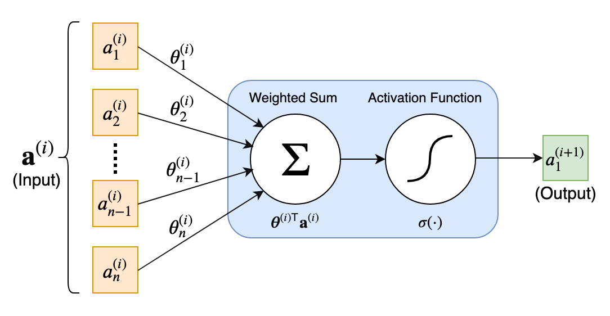
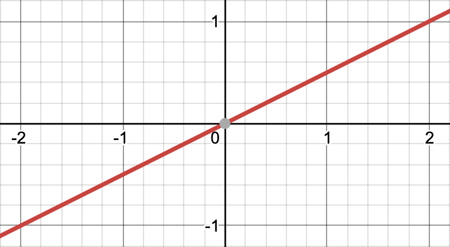
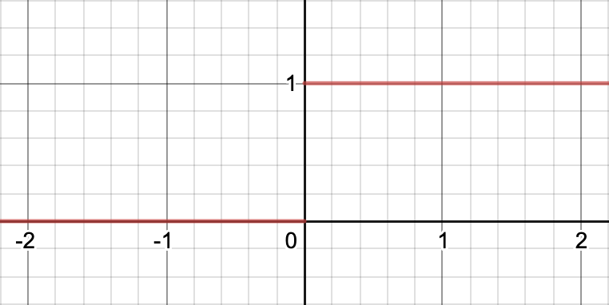
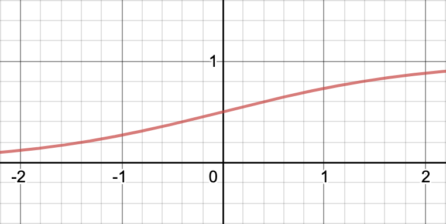
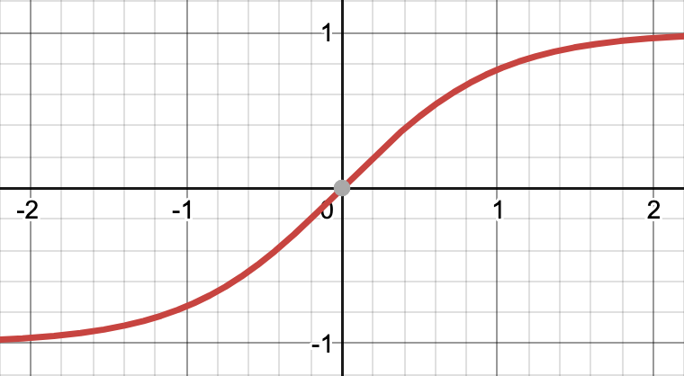
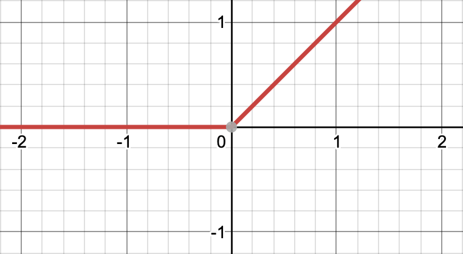
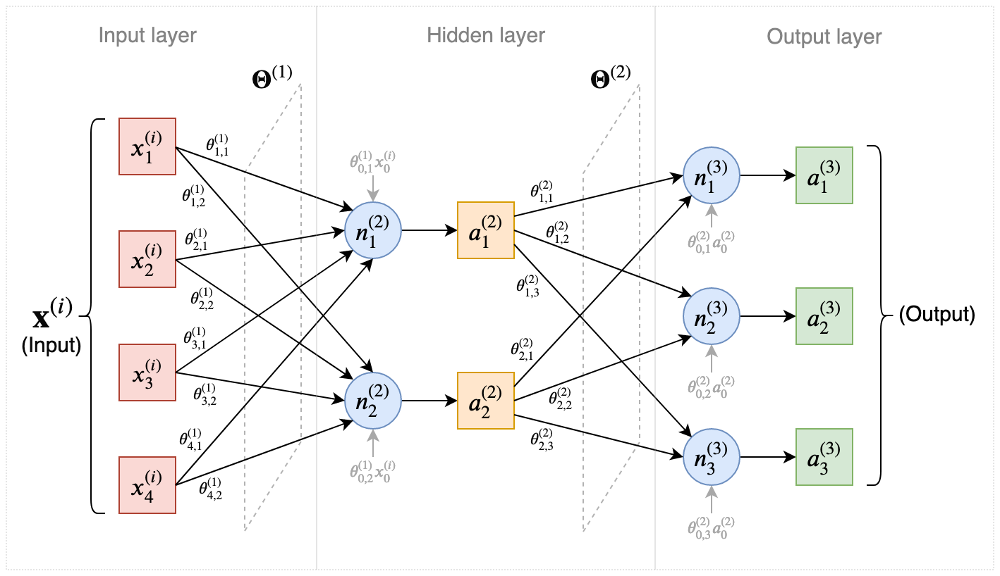
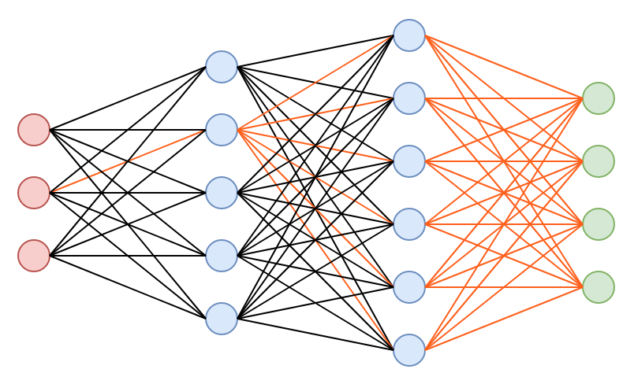
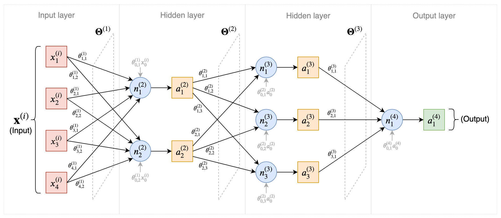

$$
% Display
\newcommand{\ds}{\displaystyle}
\newcommand{\ob}{\overbrace}
\newcommand{\ub}{\underbrace}
\newcommand{\code}{\texttt}

% Colours
\newcommand{\red}[1]{\textcolor{red}{#1}}
\newcommand{\redt}[1]{\textcolor{red}{\text{#1}}}
\newcommand{\blue}[1]{\textcolor{blue}{#1}}
\newcommand{\bluet}[1]{\textcolor{blue}{\text{#1}}}
\newcommand{\green}[1]{\textcolor{green}{#1}}
\newcommand{\greent}[1]{\textcolor{green}{\text{#1}}}

% Typefaces/Text-styles
\newcommand{\mc}{\mathcal}
\newcommand{\mf}{\mathfrak}
\newcommand{\b}{\mathbf}
\newcommand{\bs}{\boldsymbol}

% Fractions
\newcommand{\f}{\frac}

% Positioning
\newcommand{\l}{\left}
\newcommand{\m}{\middle}
\newcommand{\r}{\right}

% Logic
\newcommand{\n}{\not}
\newcommand{\eq}{\equiv}
\newcommand{\xor}{\oplus}

% Sets
\newcommand{\fa}{\forall}
\newcommand{\te}{\exists}
\newcommand{\empty}{\varnothing}
\newcommand{\set}[1]{\l\lbrace#1\r\rbrace}
\newcommand{\setb}[2]{\l\lbrace#1\ \m| \ #2\r\rbrace}
\newcommand{\bb}{\mathbb}
\newcommand{\R}{\bb{R}}
\newcommand{\N}{\bb{N}}
\newcommand{\Z}{\bb{Z}}
\newcommand{\Q}{\bb{Q}}
\newcommand{\C}{\bb{C}}

% Derivatives
\newcommand{\d}[1]{\mathrm{d}#1}
\newcommand{\deriv}[2]{\f{\d{#1}}{\d{#2}}}
\newcommand{\pderiv}[2]{\f{\partial #1}{\partial #2}}

% Sums/Integrals
\newcommand{\s}[3]{\sum_{#1}^{#2}#3}
\newcommand{\i}[4]{\int_{#1}^{#2}#3\ \d{#4}}

% Probability
\newcommand{\p}[1]{\bb{P}\l(#1\r)}
\newcommand{\cp}[2]{\p{#1\m|#2}}
\newcommand{\jp}[2]{\p{#1,#2}}
\newcommand{\e}[1]{\bb{E}\l[#1\r]}
\newcommand{\var}[1]{\text{Var}\l[#1\r]}
\newcommand{\sd}[1]{\text{SD}\l[#1\r]}
\newcommand{\cov}[2]{\text{Cov}\l[#1,#2\r]}

% Binomials
\newcommand{\ch}{\binom}
\newcommand{\pbin}[3][{}]{\l(#2 + #3\r)^#1}
\newcommand{\mbin}[3][{}]{\l(#2 - #3\r)^#1}

% Linear Algebra
\newcommand{\T}{\mathsf{T}}
\newcommand{\seq}[4][{}]{#2_{#3}#1 \ldots #1 #2_{#4}}
\newcommand{\rowv}[3]{\l(\seq[,]{#1}{#2}{#3}\r)}
\newcommand{\colv}[3]{\rowv{#1}{#2}{#3}^\T}
\newcommand{\sqpmat}[3][{}]{
    \begin{pmatrix}
		#2_{1{#1}1} & #2_{1{#1}2} & \cdots & #2_{1{#1}j} & \cdots & #2_{1{#1}#3} \\
		#2_{2{#1}1} & #2_{2{#1}2} & \cdots & #2_{2{#1}j} & \cdots & #2_{2{#1}#3} \\
		\vdots & \vdots & \ddots & \vdots & \ddots & \vdots \\
		#2_{i{#1}1} & #2_{i{#1}2} & \cdots & #2_{i{#1}j} & \cdots & #2_{i{#1}#3} \\
		\vdots & \vdots & \ddots & \vdots & \ddots & \vdots \\
		#2_{#3{#1}1} & #2_{#3{#1}2} & \cdots & #2_{#3{#1}j} & \cdots & #2_{#3{#1}#3} \\
	\end{pmatrix}
}
\newcommand{\sqmat}[3][{}]{
    \begin{matrix}
		#2_{1{#1}1} & #2_{1{#1}2} & \cdots & #2_{1{#1}j} & \cdots & #2_{1{#1}#3} \\
		#2_{2{#1}1} & #2_{2{#1}2} & \cdots & #2_{2{#1}j} & \cdots & #2_{2{#1}#3} \\
		\vdots & \vdots & \ddots & \vdots & \ddots & \vdots \\
		#2_{i{#1}1} & #2_{i{#1}2} & \cdots & #2_{i{#1}j} & \cdots & #2_{i{#1}#3} \\
		\vdots & \vdots & \ddots & \vdots & \ddots & \vdots \\
		#2_{#3{#1}1} & #2_{#3{#1}2} & \cdots & #2_{#3{#1}j} & \cdots & #2_{#3{#1}#3} \\
	\end{matrix}
}
\newcommand{\sqbmat}[3][{}]{
    \begin{bmatrix}
		#2_{1{#1}1} & #2_{1{#1}2} & \cdots & #2_{1{#1}j} & \cdots & #2_{1{#1}#3} \\
		#2_{2{#1}1} & #2_{2{#1}2} & \cdots & #2_{2{#1}j} & \cdots & #2_{2{#1}#3} \\
		\vdots & \vdots & \ddots & \vdots & \ddots & \vdots \\
		#2_{i{#1}1} & #2_{i{#1}2} & \cdots & #2_{i{#1}j} & \cdots & #2_{i{#1}#3} \\
		\vdots & \vdots & \ddots & \vdots & \ddots & \vdots \\
		#2_{#3{#1}1} & #2_{#3{#1}2} & \cdots & #2_{#3{#1}j} & \cdots & #2_{#3{#1}#3} \\
	\end{bmatrix}
}
\newcommand{\sqpmat}[3][{}]{
    \begin{pmatrix}
		#2_{1{#1}1} & #2_{1{#1}2} & \cdots & #2_{1{#1}j} & \cdots & #2_{1{#1}#3} \\
		#2_{2{#1}1} & #2_{2{#1}2} & \cdots & #2_{2{#1}j} & \cdots & #2_{2{#1}#3} \\
		\vdots & \vdots & \ddots & \vdots & \ddots & \vdots \\
		#2_{i{#1}1} & #2_{i{#1}2} & \cdots & #2_{i{#1}j} & \cdots & #2_{i{#1}#3} \\
		\vdots & \vdots & \ddots & \vdots & \ddots & \vdots \\
		#2_{#3{#1}1} & #2_{#3{#1}2} & \cdots & #2_{#3{#1}j} & \cdots & #2_{#3{#1}#3} \\
	\end{pmatrix}
}
\newcommand{\sqvmat}[3][{}]{
    \begin{vmatrix}
		#2_{1{#1}1} & #2_{1{#1}2} & \cdots & #2_{1{#1}j} & \cdots & #2_{1{#1}#3} \\
		#2_{2{#1}1} & #2_{2{#1}2} & \cdots & #2_{2{#1}j} & \cdots & #2_{2{#1}#3} \\
		\vdots & \vdots & \ddots & \vdots & \ddots & \vdots \\
		#2_{i{#1}1} & #2_{i{#1}2} & \cdots & #2_{i{#1}j} & \cdots & #2_{i{#1}#3} \\
		\vdots & \vdots & \ddots & \vdots & \ddots & \vdots \\
		#2_{#3{#1}1} & #2_{#3{#1}2} & \cdots & #2_{#3{#1}j} & \cdots & #2_{#3{#1}#3} \\
	\end{vmatrix}
}
\newcommand{\sqVmat}[3][{}]{
    \begin{Vmatrix}
		#2_{1{#1}1} & #2_{1{#1}2} & \cdots & #2_{1{#1}j} & \cdots & #2_{1{#1}#3} \\
		#2_{2{#1}1} & #2_{2{#1}2} & \cdots & #2_{2{#1}j} & \cdots & #2_{2{#1}#3} \\
		\vdots & \vdots & \ddots & \vdots & \ddots & \vdots \\
		#2_{i{#1}1} & #2_{i{#1}2} & \cdots & #2_{i{#1}j} & \cdots & #2_{i{#1}#3} \\
		\vdots & \vdots & \ddots & \vdots & \ddots & \vdots \\
		#2_{#3{#1}1} & #2_{#3{#1}2} & \cdots & #2_{#3{#1}j} & \cdots & #2_{#3{#1}#3} \\
	\end{Vmatrix}
}
$$

[TOC]

# Neural networks

**==Artificial neural networks==** are powerful and versatile machine learning systems that are perhaps the most commonly used learning method for many modern machine learning tasks.

Neural networks are often used for machine learning tasks where not much meaning or knowledge can be derived from the individual features of the training data. Instead, neural networks rely on a system of nodes called **neurons**, which are arranged in collections called **layers**, where the neurons in adjacent layers are connected. These connections have varied strengths, determined by a scalar referred to as a **weight**.

The purpose of the neurons on different layers is to learn the underlying (mostly non-linear) relationships between the original features and the output. Nevertheless, neural networks are often still treated as black boxes when compared to other machine learning models, since it isn't always straightforward to understand what the individual layers and neurons represent.

## Layers and neurons

A neural network may consist of many **layers**. Namely, there are three distinct types of layers:

- ==**Input layer**==: 

  - Consists of the features of the input vector $\b{x}^{(i)}$, or transformed feature vector $\bs{\phi}\l(\b{x}^{(i)}\r)$. This vector is also sometimes denoted as $\b{a}^{(1)}$ for consistency, as the notation $\b{a}^{(i)}$ in neural networks represents the output vector from the neurons in layer $i$, where indexing starts from $1$, with the input layer.
  - This layer **does not** pass the features through a weighted sum or activation function. The inputs are simply passed on to the next layer, with the corresponding weights $\bs{\theta}^{(1)}$ for this layer.
  - There may only be one input layer in a neural network.

- ==**Hidden layer**==:

  - Consists of **neurons**, each made up of two functions: a **weighted sum** and an **activation function**.

    

    	
    	 
    	

        <b>Figure 1</b>: An artificial neuron (depicted in blue).
    	

    

    1. The **weighted sum** is computed from the inputs $\b{a}^{(i)}$, which are the outputs from the previous layer (along with their corresponding weights $\bs{\theta}^{(i)}$) . This is calculated as the dot product between these two vectors.
      
       Observe that this dot product may be an arbitrary real-valued number, depending on the weights—therefore, this result is passed through the activation function to transform it.
       
    2. The purpose of an **activation function** is to introduce non-linearity to a neural network—it transforms the value of the weighted sum and is chosen specifically for the type of task being performed.
    
       > **Example**: In the case of logistic regression, we saw that the logistic function $\sigma(x)=\frac{1}{1+e^{-x}}$ can be used to shrink $\R$ into the range $(0,1)$. This is an example of a commonly used activation function.
    
       

           	
       	 
           	

           <b>Figure 2</b>: The logistic sigmoid activation function. (<a href="https://en.wikipedia.org/wiki/Sigmoid_function">source</a>)
           	

           

    
       There are many other activation functions which will be described later.
    
    - The output of one neuron is a **single value**, which is sent to each of the neurons on the next layer with new weights $\bs{\theta}^{(i+1)}$.
  
  - The outputs of the neurons in the final hidden layer are passed to the neurons in the **output layer**.
  
- ==**Output layer**==:

  - Functions the same way as a hidden layer—each output takes a weighted sum of its inputs and passes it through an activation function.
  - The number of output neurons is often the number of classes (in the case of a classification problem). However, in the case of binary classification, one output neuron is enough since we can represent the probability of the other class as the complement of the probability that is output by the neuron.

**Note**: When we say a neural network consists of $L$ layers, $L$ is the sum of hidden layers and the output layer.

## Activation functions

As explained previously, the purpose of an **==activation function==** is to introduce non-linearity to a neural network—it transforms the value of the weighted sum and is chosen specifically for the type of task being performed. Below is a list of some commonly used activation functions:

| **Name**                     |                         **Function**                         |                       **Plot**                        | **Comments**                                                 |
| ---------------------------- | :----------------------------------------------------------: | :---------------------------------------------------: | ------------------------------------------------------------ |
| Linear function              |                $\sigma_\text{Linear}(x;k)=kx$                |   |                                                              |
| Threshold (step) function    | $\sigma_\text{Step}(x;k)=\begin{cases}1& x\geq k\\ 0& x<k\end{cases}$ |     | <ul><li>Can be used to make a decision between binary classes $0$ and $1$, given a real-valued argument. For example, since $\sigma_\text{Logistic}$ yields a probability (where we would have to use $\arg\max$ to determine the class), we can determine the class by using $\sigma_\text{Step}(x;k=\frac{1}{2})$ in the output layer.</li></ul> |
| Logistic (sigmoid) function  |        $\sigma_\text{Logistic}(x)=\frac{1}{1+e^{-x}}$        |  | <ul><li>Typically used in the output layer of a neural network performing binary classification.</li><li>Suffers from the issue of vanishing gradients as $|x|$ increases.</li><li>Differentiable across entire domain.</li></ul> |
| Hyperbolic tangent function  |               $\sigma_\text{tanh}(x)=\tanh(x)$               |     | <ul><li>Can mathematically be represented as a shifted and scaled version of $\sigma_\text{Logistic}$ and is similarly used for binary classification tasks.</li><li>However, this cannot be directly used for negative log likelihood cost functions due to the function range being $(-1,1)$.</li><li>Suffers from the same vanishing gradient issue as $\sigma_\text{Logistic}$.</li></ul> |
| Rectified linear unit (ReLU) |              $\sigma_\text{ReLU}(x)=\max(0,x)$               |     | ReLU is generally preferred to sigmoidal activation functions such as $\sigma_\text{Logistic}$ and $\sigma_\text{tanh}$ in deeper neural networks, mainly because:<ul><li> its simpler gradients (during backpropagation) allow for each layer to be trained quicker,</li><li>it does not suffer from the vanishing gradient problem.</li></ul> |

### Softmax function

The softmax function is a special type of activation function which takes a vector of $K$ real numbers as input, and normalizes it into a discrete probability distribution consisting of $K$ probabilities.

The standard softmax function $\sigma : \R^K \to \R^K$ is defined by the formula:
$$
\sigma_\text{Soft}(i,\b{z})=\frac{\exp{z_i}}{\sum_{j=1}^K \exp{z_j}}\qquad\text{for $i=\set{1,\ldots,K}$ and $\b{z}=\rowv{z}{1}{k}\in\R^K$}
$$

## Multi-layer neural networks

A **==multi-layer neural network==** is a neural network that contains at least one hidden layer.

	
	 
	

    <b>Figure 3</b>: A multi-layer neural network consisting of one hidden layer with two neurons.
	

As seen in *Figure 3*, each additional layer requires connections from the neurons in the layer to the neurons in the next layer, as well as the neurons in the previous layer. The connections between each layer depend on the outputs from the previous layer, and some weights for each neuron in the previous layer.

As a result, we require more structures and indexing to formally represent a neural network. Using *Figure 3* as an example:

- $\b{x}^{(i)}$ represents an arbitrary input feature vector with a bias term $x_0^{(i)}$.
  $$
  \b{x}^{(i)}=\colv{x^{(i)}}{0}{D}
  $$
  **Note**: $\b{x}^{(i)}$ is also treated as the first output—the output of the input layer, $\b{a}^{(1)}$.

- $\bs{\Theta}^{(i)}$ is the **weight matrix** representing the weights of the connections between the neurons in layer $i$ and the neurons in layer $i+1$.
  $$
  \begin{array}{c:ccccc}
  	\bs{\Theta}^{(i)} & \bs{\theta}_{0,\cdot}^{(i)} & \bs{\theta}_{1,\cdot}^{(i)} & \bs{\theta}_{2,\cdot}^{(i)} & \cdots & \bs{\theta}_{N_i,\cdot}^{(i)}\\
  	\hdashline
  	\blue{\bs{\theta}_{\cdot,1}^{(i)^\T}} & \theta_{0,1}^{(i)} & \theta_{1,1}^{(i)} & \theta_{2,1}^{(i)} & \cdots & \theta_{N_i,1}^{(i)}\\
  	\blue{\bs{\theta}_{\cdot,2}^{(i)^\T}} & \theta_{0,2}^{(i)} & \theta_{1,2}^{(i)} & \theta_{2,2}^{(i)} & \cdots & \theta_{N_i,2}^{(i)}\\
  	\vdots & \vdots & \vdots & \vdots & \ddots & \vdots\\
  	\blue{\bs{\theta}_{\cdot,N_{i+1}}^{(i)^\T}} & \theta_{0,N_{i+1}}^{(i)} & \theta_{1,N_{i+1}}^{(i)} & \theta_{2,N_{i+1}}^{(i)} & \cdots & \theta_{N_i,N_{i+1}}^{(i)}\\
  \end{array}
  $$

  > **Where**:
  >
  > - $N_i$ is the number of neurons in layer $i$.
  > - $\theta_{j,k}^{(i)}$ represents the weight from neuron $j$ in layer $i$, to neuron $k$ in layer $i+1$.
  > - $\bs{\theta}_{\cdot,k}^{(i)}=\l(\theta_{0,k}^{(i)},\ldots,\theta_{N_i,k}^{(i)}\r)^\T$ represents the weights from each neuron in layer $i$, to neuron $k$ in layer $i+1$.
  > - $\bs{\theta}_{j,\cdot}^{(i)}=\colv{\theta^{(i)}}{j,1}{j,N_{i+1}}$ represents the weights from neuron $j$ in layer $i$, to each neuron in layer $i+1$.

  Observe that there is no connection to the bias unit of the next layer—this bias unit is introduced independently and is not affected by the activations of the neurons from the previous layer. As a result, this weight matrix has dimensions:
  $$
  \dim(\bs{\Theta}^{(i)})=N_{i+1}\times (N_i+1)
  $$

- $\b{a}^{(i)}$ represents a vector consisting of the outputs from the neurons in layer $i$.
  $$
  \b{a}^{(i)}=\colv{a^{(i)}}{1}{N_i}
  $$

- $\b{n}^{(i)}$ represents the vector of neurons in layer $i$.
  $$
  \b{n}^{(i)}=\colv{n^{(i)}}{1}{N_i}
  $$

  > **Where**: Each neuron $n_j^{(i)}$ comprises an activation function $\sigma_j^{(i)}$ such that the output $a_j^{(i)}$ of this neuron is given by:
  > $$
  > a_j^{(i)}=\sigma_j^{(i)} \! \l(\bs{\theta}_{\cdot ,j}^{(i-1)\T}\b{a}^{(i-1)}\r)
  > $$
  > That is, the dot product between the weights from each neuron in layer $i-1$ to neuron $j$ in layer $i$, and the outputs of the neurons in the previous layer, applied to the activation function $\sigma_j^{(i)}$.
  >
  > However, it is usually the case that all of the sigmoid functions in one layer are the same—so we can just refer to this as $\sigma^{(i)}$.
  >
  > ---
  >
  > It is also possible to compute these activations all at once, using matrix multiplication of the weight matrix $\bs{\Theta}^{(i-1)}$ with the outputs of the previous layer, and a vector-valued activation function $\bs{\sigma}^{(i)}$:
  > $$
  > \begin{align}
  > 	\b{a}^{(i)}
  > 	&=\bs{\sigma}^{(i)} \! \l(\bs{\Theta}^{(i-1)}\b{a}^{(i-1)}\r)^\T\\
  > 	&=\bigg(
  > 		\underbrace{
  > 			\sigma^{(i)}\Big(\bs{\theta}_{\cdot,1}^{(i-1)\T}\b{a}^{i-1}\Big)
  > 		}_{a_1^{(i)}},
  > 		\ldots,
  > 		\underbrace{
  > 			\sigma^{(i)}\Big(\bs{\theta}_{\cdot,N_i}^{(i-1)\T}\b{a}^{i-1}\Big)
  > 		}_{a_{N_i}^{(i)}}
  > 	\bigg)^\T
  > \end{align}
  > $$

As an example of these forms of representation, the multi-layer neural network in *Figure 3* can be represented by the following matrices and vectors:
$$
\b{a}^{(1)}=\b{x}^{(i)}=\begin{pmatrix}
	x_0^{(i)} \\ x_1^{(i)} \\ x_2^{(i)} \\ x_3^{(i)} \\ x_4^{(i)}
\end{pmatrix},
\quad
\bs{\Theta}^{(1)}=\begin{pmatrix}
	\theta_{0,1}^{(1)} & \theta_{1,1}^{(1)} & \theta_{2,1}^{(1)} & \theta_{3,1}^{(1)} & \theta_{4,1}^{(1)} \\
	\theta_{0,2}^{(1)} & \theta_{1,2}^{(1)} & \theta_{2,2}^{(1)} & \theta_{3,2}^{(1)} &\theta_{4,2}^{(1)} \\
\end{pmatrix}
\\
\b{a}^{(2)}=\begin{pmatrix}
	a_0^{(2)} \\
	\sigma^{(2)} \Big(\bs{\theta}_{\cdot,1}^{(1)\T}\b{a}^{(1)}\Big) \\
	\sigma^{(2)} \Big(\bs{\theta}_{\cdot,2}^{(1)\T}\b{a}^{(1)}\Big)
\end{pmatrix},
\quad
\bs{\Theta}^{(2)}=\begin{pmatrix}
	\theta_{0,1}^{(2)} & \theta_{1,1}^{(2)} & \theta_{2,1}^{(2)} \\
	\theta_{0,2}^{(2)} & \theta_{1,2}^{(2)} & \theta_{2,2}^{(2)} \\
	\theta_{0,3}^{(2)} & \theta_{1,3}^{(2)} & \theta_{2,3}^{(2)} \\
\end{pmatrix}\\
\b{a}^{(3)}=\begin{pmatrix}
	\sigma^{(3)} \Big(\bs{\theta}_{\cdot,1}^{(2)\T}\b{a}^{(2)}\Big) \\
	\sigma^{(3)} \Big(\bs{\theta}_{\cdot,2}^{(2)\T}\b{a}^{(2)}\Big) \\
	\sigma^{(3)} \Big(\bs{\theta}_{\cdot,3}^{(2)\T}\b{a}^{(2)}\Big)
\end{pmatrix}
$$

### Training a multi-layer neural network

As with other machine learning algorithms such as linear and logistic regression, in order to train a neural network we need to find the weights that minimize some error function. However, this is more of a challenge in neural networks for three reasons:

1. There are far more weights to optimize—with one entire weight matrix $\bs{\Theta}^{(i)}$ between layers $i$ and $i+1$.

2. The change of a single weight connecting a neuron $n_j^{(i)}$ in layer $i$ to $n_k^{(i+1)}$ in layer $i+1$ will lead to all of the neurons in subsequent layers being affected due to propagation, as seen in *Figure 4* below.

   

   	
   	 
   	

       <b>Figure 4</b>: The propagating effect of modifying one weight, on subsequent layers.
   	

   

3. The error functions used in neural networks are non-convex, meaning that optimization methods are not guaranteed to converge to a global minimum.

   Sometimes however, converging to a local minimum may be good enough and produce weights that the neural network can perform well with.

#### Error functions

The purpose of an **==error function==** is to evaluate the performance of the neural network when given some training examples. As neural networks are mostly commonly used in the supervised learning setting, we have access to the actual outputs of the training examples. 

The error function $C(\bs{\Theta})$ is a measure of the inconsistency between the predicted outputs $\hat{y}^{(i)}$ and the actual outputs $y^{(i)}$ for a set of training examples. Therefore, a machine learning model's robustness and performance increases as the error function decreases. The optimal weights are thus the ones that minimize the error function $C(\bs{\Theta})$:
$$
\hat{\bs{\Theta}}=\arg\min_{\bs{\Theta}} C(\bs{\Theta})
$$
> **Where**: $\bs{\Theta}$ represents all of the weights in the neural network, and can therefore be represented as a vector of the weight matrices for each layer:
> $$
> \bs{\Theta}=\l(\bs{\Theta}^{(1)},\ldots,\bs{\Theta}^{(L)}\r)
> $$

Neural networks may be used to predict the value of $y^{(i)}\in\R$ (like linear regression), $y^{(i)}\in\set{0,1}$ (binary classification), or $y^{(i)}\in\set{1,\ldots,K}$ (multi-class/multinomial classification). As a result, the error function used in a neural network must be chosen depending on the nature of the output variable.

##### Real-valued output $y^{(i)}\in\R$

Similarly to linear regression, the **residual sum of squares (RSS)** error function can be used for neural networks.
$$
C(\bs{\Theta})=\sum_{i=1}^N\l(y^{(i)}-\hat{y}^{(i)}\r)^2
$$
However for the back-propagation training algorithm, it is normally preferable for the error function to be represented as a mean of the samples. For this reason, **==mean squared error (MSE)==** is used more often. Additionally, this quantity is scaled by $\frac{1}{2}$ to make derivatives cleaner:
$$
C(\bs{\Theta})=\frac{1}{2N}\sum_{i=1}^N\l(y^{(i)}-\hat{y}^{(i)}\r)^2
$$

##### Binary output $y^{(i)}\in\set{0,1}$

As we have seen in logistic regression for binary classification, the output variable can be modeled by the Bernoulli distribution. As a result, the most appropriate cost function to use in this case was the **negative log-likelihood**. Minimizing this would yield the maximum likelihood estimate for the training data, $\hat{\bs{\theta}}$. 

For neural networks, we typically use **==cross entropy==**. Cross entropy is a measure of dissimilarity between two discrete probability distributions. As this is a binary classification problem, we have a Bernoulli-distributed output variable for each sample:
$$
\text{Output/Predicted:}\qquad \hat{y}^{(i)} \sim \mathrm{Bernoulli}\l(p_1^{(i)}\r)
$$

> **Where**: 
>
> - $p_1^{(i)}=\cp{\hat{y}^{(i)}=1}{\b{x}^{(i)};\bs{\Theta}}=a_1^{(L+1)}=\sigma\l(\bs{\Theta}^{(L)\T}\b{a}^{(L)}\r)$ represents the probability of the output variable $\hat{y}^{(i)}$ taking the value $1$.
>
>   Observe that for binary classification, the final layer $L+1$ has only one neuron $n^{(L+1)}_1$ (with output $a_1^{(L+1)}$) which represents $p_1^{(i)}$. As a result, the weight matrix from layer $L$ to layer $L+1$ is a $(1\times N_L)$ vector:
>   $$
>   \bs{\Theta}^{(L)}=\l(\theta_{0,1}^{(L)}, \theta_{1,1}^{(L)}, \ldots,\theta_{N_L,1}^{(L)}\r)
>   $$
>   **Note**: For binary classification, $p_0^{(i)}+p_1^{(i)}=1$ and therefore $p_0^{(i)}=1-p_1^{(i)}$. Due to this property, we don't require a second neuron in the final layer as we can just use the complement of $p_1^{(i)}$.
>
> - $\hat{y}^{(i)}$ is a random variable representing the **predicted output** for the $i$^th^ training sample, $\b{x}^{(i)}$ such that $\hat{y}^{(i)}\in\set{p_0^{(i)},p_1^{(i)}}$.

In binary classification problems, we use an average of the per-example **binary cross entropies (BCE)** as the cost function:
$$
\begin{align}
C(\bs{\Theta})
&=\frac{1}{N}\sum_{i=1}^N H\l(y^{(i)},\hat{y}^{(i)}\r)\\
&=-\frac{1}{N}\sum_{i=1}^N \l[\big(1-y^{(i)}\big) \log p_0^{(i)} + y^{(i)} \log p_1^{(i)}\r]\\
&=-\frac{1}{N}\sum_{i=1}^N \l[\big(1-y^{(i)}\big) \log \big(1-p_1^{(i)}\big) + y^{(i)} \log p_1^{(i)}\r]\\
\end{align}
$$

> **Where**:
>
> - $H(X,Y)$ is the cross entropy function which measures the dissimilarity between random variables $X$ and $Y$.
> - $y^{(i)}$ is a random variable representing the **true output** for the $i$^th^ training sample, $\b{x}^{(i)}$. **Note**: Unlike $\hat{y}^{(i)}$, the $y^{(i)}$ variable takes the value of the actual binary label since we don't have probabilities for the true outputs.

Observe that this is equivalent to taking the mean of the negative log likelihood function for the Bernoulli distribution:
$$
\begin{align}
	-\frac{1}{N}\mathcal{L}\l(\bs{\Theta}; \b{y}\r)
	&=-\frac{1}{N} \log L\l(\bs{\Theta}; \b{y}\r)\\
	&=-\frac{1}{N} \log \prod_{i=1}^N \l(1-p_1^{(i)}\r)^{1-y^{(i)}} \l(p_1^{(i)}\r)^{y^{(i)}}\\
	&=-\frac{1}{N} \sum_{i=1}^N \log \l[ \l(1-p_1^{(i)}\r)^{1-y^{(i)}} \l(p_1^{(i)}\r)^{y^{(i)}} \r]\\
	&=-\frac{1}{N} \sum_{i=1}^N \l[ \log\l(1-p_1^{(i)}\r)^{1-y^{(i)}} + \log\l(p_1^{(i)}\r)^{y^{(i)}} \r]\\
	&=-\frac{1}{N}\sum_{i=1}^N \l[ \l(1-y^{(i)}\r)\log\l(1-p_1^{(i)}\r) + y^{(i)}\log\l(p_1^{(i)}\r) \r]
\end{align}
$$

##### Multinomial output $y^{(i)}\in\set{1,\ldots,K}$

For multinomial classification problems, multinomial cross entropy is used as the error function for neural networks. This is a generalization of the previously seen binary cross entropy function, allowing for the use of the softmax function and multiple classes through **one-hot encoding**:
$$
\begin{align}
C(\bs{\Theta})=-\frac{1}{N}\sum_{i=1}^N\sum_{c=1}^K y_c^{(i)} \log p_c^{(i)}
\end{align}
$$

> **Where**:
>
> - There are $K$ neurons in the output layer, with each output $a_c^{(L+1)}$ : $c\in\set{1,\ldots,K}$ representing the probability $p_c^{(i)}$ for the feature vector $\b{x}^{(i)}$ being in class $c$.
>
>   Therefore, the weight matrix $\bs{\Theta}^{(L)}$ from layer $L$ to the final layer $L+1$, has dimensions $(K\times N_L)$.
>
>   Recall that in multinomial classification (as seen in the *Logistic Regression* notes), for each class $c$, we classify a feature vector $\b{x}^{(i)}$ as $k$ or not-$c$ through the use of the **softmax function** which generates a probability of $\b{x}^{(i)}$ being in class $c$:
>   $$
>   \sigma_\text{Soft}\l(c,\b{x}^{(i)};\bs{\Theta}\r)=\frac{\exp\l(\bs{\theta}_{\cdot,c}^{(L)\T}\b{a}^{(L)}\r)}{\sum_{k=1}^K \exp\l(\bs{\theta}_{\cdot,k}^{(L)\T}\b{a}^{(L)}\r)}
>   $$
>   We assign $\b{x}^{(i)}$ to the class which yields the highest probability (as generated by the softmax function).
>
> - $p_c^{(i)}=\cp{y^{(i)}=c}{\b{x}^{(i)};\bs{\Theta}}=\sigma_\text{Soft}\l(c,\b{x}^{(i)};\bs{\Theta}\r)$ represents the probability of feature vector $\b{x}^{(i)}$ being assigned to class $c$.
>
> - $\b{y}^{(i)}=\colv{y^{(i)}}{1}{K}$ is a **==one-hot encoded==** vector representing the actual class of the $i$^th^ training sample. For example, if we have data with $K=6$ classes, and training sample $\b{x}^{(i)}$ is assigned to class $4$, then $y_4^{(i)}$ is set to $1$, and the rest of the elements of $y^{(i)}$ are set to $0$, giving: $\b{y}^{(i)}=\l(0,0,0,1,0,0\r)^\T$. One-hot encoded vectors are frequently used in machine learning as they allow for selective or conditional calculations, similar to indicator variables.

## Back-propagation

As shown earlier in _Figure 4_, the modification of a single weight in any layer will have an effect on the output of the final layer. As a result, updating weights through gradient descent as we did in the _Logistic Regression_ notes, will not work in a neural network since we have multiple weight matrices.

Instead, the **==back-propagation==** algorithm is used to extend gradient descent to the context of hidden layers and neurons. The idea behind back-propagation is to choose an appropriate cost function and then systematically modify the weights of various neurons in order to minimize this cost function. This method is similar to gradient descent, but it uses the chain rule in order to calculate the gradient vector.

The purpose of back-propagation is to calculate all of the error derivatives of the neural network.

### Error derivatives

The back-propagation algorithm decides how much to update each weight of the network after comparing the predicted output with the desired output for a **particular** example. For this, we need to compute how the error changes with respect to each weight—that is $\pderiv{}{\theta_{j,k}^{(l)}}C(\bs{\Theta})$.

Once we have these error derivatives, the weights can be updated using a simple update rule for $l\in\set{1,\ldots,L}$:
$$
\theta_{j,k}^{(l)} \leftarrow \theta_{j,k}^{(l)} - \eta \pderiv{C}{\theta_{j,k}^{(l)}}
$$
Or as a per-layer weight matrix update:
$$
\bs{\Theta}^{(l)} \leftarrow \bs{\Theta}^{(l)} - \eta \bs{\nabla}_{\bs{\Theta}^{(l)}}C(\bs{\Theta})
$$

> **Where**:
> $$
> \bs{\nabla}_{\bs{\Theta}^{(l)}} C(\bs{\Theta})
> =\begin{pmatrix}
> 	\nabla_{\bs{\theta}_{0,\cdot}^{(l)}} C(\bs{\Theta})\\
> 	\nabla_{\bs{\theta}_{1,\cdot}^{(l)}} C(\bs{\Theta})\\
> 	\vdots\\
> 	\nabla_{\bs{\theta}_{N_l,\cdot}^{(l)}} C(\bs{\Theta})\\
> \end{pmatrix}^\T
> =\begin{pmatrix}
> 	\overset{\small{\nabla_{\bs{\theta}_{0,\cdot}^{(l)}} C(\bs{\Theta})}\\}{\pderiv{C}{\theta_{0,1}^{(l)}}} &
> 	\overset{\small{\nabla_{\bs{\theta}_{1,\cdot}^{(l)}} C(\bs{\Theta})}\\}{\pderiv{C}{\theta_{1,1}^{(l)}}} &
> 	\cdots & 
> 	\overset{\small{\nabla_{\bs{\theta}_{N_l,\cdot}^{(l)}} C(\bs{\Theta})}\\}{\pderiv{C}{\theta_{N_l,1}^{(l)}}}
> 	\\
> 	
> 	\pderiv{C}{\theta_{0,2}^{(l)}} & \pderiv{C}{\theta_{1,2}^{(l)}} & \cdots & \pderiv{C}{\theta_{N_l,2}^{(l)}}\\
> 	\vdots & \vdots & \ddots & \vdots\\
> 	\pderiv{C}{\theta_{0,N_{l+1}}^{(l)}} & \pderiv{C}{\theta_{1,N_{l+1}}^{(l)}} & \cdots & \pderiv{C}{\theta_{N_l,N_{l+1}}^{(l)}}\\
> \end{pmatrix}
> $$

### Additional derivatives

To help compute $\pderiv{C}{\theta_{j,k}^{(l)}}$, we store two additional derivatives for each neuron:

- How the error changes with the **total (weighted) input of the neuron**: $\pderiv{C}{z_{j}^{(l)}}$.

  > **Where**: $z_j^{(l)}=\bs{\theta}_{\cdot,j}^{(l-1)\T}\b{a}^{(l-1)}$, the input for neuron $n_j^{(l)}$.

- How the error changes with the **total output of the neuron**: $\pderiv{C}{a_{j}^{(l)}}$.

  > **Where**: $a_j^{(l)}=\sigma^{(l)} \! \l(\bs{\theta}_{\cdot,j}^{(l-1)\T}\b{a}^{(l-1)}\r)=\sigma^{(l)} \! \l(z_j^{(l)}\r)$

### Example

Consider a single training example $\l(\b{x}^{(i)},y^{(i)}\r)$ with a predicted output $\hat{y}^{(i)}$ from the following neural network:

	
   
	

    <b>Figure 5</b>: Modified version of the neural network shown in <em>Figure 3</em>, with an additional layer consisting of one output neuron.
	

The neural network has the following properties:

- The output $y^{(i)}$ is given by the output of the final neuron.

- All of the activation functions are $\sigma_\text{Logistic}$.

- $\b{x}^{(i)}\in\R^4$ and $y^{(i)}\in(0,1)$.

- The cost for one training example is given by:
  $$
  C(\bs{\Theta})=\frac{1}{2}\l(y^{(i)}-\hat{y}^{(i)}\r)^2
  $$

The neural network can be defined by the following matrices and vectors (as seen before):
$$
\b{a}^{(1)}=\b{x}^{(i)}=\begin{pmatrix}
	x_0^{(i)} \\ x_1^{(i)} \\ x_2^{(i)} \\ x_3^{(i)} \\ x_4^{(i)}
\end{pmatrix},
\quad
\bs{\Theta}^{(1)}=\begin{pmatrix}
	\theta_{0,1}^{(1)} & \theta_{1,1}^{(1)} & \theta_{2,1}^{(1)} & \theta_{3,1}^{(1)} & \theta_{4,1}^{(1)} \\
	\theta_{0,2}^{(1)} & \theta_{1,2}^{(1)} & \theta_{2,2}^{(1)} & \theta_{3,2}^{(1)} &\theta_{4,2}^{(1)} \\
\end{pmatrix}
\\
\b{a}^{(2)}=\begin{pmatrix}
	a_0^{(2)} \\
	\sigma \Big(\bs{\theta}_{\cdot,1}^{(1)\T}\b{a}^{(1)}\Big) \\
	\sigma \Big(\bs{\theta}_{\cdot,2}^{(1)\T}\b{a}^{(1)}\Big)
\end{pmatrix},
\quad
\bs{\Theta}^{(2)}=\begin{pmatrix}
	\theta_{0,1}^{(2)} & \theta_{1,1}^{(2)} & \theta_{2,1}^{(2)} \\
	\theta_{0,2}^{(2)} & \theta_{1,2}^{(2)} & \theta_{2,2}^{(2)} \\
	\theta_{0,3}^{(2)} & \theta_{1,3}^{(2)} & \theta_{2,3}^{(2)} \\
\end{pmatrix}
\\
\b{a}^{(3)}=\begin{pmatrix}
	a_0^{(3)}\\
	\sigma \Big(\bs{\theta}_{\cdot,1}^{(2)\T}\b{a}^{(2)}\Big) \\
	\sigma \Big(\bs{\theta}_{\cdot,2}^{(2)\T}\b{a}^{(2)}\Big) \\
	\sigma \Big(\bs{\theta}_{\cdot,3}^{(2)\T}\b{a}^{(2)}\Big)
\end{pmatrix},
\quad
\bs{\Theta}^{(3)}=\begin{pmatrix}
	\theta_{0,1}^{(3)} & \theta_{1,1}^{(3)} & \theta_{2,1}^{(3)} & \theta_{3,1}^{(3)}
\end{pmatrix}
\\
\b{a}^{(4)}=a_1^{(4)}=\sigma\Big(\bs{\theta}_{\cdot,1}^{(3)\T}\b{a}^{(3)}\Big)
$$

#### Back-propagation procedure

To begin back-propagating to find the cost derivatives, we start at the end of the network, with our predicted output $\hat{y}^{(i)}$.

1. Given our cost function $C(\bs{\Theta})=\frac{1}{2}\l(y^{(i)}-\hat{y}^{(i)}\r)^2$, we have:
   $$
   \pderiv{C}{\hat{y}^{(i)}}=y^{(i)}-\hat{y}^{(i)}
   $$
   **Note**: Recall that $\hat{y}^{(i)}=a_1^{(4)}$, so we can also say that $\pderiv{C}{\hat{y}^{(i)}}=\pderiv{C}{a_{1}^{(4)}}$.

2. Now that we have $\pderiv{C}{a_{1}^{(4)}}$, we can find $\pderiv{C}{z_{1}^{(4)}}$ through the use of the chain rule:
   $$
   \pderiv{C}{z_{1}^{(4)}}=\pderiv{C}{a_1^{(4)}} \pderiv{a_1^{(4)}}{z_1^{(4)}}
   $$
   Observe that $\pderiv{a_1^{(4)}}{z_1^{(4)}}$ may be expressed as:
   $$
   \begin{align}
   	\pderiv{a_1^{(4)}}{z_1^{(4)}}
   	&=\pderiv{}{z_1^{(4)}}\sigma\l(\bs{\theta}_{\cdot,1}^{(3)\T}\b{a}^{(3)}\r)\\
   	&=\pderiv{}{z_1^{(4)}}\sigma\l(z_1^{(4)}\r)
   \end{align}
   $$
   The logistic function has the nice property that its derivative is defined as $\pderiv{}{z}\sigma(z)=\sigma(z)\big(1-\sigma(z)\big)$. This allows us to further simplify $\pderiv{a_1^{(4)}}{z_1^{(4)}}$:
   $$
   \pderiv{a_1^{(4)}}{z_1^{(4)}}=\sigma\l(z_1^{(4)}\r)\bigg(1-\sigma\l(z_1^{(4)}\r)\bigg)
   $$
   However, to maintain some generality over the various activation functions, we will continue to write this as $\sigma'\l(z_1^{(4)}\r)$.

   In _Step 1_ we found that $\pderiv{C}{a_{1}^{(4)}}=y^{(i)}-\hat{y}^{(i)}$ and can therefore write $\pderiv{C}{z_{1}^{(4)}}$ as:
   $$
   \begin{align}
   	\pderiv{C}{z_{1}^{(4)}}
   	&=\l(y^{(i)}-\hat{y}^{(i)}\r) \pderiv{a_1^{(4)}}{z_1^{(4)}}\\
   	&=\bigg(y^{(i)}-\sigma\l(z_1^{(4)}\r)\bigg) \pderiv{a_1^{(4)}}{z_1^{(4)}}
   \end{align}
   $$
   Substituting the expression for $\pderiv{a_1^{(4)}}{z_1^{(4)}}$ that we found earlier:
   $$
   \pderiv{C}{z_{1}^{(4)}}=
   \underbrace{\sigma'\l(z_1^{(4)}\r)}_{\pderiv{a_1^{(4)}}{z_1^{(4)}}}\ 
   \underbrace{\bigg(y^{(i)}-\sigma\l(z_1^{(4)}\r)\bigg)}_{\pderiv{C}{a_{1}^{(4)}}}
   $$

3. Once we have the cost derivative with respect to the total (weighted) input of a neuron, $\pderiv{C}{z_j^{(l)}}$, we can get the cost derivative with respect to the weights coming into that neuron:
   $$
   \pderiv{C}{\theta_{j,k}^{(l-1)}}=
   \pderiv{C}{z_k^{(l)}}
   \pderiv{z_k^{(l)}}{\theta_{j,k}^{(l-1)}}
   $$
   Recall that $z_k^{(l)}$ is defined as:
   $$
   z_k^{(l)}=\sigma\l(\bs{\theta}_{\cdot,k}^{(l-1)\T}\b{a}^{(l-1)}\r)
   $$
   Then the derivative of the input $z_k^{(l)}$ with respect to the incoming weight $\theta_{j,k}^{(l-1)}$ is given by the following (using the chain rule):
   $$
   \begin{align}
   	\pderiv{z_k^{(l)}}{\theta_{j,k}^{(l-1)}}
   	&=\sigma'\l(\bs{\theta}_{\cdot,k}^{(l-1)\T}\b{a}^{(l-1)}\r)a_j^{(l-1)}\\
   	&=\sigma'\l(z_k^{(l)}\r)a_j^{(l-1)}
   \end{align}
   $$

   ---

   Applying this to $z_1^{(4)}$ and its cost derivative $\pderiv{C}{z_1^{(4)}}$ that we already obtained in _Step 2_, we can find the cost derivative of the first weight $\theta_{1,1}^{(3)}$ in $\bs{\Theta}^{(3)}$:
   $$
   \begin{align}
   	\pderiv{C}{\theta_{1,1}^{(3)}}
   	&=\pderiv{C}{z_1^{(4)}}\pderiv{z_1^{(4)}}{\theta_{1,1}^{(3)}}\\
   	&=\underbrace{\sigma'\l(z_1^{(4)}\r)\bigg(y^{(i)}-\sigma\l(z_1^{(4)}\r)\bigg)}_{\pderiv{C}{z_1^{(4)}}} \ 
   	  \underbrace{\sigma'\l(z_1^{(4)}\r)a_1^{(3)}}_{\pderiv{z_1^{(4)}}{\theta_{1,1}^{(3)}}}\\
   	&=\sigma'\l(z_1^{(4)}\r)^2\bigg(y^{(i)}-\sigma\l(z_1^{(4)}\r)\bigg)a_1^{(3)}
   \end{align}
   $$
   The same procedure can be used to obtain an error derivative for all of the weights in $\bs{\Theta}^{(3)}$.

4. Using the chain rule for multivariate functions once again, we can calculate $\pderiv{C}{a_j^{(3)}}$.
   $$
   \begin{align}
   	\pderiv{C}{z_j^{(3)}}
   	&=\pderiv{C}{a_j^{(3)}}
   	  \pderiv{a_j^{(3)}}{z_j^{(3)}}\\
   	&=\pderiv{C}{a_j^{(3)}}
   	  \pderiv{}{z_j^{(3)}}\sigma\l(z_j^{(3)}\r)\\
   	&=\pderiv{C}{a_j^{(3)}}
   	  \sigma'\l(z_j^{(3)}\r)  
   \end{align}
   $$
   Where $\pderiv{C}{a_j^{(3)}}$ may also be found using the chain rule and the weight derivatives of the previous layer:
   $$
   \pderiv{C}{a_j^{(3)}}
     =\pderiv{C}{z_1^{(4)}}
   	\sum_{k=1}^{N_4}
   	\pderiv{z_1^{(4)}}{\theta_{j,k}^{(3)}}
   	\pderiv{\theta_{j,k}^{(3)}}{a_j^{(3)}}\\
   $$

   ---

   And then I got lost​. But basically keep back-propagating until you find all the error derivatives with respect to all weights of the network.

### Back-propagating with all training examples

The example above describes the process of finding all of the error derivatives for the weights in the network after a forward pass with just one training example.

To train a neural network using all of the training examples:

1. **Input a set of training examples** $\mathcal{D}=\set{(\b{x}^{(i)},y^{(i)})}_{i=1}^N$.
2. **Randomize the weights of the networks** Biases should be set to $1$.
3. **For each training example**:
   1. **Feedforward** For each layer $l$ and each neuron $n_j^{(l)}$ on layer $l$, compute:
      - $z_{j}^{(l)}=\bs{\theta}_{.,j}^{(l-1)}\b{a}^{(l-1)}$
      - $a_j^{(l)}=\sigma^{(l)}\!\l(z_j^{(l)}\r)$
   2. **Calculate the error and gradient of the output layer** For each neuron $n_k^{(N+1)}$ on layer $L+1$, compute the values:
      - $\ds\pderiv{C}{z_k^{(L+1)}}$ (the error derivative w.r.t the weighted input, a.k.a _**the error**_) 
      - $\ds\pderiv{C}{\theta_{j,k}^{(L)}}$ (the error derivative w.r.t the weight $\theta_{j,k}^{(L)}$ connecting $n_j^{(L)}$ with $n_k^{(L+1)}$)
   3. **Backpropagate the error** For each $l\in\set{L,L-1\ldots,2}$, compute the following values for each neuron $n_k^{(l)}$:
      - $\ds\pderiv{C}{z_k^{(l)}}$ (the error)
      - $\ds\pderiv{C}{\theta_{j,k}^{(l-1)}}$ (the error derivative w.r.t the weight $\theta_{j,k}^{(l-1)}$)
4. **Gradient descent** For each weight $\theta_{j,k}^{(l)}$ in the network (where $l\in\set{1,\ldots,L}$), update it using the simple update rule $\theta_{j,k}^{(l)} \leftarrow \theta_{j,k}^{(l)} - \eta \pderiv{C}{\theta_{j,k}^{(l)}}$.

#### Epochs and batches

The algorithm above forms a training loop for one **epoch**, treating the entire training set as one **batch**.

An **==epoch==** represents a single forward pass and backward pass of **all** of the training examples through the neural network. Since feeding the entire training data set into the neural network would be time consuming, we divide it into several **batches**, each of equal **batch size**.

A **==batch==** is therefore just a division of the training set. An epoch requires all of the batches to be passed forward and backward through the neural network. Therefore, the number of **iterations** in an epoch is simply equal to the number of batches.

> **Example**: If we have a training set consisting of $1000$ examples and divide it into batches of size $200$, we will have $5$ batches and will therefore require $5$ iterations to complete $1$ full epoch.

#### Types of gradient descent

##### Mini-batch (stochastic) gradient descent

In **==mini-batch (stochastic) gradient descent==**, the training set is randomly divided into a number of subsets—each of a specified batch size. The term **stochastic** arises due to the fact that the batches are randomly divided.

The weights of the network are updated after each batch completes a forward and backward pass through the network. After one epoch is complete, we may randomly select the subsets again and perform another training epoch.

---

Suppose we divide $\mathcal{D}=\set{(\b{x}^{(i)},y^{(i)})}_{i=1}^N$ into $B$ batches such that $\mathcal{D}=\bigcup_{b=1}^B\mathcal{D}^{(b)}$. 

> **Where**: Each batch is given as $\mathcal{D}^{(b)}=\set{(\b{x}^{(b,i)}, y^{(b,i)})}_{i=1}^{\frac{N}{B}}$. Note that the size of $\mathcal{D}^{(b)}$ may not always be exactly $\frac{N}{B}$ as the number of batches $B$ often does not perfectly divide the total number of training samples $N$. 
>
> So instead, the size of a training batch is simply denoted as $|\mathcal{D}^{(b)}|$.

The update rules for gradient descent must be slightly modified (from the one seen before) as we now have to average the error derivative over the number of samples in the batch.
$$
\begin{align}
	\theta_{j,k}^{(l)} &\leftarrow \theta_{j,k}^{(l)} - \frac{\eta}{|\mathcal{D}^{(b)}|} \sum_{i=1}^{|\mathcal{D}^{(b)}|} \pderiv{C}{\theta_{j,k}^{(l)}}\\
	\bs{\Theta}^{(l)} &\leftarrow \bs{\Theta}^{(l)} - \frac{\eta}{|\mathcal{D}^{(b)}|} \sum_{i=1}^{|\mathcal{D}^{(b)}|} \bs{\nabla}_{\bs{\Theta}^{(l)}}C(\bs{\Theta})
\end{align}
$$

> **Where**: $C$ is the per-example (non-averaged) error function $C_{(\b{x}^{(b,i)},\b{y}^{(b,i)})}$ evaluated on training example $(\b{x}^{(b,i)},\b{y}^{(b,i)})$. The subscripts are omitted for clarity.

##### Stochastic gradient descent

**==Stochastic gradient descent==** takes the idea of mini-batches to the extreme—it only uses a single example per iteration (batch size $1$). 

This is simply a special case of mini-batch stochastic gradient descent where $B=N$ and $|\mathcal{D}^{(b)}|=1$. This leads to the following update rules for each example (batch):
$$
\begin{align}
	\theta_{j,k}^{(l)} &\leftarrow \theta_{j,k}^{(l)} - \eta\pderiv{C}{\theta_{j,k}^{(l)}}\\
	\bs{\Theta}^{(l)} &\leftarrow \bs{\Theta}^{(l)} - \eta\bs{\nabla}_{\bs{\Theta}^{(l)}}C(\bs{\Theta})
\end{align}
$$

> **Where**: $C$ is the per-example (non-averaged) error function $C_{(\b{x}^{(b,i)},\b{y}^{(b,i)})}$ evaluated on training example $(\b{x}^{(b,i)},\b{y}^{(b,i)})$. The subscripts are omitted for clarity.

In this form of gradient descent, the weights and biases are updated for each training example, after it has completed a forward and backward pass through the neural network. Therefore, one epoch would consist of $N$ iterations.

##### Batch gradient descent

In **==batch gradient descent==**, each epoch treats the entire training data as one batch, meaning the batch size is equal to the number of training examples.

Once again, this is an extreme case of mini-batch stochastic gradient descent where $B=1$ and $|\mathcal{D}^{(b)}|=N$. This leads to the following update rules:
$$
\begin{align}
	\theta_{j,k}^{(l)} &\leftarrow \theta_{j,k}^{(l)} - \frac{\eta}{N} \sum_{i=1}^{N} \pderiv{C}{\theta_{j,k}^{(l)}}\\
	\bs{\Theta}^{(l)} &\leftarrow \bs{\Theta}^{(l)} - \frac{\eta}{N} \sum_{i=1}^{N} \bs{\nabla}_{\bs{\Theta}^{(l)}}C(\bs{\Theta})
\end{align}
$$

> **Where**: $C$ is the per-example (non-averaged) error function $C_{(\b{x}^{(b,i)},\b{y}^{(b,i)})}$ evaluated on training example $(\b{x}^{(b,i)},\b{y}^{(b,i)})$. The subscripts are omitted for clarity.

In this form of gradient descent, the weights are not updated until the epoch is complete (all training examples have done a forward and backward pass through the network).

This form of gradient descent is rarely used in practice since it requires the entire data set to be loaded into memory. It may be feasible for problems with few training examples, but neural networks require lots of training data and therefore may not be appropriate in some of these cases anyway.

# Resources

- _Charles Sutton, Nigel Goddard (School of Informatics, University of Edinburgh)_ [Introductory Applied Machine Learning: Neural Networks - Training an ANN](https://www.learn.ed.ac.uk/bbcswebdav/pid-3412585-dt-content-rid-6699486_1/courses/INFR100692018-9SV1SEM1/Mlp9.pdf)
- _Hiroshi Shimodaira, Iain Murray, Steve Renals (School of Informatics, University of Edinburgh)_ [Algorithms, Data Structures and Learning: Single Layer Neural Networks](https://www.inf.ed.ac.uk/teaching/courses/inf2b/learnSlides/inf2b-learnlec11-full.pdf)
- *Gordon Ross (School of Mathematics, University of Edinburgh)* [Statistical Learning: Neural Networks](http://www.drps.ed.ac.uk/19-20/dpt/cxmath10094.htm)
- _Sagar Sharma (Towards Data Science)_ [The Fundamentals of Neural Networks: What the Hell is Perceptron?](https://towardsdatascience.com/what-the-hell-is-perceptron-626217814f53)
- _Rubio95R (Stack Exchange)_ [Logistic Regression with Neural Network mindset vs. a shallow Neural Network](https://stats.stackexchange.com/questions/366707/a-logistic-regression-with-neural-network-mindset-vs-a-shallow-neural-network)
- _Rohan Varma_ [Creating Neural Networks in Tensorflow](https://rohanvarma.me/Neural-Net-Tensorflow/)
- _cdeterman (Stack Exchange)_ [Activation Function for First Layer Nodes in an ANN](https://stats.stackexchange.com/a/188452)
- _SimpliLearn_ [Multilayer Artificial Neural Network](https://www.simplilearn.com/multilayer-artificial-neural-network-tutorial)
- _Sebastian Raschka_ [Machine Learning FAQ: What is the relation between Logistic Regression and Neural Networks and when to use which?](https://sebastianraschka.com/faq/docs/logisticregr-neuralnet.html)
- _James Isaac (Medium)_ [Understanding Deep Neural Networks from First Principles: Logistic Regression](https://medium.com/@melodious/understanding-deep-neural-networks-from-first-principles-logistic-regression-bd2f01c9e263)
- _Jiri Kriz (Nosco)_ [Neural Networks: Forward Propagation](https://www.nosco.ch/ai/ml/nn_forward.php)
- _The Microsoft Cognitive Toolkit_ [CNTK 103: Part B - Logistic Regression with MNIST](https://cntk.ai/pythondocs/CNTK_103B_MNIST_LogisticRegression.html)
- _GeeksForGeeks_ [Activation functions in Neural Networks](https://www.geeksforgeeks.org/activation-functions-neural-networks/)
- _Pablo Ruiz (Towards Data Science)_ [Neural Networks I: Notation and building blocks](https://towardsdatascience.com/neural-networks-i-notation-and-building-blocks-817b1d2ea04b)
- _Andrew Ng, Kian Katanforoosh (Computer Science Department, Stanford University)_ [CS230: Deep Learning Representations](https://cs230.stanford.edu/files/Notation.pdf)
- _Alex S. Holehouse_ [Neural Networks: Representation](http://www.holehouse.org/mlclass/08_Neural_Networks_Representation.html)
- _DeepAI_ [Neural Network](https://deepai.org/machine-learning-glossary-and-terms/neural-network)
- _Wikipedia_ [Activation function](https://en.wikipedia.org/wiki/Activation_function) [Softmax function](https://en.wikipedia.org/wiki/Softmax_function)
- _Jason Brownlee_ [Why Training a Neural Network Is Hard](https://machinelearningmastery.com/why-training-a-neural-network-is-hard/) [A Gentle Introduction to Mini-Batch Gradient Descent and How to Configure Batch Size](https://machinelearningmastery.com/gentle-introduction-mini-batch-gradient-descent-configure-batch-size/)
- _ML4A (Machine Learning For Artists)_ [How neural networks are trained](https://ml4a.github.io/ml4a/how_neural_networks_are_trained/)
- _Isaac Changhau_ [Loss Functions in Neural Networks](https://isaacchanghau.github.io/post/loss_functions/)
- _Kevin P. Murphy_ [Machine Learning: A Probabilistic Perspective](https://www.cs.ubc.ca/~murphyk/MLbook/)
- _Morgan Giraud (MetaFlow)_ [ML notes: Why the log-likelihood?](https://blog.metaflow.fr/ml-notes-why-the-log-likelihood-24f7b6c40f83)
- _Gluon_ [Binary classification with logistic regression](https://gluon.mxnet.io/chapter02_supervised-learning/logistic-regression-gluon.html) [Gradient descent and stochastic gradient descent from scratch](https://gluon.mxnet.io/chapter06_optimization/gd-sgd-scratch.html)
- _Ankur Gupta (Perfectly Random)_ [Bernoulli Distribution as a tiny Neural Network](https://www.perfectlyrandom.org/2019/04/27/bernoulli-distribution-as-a-tiny-nn/)
- _astroman (BigQuant)_ [Entropy (3.13 Information theory)](https://bigquant.com/community/t/topic/121439)
- _jingweimo (ScienceNet)_ [Nonlinearity and loss function in multi-tasking problems](http://wap.sciencenet.cn/blog-578676-1118819.html)
- _Google Developers_ [Backpropagation algorithm](https://google-developers.appspot.com/machine-learning/crash-course/backprop-scroll/) [Reducing Loss: Stochastic Gradient Descent](https://developers.google.com/machine-learning/crash-course/reducing-loss/stochastic-gradient-descent)
- _D.W. (StackExchange)_ [Why does the neural network logistic regression cost function sum for all layers only for lambda?](https://cs.stackexchange.com/a/71415)
- _user329469 (StackExchange)_ [Derivative of neural network function with respect to weights](https://math.stackexchange.com/questions/1731965/derivative-of-neural-network-function-with-respect-to-weights)
- _Michael A. Nielsen, "Neural Networks and Deep Learning", Determination Press, 2015_ [Chapter 2: How the backpropagation algorithm works](http://neuralnetworksanddeeplearning.com/chap2.html)
- _Oleg Shirokikh (StackExchange)_ [Back-propagation in Neural Nets with >2 hidden layers](https://stats.stackexchange.com/questions/70168/back-propagation-in-neural-nets-with-2-hidden-layers)
- _John McGonagle, George Shaikouski, Christopher Williams, Andrew Hsu, Jimin Khim_ [Backpropagation](https://brilliant.org/wiki/backpropagation/)
